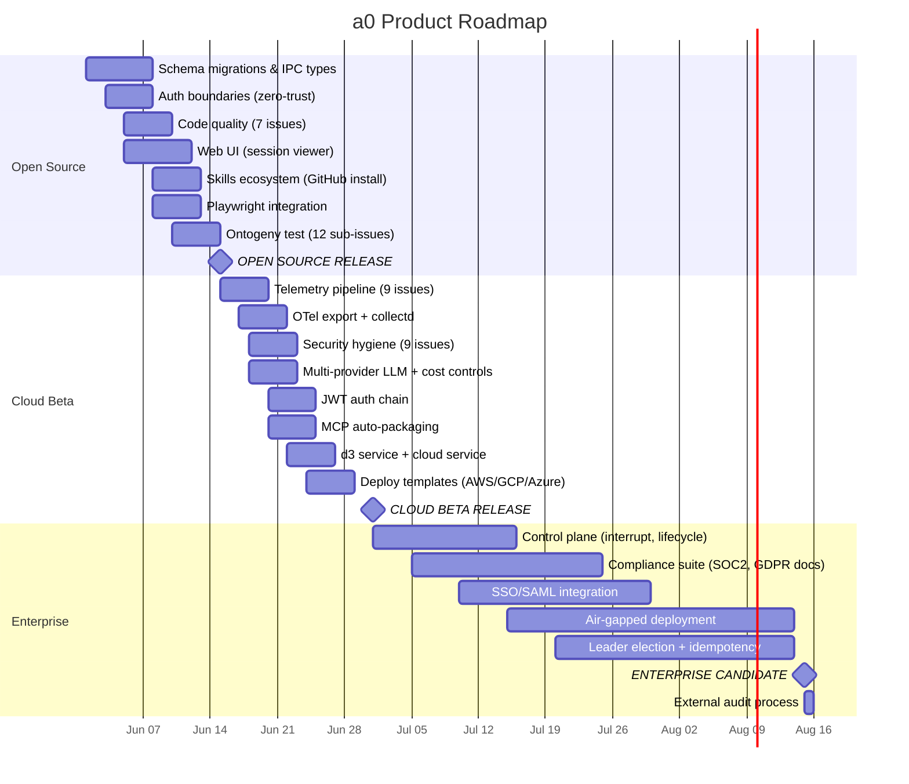

> **⚠️ PRE-RELEASE DISCLAIMER**: This project is under active pre-release development. It is intended **only** for developer evaluation in a secure, sandboxed VM environment using open/non-sensitive data. **Do not use for any production purpose.** No warranty of any kind is provided. APIs, protocols, data formats, and security boundaries are unstable and will change without notice. All agent execution is disabled by default — the agent starts with zero autonomous capability until explicit user authorization is granted.

---

# a0 — Agentic Development Pipeline

a0 is a C++17 agentic development pipeline that uses specification-driven generation, real-time telemetry, and adaptive governance panels to evolve itself through three release phases: **Open Source**, **Cloud Beta**, and **Enterprise**.

## Architecture

Four daemons form a distributed deployment tree, with a zero-opex cloud service for authentication only:

```
Cloud Service ──→ d3 ──→ c2 ──→ b1 ──→ a0
  (auth only)    (team)   (host)  (proj)  (agent)
```

All agent execution, telemetry, and data storage run on customer infrastructure. The cloud service handles only authentication and routing.

## Development Governance

Two independent expert panels adaptively shape the roadmap and audit requirements:

- **Enterprise Stakeholder Review Panel** — 5 experts (SeniorSoftwareEngineer, SeniorSoftwareEngineerUser, EngineeringManager, ProductManager, CorporateExecutive) evaluate feature gaps and market fit, reprioritizing the feature roadmap each session.
- **System Design Review Panel** — 7 experts (Cryptography, Security, Distributed Systems, Software Engineering, UX, Legal, Energy) audit every feature against security/compliance requirements and create or modify audit blocker issues at each release phase.

Neither panel writes code. Both panels produce structured issue output that drives the implementation process.

## Product Roadmap

```mermaid
graph TB
    subgraph "Adaptive Governance Panels"
        EP[Enterprise Stakeholder<br/>Review Panel]
        SDR[System Design<br/>Review Panel]
    end

    subgraph "Feature Groups"
        FG1["Group 1: Core Foundation<br/>(schema, IPC types)"]
        FG2["Group 2: Telemetry & Observability<br/>(instrumentation, aggregation, OTel export)"]
        FG3["Group 3: Security & Auth<br/>(boundaries, zero-trust, JWT chain, audit)"]
        FG4["Group 4: Web UI<br/>(dashboards, session viewer, auth prompts)"]
        FG5["Group 5: Skills Ecosystem<br/>(GitHub install, MCP auto-packaging, persona)"]
        FG6["Group 6: LLM Providers<br/>(multi-provider factory, cost controls)"]
        FG7["Group 7: Infrastructure<br/>(d3, cloud service, deploy templates, collectd)"]
        FG8["Group 8: Control Plane<br/>(interrupt, lifecycle, session control)"]
        FG9["Group 9: Testing & CI<br/>(Playwright, ontogeny, flow tests)"]
        FG10["Group 10: Compliance<br/>(audit logging, SIEM, SOC2, air-gap)"]
    end

    subgraph "Release Phases"
        subgraph "Open Source"
            OS_ITEMS["Schema migrations<br/>Auth boundaries (6 issues)<br/>Code quality (7 issues)<br/>Web UI (session viewer)<br/>Skills ecosystem<br/>CLI docs"]
        end

        subgraph "Cloud Beta"
            CB_ITEMS["Telemetry pipeline (9 issues)<br/>OTel export<br/>collectd integration<br/>d3 + cloud service<br/>Deploy templates<br/>Security hygiene (9 issues)<br/>JWT auth chain<br/>Playwright tests"]
        end

        subgraph "Enterprise"
            ENTERPRISE_ITEMS["Control plane (3 issues)<br/>Compliance suite<br/>Air-gapped deploy<br/>SSO/SAML<br/>SOC2 documentation<br/>Leader election<br/>Idempotent writes"]
        end
    end

    FG1 --> OS_ITEMS
    FG2 --> CB_ITEMS
    FG3 --> OS_ITEMS
    FG3 --> CB_ITEMS
    FG4 --> OS_ITEMS
    FG4 --> CB_ITEMS
    FG5 --> OS_ITEMS
    FG6 --> CB_ITEMS
    FG7 --> CB_ITEMS
    FG7 --> ENTERPRISE_ITEMS
    FG8 --> ENTERPRISE_ITEMS
    FG9 --> OS_ITEMS
    FG9 --> CB_ITEMS
    FG10 --> ENTERPRISE_ITEMS

    EP -->|"reviews feature gaps, reprioritizes"| FG1
    EP -->|"reviews feature gaps, reprioritizes"| FG2
    EP -->|"reviews feature gaps, reprioritizes"| FG3
    EP -->|"reviews feature gaps, reprioritizes"| FG4
    EP -->|"reviews feature gaps, reprioritizes"| FG5
    EP -->|"reviews feature gaps, reprioritizes"| FG6
    EP -->|"reviews feature gaps, reprioritizes"| FG7
    EP -->|"reviews feature gaps, reprioritizes"| FG8
    EP -->|"reviews feature gaps, reprioritizes"| FG9
    EP -->|"reviews feature gaps, reprioritizes"| FG10

    SDR -->|"audits features, creates blocker issues"| FG3
    SDR -->|"audits features, creates blocker issues"| FG6
    SDR -->|"audits features, creates blocker issues"| FG7
    SDR -->|"audits features, creates blocker issues"| FG10

    classDef phase fill:#e1f5fe,stroke:#01579b,stroke-width:2px
    classDef group fill:#f3e5f5,stroke:#7b1fa2,stroke-width:1px
    classDef panel fill:#fff3e0,stroke:#e65100,stroke-width:2px,stroke-dasharray: 5 5
    class OS_ITEMS,CB_ITEMS,ENTERPRISE_ITEMS phase
    class FG1,FG2,FG3,FG4,FG5,FG6,FG7,FG8,FG9,FG10 group
    class EP,SDR panel
```



## Development Process

The roadmap evolves through a continuous two-phase loop, executed each session:

**Phase 1 — Feature Review (Enterprise Stakeholder Panel)**:
1. Load open issues from the project board
2. Load full source tree and spec tree into context
3. Run the 5-expert Enterprise Panel to identify feature gaps
4. Decompose issues into atomic, parallelizable implementation units (code-first: one isolatable source change per unit)
5. Create sub-issues on GitHub, link via tasklists in epic bodies
6. Update the project board with new issues

**Phase 2 — Audit Reconciliation (System Design Review Panel)**:
1. For each new feature issue, run the 7-expert technical audit panel
2. Identify gaps between the feature and applicable audit requirements
3. Either: add user stories to the existing issue, or create a new sub-issue
4. Tag issues with the correct release phase label (audit-open-source, audit-cloud-beta, audit-enterprise)
5. Audit issues block their phase from releasing until closed

**Implementation**:
1. Developers implement atomic units from the board, ordered by dependency
2. Each unit produces a working build increment with tests
3. The ontogeny test (a0 generating itself from its own specs) validates the spec-driven pipeline
4. b1 supervises the process, detects crashes, and triggers self-healing

## Timeline



## Project Board

All 81 issues are tracked at **https://github.com/orgs/opensassi/projects/1**

| Epic | Phase | Issues |
|------|-------|--------|
| #1 SQLite schema versioning | Open Source | #1 |
| #2 Telemetry pipeline | Open Source | #7-#15 |
| #3 Control plane | Enterprise | #19-#21 |
| #4 Web UI | Open Source | #16-#18, #35-#36 |
| #5 Host monitoring (collectd) | Cloud Beta | #22-#24 |
| #6 LLM & skills ecosystem | Open Source | #25-#28, #39 |
| #7 d3 team environment manager | Cloud Beta | #29-#34 |
| #42 Ontogeny test | Open Source | #42-#54 |
| #55 Security & Compliance Audit | All phases | #55-#81 |
# a0 Product Roadmap — Open Source → Cloud Beta → Enterprise

## Architecture Overview

```
                    ┌──────────────────────────────────┐
                    │        Cloud Service              │
                    │  (auth, billing, account mgmt)    │
                    │  Routes users to their d3         │
                    │  Zero operational cost per user   │
                    └──────────┬───────────────────────┘
                               │ HTTPS
                    ┌──────────▼───────────────────────┐
                    │  d3 — Team Environment Manager    │
                    │  Aggregates c2 instances          │
                    │  Cross-team/project view          │
                    │  Deployed on customer infra       │
                    └──────────┬───────────────────────┘
                               │ TLS + mTLS
                    ┌──────────▼───────────────────────┐
                    │  c2 — Host Monitor (per machine)  │
                    │  Dashboard + OTel export          │
                    │  One per host                     │
                    └──────────┬───────────────────────┘
                               │ Unix socket
                    ┌──────────▼───────────────────────┐
                    │  b1 — Project Supervisor          │
                    │  One per project directory        │
                    └──────────┬───────────────────────┘
                               │ Unix socket
                    ┌──────────▼───────────────────────┐
                    │  a0 — Agent instances             │
                    │  Many per project                 │
                    └──────────────────────────────────┘
```

**Key design principle**: The cloud service handles **only** authentication, account management, and routing. All agent execution, telemetry storage, and dashboards run on the customer's own infrastructure. This gives the cloud service effectively zero per-user operational cost while providing full data sovereignty to customers.

**Deployment model**:
- Infrastructure-as-code templates (Terraform/Pulumi/CDK) for AWS, GCP, Azure
- SSH-based deployment to arbitrary hosts (bare metal, VPS, on-prem)
- d3 + c2 stack deploys on customer infrastructure
- Cloud service routes `*.d3.a0.dev` subdomains to the correct d3 instance

---

## Release Phases

### Phase 1: Open Source (current)

**Target audience**: Individual developers, early adopters, community contributors.

**Deployment model**: Manual build from source, `git clone && cmake && make`.

**Stack**: a0 + b1 + c2 (all localhost, single machine)

| Area | Features | Issues |
|------|----------|--------|
| **Persistence** | SQLite schema versioning & migrations | #1 |
| **Core agent** | Git integration, session persistence, Docker execution | Existing |
| **Skills** | Local skill creation, system skills (bash, docker, git, fs) | Existing |
| **Basic dashboard** | c2 with SSE, host list, agent list, pending prompt management | Existing (basic) |
| **CLI** | `a0 --run`, `--resume`, `--kill-all`, `session export/list` | Existing |

**Target completion**: All foundational features stable, documentation complete, community contribution guide published.

---

### Phase 2: Cloud Beta

**Target audience**: Small teams, startups, early enterprise pilots.

**Deployment model**: One-click deploy via cloud template (AWS/GCP/Azure) or SSH to existing host.

**New component**: **d3** — Team Environment Manager
- Aggregates multiple c2 instances across a team
- Provides cross-project, cross-host unified view
- Team-level access control (RBAC at d3 level)
- Connects to cloud service for authentication

**New component**: **Cloud Service** (separate app)
- User authentication (OAuth 2.0 / SSO / SAML)
- Account management (teams, invite flow, roles)
- Billing/subscription management (Stripe)
- Routes `*.d3.a0.dev` to customer's d3 instance
- No access to customer data — all traffic proxied to d3

| Epic | Features | Issues |
|------|----------|--------|
| **Telemetry pipeline** | IPC telemetry types, a0 instrumentation, b1 aggregation, c2 ingestion, SSE broadcast | #7-#14 |
| **OTel export** | OpenTelemetry C++ SDK in c2, OTLP HTTP export | #15 |
| **d3 — team aggregator** | Multi-c2 aggregation, cross-host view, team-level RBAC | New |
| **Cloud service** | Auth, billing, account management, d3 routing | New |
| **Deployment templates** | Terraform/Pulumi for AWS/GCP/Azure, SSH deploy script | New |
| **Web UI — session viewer** | Chat history, branching context tree, collapsible sections | #16 |
| **Web UI — host monitoring** | Live host cards, telemetry feeds, agent tree view | #17 |
| **collectd integration** | Deploy collectd, custom a0 plugin, RRD storage | #22, #23 |
| **Skill install from GitHub** | `a0 skill install`, list, remove, GC | #27 |
| **MCP auto-packaging** | Discover, fetch, convert MCP servers → skills | #28 |
| **Multi-provider LLM** | Provider factory, OpenAI, Anthropic, Ollama backends | #25 |
| **Cost controls** | Token tracking, budget caps, rate limiting | #26 |

**Target completion**: Production-ready for teams of up to 50 engineers. Full skill ecosystem operational. One-click cloud deployment.

---

### Phase 3: Enterprise

**Target audience**: Large organizations, regulated industries, multi-team deployments.

**Deployment model**: Fully air-gapped option (no cloud service needed), existing infra integration.

| Epic | Features | Issues |
|------|----------|--------|
| **Control plane** | HTTP interruption, lifecycle manager, session control | #19, #20, #21 |
| **Resource limits** | c2 UI for per-agent/b1 limits, c2→b1→a0 flow | #18 |
| **collectd enterprise export** | Write Prometheus, Write HTTP, Write Graphite, docs | #24 |
| **b1 control relay** | Forward limits/interrupts from c2 to a0 | #13 |
| **Web UI — resource config** | Limit forms, apply to agent/b1/all | #18 (impl) |
| **SSO/SAML** | Enterprise identity provider integration in cloud service | New |
| **Audit logging** | Forward SQLite audit trail to enterprise SIEM | New |
| **Compliance reports** | Automated SOC2/GDPR report generation from audit trail | New |
| **Multi-team hierarchy** | Org → Team → Project → Agent namespace in d3 | New |
| **On-prem deploy** | Fully air-gapped, no cloud service dependency, license key activation | New |

**Target completion**: SOC2 Type II, GDPR compliance documentation. Multi-team org support. Air-gapped deployment.

---

## Detailed Feature Mapping

### Open Source Phase (Current + Immediate)

| Priority | Feature | Issue | Effort | Dependencies |
|----------|---------|-------|--------|-------------|
| P0 | SQLite schema versioning & migrations | #1 | S | None |
| P0 | IPC telemetry message types | #7 | XS | None |
| P0 | a0 LLM request instrumentation | #8 | S | #7 |
| P0 | a0 tool execution instrumentation | #9 | S | #7 |
| P0 | a0 periodic telemetry flush to b1 | #10 | M | #8, #9 |
| P0 | b1 telemetry aggregation | #11 | M | #10 |
| P0 | b1 periodic snapshot to c2 | #12 | S | #11 |
| P1 | c2 telemetry ingestion + SSE | #14 | M | #12 |
| P1 | c2 session context viewer | #16 | L | None (uses existing SQLite) |
| P1 | c2 host monitoring dashboard | #17 | L | #14 |
| P1 | Skill install from GitHub | #27 | L | None |
| P2 | Multi-provider LLM factory | #25 | L | None |
| P2 | c2 OpenTelemetry exporter | #15 | XL | #14 |
| P2 | collectd custom a0 plugin | #23 | M | #11 |
| P2 | MCP auto-packaging as skills | #28 | M | #27 |

### Cloud Beta Phase

| Priority | Feature | Issue | Effort | Dependencies |
|----------|---------|-------|--------|-------------|
| P0 | d3 — team aggregator service | New | XL | #14, #12 |
| P0 | Cloud service — auth + routing | New | XL | d3 |
| P0 | Deployment templates (AWS) | New | M | d3 |
| P0 | Deployment templates (GCP) | New | M | d3 |
| P0 | Deployment templates (Azure) | New | M | d3 |
| P0 | SSH-based deploy to arbitrary hosts | New | S | d3 |
| P1 | Cost controls (token tracking + caps) | #26 | M | #25 |
| P1 | collectd deployment config | #22 | S | None |
| P1 | collectd enterprise export (Write Prometheus) | #24 | S | #22, #23 |
| P2 | c2 resource limit configuration UI | #18 | M | #14 |
| P2 | b1 control relay | #13 | S | #7 |

### Enterprise Phase

| Priority | Feature | Issue | Effort | Dependencies |
|----------|---------|-------|--------|-------------|
| P0 | a0 HTTP request interruption | #19 | L | None |
| P0 | Air-gapped deployment (no cloud service) | New | XL | d3, c2, b1, a0 |
| P0 | SSO/SAML integration | New | M | Cloud service |
| P0 | SOC2 compliance documentation | New | L | Audit trail, OTel |
| P1 | Sequential operation lifecycle manager | #20 | XL | #19 |
| P1 | c2 real-time session control | #21 | L | #19, #20, #13 |
| P1 | Audit log export to SIEM | New | M | #1, #14 |
| P1 | GDPR compliance reports | New | M | #1, #14 |
| P2 | Multi-team org hierarchy in d3 | New | L | d3 |
| P2 | Customizable resource limit policies | New | S | #18 |

---

## Component Specification

### d3 — Team Environment Manager

**Purpose**: Aggregates multiple c2 instances across a team or organization into a unified management plane.

**Interface**:
- HTTPS REST API + WebSocket (not Unix sockets — must work across machines)
- Accepts connections from c2 instances (c2 registers with d3)
- Accepts connections from cloud service (for user auth proxying)
- Serves the "team view" web app (cross-host dashboard)

**Data model**:
```
d3
 ├── Organizations
 │    ├── Teams
 │    │    ├── Members (users with roles)
 │    │    ├── Hosts (c2 instances)
 │    │    │    ├── b1 supervisors
 │    │    │    │    ├── a0 agents
 │    │    │    │    └── Project metrics
 │    │    │    └── Machine metrics (from collectd)
 │    │    └── Deployments (cloud template state)
 │    └── Billing (subscription plan, usage)
```

**Deployment**: Runs on customer infrastructure only. Cloud service never hosts d3.

**Tech stack**: C++17, same project as a0/b1/c2. Shares `ipc_lib` for protocol types, `unix_socket` for transport (local c2 connections), plus HTTPS server (via uWebSockets, already a dependency of c2). SQLite via the existing `PersistenceStore` interface for team state. Static binary built by the same CMake project, deployed alongside siblings.

**Shared code with a0/b1/c2**:
- `src/ipc/` — IPC message types extended for d3↔c2 protocol
- `src/unix_socket.h/.cpp` — Unix socket transport (for local c2 connections)
- `src/persistence/` — SQLite store for team state, user/team/host models
- `src/command_runner.h/.cpp` — SSH and deployment script execution
- `CMakeLists.txt` — `add_executable(d3 d3_main.cpp)` linking shared libraries

### Cloud Service

**Purpose**: Zero-opex user management and routing layer.

**Interface**:
- Web UI for sign-up, login, account management
- Stripe integration for billing
- Routes `team-a.d3.a0.dev` → `203.0.113.42:8443` (the customer's d3 instance)
- REST API for d3 health checks and routing table updates

**Data stored** (in cloud service only):
- User accounts (email, hashed password, OAuth identities)
- Organization name and subscription plan
- d3 instance routing table (hostname → IP:port)
- Billing records

**Data NEVER stored** in cloud service:
- Agent telemetry
- Session logs
- Skill definitions
- Host metrics
- Any customer code or data

**Tech stack**: Whatever fits — stateless Go/Rust binary, PostgreSQL, Redis for session cache.

### Deployment Templates

**Purpose**: One-command deploy of the full a0/d3 stack to customer infrastructure.

**Targets**:
- AWS: CloudFormation or CDK (TypeScript)
- GCP: Deployment Manager or Pulumi
- Azure: ARM templates or Bicep
- Generic: Ansible playbook + SSH
- Docker Compose (for single-machine evaluation)

**Template contents**:
- VPC / network setup
- Compute instances (EC2 / GCE / VM) for d3 + c2
- Security groups / firewall rules (d3:443, c2:9090, collectd:9103)
- IAM roles / service accounts for monitoring
- CloudWatch / Stackdriver / Azure Monitor integration config
- DNS record for `*.d3.a0.dev`

**SSH deploy**: For teams that already have infrastructure:
```
curl -sS https://deploy.a0.dev | bash -s -- --ssh host@example.com --hostname team-a
```
This installs d3 + c2 + collectd on the target host via SSH and registers the hostname with the cloud service.

---

## Release Timeline (Tentative)

| Milestone | Date | Phase | Key Deliverables |
|-----------|------|-------|------------------|
| M1 | 2026-06-15 | Open Source | Schema migrations, auth boundaries, code quality, session viewer, skill install, ontogeny, Playwright |
| M2 | 2026-07-01 | Cloud Beta | Telemetry pipeline, OTel export, collectd, d3, cloud service, deploy templates, JWT chain, multi-provider LLM, MCP auto-packaging |
| M3 | 2026-08-15 | Enterprise | Control plane, compliance suite, SSO/SAML, air-gapped deploy, leader election, SOC2/GDPR/ISO/FedRAMP audit ready |

---

## Key Architectural Decisions

| Decision | Choice | Rationale |
|----------|--------|-----------|
| d3 tech stack | C++17 (same as a0/b1/c2) | Shared IPC library, build system, and deployment. uWebSockets already provides HTTPS. Single CMake project produces all four binaries. |
| d3↔c2 transport | HTTPS + WebSocket (remote) + Unix socket (local) | Remote c2 instances connect via HTTPS; local c2 via Unix socket for zero-config. |
| Cloud service data | Minimal (auth only) | Zero-opex design; all customer data stays on customer infra |
| Deployment template format | Multiple (Terraform/Pulumi/CDK) | Meet customers where they are; each cloud has a preferred IaC tool |
| SSH deploy | Ansible-based | Battle-tested, idempotent, supports all Linux distros |
| c2 OTel export | OTLP HTTP (not gRPC) | gRPC is heavy; HTTP/1.1 is simpler and works everywhere |
| collectd data flow | c2 exposes port, collectd pulls | Pull model avoids overloading a0 agents with export responsibility |

---

*Generated from the Enterprise Stakeholder Review Panel. Architecture decisions informed by 5-expert evaluation across SeniorSoftwareEngineer, SeniorSoftwareEngineerUser, EngineeringManager, ProductManager, and CorporateExecutive perspectives.*
