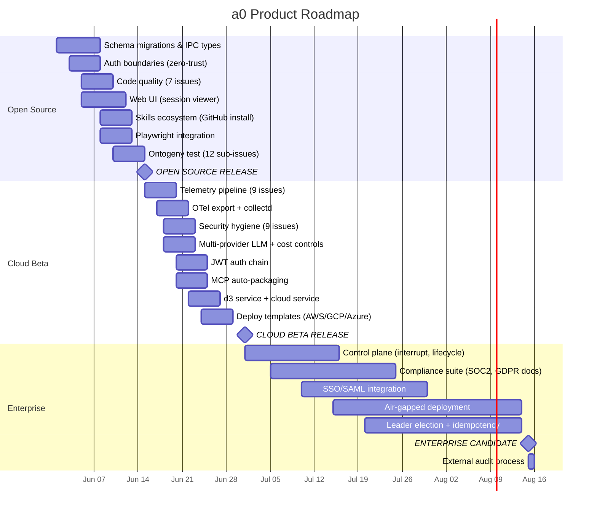
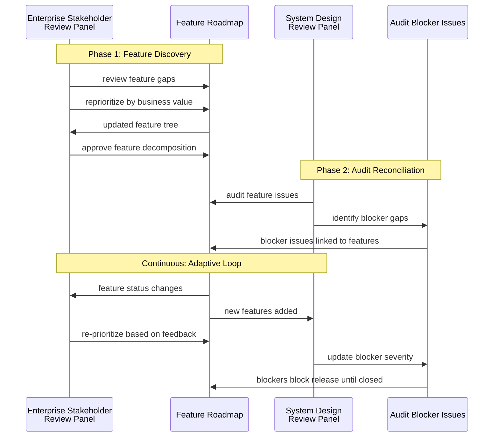

# Roadmap Overview — Feature Groups, Release Phases, and Adaptive Panels

## Mermaid Visualization

```mermaid
graph TB
    subgraph "Adaptive Governance Panels"
        EP[Enterprise Stakeholder<br/>Review Panel]
        SDR[System Design<br/>Review Panel]
    end

    subgraph "Feature Groups"
        FG1["Group 1: Core Foundation<br/>(schema, IPC types)"]
        FG2["Group 2: Telemetry & Observability<br/>(instrumentation, aggregation, OTel export)"]
        FG3["Group 3: Security & Auth<br/>(boundaries, zero-trust, JWT chain, audit)"]
        FG4["Group 4: Web UI<br/>(dashboards, session viewer, auth prompts)"]
        FG5["Group 5: Skills Ecosystem<br/>(GitHub install, MCP auto-packaging, persona)"]
        FG6["Group 6: LLM Providers<br/>(multi-provider factory, cost controls)"]
        FG7["Group 7: Infrastructure<br/>(d3, cloud service, deploy templates, collectd)"]
        FG8["Group 8: Control Plane<br/>(interrupt, lifecycle, session control)"]
        FG9["Group 9: Testing & CI<br/>(Playwright, ontogeny, flow tests)"]
        FG10["Group 10: Compliance<br/>(audit logging, SIEM, SOC2, air-gap)"]
    end

    subgraph "Release Phases"
        subgraph "Open Source"
            OS_ITEMS["Schema migrations<br/>Auth boundaries (6 issues)<br/>Code quality (7 issues)<br/>Web UI (session viewer)<br/>Skills ecosystem<br/>CLI docs"]
        end

        subgraph "Cloud Beta"
            CB_ITEMS["Telemetry pipeline (9 issues)<br/>OTel export<br/>collectd integration<br/>d3 + cloud service<br/>Deploy templates<br/>Security hygiene (9 issues)<br/>JWT auth chain<br/>Playwright tests"]
        end

        subgraph "Enterprise"
            ENTERPRISE_ITEMS["Control plane (3 issues)<br/>Compliance suite<br/>Air-gapped deploy<br/>SSO/SAML<br/>SOC2 documentation<br/>Leader election<br/>Idempotent writes"]
        end
    end

    %% Feature Group → Phase Mapping
    FG1 --> OS_ITEMS
    FG2 --> CB_ITEMS
    FG3 --> OS_ITEMS
    FG3 --> CB_ITEMS
    FG4 --> OS_ITEMS
    FG4 --> CB_ITEMS
    FG5 --> OS_ITEMS
    FG6 --> CB_ITEMS
    FG7 --> CB_ITEMS
    FG7 --> ENTERPRISE_ITEMS
    FG8 --> ENTERPRISE_ITEMS
    FG9 --> OS_ITEMS
    FG9 --> CB_ITEMS
    FG10 --> ENTERPRISE_ITEMS

    %% Adaptive Panel Feedback Loops
    EP -->|"reviews feature gaps,<br/>reprioritizes roadmap"| FG1
    EP -->|"reviews feature gaps,<br/>reprioritizes roadmap"| FG2
    EP -->|"reviews feature gaps,<br/>reprioritizes roadmap"| FG3
    EP -->|"reviews feature gaps,<br/>reprioritizes roadmap"| FG4
    EP -->|"reviews feature gaps,<br/>reprioritizes roadmap"| FG5
    EP -->|"reviews feature gaps,<br/>reprioritizes roadmap"| FG6
    EP -->|"reviews feature gaps,<br/>reprioritizes roadmap"| FG7
    EP -->|"reviews feature gaps,<br/>reprioritizes roadmap"| FG8
    EP -->|"reviews feature gaps,<br/>reprioritizes roadmap"| FG9
    EP -->|"reviews feature gaps,<br/>reprioritizes roadmap"| FG10

    SDR -->|"audits features,<br/>creates/modifies<br/>blocker issues"| FG3
    SDR -->|"audits features,<br/>creates/modifies<br/>blocker issues"| FG6
    SDR -->|"audits features,<br/>creates/modifies<br/>blocker issues"| FG7
    SDR -->|"audits features,<br/>creates/modifies<br/>blocker issues"| FG10

    %% Style
    classDef phase fill:#e1f5fe,stroke:#01579b,stroke-width:2px
    classDef group fill:#f3e5f5,stroke:#7b1fa2,stroke-width:1px
    classDef panel fill:#fff3e0,stroke:#e65100,stroke-width:2px,stroke-dasharray: 5 5
    class OS_ITEMS,CB_ITEMS,ENTERPRISE_ITEMS phase
    class FG1,FG2,FG3,FG4,FG5,FG6,FG7,FG8,FG9,FG10 group
    class EP,SDR panel
```

## Gantt Timeline

## Sub-Module Spec: Release Phase — Open Source

**Phase identifier**: `phase-open-source`
**Duration**: Q3 2026 (June — September)
**Deployment model**: Manual build from source (`git clone && cmake && make`)
**Stack**: a0 + b1 + c2 (all localhost, single machine)

### Feature Groups Mapped

| Group | Key Issues | Audit Overlay |
|-------|------------|---------------|
| Core Foundation | #1, #7 | — |
| Security & Auth | #56-#67, #77, #79 | System Design Review Panel blocks release on open findings |
| Web UI | #16 | — |
| Skills Ecosystem | #27, #28, #39 | — |
| Testing & CI | #37, #38, #42-#54 | — |

### Release Criteria

1. All Open Source audit issues (#56-#67, #77, #79) are closed
2. Agent starts with zero autonomous capability (auth boundaries operational)
3. c2 dashboard renders session viewer
4. Skills can be installed from GitHub
5. Ontogeny test runs one full iteration without crashing

---

## Sub-Module Spec: Release Phase — Cloud Beta

**Phase identifier**: `phase-cloud-beta`
**Duration**: Q4 2026 — Q1 2027 (September — February)
**Deployment model**: One-click cloud template (AWS/GCP/Azure) or SSH to existing host
**Stack**: a0 + b1 + c2 + d3 + Cloud Service

### Feature Groups Mapped

| Group | Key Issues | Audit Overlay |
|-------|------------|---------------|
| Telemetry & Observability | #8-#15 | — |
| Security & Auth | #68-#76, #78, #80, #81 | System Design Review Panel blocks release on open findings |
| Web UI | #17, #35, #36, #38 | — |
| LLM Providers | #25, #26 | — |
| Infrastructure | #29-#34, #22-#24 | — |
| Skills Ecosystem | #28 | — |

### Release Criteria

1. All Cloud Beta audit issues (#68-#76, #78, #80, #81) are closed
2. d3 aggregates at least one c2 instance and renders cross-host dashboard
3. Cloud service authenticates via SSO and routes to d3
4. OTel metrics are exportable from c2
5. collectd archives host + agent metrics to RRD

---

## Sub-Module Spec: Release Phase — Enterprise

**Phase identifier**: `phase-enterprise`
**Duration**: Q2 2027 (January — June)
**Deployment model**: Fully air-gapped option, existing infrastructure integration
**Stack**: a0 + b1 + c2 + d3 (cloud service optional)

### Feature Groups Mapped

| Group | Key Issues | Audit Overlay |
|-------|------------|---------------|
| Control Plane | #19, #20, #21 | — |
| Compliance | TBD (SOC2, GDPR, SIEM) | System Design Review Panel blocks release on open findings |
| Infrastructure | air-gapped deploy, leader election | — |
| LLM Providers | idempotent writes, clock drift docs | — |

### Release Criteria

1. Air-gapped deployment works without any cloud service dependency
2. SSO/SAML integration with major IdPs (Okta, Azure AD, Google Workspace)
3. SOC2 Type II documentation complete
4. Control plane can interrupt LLM requests mid-flight
5. Session control (pause/kill/send-message) operational in c2

---

## Feature Group: Core Foundation

**Identifier**: `group-core`
**Boundary isolation**: Independent — no dependencies on other feature groups

| Feature | Phase | Issues | Dependencies |
|---------|-------|--------|-------------|
| SQLite schema versioning | Open Source | #1 | None |
| IPC protocol message types | Open Source | #7 | None |

## Feature Group: Telemetry & Observability

**Identifier**: `group-telemetry`
**Boundary isolation**: Depends on IPC types (#7) from Core Foundation

| Feature | Phase | Issues | Dependencies |
|---------|-------|--------|-------------|
| a0 LLM instrumentation | Open Source | #8 | #7 |
| a0 tool instrumentation | Open Source | #9 | #7 |
| a0 telemetry flush to b1 | Open Source | #10 | #8, #9 |
| b1 telemetry aggregation | Open Source | #11 | #10 |
| b1 snapshot to c2 | Open Source | #12 | #11 |
| c2 telemetry ingestion + SSE | Open Source | #14 | #12 |
| c2 OTel exporter | Cloud Beta | #15 | #14 |
| collectd integration | Cloud Beta | #22-#24 | #11 |

## Feature Group: Security & Auth

**Identifier**: `group-security`
**Boundary isolation**: Partially independent; auth UI depends on c2 web infrastructure

| Feature | Phase | Issues | Dependencies |
|---------|-------|--------|-------------|
| Zero-trust default | Open Source | #77 | — |
| Auth boundary: bash | Open Source | #56 | #77 |
| Auth boundary: docker | Open Source | #57 | #77 |
| Auth boundary: LLM API | Open Source | #58 | #77 |
| Auth boundary: file write | Open Source | #59 | #77 |
| AuthorizationStore | Open Source | #60 | #77 |
| c2 auth prompt UI | Open Source | #61 | #60 |
| Code quality (6 issues) | Open Source | #62-#67 | — |
| TLS/peer/rate-limit (4 issues) | Cloud Beta | #68, #69, #76, #80 | — |
| Data filter/retention/GDPR (4) | Cloud Beta | #70, #71, #73 | — |
| Docker network isolation | Cloud Beta | #74 | #57 |
| JWT auth chain | Cloud Beta | #81 | #34, #77 |
| Auth audit log | Cloud Beta | #78 | #60, #81 |

## Feature Group: Web UI

**Identifier**: `group-ui`
**Boundary isolation**: Independent backend; uses c2 REST API

| Feature | Phase | Issues | Dependencies |
|---------|-------|--------|-------------|
| Session context viewer | Open Source | #16 | None (SQLite data exists) |
| Skill creation UI | Open Source | #35 | #27 |
| Engineering dashboard | Cloud Beta | #36 | #16 |
| Auth prompt UI | Open Source | #61 | #60 |
| Host monitoring dashboard | Cloud Beta | #17 | #14 |
| Resource limit UI | Cloud Beta | #18 | #8, #76 |

## Feature Group: Skills Ecosystem

**Identifier**: `group-skills`
**Boundary isolation**: Independent; depends only on SkillManager infrastructure

| Feature | Phase | Issues | Dependencies |
|---------|-------|--------|-------------|
| Skill install from GitHub | Open Source | #27 | None |
| MCP auto-packaging | Cloud Beta | #28 | #27 |
| Developer persona (AGENTS.md) | Open Source | #39 | #27 |

## Feature Group: LLM Providers

**Identifier**: `group-llm`
**Boundary isolation**: Independent of other groups

| Feature | Phase | Issues | Dependencies |
|---------|-------|--------|-------------|
| Multi-provider factory | Cloud Beta | #25 | None |
| Cost controls | Cloud Beta | #26 | #25 |

## Feature Group: Infrastructure

**Identifier**: `group-infra`
**Boundary isolation**: Independent; new binaries (d3) and deployment scripts

| Feature | Phase | Issues | Dependencies |
|---------|-------|--------|-------------|
| d3 core service | Cloud Beta | #30 | #14 |
| d3 web UI | Cloud Beta | #31 | #30 |
| d3 CLI | Cloud Beta | #32 | #30 |
| d3 deploy templates | Cloud Beta | #33 | #30 |
| Cloud service | Cloud Beta | #34 | #30 |
| Air-gapped deploy | Enterprise | TBD | #30 |

## Feature Group: Control Plane

**Identifier**: `group-control`
**Boundary isolation**: Depends on telemetry pipeline and IPC types

| Feature | Phase | Issues | Dependencies |
|---------|-------|--------|-------------|
| b1 control relay | Enterprise | #13 | #7 |
| HTTP interruption | Enterprise | #19 | None |
| Lifecycle manager | Enterprise | #20 | #19 |
| Session control | Enterprise | #21 | #19, #20, #13 |

## Feature Group: Testing & CI

**Identifier**: `group-testing`
**Boundary isolation**: Independent — test infrastructure and tooling

| Feature | Phase | Issues | Dependencies |
|---------|-------|--------|-------------|
| Playwright integration | Open Source | #37 | — |
| UI test feedback loop | Cloud Beta | #38 | #37 |
| Ontogeny spec_loader | Open Source | #43 | — |
| Ontogeny build_runner | Open Source | #44 | — |
| Ontogeny test_runner | Open Source | #45 | — |
| Ontogeny attestation | Open Source | #46 | — |
| Ontogeny iteration_tracker | Open Source | #47 | — |
| Ontogeny code_generator | Open Source | #48 | #43 |
| Ontogeny feedback_analyzer | Open Source | #49 | #44, #45 |
| Ontogeny spec_revisor | Open Source | #50 | #49 |
| Ontogeny orchestrator | Open Source | #51 | #43-#50 |
| b1 crash detection | Open Source | #52 | b1 infra |
| b1 self-healer | Open Source | #53 | #52 |
| Ontogeny CLI | Open Source | #54 | #43-#51 |

## Feature Group: Compliance

**Identifier**: `group-compliance`
**Boundary isolation**: Documentation and configuration; minimal code changes

| Feature | Phase | Issues | Dependencies |
|---------|-------|--------|-------------|
| DPIA documentation | Cloud Beta | #72 | — |
| License audit | Cloud Beta | #75 | — |
| SOC2 documentation | Enterprise | TBD | #71, #73, #78 |
| SIEM audit export | Enterprise | TBD | #78 |

---

## Adaptive Panel Interaction Model

---

*Generated following the opensassi system-design sub-module specification pattern. Feature groups are isolated by source change boundary, mapped to release phases by dependency analysis, and governed by two adaptive panels: the Enterprise Stakeholder Review Panel (business value, market fit) and the System Design Review Panel (security, compliance, technical audit).*
