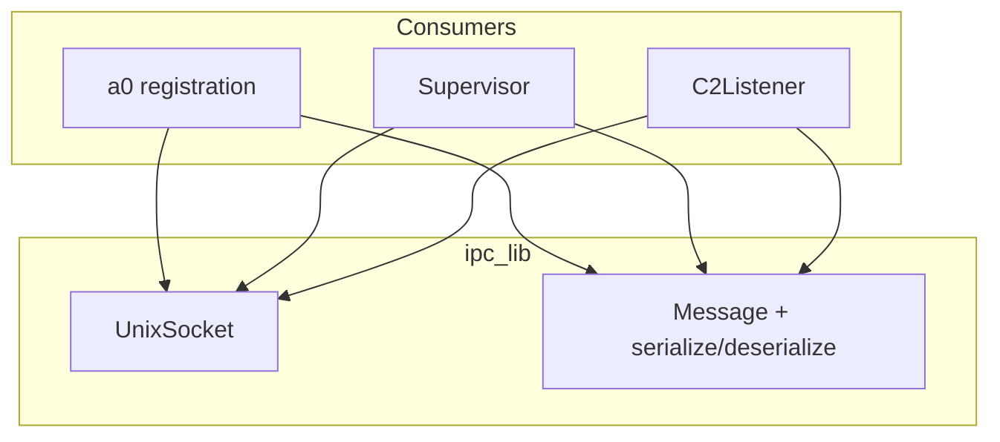
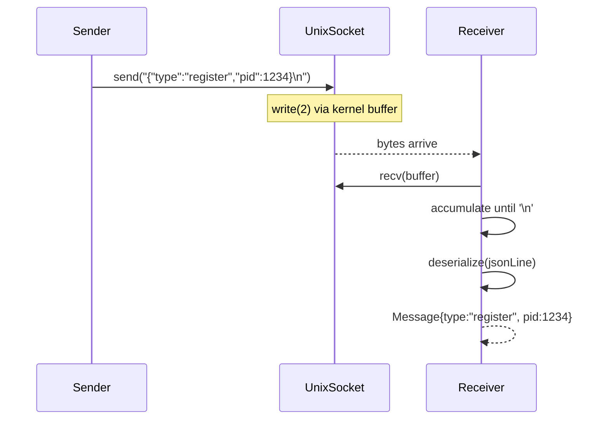

# IPC Spec

## 1. Overview

Utility library providing Unix domain socket communication and JSON-line message framing for the a0↔b1↔c2 protocol.

**Dependencies:** POSIX (`socket`, `bind`, `listen`, `accept`, `connect`, `poll`, `send`, `recv`, `unlink`), nlohmann/json

**Lifecycle:** Per-connection. `UnixSocket` objects are move-only. Server sockets long-lived; client sockets per-peer.

## 2. Component Specifications

```cpp
namespace a0::ipc {

/// Wrapper around AF_UNIX SOCK_STREAM. Non-blocking I/O via poll(2).
class UnixSocket {
public:
    UnixSocket();
    explicit UnixSocket(int fd);
    UnixSocket(UnixSocket&&) noexcept;
    ~UnixSocket();

    int bindAndListen(const std::string& socketPath, int backlog = 5);
    int accept(UnixSocket& client);
    int connect(const std::string& socketPath, int timeoutMs = 5000);
    int send(const std::string& data);
    int recv(std::vector<char>& buf, size_t& received);
    int pollReadable(int timeoutMs = -1) const;
    void close();
    static void unlinkPath(const std::string& socketPath);
    int fd() const;
    bool isOpen() const;
};

/// A framed JSON-line message from the protocol.
struct Message {
    std::string type;            // "register", "ack", "update", "heartbeat", "shutdown"
    int pid = 0;
    std::string sessionUuid;
    std::string workdir;
    std::string hostname;
    nlohmann::json agents;
    std::string status;
    std::string error;
    std::string reason;
};

std::string serialize(const Message& msg);
int deserialize(const std::string& jsonLine, Message& msg);
int recvMessage(UnixSocket& sock, Message& msg, int timeoutMs = 5000);
int sendMessage(UnixSocket& sock, const Message& msg);

} // namespace a0::ipc
```

## 3. Architecture Diagram



**Caption:** Three consumers (a0, b1, c2) share the same socket and protocol code.

## 4. Data Flow



## 5. Error Handling

| Condition | Behaviour |
|-----------|-----------|
| Socket path exists on bindAndListen | Unlinks first, then binds |
| connect to non-existent path | Returns -1 after timeout |
| send on closed socket | Returns -1 (EPIPE) |
| recv returns 0 bytes (EOF) | Returns -1 — caller treats as disconnect |
| Malformed JSON in deserialize | Returns -1 |
| recvMessage timeout waiting for `\n` | Returns -2, no data consumed |

## 6. Edge Cases

- **Large message (>1 MB)**: `send` fragments across multiple write calls; `recvMessage` reassembles
- **Multiple concurrent clients**: Server uses poll(2) with one fd per peer
- **Interrupted syscall (EINTR)**: All blocking calls retry internally
- **Stale socket from crash**: bindAndListen calls unlinkPath before bind

## 7. Testing Requirements

| Test | Verification |
|------|-------------|
| bindAndListen + accept + connect | Round-trip connect/accept succeeds |
| send/recv round-trip | "hello" → "hello" |
| send after peer close | Returns -1 |
| connect timeout to non-existent path | Returns -1 |
| Message serialize/deserialize round-trip | All fields survive round-trip |
| deserialize missing type | Returns -2 |
| recvMessage message split across two recvs | Returns 0 after second recv completes line |
| recvMessage timeout | Returns -2 |

All socket tests use `socketpair(AF_UNIX, SOCK_STREAM, 0)` — no filesystem needed.
