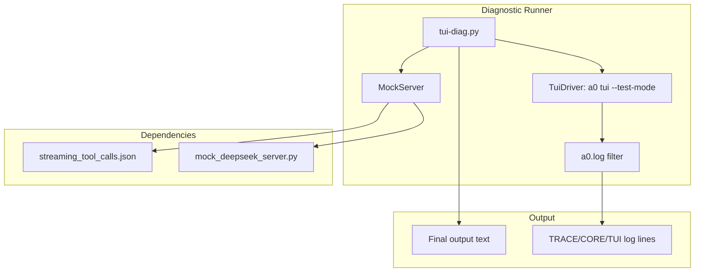
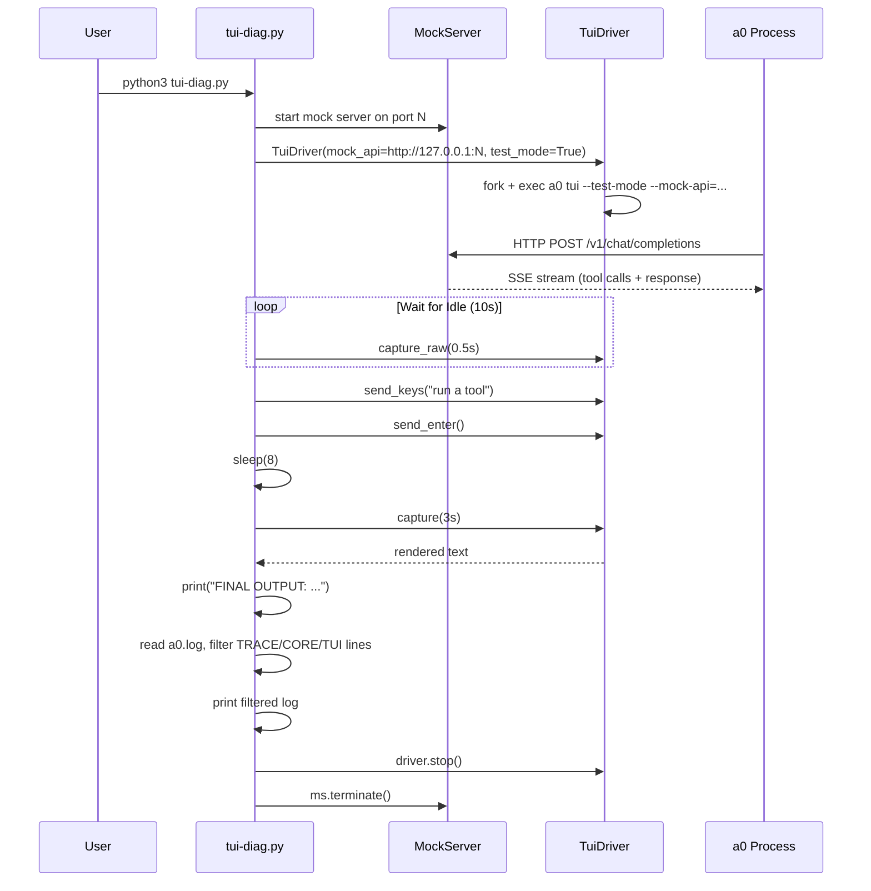

# TuiDiag Spec

## §1. Overview

**Role:** Diagnostic test runner for TUI debugging. Launches `a0 tui --test-mode` with a mock DeepSeek API server using the `streaming_tool_calls.json` scenario, submits a single goal, captures the rendered output, then prints filtered log entries (TRACE, CORE, TUI) from the a0 log file. Designed for quick feedback during development — runs in ~8 seconds and surfaces relevant trace output.

**Source file:** `scripts/tui-diag.py`

**Dependencies:** `test/e2e/conftest.py` (MockServer, TuiDriver, A0_BIN, SKILLS_DIR, find_free_port), `test/e2e/mock_deepseek_server.py`, `test/e2e/fixtures/streaming_tool_calls.json`, Python standard library

**Lifecycle:**
1. Start mock server on a free port with `streaming_tool_calls.json` scenario
2. Start TuiDriver with `--mock-api` pointing to mock server
3. Wait for TUI to reach Idle state (10s timeout)
4. Submit goal "run a tool"
5. Wait 8 seconds for processing
6. Capture final rendered output
7. Stop TuiDriver and mock server
8. Print filtered log entries from a0's log file

## §2. Component Specifications

```python
# Configuration
MOCK_PORT = find_free_port()       # ephemeral port
SCENARIO = "streaming_tool_calls.json"
WAIT_SECONDS = 8                   # time to let TUI process
A0_DIR = f"/tmp/a0-diag-{os.getpid()}"
```

No classes defined — the file is a single script with setup, execution, and log filtering in sequence.

## §3. Architecture Diagram



## §4. Data Flow



## §5. Testing Requirements

| Test | Verification |
|------|-------------|
| Mock server starts | Returns HTTP 200 on `/` endpoint |
| TUI reaches Idle | `b"Idle"` appears in captured output within 10s |
| Goal submission | No crash after `send_enter()` |
| Log file exists | `a0.log` created in a0_dir |
| Log filtering | Only lines containing TRACE/CORE/TUI printed |
| Clean shutdown | Both driver and mock server terminated |

## §6. (skip)

## §7. CLI Entry Point

```
python3 scripts/tui-diag.py

Output:
  stderr: "TUI started.", "Ready: True/False", "Goal submitted...", "FINAL OUTPUT: ..."
  stderr: Filtered TRACE/CORE/TUI lines from a0.log

No arguments. Uses streaming_tool_calls.json fixture from test/e2e/fixtures/.
```
