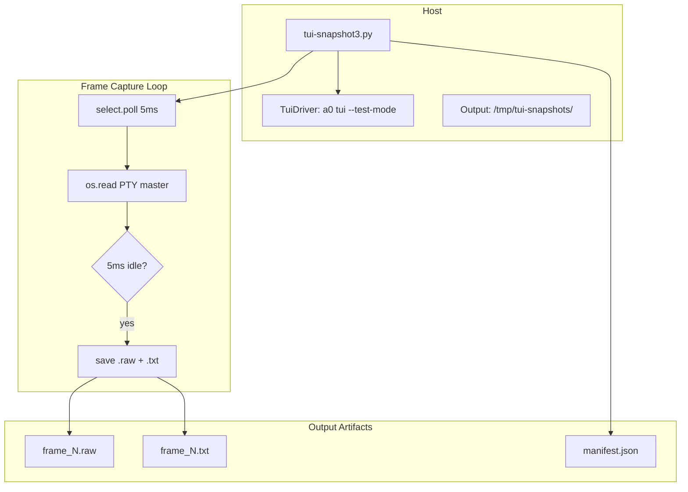
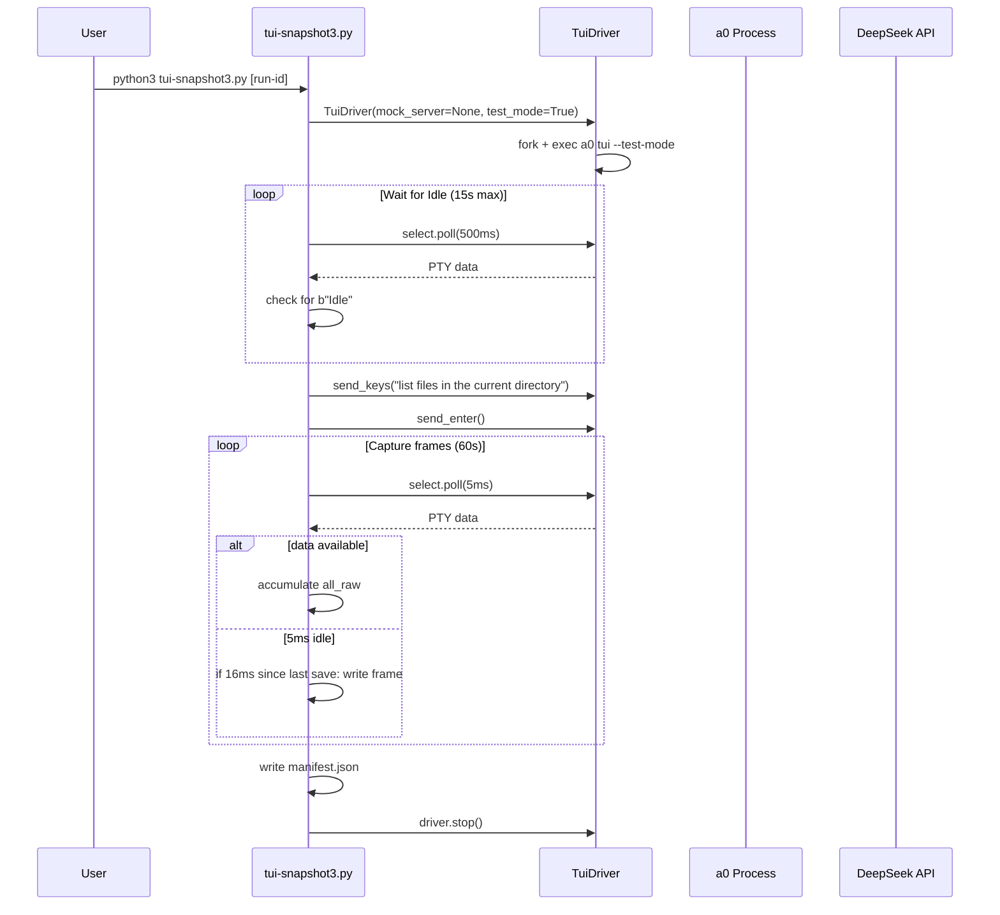

# TuiSnapshot Spec

## §1. Overview

**Role:** Frame capture tool for the TUI. Launches `a0 tui --test-mode` with a real API connection, submits a goal ("list files in the current directory"), and captures screen frames at ~60fps for a configurable duration. Uses continuous polling with 5ms idle detection to detect frame boundaries. Outputs raw ANSI frames and plain-text extracts to a timestamped directory.

**Source file:** `scripts/tui-snapshot3.py`

**Dependencies:** `test/e2e/conftest.py` (TuiDriver), Python standard library (`os`, `sys`, `select`, `re`, `json`, `time`)

**Lifecycle:**
1. Allocate output directory: `/tmp/tui-snapshots/<run-id>/`
2. Start `TuiDriver` with no mock server (real API)
3. Wait for TUI to reach Idle state
4. Submit goal via `send_keys` + `send_enter`
5. Poll PTY master at 5ms intervals for output data
6. When output stalls for 5ms and ≥16ms since last save: write frame files
7. After `CAPTURE_SECONDS` (60s default): write manifest JSON
8. Stop TuiDriver via `driver.stop()`

## §2. Component Specifications

```python
# Configuration
CAPTURE_SECONDS = 60          # Total capture window
SNAPSHOT_INTERVAL = 0.016     # Minimum interval between frames (~60fps)
POLL_TIMEOUT = 0.005          # PTY select timeout (5ms idle detection)
# Output: /tmp/tui-snapshots/<run-id>/
#   frame_NNNNN.raw   — raw ANSI bytes
#   frame_NNNNN.txt   — plain text (ANSI stripped)
#   manifest.json     — frame index with timestamps and sizes
```

No classes defined — the file is a single script with helper functions:
- `strip_ansi(text)` — removes ANSI escape sequences via regex
- Main block: driver lifecycle, poll loop, frame detection, output

## §3. Architecture Diagram



## §4. Data Flow



## §5. Testing Requirements

| Test | Verification |
|------|-------------|
| Invocation without run-id | Generates timestamp-based run-id |
| Output directory creation | `/tmp/tui-snapshots/<run-id>/` created |
| Frame capture | At least one `.raw` + `.txt` pair written |
| Manifest format | JSON with `run_id`, `frames[]`, `total_frames` |
| ANSI stripping | `.txt` files contain no escape sequences |
| Graceful shutdown | `driver.stop()` called even on exception |

## §6. (skip)

## §7. CLI Entry Point

```
python3 scripts/tui-snapshot3.py [run-id]

Arguments:
  run-id    Optional identifier for the capture run (default: snap-<timestamp>)

Output:
  /tmp/tui-snapshots/<run-id>/
    frame_NNNNN.raw   Raw PTY output with ANSI escapes
    frame_NNNNN.txt   Plain text (ANSI stripped)
    manifest.json     Frame metadata index
