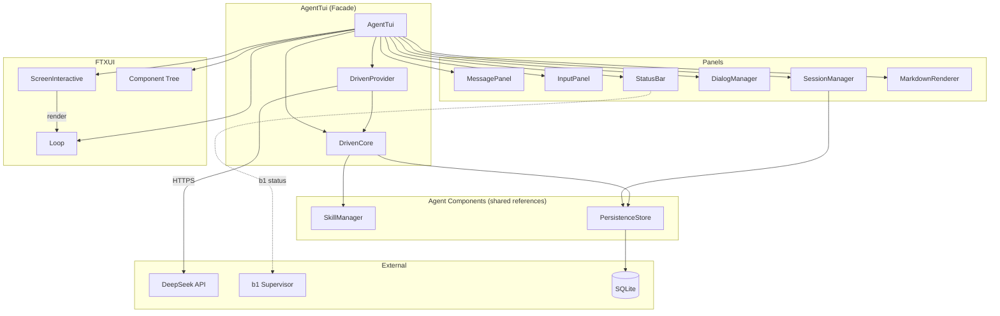
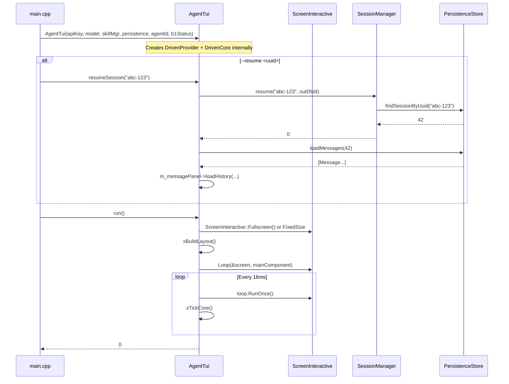
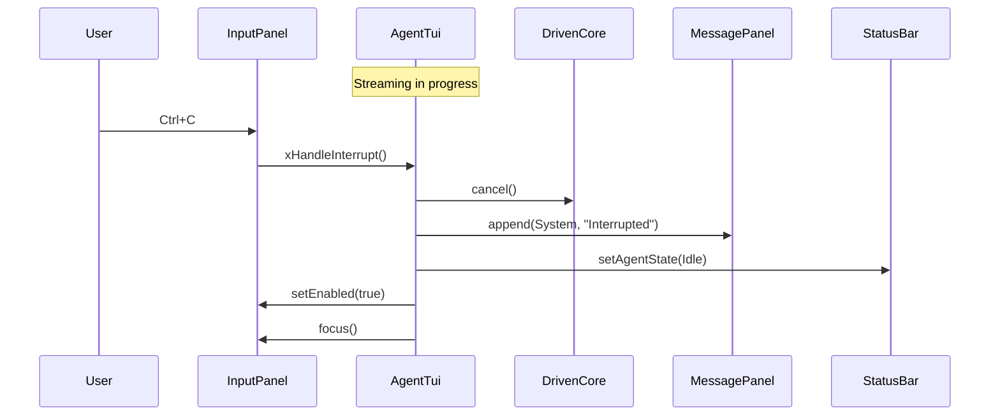

# agent_tui.h/.cpp — TUI Facade

## 1. Overview

The `AgentTui` class is the facade for the TUI sub-module. It owns all panels (MessagePanel, InputPanel, StatusBar, DialogManager, SessionManager, MarkdownRenderer), constructs the FTXUI component hierarchy, manages the event loop via `ScreenInteractive`, and wires events from `DrivenCore` (via `m_drivenCore->tick()`) into the rendering pipeline. It is the sole entry point for the `a0 tui` subcommand.

**Lifecycle:** Construct → (optional `resumeSession`) → `run()` (blocks with xTickCore loop) → cleanup → destruct.

**Depends on**: All other TUI components, `a0::DrivenProvider`, `a0::DrivenCore`, `a0::persistence::PersistenceStore`, `a0::skills::SkillManager`, FTXUI `ScreenInteractive`, `Loop`, `Component`

---

## 2. Component Specifications

```cpp
namespace a0::tui {

/// Main TUI orchestrator. Owns the FTXUI screen, loop, and all panels.
/// Constructed with API key + model, creates DrivenProvider and DrivenCore internally,
/// then run() enters the event loop with a tick-driven polling loop.
class AgentTui {
public:
    /// \param apiKey       DeepSeek API key for DrivenProvider.
    /// \param model        Model identifier (e.g. "deepseek-chat").
    /// \param skillMgr     SkillManager for DrivenCore tool dispatch.
    /// \param persistence  PersistenceStore for session list/resume.
    /// \param agentId      DB agent ID for session creation (optional).
    /// \param b1Status     Function to query b1 connection status (optional).
    AgentTui(const std::string& apiKey,
             const std::string& model,
             a0::skills::SkillManager* skillMgr,
             a0::persistence::PersistenceStore* persistence,
             int64_t agentId = 0,
             std::function<bool()> b1Status = nullptr);

    virtual ~AgentTui();

    /// Enter the FTXUI event loop. Blocks until user quits (Ctrl+Q / :q / /quit).
    /// During the loop:
    ///   - Runs FTXUI Loop with 16ms sleep between iterations
    ///   - Calls xTickCore() after each iteration to drain DrivenCore events
    ///   - Handles user input via InputPanel callbacks
    ///   - Dispatches streaming responses to MessagePanel
    ///   - Updates StatusBar on state changes
    ///   - Processes dialog interactions
    /// \param testMode  If true, uses FixedSize(80,24) screen for automated tests.
    /// \retval 0  Normal exit.
    int run(bool testMode = false);

    /// Request graceful shutdown. Posts Exit() to FTXUI screen.
    void shutdown();

    /// Access the FTXUI component tree for embedding.
    ftxui::Component component() const { return m_mainComponent; }

    /// Set external FTXUI screen (for embedding in larger layouts).
    void setScreen(ftxui::ScreenInteractive* screen);

    /// Clear screen and end current session.
    void clearScreen();

    /// Get the current screen pointer.
    ftxui::ScreenInteractive* screenPtr() const { return m_screen; }

    /// Resume an existing session by UUID.
    /// Loads messages from persistence into the message panel.
    /// \retval 0  Session loaded.
    /// \retval -1 Session not found.
    int resumeSession(const std::string& uuid);

    /// Get current session UUID.
    std::string currentSessionId() const;

    /// Programmatic input submission (used by tests).
    void submitInput(const std::string& input);

private:
    // Non-owning dependencies
    a0::persistence::PersistenceStore* m_persistence;
    int64_t m_agentId = 0;
    std::function<bool()> m_b1Status;

    // Owned providers and core
    std::unique_ptr<a0::DrivenProvider> m_provider;
    std::unique_ptr<a0::DrivenCore> m_drivenCore;

    // Owned panels
    std::unique_ptr<MessagePanel> m_messagePanel;
    std::unique_ptr<InputPanel> m_inputPanel;
    std::unique_ptr<StatusBar> m_statusBar;
    std::unique_ptr<DialogManager> m_dialogMgr;
    std::unique_ptr<SessionManager> m_sessionMgr;
    std::unique_ptr<MarkdownRenderer> m_markdown;

    // Session state
    std::string m_sessionUuid;
    int64_t m_sessionDbId = 0;
    AgentState m_agentState = AgentState::Idle;

    // FTXUI objects
    ftxui::ScreenInteractive* m_screen = nullptr;
    ftxui::Component m_mainComponent;

    // Mouse drag tracking for copy-on-select
    bool m_mouseDown = false;
    bool m_mouseMoved = false;

    // Bracketed paste handling
    bool m_pasteActive = false;
    std::string m_pasteBuffer;
    int m_pasteCounter = 0;
    std::unordered_map<int, std::string> m_pastedContents;

    // Accumulated streaming text for the current assistant message
    std::string m_streamingText;
    int m_streamingEntryIndex = -1;

    // Helpers
    std::string xExpandPastePlaceholders(const std::string& input);
    void xProcessPasteBuffer();
    void xTickCore();

    // Layout
    void xBuildLayout();
    ftxui::Component xBuildMainContainer();

    // Input dispatch
    int xHandleSubmit(const std::string& input);
    int xHandleInterrupt();
    int xHandleCommand(const std::string& cmd);

    // DrivenCore event dispatch
    void xHandleEvent(const a0::mpsc::AppCoreEvent& ev);

    // Streaming callbacks — called from main thread via xTickCore()
    void xOnToken(const std::string& token);
    void xOnToolStart(const std::string& name, const std::string& arguments);
    void xOnToolEnd(const std::string& name, const std::string& output, bool success);
    void xOnComplete(const std::string& fullOutput);
    void xOnError(const std::string& error);

    // Internal commands
    int xCmdSessions();
    int xCmdHelp();
    int xCmdClear();
    int xCmdQuit();
    int xCmdExport();
};

} // namespace a0::tui
```

---

## 3. Architecture



---

## 4. Data Flow

### 4.1 Startup and Main Loop



### 4.2 Submit → xTickCore → Complete

```mermaid
sequenceDiagram
    participant User
    participant IP as InputPanel
    participant AT as AgentTui
    participant SB as StatusBar
    participant MP as MessagePanel
    participant DC as DrivenCore

    User->>IP: type & submit
    IP->>AT: xHandleSubmit("find log files")

    alt command (/sessions, /help, etc.)
        AT->>AT: xHandleCommand(...)
    else goal input
        Note over AT: Create session on first input
        AT->>SM: create("tui-<timestamp>", agentId)
        AT->>SB: setSessionId(uuid)
        AT->>SB: setAgentState(Thinking)
        AT->>MP: append(User, "find log files")
        AT->>IP: setEnabled(false)
        AT->>DC: submitGoal(expanded)
        AT->>AT: xTickCore()  — immediate first tick
    end

    Note over AT,DC: Event loop drains DrivenCore events
    loop xTickCore() — each loop iteration
        DC->>AT: events vector via tick()
        alt LlmToken
            AT->>MP: beginStreaming / streamUpdate
        alt ToolStart
            AT->>MP: appendToolCall(name, Running)
            AT->>SB: setAgentState(Executing)
        alt ToolEnd
            AT->>MP: appendToolCall(name, Completed/Failed, output)
            AT->>SB: setAgentState(Thinking)
        alt Complete
            AT->>MP: endStream
            AT->>SB: setAgentState(Idle)
            AT->>IP: setEnabled(true)
        alt Error
            AT->>MP: append(Error, message)
            AT->>SB: setAgentState(Idle)
            AT->>IP: setEnabled(true)
        end
    end
```

### 4.3 Interrupt



---

## 5. D3 Animation

```html
<!DOCTYPE html>
<html>
<head>
<style>
body { font-family: monospace; background: #1a1a2e; color: #ccc; padding: 24px; }
.terminal { border: 1px solid #444; border-radius: 6px; max-width: 800px; overflow: hidden; }
.statusbar { display: flex; background: #2d2d44; padding: 4px 12px; font-size: 12px; border-bottom: 1px solid #444; }
.status-item { margin-right: 12px; }
.session { color: #888; }
.state { color: #ffea00; }
.b1 { color: #00e676; margin-left: auto; }
.count { color: #888; }
.scrollback { padding: 8px 12px; min-height: 200px; max-height: 300px; overflow-y: auto; background: #1a1a2e; }
.msg { margin: 4px 0; padding: 4px 8px; border-radius: 3px; }
.user { color: #00bcd4; border-left: 2px solid #00bcd4; }
.assistant { color: #ddd; border-left: 2px solid #00e676; }
.tool { color: #448aff; border-left: 2px solid #448aff; font-size: 12px; background: #1a1a3e; }
.system { color: #ffea00; border-left: 2px solid #ffea00; font-size: 12px; }
.cursor { animation: blink 1s step-end infinite; }
@keyframes blink { 50% { opacity: 0; } }
.inputbar { display: flex; border-top: 1px solid #444; background: #2d2d44; }
.prompt { padding: 8px 0 8px 12px; color: #888; }
.input { flex: 1; background: transparent; border: none; color: #eee; padding: 8px; font-family: monospace; outline: none; }
.hint { padding: 8px 12px; color: #555; font-size: 12px; }
button { margin-top: 16px; margin-right: 8px; }
</style>
</head>
<body>
<h3>agent_tui — Full Interaction Demo</h3>
<div class="terminal" id="terminal">
  <div class="statusbar">
    <span class="status-item session" id="session">📋 abc-123</span>
    <span class="status-item state" id="state">💤 Idle</span>
    <span class="status-item b1">b1: ✓</span>
    <span class="status-item count" id="count">3 msgs</span>
  </div>
  <div class="scrollback" id="scrollback">
    <div class="msg user">> find log files</div>
    <div class="msg assistant" id="streamMsg">I will search for log files...</div>
    <div class="msg tool">🔧 glob <span id="toolStatus">⏳ running</span></div>
    <div class="msg tool" style="display:none;" id="toolResult">📄 found 3 files</div>
  </div>
  <div class="inputbar">
    <span class="prompt">></span>
    <input class="input" id="input" value="" placeholder="Type a message..." readonly/>
    <span class="hint">Enter</span>
  </div>
</div>
<div id="toast"></div>
<button onclick="simulateStep()" data-testid="play-pause">Step</button>
<button onclick="resetDemo()">Reset</button>

<script>
let step = 0;
const tokens = ['I will use ', 'the glob tool ', 'to search ', 'for *.log files...'];
const streamMsg = document.getElementById('streamMsg');
const toolStatus = document.getElementById('toolStatus');
const toolResult = document.getElementById('toolResult');
const stateEl = document.getElementById('state');
const countEl = document.getElementById('count');
const input = document.getElementById('input');
let currentText = '';

window.ANIMATION_DURATION_MS = 12000;
window.ANIMATION_KEYFRAMES = [
  { time: 0, label: "idle" },
  { time: 2000, label: "user-input" },
  { time: 4000, label: "streaming" },
  { time: 6000, label: "tool-running" },
  { time: 8000, label: "tool-complete" },
  { time: 10000, label: "done" }
];
window.ANIMATION_VERIFICATION = [
  { label: "idle", state: "Idle" },
  { label: "user-input", inputValue: "find log files" },
  { label: "streaming", streamText: "I will use the glob tool" },
  { label: "tool-running", toolStatusText: "⏳ running" },
  { label: "tool-complete", toolStatusText: "✅ completed" },
  { label: "done", state: "Idle", msgCount: "5 msgs" }
];

function simulateStep() {
  switch(step) {
    case 0: // user types
      input.value = 'find log files';
      stateEl.textContent = '🤔 Thinking';
      stateEl.style.color = '#ffea00';
      break;
    case 1: // first tokens
      currentText = tokens[0];
      streamMsg.textContent = currentText;
      input.value = '';
      break;
    case 2: // more tokens
      currentText += tokens[1];
      streamMsg.textContent = currentText;
      break;
    case 3: // still streaming
      currentText += tokens[2];
      streamMsg.textContent = currentText;
      break;
    case 4: // tool starts
      currentText += tokens[3];
      streamMsg.textContent = currentText;
      toolStatus.textContent = '⏳ running';
      stateEl.textContent = '⚡ Executing';
      stateEl.style.color = '#448aff';
      toolResult.style.display = 'none';
      break;
    case 5: // tool completes
      toolStatus.textContent = '✅ completed';
      toolResult.style.display = 'block';
      stateEl.textContent = '🤔 Thinking';
      stateEl.style.color = '#ffea00';
      break;
    case 6: // assistant done
      streamMsg.textContent = 'Found 3 log files matching *.log.';
      stateEl.textContent = '💤 Idle';
      stateEl.style.color = '#ccc';
      countEl.textContent = '5 msgs';
      break;
  }
  step++;
  if (step > 6) step = 6;
}

function resetDemo() {
  step = 0;
  currentText = '';
  streamMsg.textContent = 'I will search for log files...';
  input.value = '';
  toolStatus.textContent = '⏳ running';
  toolResult.style.display = 'none';
  stateEl.textContent = '💤 Idle';
  stateEl.style.color = '#ccc';
  countEl.textContent = '3 msgs';
}

window.jumpToKeyframe = function(idx) {
  resetDemo();
  for (let i = 0; i <= idx; i++) { step = i; simulateStep(); }
};
window.resetAnimation = resetDemo;
window.getAnimationState = function() {
  return {
    state: stateEl.textContent,
    inputValue: input.value,
    streamText: streamMsg.textContent,
    toolStatusText: toolStatus.textContent,
    msgCount: countEl.textContent
  };
};
</script>
</body>
</html>
```

---

## 6. Testing Requirements

### Unit Tests

| Method | Test Case | Expected |
|--------|-----------|----------|
| `run` | Normal lifecycle | Returns 0, terminal restored |
| `run` | Test mode | FixedSize(80,24) screen used |
| `shutdown` | During execution | Loop exits, DrivenCore cancel called |
| `setScreen` | External screen set | screenPtr() returns correct pointer |
| `clearScreen` | Active session | Session ended, m_screen = nullptr |
| `resumeSession` | Valid UUID | Messages loaded, sessionId set |
| `resumeSession` | Invalid UUID | -1, no change |
| `currentSessionId` | After resume | Returns the resumed UUID |
| `currentSessionId` | Before any session | Empty string |
| `submitInput` | Text input | Forwards to xHandleSubmit |
| `xHandleSubmit` | Normal text | Session created, submitGoal called, state = Thinking |
| `xHandleSubmit` | `/sessions` | Triggers dialog |
| `xHandleSubmit` | `/quit` | Triggers shutdown |
| `xHandleSubmit` | Empty input | No-op |
| `xHandleInterrupt` | During execution | cancel() called, state = Idle, system msg appended |
| `xHandleInterrupt` | While idle | No-op |
| `xOnToken` | Token received | streamUpdate called on MessagePanel |
| `xOnToolStart` | Tool begins | appendToolCall called, state = Executing |
| `xOnToolEnd` | Tool succeeds | appendToolCall called with Completed |
| `xOnToolEnd` | Tool fails | appendToolCall called with Failed |
| `xOnComplete` | Response done | endStream called, state = Idle, input re-enabled |
| `xOnError` | Error occurs | Error message appended, state = Idle |
| `xTickCore` | Events pending | tick() called, events dispatched |
| `xTickCore` | Core still busy | RequestAnimationFrame posted |

### Integration Tests

| ID | Scenario | Steps | Expected |
|----|----------|-------|----------|
| INT‑TUI‑01 | Full session: input -> stream -> complete | Type goal, watch streaming, receive response | All messages rendered with correct roles/colors |
| INT‑TUI‑02 | Session resume | Quit TUI, relaunch with `--resume` | Previous messages visible, can continue |
| INT‑TUI‑03 | `/sessions` -> resume | Type `/sessions`, select a session | Session loads, messages displayed |
| INT‑TUI‑04 | Interrupt during tool | Ctrl+C while tool running | Tool cancelled, system message shown |
| INT‑TUI‑05 | Bracketed paste | Paste large text (>20 chars) | `[ PASTED #1 ]` placeholder inserted |

---

## 7. CLI Entry Point

Wired in `main.cpp` as a CLI11 subcommand:

```cpp
auto tuiCmd = app.add_subcommand("tui", "Interactive terminal UI");
std::string resumeUuid;
bool noPermissions = false;
tuiCmd->add_option("--resume", resumeUuid, "Resume session by UUID");

// In dispatch:
{
    AgentStack stack = buildAgentStack(args);
    int agentId = stack.core ? stack.core->agentDbId() : 0;
    AgentTui tui(apiKey, "deepseek-chat",
                 &stack.skillMgr, &stack.persistence,
                 agentId,
                 [&]() { return b1Fd >= 0; });
    if (!resumeUuid.empty())
        tui.resumeSession(resumeUuid);
    return tui.run();
}
```

### Additional Dependencies Linked

The `a0` binary must link:
- `ftxui::ftxui` (umbrella target)
- `md4c::md4c`
- `tui_lib` (the new static library containing all TUI sources)
