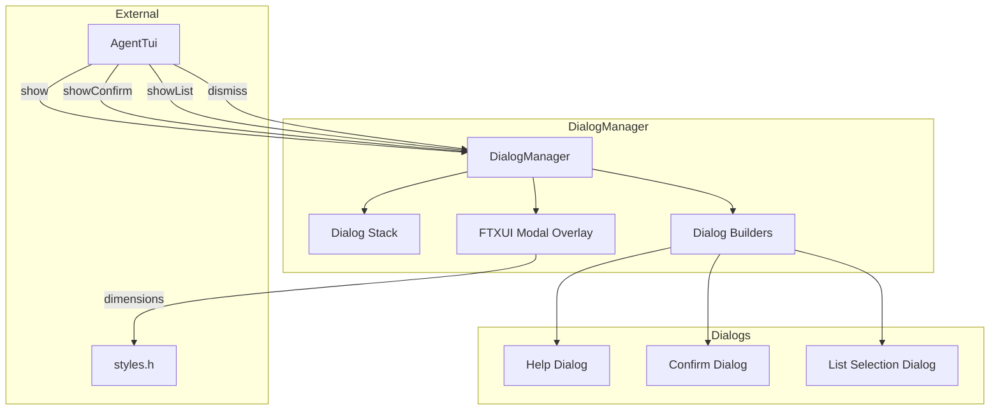
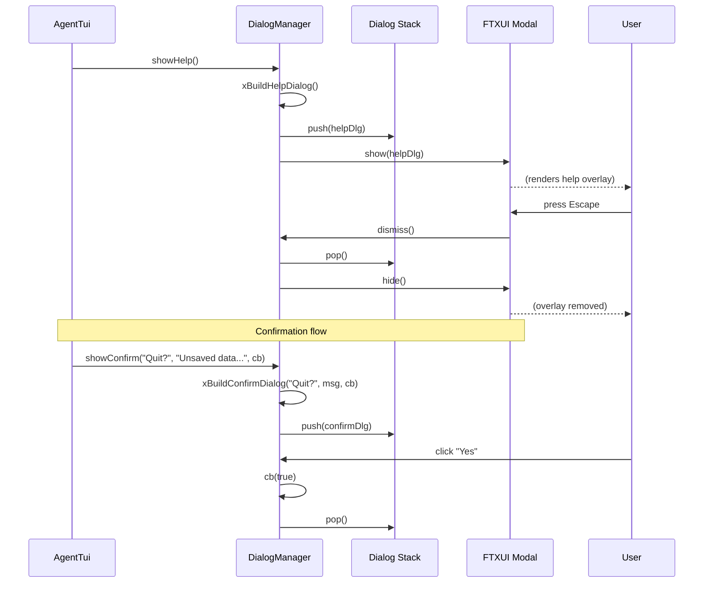

# dialog_manager.h/.cpp — TUI Dialog Manager

## 1. Overview

Stack-based modal dialog system wrapping FTXUI's `Modal` component. Manages an overlay stack — only the topmost dialog is visible. Provides convenience methods for help, confirmation, and session list dialogs. Pushes/pops keymap modes so modal-only keybindings are active while a dialog is open.

**Depends on**: FTXUI `ftxui::Modal`, `ftxui::Container`, `a0::tui::styles`

---

## 2. Component Specifications

```cpp
namespace a0::tui {

/// Stack-based modal dialog system using FTXUI::Modal.
class DialogManager {
public:
    DialogManager();
    virtual ~DialogManager();

    /// The FTXUI component (main container with Modal overlay).
    /// Must be the outermost component in the panel hierarchy.
    ftxui::Component component() const;

    /// Show a dialog. Pushes onto the stack.
    /// \param dialog    FTXUI component to render as modal overlay.
    /// \param title     Header text for the dialog frame.
    /// \param onDismiss Callback when dialog is dismissed (by user or programmatically).
    /// \retval 0        Dialog shown.
    /// \retval -1      Dialog already active (nested not yet supported).
    int show(ftxui::Component dialog, const std::string& title,
             std::function<void()> onDismiss = nullptr);

    /// Dismiss the topmost dialog.
    void dismiss();

    /// Dismiss all dialogs.
    void dismissAll();

    /// Whether any dialog is currently shown.
    bool isActive() const;

    /// Show the help overlay — lists all keybindings and commands.
    int showHelp();

    /// Show a confirmation dialog with Yes/No buttons.
    /// \param title, message   Display text.
    /// \param onConfirm        Called with true (Yes) or false (No).
    int showConfirm(const std::string& title,
                    const std::string& message,
                    std::function<void(bool)> onConfirm);

    /// Show a list selection dialog (for /sessions etc.).
    /// \param items   Vector of (label, id) pairs.
    /// \param onSelect Called with the selected item's id, or empty on dismiss.
    int showList(const std::string& title,
                 const std::vector<std::pair<std::string, std::string>>& items,
                 std::function<void(const std::string&)> onSelect);

private:
    class Impl;
    std::unique_ptr<Impl> m_impl;

    // Internal dialog builders
    ftxui::Component xBuildHelpDialog();
    ftxui::Component xBuildConfirmDialog(const std::string& title,
                                          const std::string& message,
                                          std::function<void(bool)> onConfirm);
    ftxui::Component xBuildListDialog(const std::string& title,
                                       const std::vector<std::pair<std::string, std::string>>& items,
                                       std::function<void(const std::string&)> onSelect);
};

} // namespace a0::tui
```

---

## 3. Architecture



---

## 4. Data Flow



---

## 5. D3 Animation

```html
<!DOCTYPE html>
<html>
<head>
<style>
body { font-family: sans-serif; background: #1a1a2e; color: #eee; padding: 24px; }
.main { border: 1px solid #444; border-radius: 4px; max-width: 600px; min-height: 300px; position: relative; padding: 16px; }
.overlay { position: absolute; top: 0; left: 0; right: 0; bottom: 0; background: rgba(0,0,0,0.6); display: flex; align-items: center; justify-content: center; }
.dialog { background: #2d2d44; border: 1px solid #666; border-radius: 6px; padding: 24px; min-width: 300px; }
.dialog h3 { margin: 0 0 12px; color: #ffea00; }
.dialog p { margin: 0 0 16px; color: #ccc; }
.buttons { display: flex; gap: 8px; justify-content: flex-end; }
.btn { padding: 6px 20px; border: 1px solid #555; border-radius: 4px; background: #3d3d5c; color: #eee; cursor: pointer; }
.btn:hover { background: #5d5d7c; }
.btn-primary { background: #448aff; border-color: #448aff; }
#toast { margin-top: 8px; color: #00e676; }
.hidden { display: none; }
button.trigger { margin-top: 16px; margin-right: 8px; }
</style>
</head>
<body>
<h3>dialog_manager — Modal Overlays</h3>
<div class="main" id="main">
  <p>Main TUI content area...</p>
  <p>Session: abc-123 | Status: Idle</p>
  <div class="overlay hidden" id="overlay">
    <div class="dialog" id="dialog">
      <h3 id="dlgTitle">Help</h3>
      <div id="dlgBody">
        <p><b>Keybindings:</b></p>
        <p>Enter — Submit<br/>Ctrl+C — Interrupt<br/>Ctrl+Q — Quit<br/>Up/Down — History</p>
      </div>
      <div class="buttons">
        <button class="btn btn-primary" onclick="dismiss()">OK</button>
      </div>
    </div>
  </div>
</div>
<div id="toast"></div>
<button class="trigger" onclick="showHelp()" data-testid="play-pause">Show Help</button>
<button class="trigger" onclick="showConfirm()">Show Confirm</button>

<script>
let dlgType = 'help';
window.ANIMATION_DURATION_MS = 6000;
window.ANIMATION_KEYFRAMES = [
  { time: 0, label: "no-dialog" },
  { time: 2000, label: "help-shown" },
  { time: 4000, label: "confirm-shown" }
];
window.ANIMATION_VERIFICATION = [
  { label: "no-dialog", dlgVisible: false },
  { label: "help-shown", dlgVisible: true, dlgTitle: "Help" },
  { label: "confirm-shown", dlgVisible: true, dlgTitle: "Confirm" }
];
function showHelp() {
  document.getElementById('overlay').classList.remove('hidden');
  document.getElementById('dlgTitle').textContent = 'Help';
  document.getElementById('dlgBody').innerHTML = '<p><b>Keybindings:</b></p><p>Enter — Submit<br/>Ctrl+C — Interrupt<br/>Ctrl+Q — Quit<br/>Up/Down — History</p>';
}
function showConfirm() {
  document.getElementById('overlay').classList.remove('hidden');
  document.getElementById('dlgTitle').textContent = 'Confirm';
  document.getElementById('dlgBody').innerHTML = '<p>Are you sure you want to quit?</p>';
}
function dismiss() {
  document.getElementById('overlay').classList.add('hidden');
}
window.jumpToKeyframe = function(idx) {
  if (idx === 0) dismiss();
  if (idx === 1) showHelp();
  if (idx === 2) showConfirm();
};
window.resetAnimation = function() { dismiss(); };
window.getAnimationState = function() {
  const ov = document.getElementById('overlay');
  return { dlgVisible: !ov.classList.contains('hidden'), dlgTitle: document.getElementById('dlgTitle').textContent };
};
</script>
</body>
</html>
```

---

## 6. Testing Requirements

| Method | Test Case | Expected |
|--------|-----------|----------|
| `show` | Push dialog | Dialog visible, isActive() true |
| `dismiss` | Active dialog | Dialog hidden, isActive() false |
| `dismiss` | No dialog | No-op, no crash |
| `dismissAll` | 2 active dialogs | Both dismissed |
| `isActive` | No dialog | false |
| `isActive` | Dialog shown | true |
| `showHelp` | Display help | Shows help content with all keybindings |
| `showConfirm` | Yes path | onConfirm(true) called |
| `showConfirm` | No path | onConfirm(false) called |
| `showList` | Select item | onSelect called with item id |
| `showList` | Dismiss | onSelect called with empty string |
