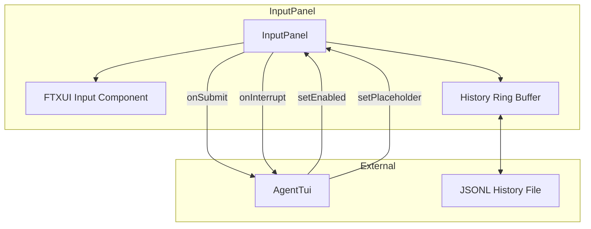
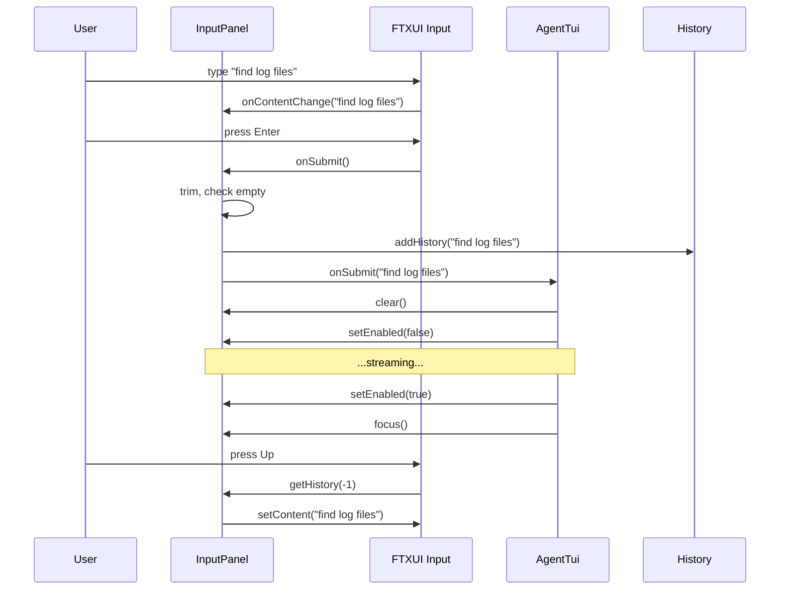

# input_panel.h/.cpp — TUI Input Panel

## 1. Overview

Provides the fixed-bottom input bar for the a0 TUI. Wraps an FTXUI `Input` component, manages prompt history (in-memory ring buffer + optional JSONL persistence), and dispatches submitted text or commands via callbacks. Handles multi-line input (Shift+Enter), Ctrl+C interrupt, and Up/Down history navigation.

**Depends on**: FTXUI `ftxui::Input`, `ftxui::Component`, `ftxui::CatchEvent`

---

## 2. Component Specifications

```cpp
namespace a0::tui {

/// Fixed bottom input bar with prompt history and interrupt handling.
class InputPanel {
public:
    InputPanel();
    virtual ~InputPanel();

    /// The FTXUI component (Input + optional submit hint).
    ftxui::Component component() const;

    /// Set callback when user submits input via Enter.
    /// Called with the full input text (after Shift+Enter multi-line join).
    void setOnSubmit(std::function<void(const std::string&)> cb);

    /// Set callback for interrupt (Ctrl+C during streaming).
    void setOnInterrupt(std::function<void()> cb);

    /// Enable/disable input (disabled during streaming).
    void setEnabled(bool enabled);

    /// Set placeholder text (cycles if called with different values).
    void setPlaceholder(const std::string& text);

    /// Clear current input buffer.
    void clear();

    /// Focus the input element.
    void focus();

    /// Add a prompt to the in-memory history ring buffer.
    /// \retval index of the entry in history.
    int addHistory(const std::string& prompt);

    /// Load history from JSONL file.
    /// \retval 0  Loaded.
    /// \retval -1 File not found.
    int loadHistory(const std::string& path);

    /// Save current history to JSONL file.
    /// \retval 0  Saved.
    /// \retval -1 Write error.
    int saveHistory(const std::string& path);

private:
    class Impl;
    std::unique_ptr<Impl> m_impl;

    // Internal (visible for test)
    static constexpr size_t MAX_HISTORY = 50;
};

} // namespace a0::tui
```

---

## 3. Architecture



---

## 4. Data Flow



---

## 5. D3 Animation

```html
<!DOCTYPE html>
<html>
<head>
<style>
body { font-family: monospace; background: #1a1a2e; color: #ccc; padding: 24px; }
.panel { border: 1px solid #444; border-radius: 4px; max-width: 720px; }
.header { background: #2d2d44; padding: 8px 16px; border-bottom: 1px solid #444; font-size: 12px; color: #888; }
.body { padding: 16px; min-height: 120px; }
.msg { margin: 4px 0; padding: 4px 8px; border-radius: 3px; }
.user { color: #00bcd4; }
.assistant { color: #00e676; }
.input-bar { display: flex; border-top: 1px solid #444; }
.prompt { color: #888; padding: 8px 0 8px 16px; }
.input { flex: 1; background: transparent; border: none; color: #eee; padding: 8px; font-family: monospace; outline: none; }
.hint { color: #555; padding: 8px 16px; font-size: 12px; }
button { margin-top: 16px; }
</style>
</head>
<body>
<h3>input_panel — Interaction Demo</h3>
<div class="panel" id="panel">
  <div class="header">a0 tui — session abc-123</div>
  <div class="body" id="scrollback">
    <div class="msg user">> find log files</div>
    <div class="msg assistant" id="response">I'll search for log files...</div>
  </div>
  <div class="input-bar">
    <span class="prompt">></span>
    <input class="input" id="input" value="find" readonly />
    <span class="hint">Enter</span>
  </div>
</div>
<button onclick="simulate()" data-testid="play-pause">Simulate Input</button>

<script>
let step = 0;
window.ANIMATION_DURATION_MS = 6000;
window.ANIMATION_KEYFRAMES = [
  { time: 0, label: "idle" },
  { time: 2000, label: "input-typed" },
  { time: 4000, label: "response-streaming" }
];
window.ANIMATION_VERIFICATION = [
  { label: "idle", msgCount: 0 },
  { label: "input-typed", inputValue: "find log files" },
  { label: "response-streaming", responseText: "I'll search" }
];
function simulate() {
  const input = document.getElementById('input');
  const resp = document.getElementById('response');
  input.value = 'find log files';
  setTimeout(() => { resp.textContent = "I'll search for log files matching *.log..."; }, 1000);
}
window.jumpToKeyframe = function(idx) { /* stub */ };
window.resetAnimation = function() { step = 0; };
window.getAnimationState = function() {
  return { inputValue: document.getElementById('input').value, responseText: document.getElementById('response').textContent };
};
</script>
</body>
</html>
```

---

## 6. Testing Requirements

| Method | Test Case | Expected |
|--------|-----------|----------|
| `setOnSubmit` | Submit with text | Callback fires with input text |
| `setOnSubmit` | Submit with empty string | Callback not fired |
| `setOnInterrupt` | Ctrl+C event | Interrupt callback fires |
| `setEnabled` | true then false | Input refuses key events |
| `setPlaceholder` | Set placeholder | Input shows placeholder text |
| `clear` | After typing | Input buffer empty |
| `addHistory` | Single entry | Size = 1 |
| `addHistory` | 60 entries | Max 50 kept |
| `addHistory` then Up arrow | History navigation | Restores previous entry |
| `loadHistory` | Valid JSONL file | Entries loaded |
| `saveHistory` | Write to file | File exists with correct content |
