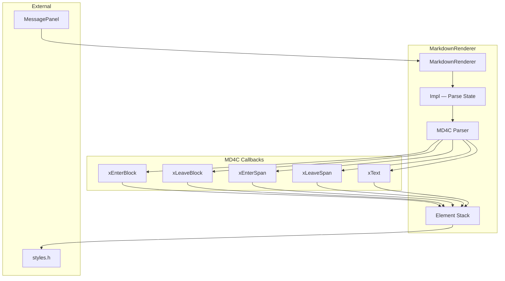
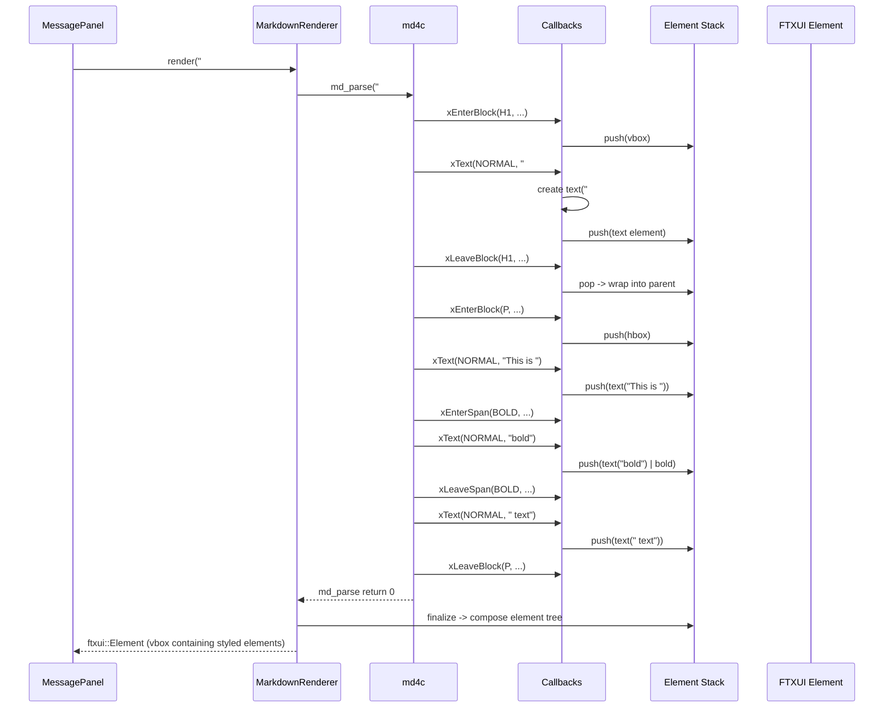

# markdown_renderer.h/.cpp — TUI Markdown Renderer

## 1. Overview

Converts Markdown source text into an FTXUI `Element` tree by wrapping the MD4C parser. Supports the full CommonMark spec subset relevant to LLM responses: headings, emphasis (bold/italic), inline code, fenced code blocks, bullet and numbered lists, horizontal rules, and links. A `streaming` mode handles incomplete markdown gracefully (unclosed fences, truncated emphasis).

**Depends on**: MD4C `md4c.h`, `md4c-html.h`, FTXUI `ftxui::Elements`, `a0::tui::styles`

---

## 2. Component Specifications

```cpp
namespace a0::tui {

/// Converts Markdown text into an FTXUI Element tree.
/// Wraps MD4C SAX-style parser; builds element tree via enter/leave callbacks.
class MarkdownRenderer {
public:
    MarkdownRenderer();
    virtual ~MarkdownRenderer();

    /// Parse markdown and return an FTXUI element suitable for rendering.
    /// \param md         Markdown source text (UTF-8).
    /// \param streaming  If true, handles incomplete markdown gracefully.
    ///                    Unclosed code fences show as inline text, etc.
    ftxui::Element render(const std::string& md, bool streaming = false);

    /// Render inline-only (for short snippets in tool output blocks, etc.).
    /// Produces a single paragraph element with inline formatting.
    ftxui::Element renderInline(const std::string& md);

private:
    class Impl;
    std::unique_ptr<Impl> m_impl;

    // MD4C SAX callbacks (registered as static functions, dispatched to Impl).
    static int xEnterBlock(MD_BLOCKTYPE type, void* detail, void* userdata);
    static int xLeaveBlock(MD_BLOCKTYPE type, void* detail, void* userdata);
    static int xEnterSpan(MD_SPANTYPE type, void* detail, void* userdata);
    static int xLeaveSpan(MD_SPANTYPE type, void* detail, void* userdata);
    static int xText(MD_TEXTTYPE type, const MD_CHAR* text, MD_SIZE size, void* userdata);

    // Element stack — during parse, builds a tree of ftxui::Elements.
    // The tree is finalized on render() return.
};

} // namespace a0::tui
```

### MD4C Integration

The `Impl` class holds an FTXUI element stack during parsing:
- On `enterBlock` / `enterSpan` → push a container element (e.g., vbox for list, hbox for paragraph)
- On `text` → push a styled text element based on `MD_TEXTTYPE` (normal, bold, italic, code, etc.)
- On `leaveBlock` / `leaveSpan` → pop and wrap into parent

| MD_TEXTTYPE | FTXUI Decorator |
|-------------|-----------------|
| `MD_TEXT_NORMAL` | Default text |
| `MD_TEXT_BOLD` | `bold` |
| `MD_TEXT_ITALIC` | `italic` |
| `MD_TEXT_CODE` | `style.inlineCode` (inverted) |
| `MD_TEXT_STRIKETHROUGH` | `dim` |
| `MD_TEXT_LINK` | `style.link` (underlined + color) |
| `MD_TEXT_IMAGE` | Render alt text (no image support) |

| MD_BLOCKTYPE | FTXUI Container |
|--------------|-----------------|
| `MD_BLOCK_DOC` | Root vbox |
| `MD_BLOCK_P` | hbox (paragraph) |
| `MD_BLOCK_H1`-`H6` | styled hbox with `style.headingN` |
| `MD_BLOCK_UL` | vbox with bullet prefix |
| `MD_BLOCK_OL` | vbox with numbered prefix |
| `MD_BLOCK_CODE` | `style.codeBlock` (dim background) |
| `MD_BLOCK_HR` | separator element |

---

## 3. Architecture



---

## 4. Data Flow



---

## 5. D3 Animation

```html
<!DOCTYPE html>
<html>
<head>
<style>
body { font-family: sans-serif; background: #1a1a2e; color: #eee; padding: 24px; }
.preview { border: 1px solid #444; border-radius: 4px; padding: 16px; max-width: 600px; background: #2d2d44; margin-bottom: 16px; }
h1 { color: #fff; font-size: 20px; border-bottom: 1px solid #444; padding-bottom: 4px; margin: 0 0 12px; }
h2 { color: #ddd; font-size: 16px; margin: 12px 0 6px; }
code { background: #1a1a2e; padding: 1px 4px; border-radius: 3px; font-family: monospace; }
pre { background: #1a1a2e; padding: 8px 12px; border-left: 3px solid #448aff; border-radius: 3px; font-family: monospace; overflow-x: auto; }
.bold { font-weight: bold; }
.italic { font-style: italic; }
.block { border-left: 3px solid #00e676; padding-left: 12px; color: #aaa; }
.source { color: #888; font-family: monospace; font-size: 12px; background: #1a1a2e; padding: 8px; border-radius: 4px; }
button { margin-top: 8px; }
</style>
</head>
<body>
<h3>markdown_renderer — Rendering Pipeline</h3>
<div class="source" id="source"># Hello\nThis is **bold** and *italic* text.\n\n[code block]\nint x = 42;\n[/code block]</div>
<div class="preview" id="preview">
  <h1>Hello</h1>
  <p>This is <span class="bold">bold</span> and <span class="italic">italic</span> text.</p>
  <pre>int x = 42;</pre>
</div>
<button onclick="togglePreview()" data-testid="play-pause">Toggle Source / Preview</button>

<script>
let showingSource = false;
window.ANIMATION_DURATION_MS = 4000;
window.ANIMATION_KEYFRAMES = [
  { time: 0, label: "rendered" },
  { time: 2000, label: "source" }
];
window.ANIMATION_VERIFICATION = [
  { label: "rendered", showing: "preview" },
  { label: "source", showing: "source" }
];
function togglePreview() {
  showingSource = !showingSource;
  document.getElementById('preview').style.display = showingSource ? 'none' : 'block';
  document.getElementById('source').style.display = showingSource ? 'block' : 'none';
}
window.jumpToKeyframe = function(idx) {
  showingSource = idx === 1;
  document.getElementById('preview').style.display = showingSource ? 'none' : 'block';
  document.getElementById('source').style.display = showingSource ? 'block' : 'none';
};
window.resetAnimation = function() { showingSource = false; togglePreview(); };
window.getAnimationState = function() {
  return { showing: showingSource ? 'source' : 'preview' };
};
</script>
</body>
</html>
```

---

## 6. Testing Requirements

| Method | Test Case | Expected |
|--------|-----------|----------|
| `render` | Empty string | Returns empty element |
| `render` | Plain text | Single paragraph element |
| `render` | H1 heading | Bold large element with heading1 decorator |
| `render` | Bold text | Text element with bold decorator |
| `render` | Italic text | Text element with italic decorator |
| `render` | Inline code | Text element with inverted decorator |
| `render` | Fenced code block | Code block element with dim background |
| `render` | Bullet list | vbox with bullet-prefixed items |
| `render` | Numbered list | vbox with number-prefixed items |
| `render` | Horizontal rule | Separator element |
| `render` | Link | Underlined colored text element |
| `render` | Code fence with language hint | Same as code block (lang stored as metadata) |
| `render` | Mixed formatting | Correctly nested / ordered element tree |
| `render` with streaming=true | Unclosed code fence | Falls back to inline rendering (no crash) |
| `render` with streaming=true | Truncated emphasis | Renders partial text (no crash) |
| `renderInline` | Bold text in paragraph | Produces paragraph element only |
| `renderInline` | Heading text | Heading converted to plain bold paragraph |
