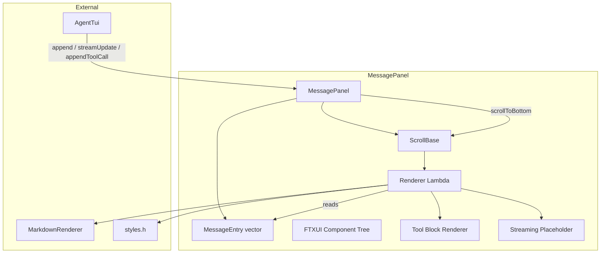
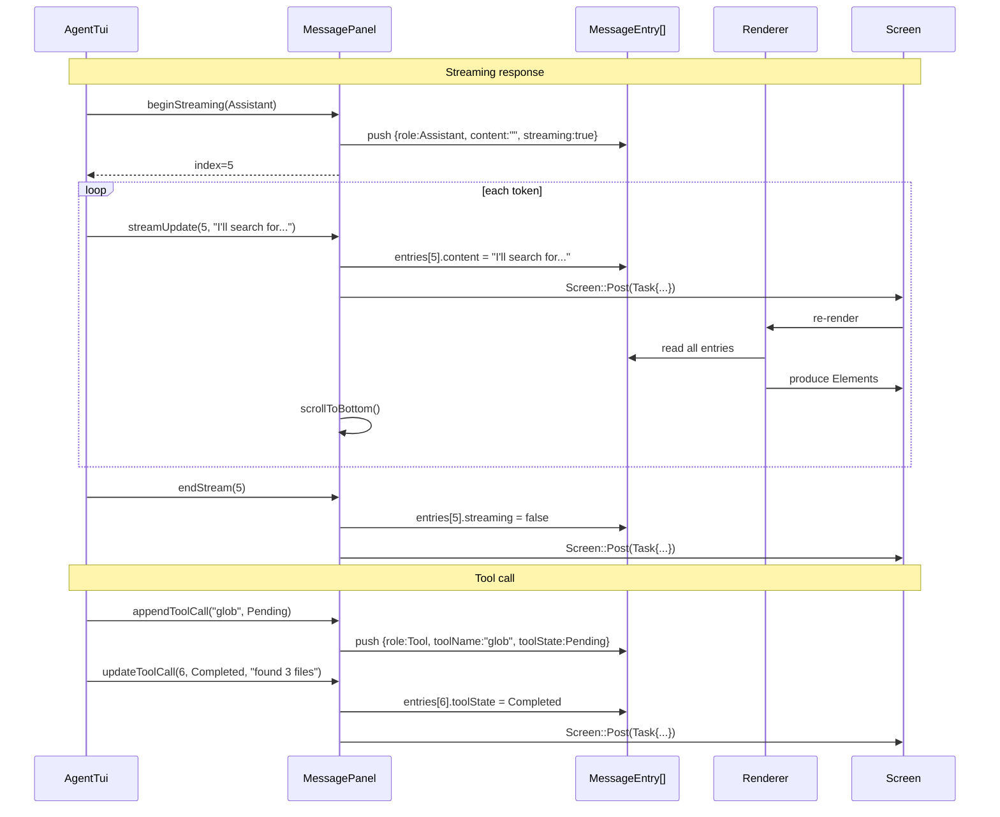

# message_panel.h/.cpp — TUI Message Panel

## 1. Overview

The scrollable message display panel occupies the upper (flex-grow) portion of the TUI split-panel layout. It maintains a vector of `MessageEntry` structs, builds and rebuilds an FTXUI component tree from them, and exposes mutation methods for appending, streaming, and clearing messages. All mutations are designed to be called via `Screen::Post(Task{})` from background threads.

**Depends on**: FTXUI `ftxui::Components` (Vertical, Renderer, ScrollBase), `a0::tui::styles`, `a0::tui::MarkdownRenderer`

---

## 2. Component Specifications

```cpp
namespace a0::tui {

/// Scrollable message display panel.
class MessagePanel {
public:
    MessagePanel();
    virtual ~MessagePanel();

    /// The FTXUI component — a ScrollBase container with a Renderer child.
    ftxui::Component component() const;

    /// Append a complete message to the scrollback.
    /// \retval index of the new entry.
    int append(const MessageEntry& entry);

    /// Begin a streaming message — creates a placeholder entry.
    /// Subsequent streamUpdate calls fill the content.
    /// \param role Typically MessageRole::Assistant.
    /// \retval index for streamUpdate / endStream calls.
    int beginStreaming(MessageRole role);

    /// Update the current streaming message with new text (replaces content).
    /// \param index Returned by beginStreaming.
    int streamUpdate(int index, const std::string& text);

    /// Finalize a streaming message (removes streaming indicator).
    int endStream(int index);

    /// Add a tool call display block with name and status.
    /// Renders as a collapsible block with status indicator.
    int appendToolCall(const std::string& name,
                       ToolState state,
                       const std::string& output = "");

    /// Update an existing tool call's state and/or output text.
    int updateToolCall(int index, ToolState state, const std::string& output);

    /// Clear all messages from the panel.
    void clear();

    /// Scroll to bottom (called after new content).
    void scrollToBottom();

    /// Load historical messages for session resume.
    /// Converts PersistenceStore Messages to MessageEntry and appends.
    int loadHistory(const std::vector<::a0::persistence::Message>& messages);

    /// Number of visible messages.
    size_t count() const;

private:
    class Impl;
    std::unique_ptr<Impl> m_impl;

    // Per-entry rendering
    ftxui::Element xRenderEntry(const MessageEntry& entry) const;
    ftxui::Element xRenderToolBlock(const MessageEntry& entry) const;
    ftxui::Element xRenderStreamingPlaceholder(const MessageEntry& entry) const;
    ftxui::Element xRenderCollapsedToggle(const MessageEntry& entry) const;
};

} // namespace a0::tui
```

---

## 3. Architecture



---

## 4. Data Flow



---

## 5. D3 Animation

```html
<!DOCTYPE html>
<html>
<head>
<style>
body { font-family: monospace; background: #1a1a2e; color: #ccc; padding: 24px; }
.panel { border: 1px solid #444; border-radius: 4px; max-width: 720px; max-height: 500px; overflow-y: auto; }
.msg { padding: 8px 16px; border-bottom: 1px solid #2d2d44; }
.user { color: #00bcd4; border-left: 3px solid #00bcd4; }
.assistant { color: #00e676; border-left: 3px solid #00e676; }
.tool { color: #448aff; border-left: 3px solid #448aff; background: #1a1a3e; }
.system { color: #ffea00; border-left: 3px solid #ffea00; }
.tool-name { font-size: 11px; color: #888; }
.tool-status { font-size: 11px; }
.status-running { color: #ffea00; }
.status-done { color: #00e676; }
.streaming-dot { animation: blink 1s infinite; }
@keyframes blink { 50% { opacity: 0; } }
button { margin-top: 16px; }
</style>
</head>
<body>
<h3>message_panel — Streaming + Tool Demo</h3>
<div class="panel" id="panel">
  <div class="msg user">> find log files modified in the last hour</div>
  <div class="msg assistant" id="streamMsg">I'll search for recently modified files...</div>
  <div class="msg tool" id="toolBlock">
    <span class="tool-name">🔧 glob</span>
    <span class="tool-status status-running" id="toolStatus">⏳ running</span>
  </div>
</div>
<button onclick="simulate()" data-testid="play-pause">Simulate</button>

<script>
let phase = 0;
window.ANIMATION_DURATION_MS = 10000;
window.ANIMATION_KEYFRAMES = [
  { time: 0, label: "initial" },
  { time: 3000, label: "streaming" },
  { time: 6000, label: "tool-complete" },
  { time: 9000, label: "done" }
];
window.ANIMATION_VERIFICATION = [
  { label: "initial", msgCount: 3 },
  { label: "streaming", streamText: "I'll search" },
  { label: "tool-complete", toolStatus: "✅ completed" },
  { label: "done", toolStatus: "✅ completed" }
];
function simulate() {
  const msg = document.getElementById('streamMsg');
  const toolStat = document.getElementById('toolStatus');
  const texts = [
    'I will use the glob tool to find recently modified files...',
    'I will use the glob tool to find recently modified files... Searching for *.log...',
    'I will use the glob tool to find recently modified files... Searching for *.log... Found 3 files.'
  ];
  msg.textContent = texts[Math.min(phase, 2)];
  if (phase >= 1) toolStat.innerHTML = '⏳ running';
  if (phase >= 2) toolStat.innerHTML = '✅ completed';
  if (phase >= 2) {
    const div = document.createElement('div');
    div.className = 'msg assistant';
    div.textContent = 'Found 3 log files matching the pattern.';
    document.getElementById('panel').appendChild(div);
  }
  phase++;
}
window.jumpToKeyframe = function(idx) { phase = idx; simulate(); };
window.resetAnimation = function() { phase = 0; document.getElementById('panel').innerHTML = ''; };
window.getAnimationState = function() {
  return { streamText: document.getElementById('streamMsg').textContent, toolStatus: document.getElementById('toolStatus').innerHTML };
};
</script>
</body>
</html>
```

---

## 6. Testing Requirements

| Method | Test Case | Expected |
|--------|-----------|----------|
| `append` | User message | Renders cyan text, count increments |
| `append` | Assistant message with markdown | Renders MD4C-parsed element tree |
| `append` | System message | Yellow, collapsible by default |
| `append` | Error message | Red, bold |
| `beginStreaming` | New stream | Placeholder entry created, count+1 |
| `streamUpdate` | Update with text | Entry content updated, scroll to bottom |
| `endStream` | Finalize streaming | Streaming indicator removed |
| `appendToolCall` | Pending state | Shows spinner + tool name |
| `updateToolCall` | Running -> Completed | Spinner stops, output shown |
| `updateToolCall` | Running -> Failed | Red indicator, error output |
| `clear` | 10 messages | Count = 0, panel empty |
| `loadHistory` | 5 PersistenceStore messages | 5 MessageEntry rendered |
| `scrollToBottom` | After content added | Scroll position at max |
