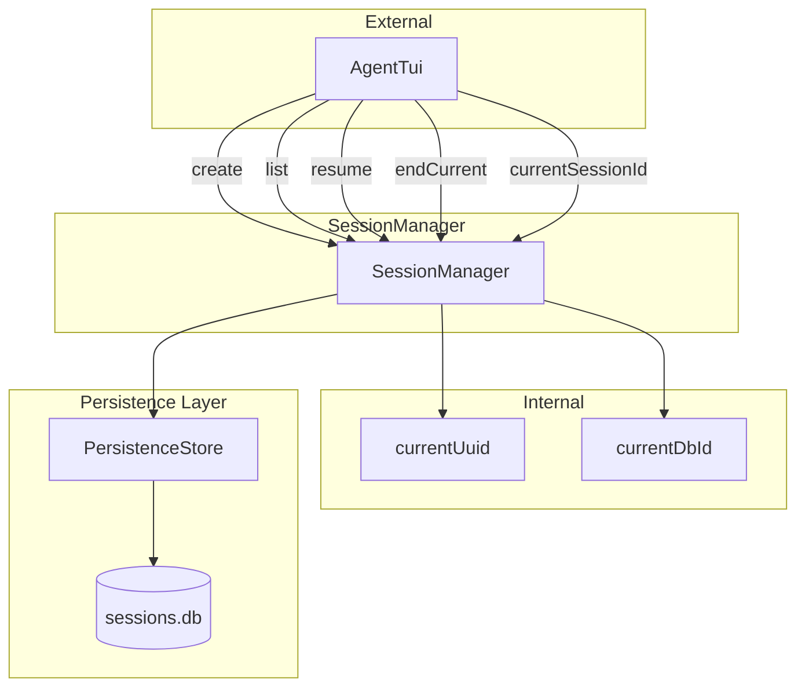
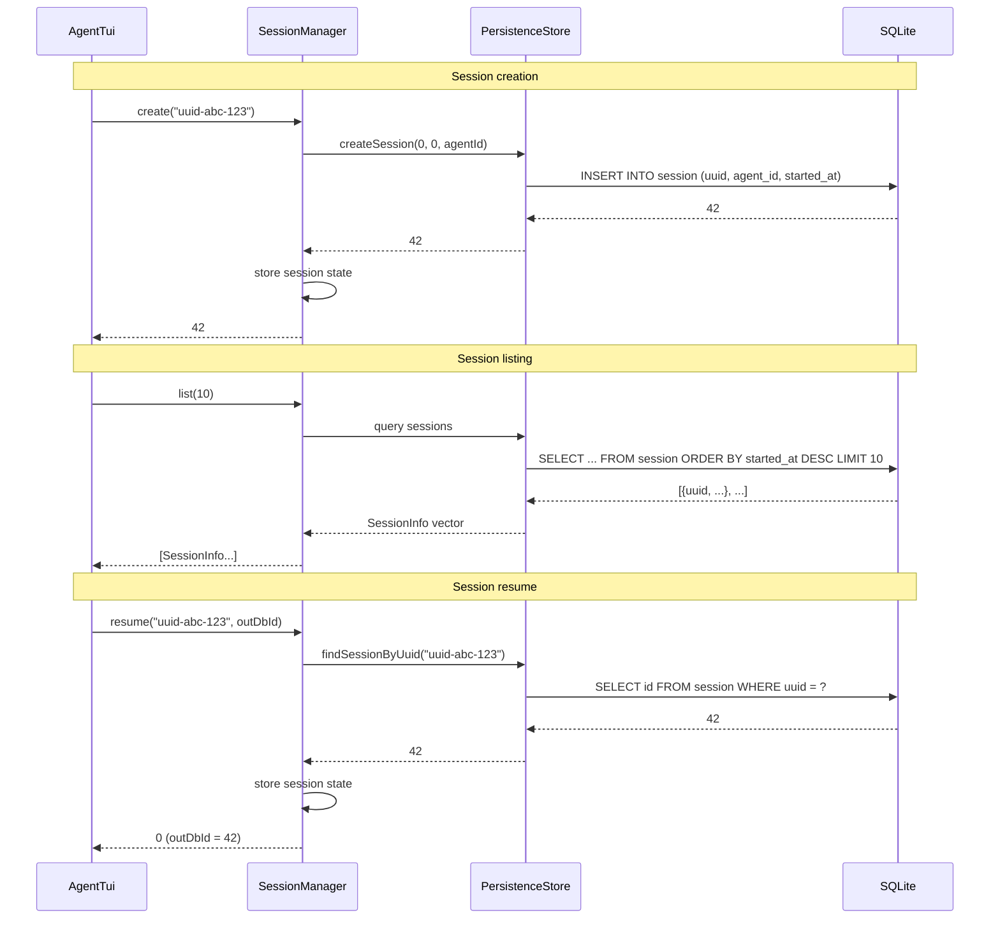

# session_manager.h/.cpp — TUI Session Manager

## 1. Overview

Manages the session lifecycle for the TUI sub-module. Wraps `PersistenceStore` to create new sessions, list recent sessions, and resume past sessions by UUID. Each TUI interaction sequence corresponds to one session. Sessions are created on first user input and ended on TUI exit.

**Depends on**: `a0::persistence::PersistenceStore`, `a0::persistence::Message`

---

## 2. Component Specifications

```cpp
namespace a0::tui {

/// Manages session lifecycle — create, list, resume via SQLite.
class SessionManager {
public:
    /// \param persistence PersistenceStore for session queries.
    /// The store must already be initialized with registerAgent.
    explicit SessionManager(::a0::persistence::PersistenceStore* persistence);
    virtual ~SessionManager();

    /// Create a new session in the database.
    /// \param uuid  Unique session identifier (generated by caller).
    /// \retval positive dbId on success.
    /// \retval -1 on database error.
    int64_t create(const std::string& uuid);

    /// List all recent sessions, ordered by started_at DESC.
    /// \param limit  Max entries to return (default 20).
    std::vector<SessionInfo> list(int limit = 20) const;

    /// Resume a session by UUID.
    /// \param uuid      Session UUID to resume.
    /// \param[out] outDbId  Database row id for the session.
    /// \retval 0  Found and ready.
    /// \retval -1 Not found.
    int resume(const std::string& uuid, int64_t& outDbId);

    /// Get current session UUID.
    std::string currentUuid() const;

    /// Get current session DB id.
    int64_t currentDbId() const;

    /// End the current session (sets ended_at timestamp).
    void endCurrent();

private:
    ::a0::persistence::PersistenceStore* m_persistence;
    std::string m_currentUuid;
    int64_t m_currentDbId = 0;

    // Message count helper — queries persistence for count.
    int xMessageCount(int64_t sessionDbId) const;
};

} // namespace a0::tui
```

---

## 3. Architecture



---

## 4. Data Flow



---

## 5. D3 Animation

```html
<!DOCTYPE html>
<html>
<head>
<style>
body { font-family: monospace; background: #1a1a2e; color: #ccc; padding: 24px; }
.db { border: 1px solid #444; border-radius: 4px; padding: 12px; max-width: 500px; margin-bottom: 16px; }
.table { width: 100%; border-collapse: collapse; }
.table th, .table td { text-align: left; padding: 4px 8px; border-bottom: 1px solid #2d2d44; }
.table th { color: #888; font-size: 11px; }
.active { background: #1a3a1a; }
.arrow { color: #448aff; margin: 8px 0; }
button { margin-top: 8px; margin-right: 8px; }
</style>
</head>
<body>
<h3>session_manager — Session Lifecycle</h3>
<div class="db">
  <div style="font-size:11px;color:#888;margin-bottom:8px;">sessions.db</div>
  <table class="table" id="sessionTable">
    <tr><th>uuid</th><th>started_at</th><th>messages</th></tr>
    <tr id="s1"><td>abc-111</td><td>2026-06-04 10:00</td><td>5</td></tr>
    <tr id="s2"><td>abc-222</td><td>2026-06-04 09:30</td><td>3</td></tr>
    <tr id="s3" class="active"><td class="current" id="currentUuid">abc-333</td><td>2026-06-04 09:00</td><td>12</td></tr>
  </table>
</div>
<div id="status">Current: abc-333</div>
<button onclick="createSession()" data-testid="play-pause">Create New Session</button>
<button onclick="resume()">Resume abc-111</button>

<script>
let currentUuid = 'abc-333';
window.ANIMATION_DURATION_MS = 6000;
window.ANIMATION_KEYFRAMES = [
  { time: 0, label: "initial" },
  { time: 2000, label: "created" },
  { time: 4000, label: "resumed" }
];
window.ANIMATION_VERIFICATION = [
  { label: "initial", currentUuid: "abc-333" },
  { label: "created", currentUuid: "abc-444" },
  { label: "resumed", currentUuid: "abc-111" }
];
function createSession() {
  const tbody = document.getElementById('sessionTable');
  const row = tbody.insertRow(1);
  row.innerHTML = '<td class="current" id="currentUuid">abc-444</td><td>2026-06-04 10:05</td><td>0</td>';
  row.className = 'active';
  document.querySelectorAll('#sessionTable tr').forEach((r, i) => { if (i > 0 && r !== row) r.className = ''; });
  currentUuid = 'abc-444';
  document.getElementById('status').textContent = 'Current: abc-444';
}
function resume() {
  document.querySelectorAll('#sessionTable tr').forEach((r, i) => { if (i > 0) r.className = ''; });
  document.getElementById('s1').className = 'active';
  currentUuid = 'abc-111';
  document.getElementById('status').textContent = 'Current: abc-111';
}
window.jumpToKeyframe = function(idx) {
  if (idx === 0) { /* initial state already shown */ }
  if (idx === 1) createSession();
  if (idx === 2) resume();
};
window.resetAnimation = function() { currentUuid = 'abc-333'; };
window.getAnimationState = function() { return { currentUuid: currentUuid }; };
</script>
</body>
</html>
```

---

## 6. Testing Requirements

| Method | Test Case | Expected |
|--------|-----------|----------|
| `create` | New UUID | Returns positive dbId, currentUuid set |
| `create` | Persistence error | Returns -1 |
| `list` | 5 sessions in DB | Returns 5 SessionInfo items |
| `list` | Empty DB | Returns empty vector |
| `list` | limit=2 | Returns at most 2 items |
| `resume` | Existing UUID | 0, outDbId populated, currentUuid set |
| `resume` | Missing UUID | -1, currentUuid unchanged |
| `currentUuid` | After create | Returns the created UUID |
| `currentUuid` | Before any create | Returns empty string |
| `endCurrent` | Active session | Persisted ended_at set |
| `endCurrent` | No active session | No-op |
