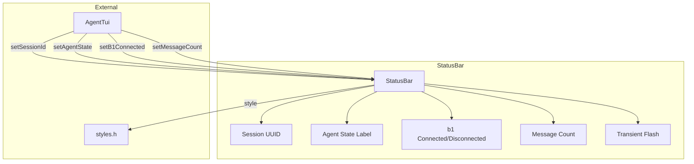
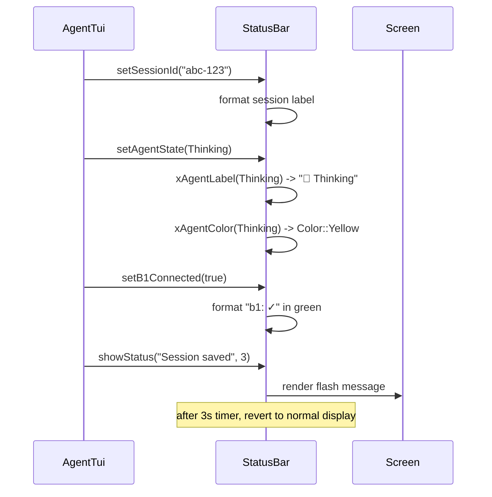

# status_bar.h/.cpp — TUI Status Bar

## 1. Overview

Provides the fixed top status bar for the a0 TUI showing session identifier, agent processing state (idle/thinking/executing/error), b1 supervisor connection status, and message count. Also supports transient flash messages (auto-dismissed after timeout).

**Depends on**: FTXUI `ftxui::Elements` (hbox, text, separator, gauge), `a0::tui::AgentState`, `a0::tui::styles`

---

## 2. Component Specifications

```cpp
namespace a0::tui {

/// Fixed top bar showing session and agent state information.
class StatusBar {
public:
    StatusBar();
    virtual ~StatusBar();

    /// The FTXUI component — 1-line hbox with flex layout.
    ftxui::Component component() const;

    /// Set the session UUID to display.
    void setSessionId(const std::string& uuid);

    /// Update agent state (idle/thinking/executing/error).
    /// Renders colored label + optional spinner animation.
    void setAgentState(AgentState state);

    /// Set b1 connection status.
    void setB1Connected(bool connected);

    /// Set message count.
    void setMessageCount(size_t count);

    /// Show a transient status message (e.g., "Saved session").
    /// Overrides normal display for timeoutSecs, then reverts.
    void showStatus(const std::string& msg, int timeoutSecs = 3);

private:
    class Impl;
    std::unique_ptr<Impl> m_impl;

    // Components
    ftxui::Element m_sessionIdElement;
    ftxui::Element m_agentStateElement;
    ftxui::Element m_b1Element;
    ftxui::Element m_countElement;
    ftxui::Element m_statusElement; // transient overlay

    // State string helpers
    std::string xAgentLabel(AgentState s) const;
    ftxui::Color xAgentColor(AgentState s) const;
};

} // namespace a0::tui
```

---

## 3. Architecture



---

## 4. Data Flow



---

## 5. D3 Animation

```html
<!DOCTYPE html>
<html>
<head>
<style>
body { font-family: monospace; background: #1a1a2e; padding: 24px; }
.bar { display: flex; background: #2d2d44; border: 1px solid #444; border-radius: 4px; padding: 6px 12px; max-width: 720px; font-size: 13px; }
.item { margin-right: 16px; }
.session { color: #888; }
.state { font-weight: bold; }
.state.idle { color: #888; }
.state.thinking { color: #ffea00; }
.state.executing { color: #448aff; }
.state.error { color: #ff1744; }
.b1 { margin-left: auto; }
.b1.ok { color: #00e676; }
.b1.bad { color: #ff1744; }
.count { color: #888; }
.flash { color: #00e676; font-weight: bold; }
button { margin-top: 16px; }
</style>
</head>
<body>
<h3>status_bar — State Transitions</h3>
<div class="bar" id="bar">
  <span class="item session">📋 abc-123</span>
  <span class="item state idle" id="state">💤 Idle</span>
  <span class="item b1 ok" id="b1">b1: ✓</span>
  <span class="item count" id="count">5 msgs</span>
</div>
<div id="flash" class="flash" style="margin-top: 8px;"></div>
<button onclick="cycle()" data-testid="play-pause">Cycle States</button>

<script>
const states = ['💤 Idle', '🤔 Thinking', '⚡ Executing', '❌ Error'];
const colors = ['idle', 'thinking', 'executing', 'error'];
let idx = 0;
window.ANIMATION_DURATION_MS = 8000;
window.ANIMATION_KEYFRAMES = [
  { time: 0, label: "idle" },
  { time: 2000, label: "thinking" },
  { time: 4000, label: "executing" },
  { time: 6000, label: "error" }
];
window.ANIMATION_VERIFICATION = [
  { label: "idle", stateText: "💤 Idle" },
  { label: "thinking", stateText: "🤔 Thinking" },
  { label: "executing", stateText: "⚡ Executing" },
  { label: "error", stateText: "❌ Error" }
];
function cycle() {
  const el = document.getElementById('state');
  idx = (idx + 1) % states.length;
  el.textContent = states[idx];
  el.className = 'item state ' + colors[idx];
  if (idx === 0) {
    document.getElementById('count').textContent = '5 msgs';
  } else {
    document.getElementById('count').textContent = (idx + 5) + ' msgs';
  }
  if (idx === 2) {
    document.getElementById('b1').textContent = 'b1: ✓';
  }
}
window.jumpToKeyframe = function(i) { idx = i; cycle(); };
window.resetAnimation = function() { idx = 0; cycle(); };
window.getAnimationState = function() {
  return { stateText: document.getElementById('state').textContent };
};
</script>
</body>
</html>
```

---

## 6. Testing Requirements

| Method | Test Case | Expected |
|--------|-----------|----------|
| `setSessionId` | Set UUID "abc-123" | Bar displays "abc-123" |
| `setAgentState` | Idle | Shows "Idle" in default color |
| `setAgentState` | Thinking | Shows "Thinking" in yellow |
| `setAgentState` | Executing | Shows "Executing" in blue |
| `setAgentState` | Error | Shows "Error" in red |
| `setB1Connected` | true | Shows green checkmark |
| `setB1Connected` | false | Shows red cross |
| `setMessageCount` | 0 | Shows "0 msgs" |
| `setMessageCount` | 42 | Shows "42 msgs" |
| `showStatus` | "Saved" + 1s timeout | Shows message, reverts after 1s |
