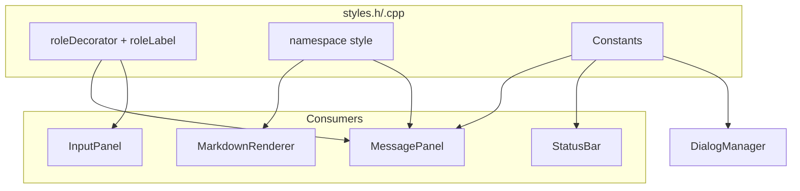
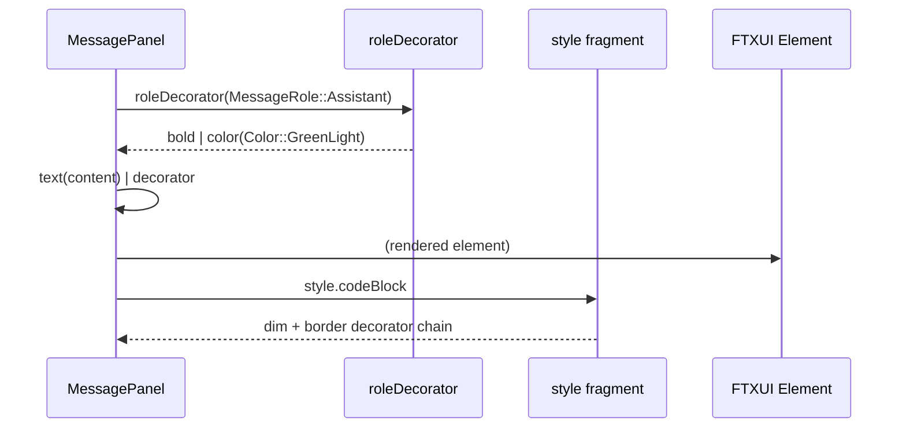

# styles.h/.cpp — TUI Style Definitions

## 1. Overview

Defines color constants, text decorator maps, and style utility functions for the a0 TUI sub-module. Maps `MessageRole` enum values to FTXUI decorator chains, defines panel dimensions, and provides reusable style fragments.

**Depends on**: FTXUI `ftxui::Element` / `ftxui::Decorator`, `a0::tui::MessageRole`

---

## 2. Component Specifications

```cpp
namespace a0::tui {

/// Map a MessageRole to an FTXUI decorator chain (color + style).
///   User       → bold + color(Color::Cyan)
///   Assistant  → color(Color::GreenLight)
///   Tool       → color(Color::BlueLight)
///   System     → dim + color(Color::Yellow)
///   Error      → bold + color(Color::RedLight)
ftxui::Decorator roleDecorator(MessageRole role);

/// Map a MessageRole to its label prefix string.
///   User       → "┌─ You"
///   Assistant  → "┌─ Assistant"
///   Tool       → "┌─ Tool: <name>"
///   System     → "┌─ System"
const std::string& roleLabel(MessageRole role, const std::string& toolName = "");

/// Predefined style fragments.
namespace style {
    extern const ftxui::Decorator codeBlock;       // dim background, border
    extern const ftxui::Decorator inlineCode;       // inverted
    extern const ftxui::Decorator heading1;         // bold + bright
    extern const ftxui::Decorator heading2;         // bold
    extern const ftxui::Decorator dimmed;           // dim only
    extern const ftxui::Decorator link;             // underlined + blue
    extern const ftxui::Decorator toolOutput;       // default (no extra styling)
    extern const ftxui::Decorator toolOutputStderr; // color(Color::Red)
    extern const ftxui::Decorator statusGood;       // color(Color::Green)
    extern const ftxui::Decorator statusBad;        // color(Color::Red)
}

/// Panel dimension constants.
constexpr int INPUT_PANEL_MIN_HEIGHT = 3;
constexpr int STATUS_BAR_HEIGHT = 1;
constexpr int SIDEBAR_WIDTH = 42;
constexpr int DIALOG_MIN_WIDTH = 60;
constexpr int DIALOG_MAX_WIDTH = 116;

} // namespace a0::tui
```

---

## 3. Architecture



---

## 4. Data Flow



---

## 5. D3 Animation

```html
<!DOCTYPE html>
<html>
<head>
<style>
body { font-family: sans-serif; background: #1a1a2e; color: #eee; }
.container { display: flex; gap: 16px; padding: 24px; flex-wrap: wrap; }
.swatch { padding: 12px 20px; border-radius: 6px; font-weight: bold; }
.user { background: #00bcd4; color: #000; }
.assistant { background: #00e676; color: #000; }
.tool { background: #448aff; color: #fff; }
.system { background: #ffea00; color: #000; }
.error { background: #ff1744; color: #fff; }
.code { background: #2d2d44; padding: 8px 16px; border-left: 3px solid #666; font-family: monospace; }
button { margin: 24px; padding: 8px 24px; }
</style>
</head>
<body>
<h2>a0 TUI — Style Palette</h2>
<div class="container">
  <div class="swatch user">User — cyan</div>
  <div class="swatch assistant">Assistant — green</div>
  <div class="swatch tool">Tool — blue</div>
  <div class="swatch system">System — yellow</div>
  <div class="swatch error">Error — red</div>
</div>
<div class="code" id="demo">Code block → dim background</div>
<button onclick="toggle()" data-testid="play-pause">Animate</button>
<div id="log"></div>

<script>
let running = false;
const steps = 0;
window.ANIMATION_DURATION_MS = 4000;
window.ANIMATION_KEYFRAMES = [
  { time: 0, label: "palette-visible" },
  { time: 2000, label: "all-styles-shown" }
];
window.ANIMATION_VERIFICATION = [
  { label: "palette-visible", swatchCount: 5 },
  { label: "all-styles-shown", swatchCount: 5 }
];
function toggle() { running = !running; }
window.jumpToKeyframe = function(idx) { /* stub */ };
window.resetAnimation = function() { running = false; };
window.getAnimationState = function() { return { swatchCount: 5 }; };
</script>
</body>
</html>
```

---

## 6. Testing Requirements

| Function | Test Case | Expected |
|----------|-----------|----------|
| `roleDecorator` | MessageRole::User | Returns decorator containing bold + cyan |
| `roleDecorator` | MessageRole::Assistant | Returns decorator containing green |
| `roleDecorator` | MessageRole::Tool | Returns decorator containing blue |
| `roleDecorator` | MessageRole::System | Returns decorator containing dim + yellow |
| `roleDecorator` | MessageRole::Error | Returns decorator containing bold + red |
| `roleLabel` | User role | Returns "┌─ You" |
| `roleLabel` | Tool role with "glob" | Returns string containing "glob" |
| `style.codeBlock` | Applied to text | Element has dim + border properties |
