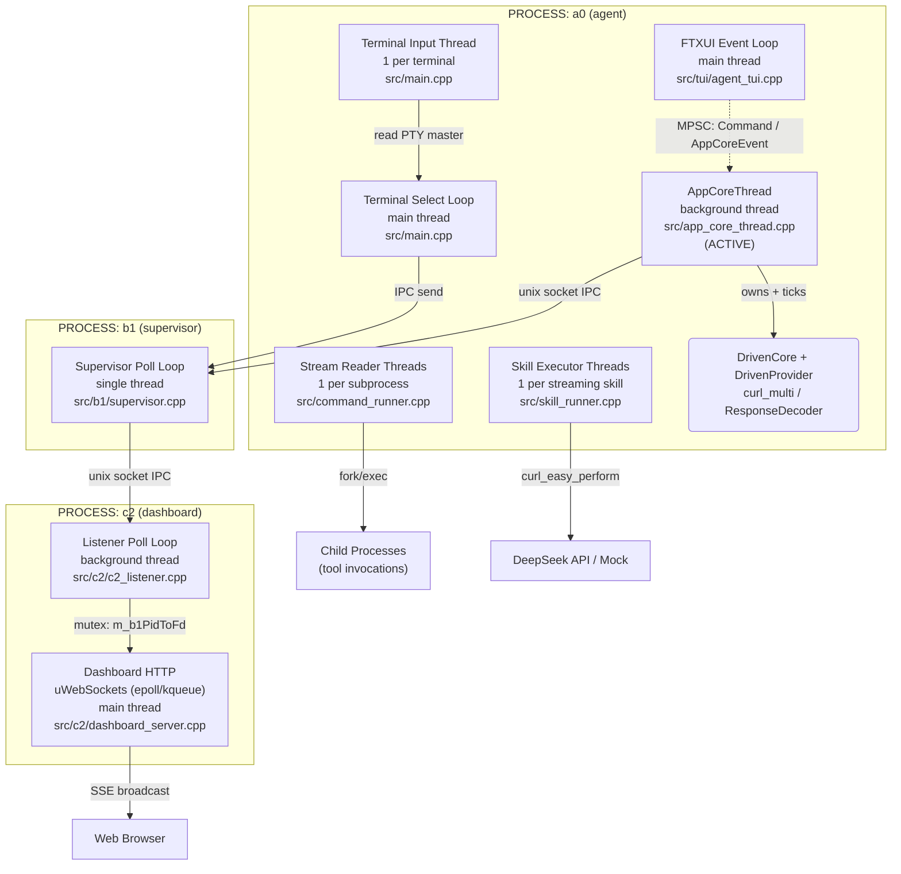
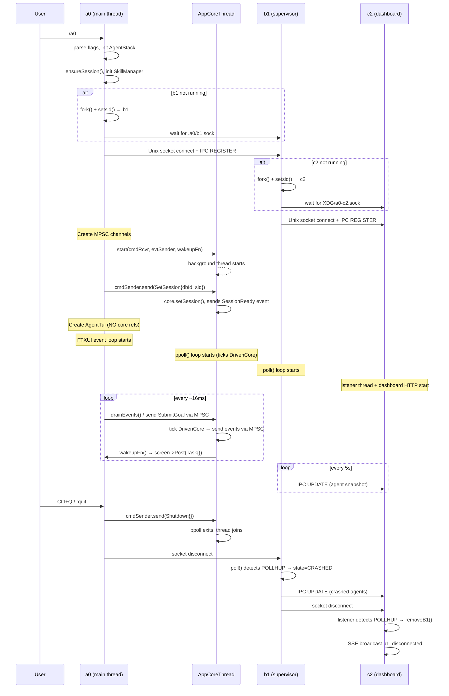
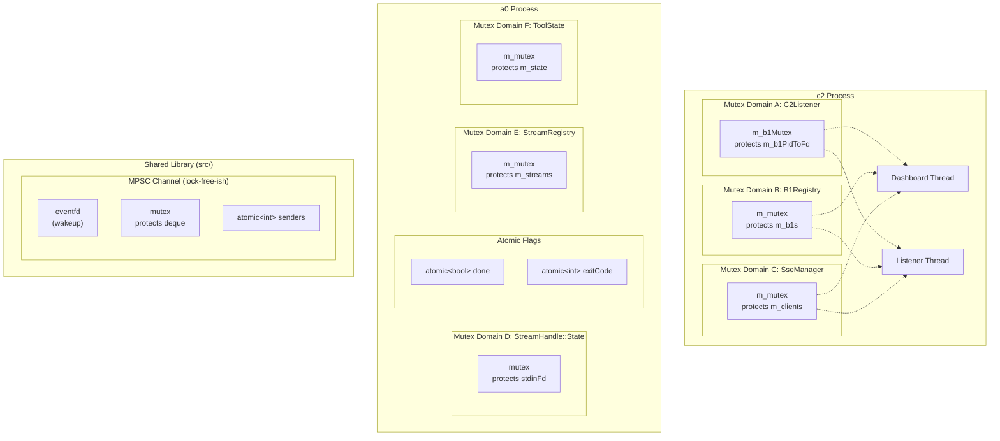
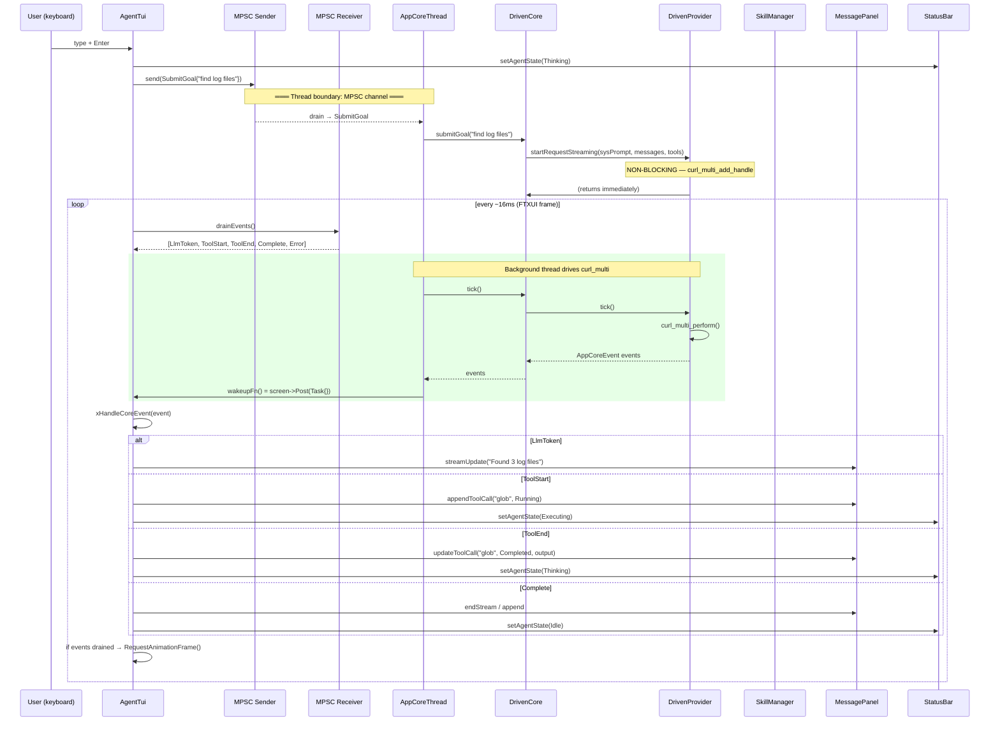
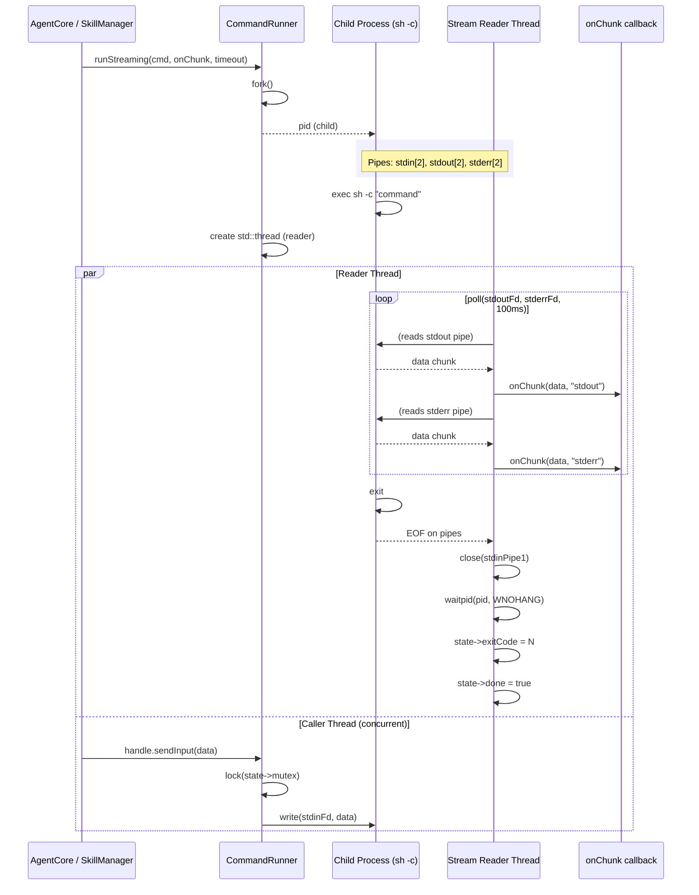
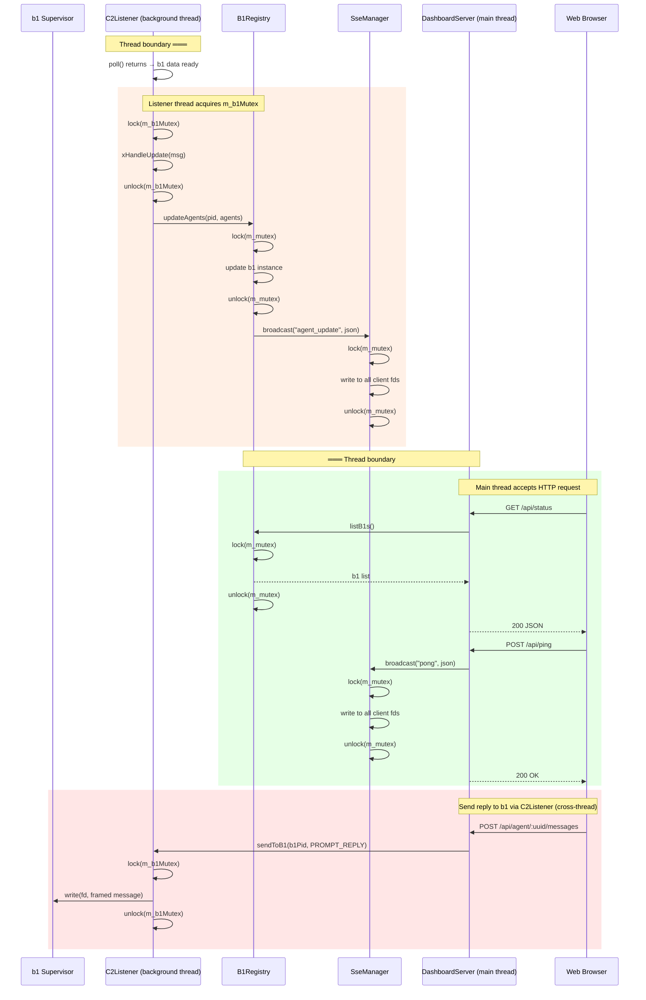
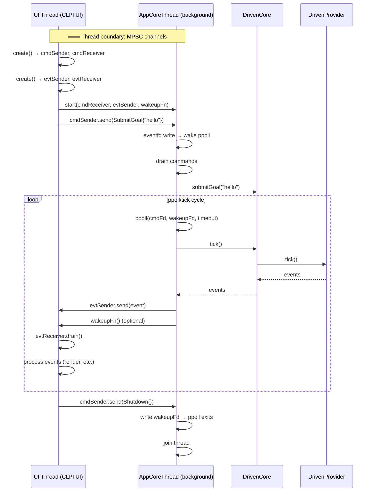

# Technical Specification: Concurrency Model

## Version 2.0 — Cross-Cutting Thread & Async Architecture

---

## 1. Overview

This document describes all concurrent execution in the a0 agent ecosystem — independent threads, async event loops, and inter-process communication — as a **high-level C4 architecture** where each component is a concurrency context (thread or async loop) rather than a source file.

The ecosystem spans three processes:

| Process | Binary | Source Root | Role |
|---------|--------|-------------|------|
| **a0** | `build/a0` | `src/` | Agent — TUI, tool execution, LLM interaction |
| **b1** | `build/b1` | `src/b1/` | Supervisor daemon — per-workdir agent lifecycle |
| **c2** | `build/c2` | `src/c2/` | Dashboard daemon — per-machine aggregation, web UI |

Each process contains one or more concurrency contexts. This document identifies every context, its source files, synchronization primitives, data flow paths, and critical coordination points.

---

## 2. Thread/Process Model — C4 Architecture

### 2.1 Container Diagram



### 2.2 Concurrency Context Inventory

#### Process: a0 (agent)

| # | Component | Type | Thread | Source Files | Status | Role |
|---|-----------|------|--------|-------------|--------|------|
| C1 | FTXUI Event Loop | Async (poll) | Main | `src/tui/agent_tui.cpp:51-79` | **Active** | Renders TUI, drains MPSC `AppCoreEvent` events, sends `Command` variants via MPSC sender — holds zero core references |
| C2 | AppCoreThread | Async (ppoll) | Background | `src/app_core_thread.cpp:76-213` | **Active** | Owns `DrivenCore` + `DrivenProvider` in dedicated thread, communicates via MPSC channels, dispatches session/persistence queries |
| C3 | Stream Reader Thread | Thread (per process) | Per-child | `src/command_runner.cpp:207-275` | **Active** | `poll()` on child stdout/stderr pipes, invokes `onChunk` callback |
| C4 | Skill Executor Thread | Thread (per skill) | Per-skill | `src/skill_runner.cpp:348-364` | **Deprecated** | Called `InferenceProvider::complete()` (deleted). SkillRunner is no longer compiled. |
| C5 | Terminal Input Thread | Thread | Per-terminal | `src/main.cpp:870-879` | **Active** | Reads IPC `STREAM_INPUT` from b1, writes to PTY master |
| C6 | Terminal Select Loop | Async (select) | Main | `src/main.cpp:882-911` | **Active** | Reads PTY master output, forwards to b1 via IPC |

#### Process: b1 (supervisor)

| # | Component | Type | Thread | Source Files | Status | Role |
|---|-----------|------|--------|-------------|--------|------|
| C7 | Supervisor Poll Loop | Async (poll) | Single | `src/b1/supervisor.cpp` | **Active** | `poll()` on listen socket, agent sockets, c2 socket; accepts agents, relay IPC, crash detection, c2 snapshots |

#### Process: c2 (dashboard)

| # | Component | Type | Thread | Source Files | Status | Role |
|---|-----------|------|--------|-------------|--------|------|
| C8 | Dashboard HTTP | Async (epoll) | Main | `src/c2/dashboard_server.cpp`, `src/c2/c2_main.cpp:124` | **Active** | uWebSockets HTTP/SSE server, REST API, SSE broadcasts |
| C9 | Listener Poll Loop | Async (poll) | Background | `src/c2/c2_listener.cpp:39-238`, `src/c2/c2_main.cpp:113` | **Active** | Accept b1 connections, receive IPC messages, dispatch handlers |

### 2.3 Process Lifecycle Diagram



---

## 3. Component Specifications

### 3.1 FTXUI Event Loop (C1)

```cpp
// src/tui/agent_tui.cpp — AgentTui::run()
int AgentTui::run() {
    // ...
    auto loop = ftxui::Loop(m_screen, m_mainComponent);
    while (!loop.HasQuitted()) {
        loop.RunOnce();              // FTXUI renders, processes events
        drainEvents();               // Drain MPSC events from AppCoreThread
        std::this_thread::sleep_for(std::chrono::milliseconds(16));  // ~60 FPS
    }
    // ...
}

void AgentTui::drainEvents() {
    auto events = m_evtReceiver.drain();
    if (!events.empty()) {
        for (auto& ev : events) {
            xHandleCoreEvent(ev);    // Dispatch LlmToken, ToolStart, Complete, etc.
        }
        m_screen->RequestAnimationFrame();
    }
}
```

**Wakeup mechanisms:**
- `AppCoreThread` calls `wakeupFn()` (set to `screen->Post(Task{})`) after sending MPSC events
- `m_screen->RequestAnimationFrame()` — request next frame when events were drained
- `std::this_thread::sleep_for(16ms)` — frame rate limiter, also the idle poll timeout

**Owns:**
- `MessagePanel`, `InputPanel`, `StatusBar`, `DialogManager`, `MarkdownRenderer` (FTXUI components)
- `m_cmdSender` (MPSC Sender — sends `Command` variants to `AppCoreThread`)
- `m_evtReceiver` (MPSC Receiver — drains `AppCoreEvent` variants from `AppCoreThread`)

**Does NOT own or reference:**
- `DrivenProvider`, `DrivenCore`, `DeepSeekProvider` — owned by `AppCoreThread`
- `SkillManager`, `PersistenceStore` — owned by main thread's `AgentStack`
- `SessionManager` — deleted; session operations go through MPSC (`ListSessions`, `ResumeSession`)

**Thread safety:** This component is **not thread-safe**. All MPSC drain and render calls happen from the main thread. The only cross-thread interaction is `wakeupFn()` which calls `Screen::Post(Task{})` (FTXUI's thread-safe re-render queue). No core component reference exists in this thread.

### 3.2 AppCoreThread (C2 — Active)

```cpp
// src/app_core_thread.cpp — AppCoreThread::xRun()
void AppCoreThread::xRun() {
    TRACE_LOG("AppCoreThread started");
    DrivenCore core(m_apiKey, m_model, "DrivenCore", m_skillMgr);
    core.setPersistence(m_persistence);
    if (!m_mockUrl.empty()) {
        core.drivenProvider().setMockUrl(m_mockUrl);
    }

    // Block SIGCHLD in this thread
    sigset_t sigmask;
    sigemptyset(&sigmask);
    sigaddset(&sigmask, SIGCHLD);
    pthread_sigmask(SIG_BLOCK, &sigmask, nullptr);

    // Build ppoll fd set: cmdReceiver fd + wakeup eventfd
    int cmdFd = m_cmdReceiver.poll_fd();
    struct pollfd fds[2];
    fds[0].fd = cmdFd;
    fds[0].events = POLLIN;
    fds[1].fd = m_wakeupFd;
    fds[1].events = POLLIN;

    while (m_running.load()) {
        int timeout = core.idle() ? 100 : core.timeoutMs();
        if (timeout < 0) timeout = 100;

        int rc = ppoll(fds, 2, &timeout, &sigmask);

        // Drain dead children (tool subprocesses)
        while (waitpid(-1, nullptr, WNOHANG) > 0) {}

        if (rc > 0) {
            if (fds[1].revents & POLLIN) {
                uint64_t u;
                read(m_wakeupFd, &u, sizeof(u));
            }
            if (fds[0].revents & POLLIN) {
                auto commands = m_cmdReceiver.drain();
                for (auto& cmd : commands) {
                    std::visit([&](auto& arg) {
                        using T = std::decay_t<decltype(arg)>;
                        if constexpr (std::is_same_v<T, mpsc::SubmitGoal>) {
                            core.submitGoal(arg.goal);
                        } else if constexpr (std::is_same_v<T, mpsc::Cancel>) {
                            core.cancel();
                        } else if constexpr (std::is_same_v<T, mpsc::SetSession>) {
                            core.setSession(arg.sessionDbId, arg.sessionUuid);
                            m_evtSender.send(mpsc::SessionReady{arg.sessionDbId, arg.sessionUuid});
                        } else if constexpr (std::is_same_v<T, mpsc::ListSessions>) {
                            std::vector<mpsc::SessionList::Entry> entries;
                            auto sessions = m_persistence->loadSessions(arg.limit);
                            for (auto& s : sessions)
                                entries.push_back({s.uuid, s.dbId, s.startedAt, s.messageCount});
                            m_evtSender.send(mpsc::SessionList{entries});
                        } else if constexpr (std::is_same_v<T, mpsc::ResumeSession>) {
                            int64_t dbId = m_persistence->findSessionByUuid(arg.uuid);
                            auto msgs = m_persistence->loadMessages(dbId);
                            core.setSession(dbId, arg.uuid);
                            m_evtSender.send(mpsc::SessionHistory{dbId, arg.uuid, true, msgs});
                        } else if constexpr (std::is_same_v<T, mpsc::Shutdown>) {
                            m_running = false;
                        }
                    }, cmd);
                }
            }
        }

        if (!core.idle()) {
            auto events = core.tick();
            for (auto& ev : events)
                m_evtSender.send(ev);
            if (!events.empty() && m_wakeupFn)
                m_wakeupFn();
        }
    }

    TRACE_LOG("AppCoreThread stopped");
}
```

**Key design properties:**
- Thread ownership: owns `DrivenCore` (stack-allocated in `xRun()`), which in turn owns `DrivenProvider`
- Communication: bidirectional MPSC channels for commands (`m_cmdReceiver`) and events (`m_evtSender`)
- Wakeup: eventfd for shutdown signal; MPSC `Receiver::poll_fd()` for command arrival; `wakeupFn()` callback to wake the UI thread after sending events
- Signal handling: SIGCHLD blocked via `pthread_sigmask`, handled via `waitpid(WNOHANG)` drain
- Timeout: curl-driven from `DrivenProvider::timeoutMs()`, minimum 100ms idle

### 3.3 Stream Reader Thread (C3)

```cpp
// src/command_runner.cpp — reader thread lambda
state->thread = std::thread([state, stdoutPipe0, stderrPipe0, stdinPipe1, onChunk, timeoutSecs, pid]() {
    // Set SIGALRM for timeout
    alarm(timeoutSecs);

    while (!outDone || !errDone) {
        poll(fds, nfds, 100);  // 100ms timeout for done-flag check
        // read from stdout pipe → onChunk(data, "stdout")
        // read from stderr pipe → onChunk(data, "stderr")
    }

    alarm(0);
    close(outFd); close(errFd);
    {
        std::lock_guard<std::mutex> lock(state->mutex);
        ::close(stdinPipe1);
        state->stdinFd = -1;   // invalidate fd under lock
    }

    waitpid(pid, &status, 0);
    state->exitCode = ec;
    state->done = true;                       // signal completion via atomic
});
```

**Shared state:** `std::shared_ptr<StreamHandle::State>` containing:
- `std::mutex mutex` — protects `stdinFd` during `sendInput()` and close
- `int stdinFd` — written before thread starts, read under mutex, closed under mutex
- `std::atomic<bool> done` — completion signal (non-blocking check via `isDone()`)
- `std::atomic<int> exitCode` — thread-safe exit code read

**Thread safety:** `close(stdinPipe1)` is performed under `state->mutex` with `state->stdinFd = -1` invalidation, ensuring any concurrent `sendInput()` sees a closed fd and skips the write.

### 3.4 Skill Executor Thread (C4)

```cpp
// src/skill_runner.cpp — executeStreaming() thread
state->thread = std::thread([this, prompt, fullSystemPrompt, expanded, onChunk, state]() {
    std::string llmResult = m_provider->complete(fullSystemPrompt, expanded);
    json finalResult = runValidators(prompt, llmResult);
    std::string output = finalResult.is_string()
        ? finalResult.get<std::string>()
        : finalResult.dump();
    if (onChunk) onChunk(output, "stdout");

    if (!prompt.composeFile.empty() && m_composeMgr &&
        !m_composeMgr->isPersistent(prompt.name)) {
        m_composeMgr->stopEnvironment(prompt);
    }

    state->exitCode = 0;
    state->done = true;
});
```

**Note:** This code path is from the deprecated `SkillRunner` (no longer compiled). `InferenceProvider` has been deleted. The TUI and headless modes use `AppCoreThread`/`DrivenProvider` (async curl_multi) exclusively.

### 3.5 Terminal Threads (C5, C6)

```cpp
// src/main.cpp — cmdTerminal()
// Input thread (C5):
std::thread inputThread([&]() {
    while (!done) {
        ipc::Message inputMsg;
        int rc = b1Sock.recv(inputMsg, 100);
        if (rc == ipc::RECV_OK
            && inputMsg.type == STREAM_INPUT
            && inputMsg.streamId == streamId)
            write(master, inputMsg.chunkData.data(), inputMsg.chunkData.size());
    }
});

// Select loop (C6, main thread):
while (!done) {
    FD_ZERO(&rdfs);
    FD_SET(master, &rdfs);
    tv.tv_sec = 0; tv.tv_usec = 100000;
    select(master + 1, &rdfs, nullptr, nullptr, &tv);
    if (FD_ISSET(master, &rdfs)) {
        n = read(master, buf, sizeof(buf));
        if (n > 0) {
            appendChunk(streamId, seq++, "stdout", data);
            send STREAM_DATA to b1
        } else { done = true; }
    }
    waitpid(shellPid, &status, WNOHANG);
}

// Synchronization:
std::atomic<bool> done{false};  // shared between C5 thread and C6 main loop
```

### 3.6 b1 Supervisor Poll Loop (C7)

Single-threaded event loop. All state (`m_agents`, `m_streamOwners`, `m_c2Fd`) is accessed from one thread — no mutexes needed.

```cpp
// src/b1/supervisor.cpp — Supervisor::run()
while (m_running) {
    poll(fds, nfds, 1000);  // 1s timeout

    // Handle new agent connections on listen socket
    // Handle incoming IPC from agents (REGISTER, HEARTBEAT, USER_PROMPT, STREAM_DATA, ...)
    // Handle incoming IPC from c2 (PROMPT_REPLY, STREAM_INPUT)
    // waitpid(WNOHANG) for child a0 processes → detect crashes
    // Every 5s: push agent snapshot to c2
}
```

### 3.7 c2 Two-Thread Architecture (C8, C9)

**Main thread:** uWebSockets HTTP/SSE server. Epoll-based internally. Calls `B1Registry`, `SseManager`, and `C2Listener::sendToB1()` under their respective mutexes.

**Background thread (`listenerThread`):** `poll()` loop on Unix socket. Accepts b1 connections, processes IPC messages, calls `B1Registry` mutations and `SseManager` broadcasts under mutex.

```cpp
// src/c2/c2_main.cpp
std::thread listenerThread([&listener]() {
    listener.run();  // C9: poll loop in background
});
dashboard.run();  // C8: uWS HTTP/SSE in main thread; blocks until shutdown
```

**Shared state across C8↔C9:**
- `C2Listener::m_b1PidToFd` (protected by `m_b1Mutex`)
- `B1Registry::m_b1s` (protected by `B1Registry::m_mutex`)
- `SseManager::m_clients` (protected by `SseManager::m_mutex`)

All three mutex domains are independent — no nested lock acquisition occurs across domains, eliminating deadlock risk.

---

## 4. Synchronization Layer

### 4.1 Mutex Domain Diagram



### 4.2 Synchronization Primitive Inventory

| Component | Primitive | Scope | File(s) |
|-----------|-----------|-------|---------|
| `mpsc::Sender::send()` | `std::lock_guard<std::mutex>` | Push to shared deque + write eventfd | `src/mpsc.h:127` |
| `mpsc::Receiver::drain()` | `std::lock_guard<std::mutex>` | Pop all from shared deque | `src/mpsc.h:205` |
| `mpsc::Channel` eventfd | `eventfd(0, EFD_NONBLOCK)` | Cross-thread wakeup for poll() | `src/mpsc.h:73` |
| `StreamHandle::sendInput()` | `std::lock_guard<std::mutex>` | stdinFd write protection | `src/command_runner.cpp:147` |
| `StreamHandle::State::done` | `std::atomic<bool>` | Non-blocking completion check | `src/command_runner.h:47` |
| `StreamHandle::State::exitCode` | `std::atomic<int>` | Thread-safe exit code read | `src/command_runner.h:48` |
| `StreamRegistry` | `std::mutex` on all methods | Stream map CRUD | `src/stream_registry.h:50` |
| `ToolState` | `std::mutex` on all methods | Session state bag | `src/tool_state.h:22` |
| `B1Registry` | `std::mutex` on all methods | b1 instance map | `src/c2/b1_registry.h:44` |
| `SseManager` | `std::mutex` on all methods | SSE client list | `src/c2/sse_manager.h:26` |
| `C2Listener::m_b1PidToFd` | `std::mutex` | PID→fd map | `src/c2/c2_listener.h:37` |
| `AppCoreThread::m_running` | `std::atomic<bool>` | Thread start/stop flag | `src/app_core_thread.h:75` |
| `hex_session_id` RNG | `thread_local` | Per-thread random device | `src/hex_session_id.h:9-11` |
| `g_timeoutFired` | `std::atomic&lt;int&gt;` | Signal handler flag | `src/command_runner.cpp:16` |
| `Terminal done` | `std::atomic<bool>` | Input thread / select loop coordination | `src/main.cpp:885` |

### 4.3 Absence of Synchronization (Design Intent)

The following components have **no internal locks** by design:

| Component | Reason | Risk if misused |
|-----------|--------|-----------------|
| `DrivenProvider` | Designed for single-thread access; all calls from AppCoreThread | Already correct — single-thread enforced by thread ownership |
| `DrivenCore` | Owns `DrivenProvider`; driven from `AppCoreThread` only | Already correct — single-thread enforced by thread ownership |
| `AppCoreThread` | Not thread-safe; all `DrivenCore` calls from `xRun()` only | Already correct — single-thread by design |
| `DefaultSkillRunner` | `executeStreaming()` spawns thread calling `m_provider` | Legacy — cross-thread `DeepSeekProvider` access possible |
| `b1::Supervisor` | Single-threaded design | Already correct |

---

## 5. Detailed Data Flow

### 5.1 FTXUI Event Loop — Goal Submission via MPSC



**Key characteristic:** The TUI and core run on separate threads. All communication passes through MPSC channels. The `AppCoreThread` owns `DrivenCore` and `DrivenProvider` and ticks them in its own `ppoll()` loop. The TUI (`AgentTui`) drains events from the MPSC receiver each frame and sends commands through the MPSC sender. No blocking LLM calls happen on the FTXUI thread.

### 5.2 CommandRunner Streaming — Subprocess Execution



### 5.3 c2 Two-Thread Data Flow



### 5.4 AppCoreThread Data Flow



---

## 6. Critical Coordination Points

| # | Point | Components | Shared State | Protection | Status |
|---|-------|-----------|-------------|-----------|--------|
| 1 | `DrivenProvider::tick()` from AppCoreThread | C2 | `m_handle`, `m_multi` | **None by design** | CORRECT — single-thread access enforced by thread ownership |
| 2 | `C2Listener::sendToB1()` + `xCleanupPeer()` | C8 ↔ C9 | `m_b1PidToFd` | `std::mutex` | CORRECT — all accesses covered |
| 3 | `B1Registry` mutations + SSE broadcasts | C9 | `m_b1s` + `m_clients` | Independent mutexes | CORRECT — no nested lock acquisition |
| 4 | `AppCoreThread::m_running` | C2 ↔ caller | `std::atomic<bool>` | `exchange()`, `load()` | CORRECT — acquire-release semantics |
| 5 | `b1::Supervisor` all state | C7 only | `m_agents`, etc. | **None** | CORRECT — single-threaded |
| 6 | `mpsc::Channel` send/drain | C1 ↔ C2 | deque + eventfd | `std::mutex` + `std::atomic<int>` | CORRECT — proven MPSC pattern |
| 7 | Terminal `done` flag | C5 ↔ C6 | `std::atomic<bool>` | `std::atomic` | CORRECT |
| 8 | `DeepSeekProvider::complete()` from skill thread | C4 | `m_baseUrl`, curl easy handle | **None** | LEGACY — TUI uses `AppCoreThread`/`DrivenProvider` instead; path exists via `SkillRunner::executeStreaming()` |

### 6.1 Legacy: `DeepSeekProvider` from Background Thread

```cpp
// src/skill_runner.cpp — executeStreaming()
state->thread = std::thread([this, ...]() {
    std::string llmResult = m_provider->complete(fullSystemPrompt, expanded);
    // ...
});
```

**Note:** This code path is from the deprecated `SkillRunner` (no longer compiled). `InferenceProvider` has been deleted. This path is not used by the TUI or headless modes — both use `AppCoreThread`/`DrivenProvider` exclusively.

---

## 7. Guarantees and Invariants

### 7.1 No `fork()` + Thread Mixing

All `fork()` calls happen before `std::thread` creation, or in processes that do not use threads:
- `CommandRunner::run()` forks before the stream reader thread is created
- `main.cpp` forks b1 before the FTXUI event loop starts
- `main.cpp` forks c2 from b1 which is single-threaded
- `b1` forks a0 instances but b1 itself is single-threaded

### 7.2 No Deadlock

All mutex domains are independent. No code acquires two mutexes simultaneously (no nested `lock_guard`). The three c2 mutexes (`m_b1Mutex`, `B1Registry::m_mutex`, `SseManager::m_mutex`) are accessed independently — no function holds more than one at a time.

### 7.3 Wakeup Guarantee

The MPSC channel provides reliable cross-thread wakeup:
1. `Sender::send()` → `lock(mutex)` → push to deque → `write(eventfd, 1)` → `unlock`
2. The eventfd is in the `poll()`/`ppoll()` fd set
3. `poll()` returns → `drain()` → `lock(mutex)` → pop all → `unlock`

This guarantees that commands sent from any thread are visible to the event loop within one poll cycle.

### 7.4 Signal Safety

| Signal | Handler | Safety |
|--------|---------|--------|
| `SIGALRM` | Sets `std::atomic&lt;int&gt; g_timeoutFired` | **Safe** — only `sig_atomic_t` / `std::atomic` writes, no async-signal-unsafe calls |
| `SIGCHLD` (AppCoreThread) | Blocked via `pthread_sigmask` | **Safe** — handled via `waitpid(WNOHANG)` drain |
| `SIGINT`/`SIGTERM` (c2) | Calls `shutdown()`, `unlink()`, `_exit()` | **Acceptable** — signal handler exits immediately via `_exit()`, no stdlib cleanup needed |
| `SIGTERM` (CommandRunner cancel) | Kills child process group | **Safe** — `kill(-pid, SIGTERM)` is async-signal-safe |

### 7.5 IPC Framing Integrity

The JSON-line protocol (`src/ipc_protocol.cpp`) uses `\n` as a message delimiter. `recvMessage()` reads one byte at a time until a newline is found. This guarantees message boundaries even with partial reads, at the cost of performance (one `read()` syscall per byte). No message corruption can occur from fragmented TCP segment delivery.

### 7.6 No Shared Memory Between Processes

All inter-process communication uses Unix domain sockets. There is no shared memory, no mmap, and no cross-process mutex. This means:
- A crash in any process cannot corrupt another process's state
- Memory isolation is maintained by the OS
- No cross-process locking is needed

---

## 8. Testing Requirements

### 8.1 Unit Tests (Google Test)

| Component | Test Case | Verification |
|-----------|-----------|-------------|
| `mpsc::Channel` | Single sender, single receiver | Message delivered, eventfd readable |
| `mpsc::Channel` | Multiple senders (threaded) | All messages received, no data race |
| `mpsc::Channel` | `poll_fd()` readability | `poll()` returns after `send()` |
| `StreamHandle::State` | `sendInput()` concurrent with done | No crash, write succeeds or fd closed |
| `StreamHandle::State` | `done`/`exitCode` atomic access | Correct values from other thread |
| `AppCoreThread` | Submit goal → events received | Commands dispatched, events propagated |
| `AppCoreThread` | Shutdown mid-tick | Clean exit, no dangling resources |

### 8.2 Thread Sanitizer (TSAN) Tests

The following tests must be run with `-fsanitize=thread` enabled in CMake:

| Test | What to check |
|------|---------------|
| MPSC 10-producer concurrent send | No data races on shared deque |
| StreamRegistry concurrent register/unregister | Mutex covers all map access |
| B1Registry concurrent read/write | Mutex covers all list operations |
| C2Lifecycle concurrent sendToB1 + peer disconnect | `m_b1Mutex` covers fd map |
| AppCoreThread submit + cancel race | Atomic `m_running` and eventfd coordination |

### 8.3 Integration Tests

| ID | Scenario | Steps | Expected |
|----|----------|-------|----------|
| INT-CONC-01 | a0 starts b1 automatically | Run `a0` in clean directory | b1 fork succeeds, IPC register completes |
| INT-CONC-02 | a0 crash detected | Kill a0 with SIGKILL | b1 detects via socket POLLHUP, state=CRASHED |
| INT-CONC-03 | b1 registers with c2 | Start c2, then b1 | IPC register received, SSE broadcast |
| INT-CONC-04 | c2 two-thread: prompt reply | b1 sends user_prompt, UI replies | sendToB1 forwards through mutex, agent receives |
| INT-CONC-05 | DrivenCore submit + tick chain | Submit goal, tick 50 times | LLM response appears, no crash |

---

## 10. File Layout Reference

The concurrency model is not a sub-module — it cross-cuts the entire source tree. This table maps each concurrency context to its implementation files:

| Context | Implementation Files |
|---------|---------------------|
| C1 — FTXUI Event Loop | `src/tui/agent_tui.h/.cpp`, `src/tui/message_panel.h/.cpp`, `src/tui/input_panel.h/.cpp`, `src/tui/status_bar.h/.cpp`, `src/mpsc.h` |
| C2 — AppCoreThread | `src/app_core_thread.h/.cpp`, `src/driven_provider.h/.cpp`, `src/driven_core.h/.cpp`, `src/response_decoder.h/.cpp`, `src/mpsc.h` |
| C3 — Stream Reader | `src/command_runner.h/.cpp` |
| C4 — Skill Executor | `src/skill_runner.h/.cpp`, `src/deepseek_provider.h/.cpp` |
| C5 — Terminal Input Thread | `src/main.cpp` |
| C6 — Terminal Select Loop | `src/main.cpp` |
| C7 — b1 Supervisor | `src/b1/supervisor.h/.cpp`, `src/b1/a0_launcher.h/.cpp` |
| C8 — c2 Dashboard HTTP | `src/c2/dashboard_server.h/.cpp`, `src/c2/b1_registry.h/.cpp`, `src/c2/sse_manager.h/.cpp` |
| C9 — c2 Listener | `src/c2/c2_listener.h/.cpp`, `src/c2/c2_event_store.h/.cpp` |
| Shared IPC | `src/ipc_protocol.h/.cpp`, `src/unix_socket.h/.cpp` |
| Shared Sync | `src/mpsc.h`, `src/stream_registry.h/.cpp`, `src/tool_state.h/.cpp` |
| Shared Signal Safety | `src/command_runner.cpp` (SIGALRM), `src/app_core_thread.cpp` (SIGCHLD), `src/c2/c2_main.cpp` (SIGINT/SIGTERM) |
