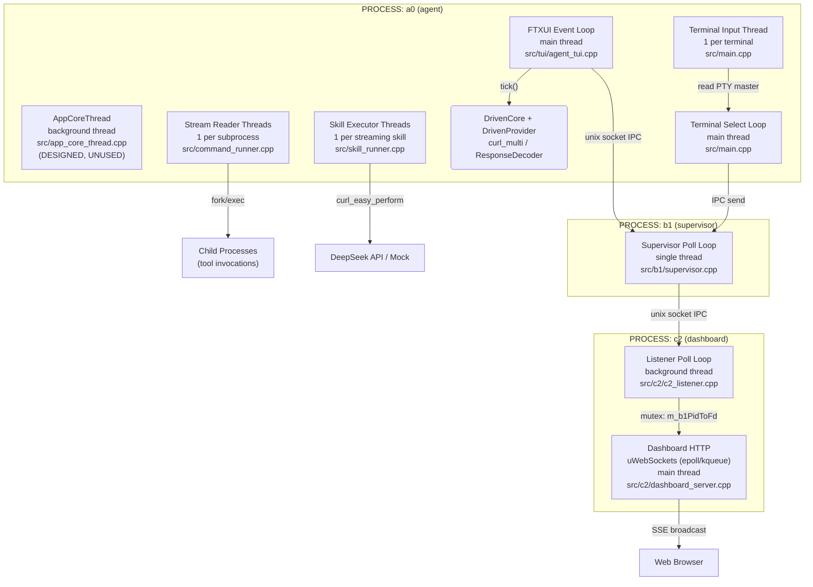
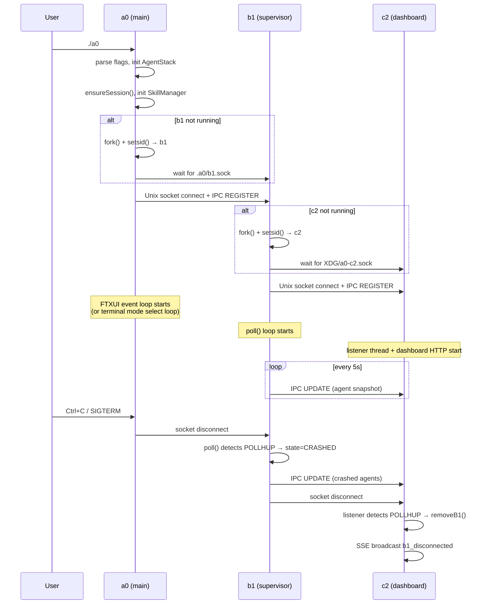
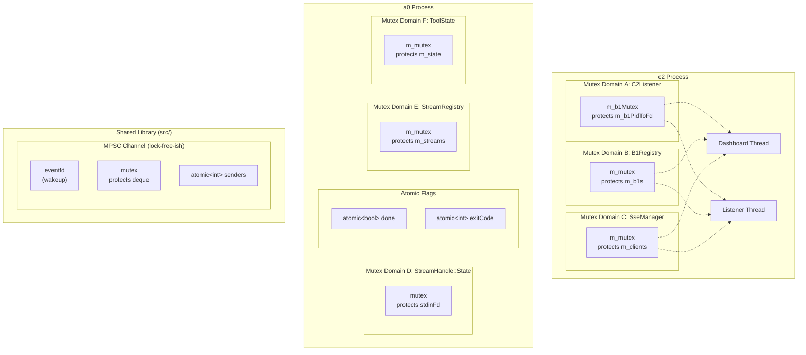
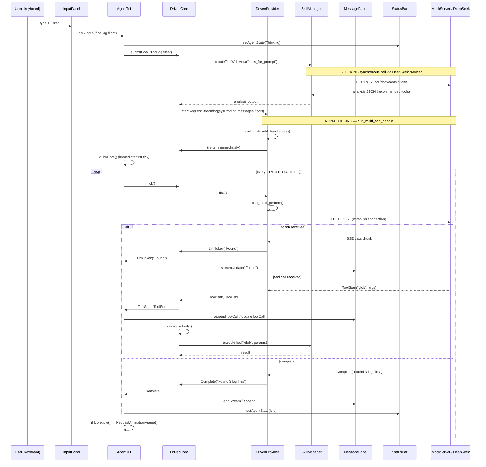
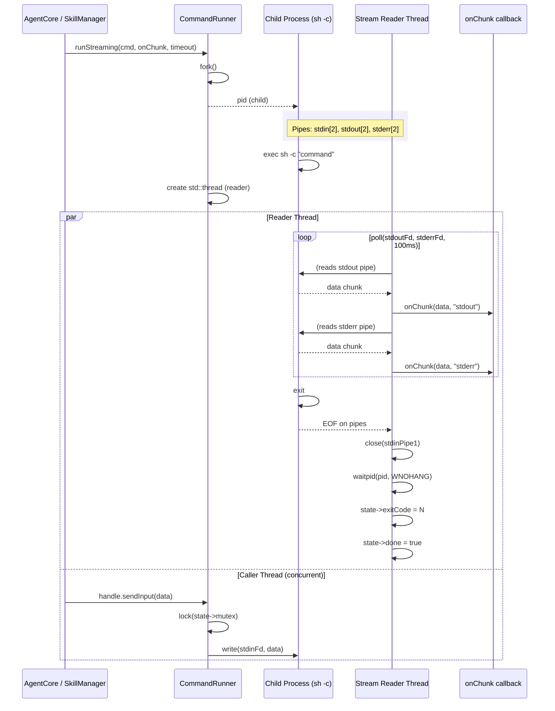
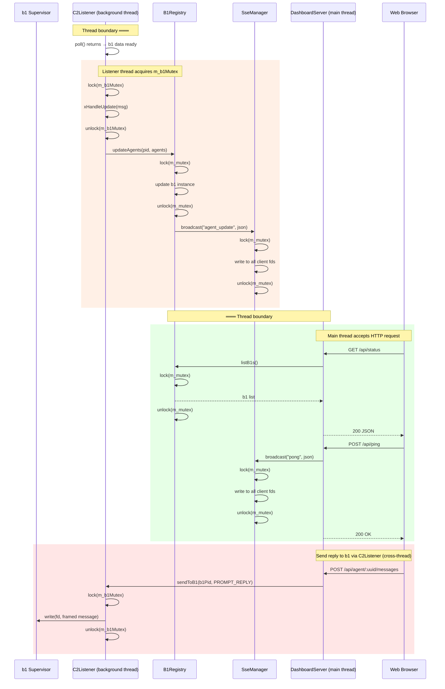
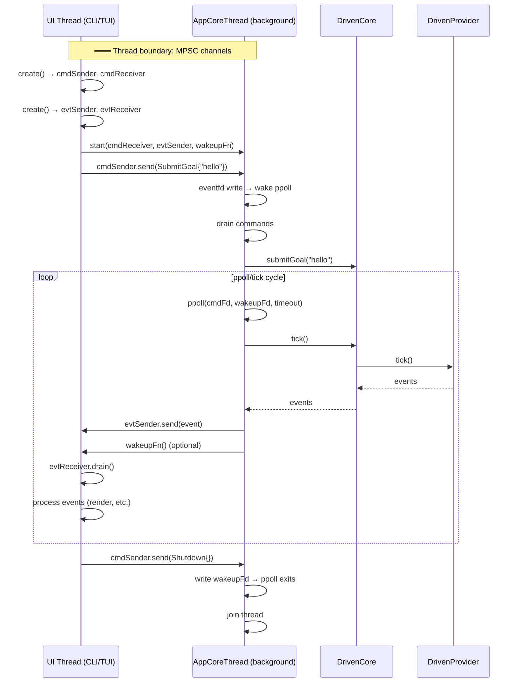

# Technical Specification: Concurrency Model

## Version 1.0 — Cross-Cutting Thread & Async Architecture

---

## 1. Overview

This document describes all concurrent execution in the a0 agent ecosystem — independent threads, async event loops, and inter-process communication — as a **high-level C4 architecture** where each component is a concurrency context (thread or async loop) rather than a source file.

The ecosystem spans three processes:

| Process | Binary | Source Root | Role |
|---------|--------|-------------|------|
| **a0** | `build/a0` | `src/` | Agent — TUI, tool execution, LLM interaction |
| **b1** | `build/b1` | `src/b1/` | Supervisor daemon — per-workdir agent lifecycle |
| **c2** | `build/c2` | `src/c2/` | Dashboard daemon — per-machine aggregation, web UI |

Each process contains one or more concurrency contexts. This document identifies every context, its source files, synchronization primitives, data flow paths, and critical coordination points.

---

## 2. Thread/Process Model — C4 Architecture

### 2.1 Container Diagram



### 2.2 Concurrency Context Inventory

#### Process: a0 (agent)

| # | Component | Type | Thread | Source Files | Status | Role |
|---|-----------|------|--------|-------------|--------|------|
| C1 | FTXUI Event Loop | Async (poll) | Main | `src/tui/agent_tui.cpp:58-86` | **Active** | Renders TUI, drives `DrivenCore::tick()`, owns `DrivenProvider` (curl_multi), processes user input |
| C2 | AppCoreThread | Async (ppoll) | Background | `src/app_core_thread.cpp:61-162` | **Designed, not wired** | Owns `DrivenCore` + `DrivenProvider` in dedicated thread, communicates via MPSC channels |
| C3 | Stream Reader Thread | Thread (per process) | Per-child | `src/command_runner.cpp:206-269` | **Active** | `poll()` on child stdout/stderr pipes, invokes `onChunk` callback |
| C4 | Skill Executor Thread | Thread (per skill) | Per-skill | `src/skill_runner.cpp:348-364` | **Active** | Calls `InferenceProvider::complete()` (blocking curl), runs validators |
| C5 | Terminal Input Thread | Thread | Per-terminal | `src/main.cpp:887-895` | **Active** | Reads IPC `STREAM_INPUT` from b1, writes to PTY master |
| C6 | Terminal Select Loop | Async (select) | Main | `src/main.cpp:900-927` | **Active** | Reads PTY master output, forwards to b1 via IPC |

#### Process: b1 (supervisor)

| # | Component | Type | Thread | Source Files | Status | Role |
|---|-----------|------|--------|-------------|--------|------|
| C7 | Supervisor Poll Loop | Async (poll) | Single | `src/b1/supervisor.cpp` | **Active** | `poll()` on listen socket, agent sockets, c2 socket; accepts agents, relay IPC, crash detection, c2 snapshots |

#### Process: c2 (dashboard)

| # | Component | Type | Thread | Source Files | Status | Role |
|---|-----------|------|--------|-------------|--------|------|
| C8 | Dashboard HTTP | Async (epoll) | Main | `src/c2/dashboard_server.cpp`, `src/c2/c2_main.cpp:124` | **Active** | uWebSockets HTTP/SSE server, REST API, SSE broadcasts |
| C9 | Listener Poll Loop | Async (poll) | Background | `src/c2/c2_listener.cpp:39-238`, `src/c2/c2_main.cpp:112-117` | **Active** | Accept b1 connections, receive IPC messages, dispatch handlers |

### 2.3 Process Lifecycle Diagram



---

## 3. Component Specifications

### 3.1 FTXUI Event Loop (C1)

```cpp
// src/tui/agent_tui.cpp — AgentTui::run()
int AgentTui::run(bool testMode) {
    // ...
    auto loop = ftxui::Loop(m_screen, m_mainComponent);
    while (!loop.HasQuitted()) {
        loop.RunOnce();              // FTXUI renders, processes events
        xTickCore();                 // Drives DrivenCore + DrivenProvider
        std::this_thread::sleep_for(std::chrono::milliseconds(16));  // ~60 FPS
    }
    // ...
}
```

**Wakeup mechanisms:**
- `m_screen->Post(Task{})` — enqueue a no-op to force a frame (used in `xHandleSubmit`)
- `m_screen->RequestAnimationFrame()` — request next frame (used in `xTickCore` when core is busy)
- `std::this_thread::sleep_for(16ms)` — frame rate limiter, also the idle poll timeout

**Owns:**
- `DrivenProvider` (curl_multi async HTTP)
- `DrivenCore` (state machine: Idle → AwaitingLlm → ExecutingTools)
- `MessagePanel`, `InputPanel`, `StatusBar`, `DialogManager` (FTXUI components)
- `SessionManager` (PersistenceStore CRUD)

**Thread safety:** This component is **not thread-safe**. All DrivenCore/DrivenProvider calls are made from the main thread. Any cross-thread event injection must use `Screen::Post(Task{})` for FTXUI-side processing.

### 3.2 AppCoreThread (C2 — Unused)

```cpp
// src/app_core_thread.cpp — AppCoreThread::xRun()
void AppCoreThread::xRun() {
    // Block SIGCHLD in this thread
    pthread_sigmask(SIG_BLOCK, &sigmask, nullptr);

    while (m_running.load()) {
        ppoll(fds, nfds, timeout, &waitset);  // poll wakeupFd + cmdFd

        // Drain dead children
        while (waitpid(-1, nullptr, WNOHANG) > 0) {}

        // Drain commands from MPSC channel
        auto commands = m_cmdReceiver.drain();
        for (auto& cmd : commands) {
            // SubmitGoal → core.submitGoal()
            // Cancel → core.cancel()
            // Shutdown → stop
        }

        // Tick the core → collect events → send via MPSC
        if (!core.idle()) {
            auto events = core.tick();
            for (auto& ev : events) m_evtSender.send(ev);
            if (!events.empty() && m_wakeupFn) m_wakeupFn();
        }
    }
}
```

**Key design properties:**
- Thread ownership: owns `DrivenProvider` + `DrivenCore` directly (stack-allocated in `xRun()`)
- Communication: bidirectional MPSC channels for commands and events
- Wakeup: eventfd for shutdown, MPSC Receiver::poll_fd() for command arrival
- Signal handling: SIGCHLD blocked via `pthread_sigmask`, handled via `waitpid(WNOHANG)` drain
- Timeout: curl-driven from `DrivenProvider::timeoutMs()`, minimum 100ms idle

### 3.3 Stream Reader Thread (C3)

```cpp
// src/command_runner.cpp — reader thread lambda (lines 206-269)
state->thread = std::thread([state, stdoutPipe0, stderrPipe0, stdinPipe1, onChunk, timeoutSecs, pid]() {
    // Set SIGALRM for timeout
    alarm(timeoutSecs);

    while (!outDone || !errDone) {
        poll(fds, nfds, 100);  // 100ms timeout for done-flag check
        // read from stdout pipe → onChunk(data, "stdout")
        // read from stderr pipe → onChunk(data, "stderr")
    }

    close(outFd); close(errFd);
    close(stdinPipe1);                        // ⚠️ unprotected close (Issue #1)

    waitpid(pid, &status, 0);
    state->exitCode = ec;
    state->done = true;                       // signal completion via atomic
});
```

**Shared state:** `std::shared_ptr<StreamHandle::State>` containing:
- `std::mutex mutex` — protects `stdinFd` during `sendInput()`
- `int stdinFd` — written before thread starts, read under mutex, closed in thread
- `std::atomic<bool> done` — completion signal (non-blocking check via `isDone()`)
- `std::atomic<int> exitCode` — thread-safe exit code read

**Thread safety concern:** `close(stdinPipe1)` at line 256 executes without holding `state->mutex`. If `sendInput()` is called concurrently from another thread, it may write to a file descriptor that has been closed and potentially reused.

### 3.4 Skill Executor Thread (C4)

```cpp
// src/skill_runner.cpp — executeStreaming() thread (lines 348-364)
state->thread = std::thread([this, prompt, fullSystemPrompt, expanded, onChunk, state]() {
    std::string llmResult = m_provider->complete(fullSystemPrompt, expanded);
    json finalResult = runValidators(prompt, llmResult);
    std::string output = finalResult.is_string() ? ... : finalResult.dump();
    if (onChunk) onChunk(output, "stdout");

    if (!prompt.composeFile.empty() && m_composeMgr &&
        !m_composeMgr->isPersistent(prompt.name)) {
        m_composeMgr->stopEnvironment(prompt);
    }

    state->exitCode = 0;
    state->done = true;
});
```

**Thread safety concern:** `m_provider` is `InferenceProvider*` (raw pointer to `DeepSeekProvider`). `DeepSeekProvider::complete()` uses non-thread-safe `curl_easy_perform()` and shares `m_baseUrl` with `setMockUrl()`. There is **no mutex** protecting the provider from concurrent access. Currently safe because `executeStreaming()` is never called while the provider is being reconfigured via `setMockUrl()`, but there is no guard against future misuse.

### 3.5 Terminal Threads (C5, C6)

```cpp
// src/main.cpp — terminal mode
// Input thread (C5):
std::thread inputThread([&]() {
    while (!done) {
        recvMessage(b1Sock, inputMsg, 100);
        if (inputMsg.type == STREAM_INPUT && inputMsg.streamId == streamId)
            write(master, inputMsg.chunkData.data(), inputMsg.chunkData.size());
    }
});

// Select loop (C6, main thread):
while (!done) {
    select(master + 1, &rdfs, nullptr, nullptr, &tv);
    if (FD_ISSET(master, &rdfs)) {
        n = read(master, buf, sizeof(buf));
        // appendChunk + send STREAM_DATA to b1
    }
    waitpid(shellPid, &status, WNOHANG); // reap child shell
}

// Synchronization:
std::atomic<bool> done{false};  // shared between C5 thread and C6 main loop
```

### 3.6 b1 Supervisor Poll Loop (C7)

Single-threaded event loop. All state (`m_agents`, `m_streamOwners`, `m_c2Fd`) is accessed from one thread — no mutexes needed.

```cpp
// src/b1/supervisor.cpp — Supervisor::run()
while (m_running) {
    poll(fds, nfds, 1000);  // 1s timeout

    // Handle new agent connections on listen socket
    // Handle incoming IPC from agents (REGISTER, HEARTBEAT, USER_PROMPT, STREAM_DATA, ...)
    // Handle incoming IPC from c2 (PROMPT_REPLY, STREAM_INPUT)
    // waitpid(WNOHANG) for child a0 processes → detect crashes
    // Every 5s: push agent snapshot to c2
}
```

### 3.7 c2 Two-Thread Architecture (C8, C9)

**Main thread:** uWebSockets HTTP/SSE server. Epoll-based internally. Calls `B1Registry`, `SseManager`, and `C2Listener::sendToB1()` under their respective mutexes.

**Background thread (`listenerThread`):** `poll()` loop on Unix socket. Accepts b1 connections, processes IPC messages, calls `B1Registry` mutations and `SseManager` broadcasts under mutex.

```cpp
// src/c2/c2_main.cpp
std::thread listenerThread([&listener]() {
    listener.run();  // C9: poll loop in background
});
dashboard.run();  // C8: uWS HTTP/SSE in main thread
```

**Shared state across C8↔C9:**
- `C2Listener::m_b1PidToFd` (protected by `m_b1Mutex`)
- `B1Registry::m_b1s` (protected by `B1Registry::m_mutex`)
- `SseManager::m_clients` (protected by `SseManager::m_mutex`)

All three mutex domains are independent — no nested lock acquisition occurs across domains, eliminating deadlock risk.

---

## 4. Synchronization Layer

### 4.1 Mutex Domain Diagram



### 4.2 Synchronization Primitive Inventory

| Component | Primitive | Scope | File(s) |
|-----------|-----------|-------|---------|
| `mpsc::Sender::send()` | `std::lock_guard<std::mutex>` | Push to shared deque + write eventfd | `src/mpsc.h:127` |
| `mpsc::Receiver::drain()` | `std::lock_guard<std::mutex>` | Pop all from shared deque | `src/mpsc.h:205` |
| `mpsc::Channel` eventfd | `eventfd(0, EFD_NONBLOCK)` | Cross-thread wakeup for poll() | `src/mpsc.h:73` |
| `StreamHandle::sendInput()` | `std::lock_guard<std::mutex>` | stdinFd write protection | `src/command_runner.cpp:147` |
| `StreamHandle::State::done` | `std::atomic<bool>` | Non-blocking completion check | `src/command_runner.h:47` |
| `StreamHandle::State::exitCode` | `std::atomic<int>` | Thread-safe exit code read | `src/command_runner.h:48` |
| `StreamRegistry` | `std::mutex` on all methods | Stream map CRUD | `src/stream_registry.h:50` |
| `ToolState` | `std::mutex` on all methods | Session state bag | `src/tool_state.h:22` |
| `B1Registry` | `std::mutex` on all methods | b1 instance map | `src/c2/b1_registry.h:44` |
| `SseManager` | `std::mutex` on all methods | SSE client list | `src/c2/sse_manager.h:26` |
| `C2Listener::m_b1PidToFd` | `std::mutex` | PID→fd map | `src/c2/c2_listener.h:37` |
| `AppCoreThread::m_running` | `std::atomic<bool>` | Thread start/stop flag | `src/app_core_thread.h:75` |
| `hex_session_id` RNG | `thread_local` | Per-thread random device | `src/hex_session_id.h:9-11` |
| `g_timeoutFired` | `volatile sig_atomic_t` | Signal handler flag | `src/command_runner.cpp:15` |
| `Terminal done` | `std::atomic<bool>` | Input thread / select loop coordination | `src/main.cpp:885` |

### 4.3 Absence of Synchronization (Design Intent)

The following components have **no internal locks** by design:

| Component | Reason | Risk if misused |
|-----------|--------|-----------------|
| `DrivenProvider` | Designed for single-thread access; all calls from FTXUI event loop | Data race if called from >1 thread |
| `DrivenCore` | Owns `DrivenProvider`; driven from same thread | Same as above |
| `DefaultAgentCore` | Not thread-safe; raw pointer members | Undefined behavior |
| `DefaultSkillRunner` | `executeStreaming()` spawns thread calling `m_provider` | Cross-thread `DeepSeekProvider` access |
| `b1::Supervisor` | Single-threaded design | Already correct |

---

## 5. Detailed Data Flow

### 5.1 FTXUI Event Loop — Goal Submission



**Key characteristic:** Everything runs on one thread. The `tools_for_prompt` call is **blocking** — it calls the old `DeepSeekProvider` which uses synchronous `curl_easy_perform()`. During this call, the FTXUI event loop is frozen. After it returns, the rest is driven by `curl_multi_perform()` on each frame.

### 5.2 CommandRunner Streaming — Subprocess Execution



### 5.3 c2 Two-Thread Data Flow



### 5.4 AppCoreThread Design Data Flow (Unused)



---

## 6. Critical Coordination Points

| # | Point | Components | Shared State | Protection | Risk | Recommendation |
|---|-------|-----------|-------------|-----------|------|----------------|
| 1 | `close(stdinPipe1)` in reader thread | C3 ↔ caller | `stdinFd` | `std::mutex` for writes, **no lock on close** | LOW — `sendInput()` is typically called before child exits; close happens after pipes EOF | Wrap `close(stdinPipe1)` in `lock_guard` |
| 2 | `DeepSeekProvider::complete()` from skill thread | C4 ↔ C1 | `m_baseUrl`, curl easy handle | **NONE** | MEDIUM — no concurrent calls today, but no guard. A background `executeStreaming()` calling `complete()` while the main thread calls `setMockUrl()` would race on `m_baseUrl` | Add mutex to `DeepSeekProvider`, or document as single-thread-only |
| 3 | `DrivenProvider::tick()` from single thread | C1 (or C2) | `m_handle`, `m_multi` | **NONE by design** | CORRECT — single-thread access enforced by architecture | Document the contract |
| 4 | `C2Listener::sendToB1()` + `xCleanupPeer()` | C8 ↔ C9 | `m_b1PidToFd` | `std::mutex` | CORRECT — all accesses covered |
| 5 | `B1Registry` mutations + SSE broadcasts | C9 | `m_b1s` + `m_clients` | Independent mutexes | CORRECT — no nested lock acquisition |
| 6 | `g_timeoutFired` signal flag | C3 signal handler | `sig_atomic_t` | `volatile sig_atomic_t` | CORRECT — only written in handler, read in same thread |
| 7 | `AppCoreThread::m_running` | C2 ↔ caller | `std::atomic<bool>` | `exchange()`, `load()` | CORRECT — acquire-release semantics |
| 8 | `b1::Supervisor` all state | C7 only | `m_agents`, etc. | **None** | CORRECT — single-threaded |
| 9 | `mpsc::Channel` send/drain | Any ↔ C2 | deque + eventfd | `std::mutex` + `std::atomic<int>` | CORRECT — proven MPSC pattern |
| 10 | Terminal `done` flag | C5 ↔ C6 | `std::atomic<bool>` | `std::atomic` | CORRECT |

### 6.1 Issue Detail: `close(stdinPipe1)` Without Lock

**File:** `src/command_runner.cpp:256`

```cpp
// In reader thread:
close(outFd);
close(errFd);
close(stdinPipe1);  // <-- no lock_guard(state->mutex)
```

`stdinPipe1` is the parent's end of the stdin pipe to the child process. The reader thread closes it after detecting EOF on stdout/stderr. However, `StreamHandle::sendInput()` (called from another thread) does this:

```cpp
// src/command_runner.cpp:147
void StreamHandle::sendInput(const std::string& data) {
    auto s = m_state.lock();
    if (!s) return;
    std::lock_guard<std::mutex> lock(s->mutex);
    if (s->stdinFd >= 0) {
        write(s->stdinFd, data.data(), data.size());
    }
}
```

If `sendInput()` is called concurrently with the reader thread's `close(stdinPipe1)`, the write may go to a file descriptor that has been recycled by another `fork()`/`accept()`/`open()` call.

**Impact:** Low probability in practice. `sendInput()` is typically called before the child exits, and `close(stdinPipe1)` happens after pipe EOF. But the race window exists.

### 6.2 Issue Detail: `DeepSeekProvider` from Background Thread

**File:** `src/skill_runner.cpp:348`

```cpp
state->thread = std::thread([this, ...]() {
    std::string llmResult = m_provider->complete(fullSystemPrompt, expanded);
    // ...
});
```

Where `m_provider` is `InferenceProvider*` pointing to a `DeepSeekProvider` instance also accessible from the main thread via `DefaultAgentCore`. `DeepSeekProvider::complete()` calls `curl_easy_perform()` which modifies internal curl state, and reads `m_baseUrl` which is written by `setMockUrl()` from another thread.

**Impact:** Medium. The streaming skill execution path is currently not used in the default TUI mode (which uses `DrivenCore`/`DrivenProvider` instead). But the code path exists and could be triggered by `SkillRunner::executeStreaming()`.

---

## 7. Guarantees and Invariants

### 7.1 No `fork()` + Thread Mixing

All `fork()` calls happen before `std::thread` creation, or in processes that do not use threads:
- `CommandRunner::run()` forks before the stream reader thread is created
- `main.cpp` forks b1 before the FTXUI event loop starts
- `main.cpp` forks c2 from b1 which is single-threaded
- `b1` forks a0 instances but b1 itself is single-threaded

### 7.2 No Deadlock

All mutex domains are independent. No code acquires two mutexes simultaneously (no nested `lock_guard`). The three c2 mutexes (`m_b1Mutex`, `B1Registry::m_mutex`, `SseManager::m_mutex`) are accessed independently — no function holds more than one at a time.

### 7.3 Wakeup Guarantee

The MPSC channel provides reliable cross-thread wakeup:
1. `Sender::send()` → `lock(mutex)` → push to deque → `write(eventfd, 1)` → `unlock`
2. The eventfd is in the `poll()`/`ppoll()` fd set
3. `poll()` returns → `drain()` → `lock(mutex)` → pop all → `unlock`

This guarantees that commands sent from any thread are visible to the event loop within one poll cycle.

### 7.4 Signal Safety

| Signal | Handler | Safety |
|--------|---------|--------|
| `SIGALRM` | Sets `volatile sig_atomic_t g_timeoutFired` | **Safe** — only `sig_atomic_t` writes, no async-signal-unsafe calls |
| `SIGCHLD` (AppCoreThread) | Blocked via `pthread_sigmask` | **Safe** — handled via `waitpid(WNOHANG)` drain |
| `SIGINT`/`SIGTERM` (c2) | Calls `shutdown()`, `unlink()`, `_exit()` | **Acceptable** — signal handler exits immediately via `_exit()`, no stdlib cleanup needed |
| `SIGTERM` (CommandRunner cancel) | Kills child process group | **Safe** — `kill(-pid, SIGTERM)` is async-signal-safe |

### 7.5 IPC Framing Integrity

The JSON-line protocol (`src/ipc_protocol.cpp`) uses `\n` as a message delimiter. `recvMessage()` reads one byte at a time until a newline is found. This guarantees message boundaries even with partial reads, at the cost of performance (one `read()` syscall per byte). No message corruption can occur from fragmented TCP segment delivery.

### 7.6 No Shared Memory Between Processes

All inter-process communication uses Unix domain sockets. There is no shared memory, no mmap, and no cross-process mutex. This means:
- A crash in any process cannot corrupt another process's state
- Memory isolation is maintained by the OS
- No cross-process locking is needed

---

## 8. Testing Requirements

### 8.1 Unit Tests (Google Test)

| Component | Test Case | Verification |
|-----------|-----------|-------------|
| `mpsc::Channel` | Single sender, single receiver | Message delivered, eventfd readable |
| `mpsc::Channel` | Multiple senders (threaded) | All messages received, no data race |
| `mpsc::Channel` | `poll_fd()` readability | `poll()` returns after `send()` |
| `StreamHandle::State` | `sendInput()` concurrent with done | No crash, write succeeds or fd closed |
| `StreamHandle::State` | `done`/`exitCode` atomic access | Correct values from other thread |
| `AppCoreThread` | Submit goal → events received | Commands dispatched, events propagated |
| `AppCoreThread` | Shutdown mid-tick | Clean exit, no dangling resources |

### 8.2 Thread Sanitizer (TSAN) Tests

The following tests must be run with `-fsanitize=thread` enabled in CMake:

| Test | What to check |
|------|---------------|
| MPSC 10-producer concurrent send | No data races on shared deque |
| StreamRegistry concurrent register/unregister | Mutex covers all map access |
| B1Registry concurrent read/write | Mutex covers all list operations |
| C2Lifecycle concurrent sendToB1 + peer disconnect | `m_b1Mutex` covers fd map |
| AppCoreThread submit + cancel race | Atomic `m_running` and eventfd coordination |

### 8.3 Integration Tests

| ID | Scenario | Steps | Expected |
|----|----------|-------|----------|
| INT-CONC-01 | a0 starts b1 automatically | Run `a0` in clean directory | b1 fork succeeds, IPC register completes |
| INT-CONC-02 | a0 crash detected | Kill a0 with SIGKILL | b1 detects via socket POLLHUP, state=CRASHED |
| INT-CONC-03 | b1 registers with c2 | Start c2, then b1 | IPC register received, SSE broadcast |
| INT-CONC-04 | c2 two-thread: prompt reply | b1 sends user_prompt, UI replies | sendToB1 forwards through mutex, agent receives |
| INT-CONC-05 | DrivenCore submit + tick chain | Submit goal, tick 50 times | LLM response appears, no crash |

---

## 9. Identified Issues and Recommendations

### Issue 1: Unprotected `close(stdinPipe1)` in Reader Thread

**Location:** `src/command_runner.cpp:256`

**Problem:** `close(stdinPipe1)` in the reader thread does not hold `state->mutex`. If `sendInput()` is called concurrently, it may write to a file descriptor that has been closed and potentially reused.

**Fix:** Wrap the close in a `lock_guard`:

```cpp
{
    std::lock_guard<std::mutex> lock(state->mutex);
    ::close(stdinPipe1);
    state->stdinFd = -1;  // invalidate fd
}
```

### Issue 2: `DeepSeekProvider` Cross-Thread Access

**Location:** `src/skill_runner.cpp:348` → `m_provider->complete()`

**Problem:** `DeepSeekProvider::complete()` is called from a background thread created by `executeStreaming()`. The provider uses non-thread-safe `curl_easy_perform()` and shares `m_baseUrl` with `setMockUrl()`. No mutex protects concurrent access.

**Status:** Not triggered in current usage (TUI uses `DrivenProvider` instead of streaming skills). But the code path exists.

**Recommendations:**
1. **Short-term:** Add a `std::mutex` to `DeepSeekProvider` and lock in both `complete()` and `setMockUrl()`
2. **Long-term:** Route all streaming skill execution through `DrivenCore`/`DrivenProvider` instead of creating background threads in `SkillRunner`

### Issue 3: `g_timeoutFired` Read Without Volatile

**Location:** `src/command_runner.cpp:348`

```cpp
// In xRunSingle, after alarm returns:
if (g_timeoutFired) {  // read site — NOT volatile-qualified
    result.timedOut = true;
    ...
}
```

**Problem:** `g_timeoutFired` is declared `volatile sig_atomic_t` but only the **write** in the signal handler has volatile semantics. The read site at line 348 is not expressed as a volatile access. On some architectures, the compiler may hoist the read before the `alarm()` syscall, losing the signal.

**Fix:**
```cpp
if (*(volatile sig_atomic_t*)&g_timeoutFired) {
```

Or use `std::atomic_signal_fence` to enforce visibility.

### Issue 4: AppCoreThread is Unwired

**Location:** `src/app_core_thread.h/.cpp`

**Status:** The component is fully implemented but unused. `main.cpp::cmdTui()` constructs `AgentTui` directly with `DrivenCore`/`DrivenProvider` on the FTXUI thread instead of launching `AppCoreThread`.

**Impact:** The elegant MPSC-based architecture with thread isolation and eventfd wakeup is dead code. When someone later needs to run the agent core on a separate thread (e.g., for headless mode), `AppCoreThread` is ready but untested in production.

**Recommendation:** Wire `AppCoreThread` into the `--headless` or command-line `run` mode as a migration path. Verify with TSAN that the MPSC channels and eventfd wakeup work correctly under load.

---

## 10. File Layout Reference

The concurrency model is not a sub-module — it cross-cuts the entire source tree. This table maps each concurrency context to its implementation files:

| Context | Implementation Files |
|---------|---------------------|
| C1 — FTXUI Event Loop | `src/tui/agent_tui.h/.cpp`, `src/driven_provider.h/.cpp`, `src/driven_core.h/.cpp`, `src/response_decoder.h/.cpp` |
| C2 — AppCoreThread | `src/app_core_thread.h/.cpp`, `src/driven_provider.h/.cpp`, `src/driven_core.h/.cpp`, `src/mpsc.h` |
| C3 — Stream Reader | `src/command_runner.h/.cpp` |
| C4 — Skill Executor | `src/skill_runner.h/.cpp`, `src/deepseek_provider.h/.cpp` |
| C5 — Terminal Input Thread | `src/main.cpp` |
| C6 — Terminal Select Loop | `src/main.cpp` |
| C7 — b1 Supervisor | `src/b1/supervisor.h/.cpp`, `src/b1/a0_launcher.h/.cpp` |
| C8 — c2 Dashboard HTTP | `src/c2/dashboard_server.h/.cpp`, `src/c2/b1_registry.h/.cpp`, `src/c2/sse_manager.h/.cpp` |
| C9 — c2 Listener | `src/c2/c2_listener.h/.cpp`, `src/c2/c2_event_store.h/.cpp` |
| Shared IPC | `src/ipc_protocol.h/.cpp`, `src/unix_socket.h/.cpp` |
| Shared Sync | `src/mpsc.h`, `src/stream_registry.h/.cpp`, `src/tool_state.h/.cpp` |
| Shared Signal Safety | `src/command_runner.cpp` (SIGALRM), `src/app_core_thread.cpp` (SIGCHLD), `src/c2/c2_main.cpp` (SIGINT/SIGTERM) |
