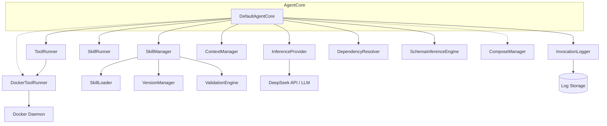
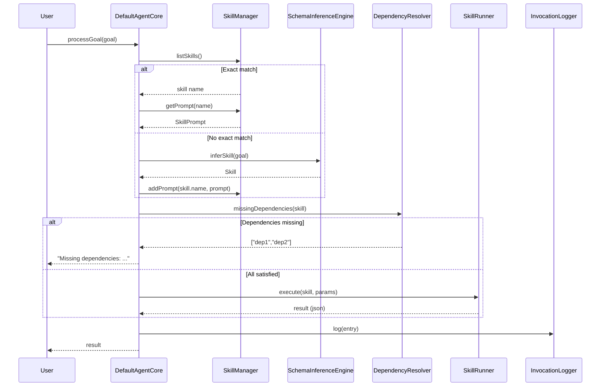

# DefaultAgentCore Spec

## 1. Overview

DefaultAgentCore is the central orchestrator of the agent system. It owns pointers to every subsystem (skill manager, runners, provider, context, logger, resolver, inference engine, Docker infra) and exposes a high-level goal-processing loop. Its lifecycle is: construct → init (load skills + generate session ID) → run (REPL) or processGoal — resumeSession replays a prior session's log. It depends on SkillManager, ToolRunner, SkillRunner, InferenceProvider, ContextManager, InvocationLogger, DependencyResolver, SchemaInferenceEngine, and optionally DockerToolRunner + ComposeManager.

## 2. Component Specifications

```cpp
class DefaultAgentCore : public AgentCore {
public:
    /// \param toolRunner     Executes tool commands
    /// \param skillRunner    Executes skill pipelines
    /// \param provider       LLM inference (e.g. DeepSeek)
    /// \param context        Conversation context stack
    /// \param logger         Invocation audit log
    /// \param depResolver    Checks transitive dependencies
    /// \param inferenceEngine  Infers Skill/Tool from natural language
    /// \param systemTools    Built-in tool registry (bash, read, glob, etc.)
    /// \param skillMgr       Skills sub-module facade
    /// \param persistence    Optional SQLite session persistence
    /// \param dockerRunner   Optional – runs tools in Docker containers
    /// \param composeMgr     Optional – manages Docker Compose environments
    DefaultAgentCore(ToolRunner* toolRunner,
                     SkillRunner* skillRunner,
                     InferenceProvider* provider,
                     ContextManager* context,
                     InvocationLogger* logger,
                     DependencyResolver* depResolver,
                     SchemaInferenceEngine* inferenceEngine,
                     a0::SystemToolRegistry* systemTools,
                     a0::skills::SkillManager* skillMgr,
                     a0::persistence::PersistenceStore* persistence = nullptr,
                     DockerToolRunner* dockerRunner = nullptr,
                     ComposeManager* composeMgr = nullptr);

    bool init(const std::string& skillsDir) override;
    json processGoal(const std::string& goal) override;
    json runSkill(const std::string& skillName, const json& params);
    bool resumeSession(const std::string& sessionId) override;
    std::string currentSessionId() const override;
    void run() override;

private:
    SkillManager* m_skillManager;
    ToolRunner* m_toolRunner;
    DockerToolRunner* m_dockerRunner;
    ComposeManager* m_composeMgr;
    SkillRunner* m_skillRunner;
    InferenceProvider* m_provider;
    ContextManager* m_context;
    InvocationLogger* m_logger;
    DependencyResolver* m_depResolver;
    SchemaInferenceEngine* m_inferenceEngine;
    std::string m_sessionId;
    bool m_initialized;
};
```

## 3. Architecture Diagram



## 4. Data Flow



## 5. Error Handling

| Condition | Behaviour |
|-----------|-----------|
| `init()` called on non-existent directory | Returns `false` |
| `processGoal()` called before `init()` | Throws `std::logic_error("AgentCore not initialized")` |
| Empty goal string | Returns JSON string `"no goal provided"` |
| No exact skill match and `inferSkill` throws | Returns `"failed to infer skill: <what>"` |
| Missing dependencies after skill resolution | Returns `"Missing dependencies: dep1, dep2"` without invoking LLM |
| `resumeSession()` with non-existent session | Returns `false`, context remains empty |
| Malformed log data during replay | Silently skipped (catch-all) |

## 6. Edge Cases

| Case | Behaviour |
|------|-----------|
| Goal equals skill name exactly (case-sensitive) | Exact match – `"Bash"` does not match `"bash"` |
| Goal is substring of a skill name | Not matched (exact match only) |
| Multiple rapid goals without await | Processed sequentially; context accumulates |
| EOF (Ctrl+D) on `run()` REPL | Loops exits cleanly |
| `resumeSession()` with valid ID but corrupted log entry | Corrupted entries skipped; valid entries replayed |
| All deps satisfied but `execute()` returns error | Error propagated as JSON result |
| DockerRunner / ComposeManager are nullptr | No Docker support; tools/skills that require containers will fail downstream |

## 7. Testing Requirements

| Method | Test | Input | Expected |
|--------|------|-------|----------|
| `init` | Valid directory with tool/skill JSONs | `componentsDir` pointing to dir with 1 tool, 1 skill | Returns `true`, `listTools()==1`, `listSkills()==1` |
| `init` | Non-existent directory | `componentsDir` = `/no/such/path` | Returns `false` |
| `init` | Empty directory | `componentsDir` = empty dir | Returns `true`, zero components loaded |
| `processGoal` | Not initialized | `"anything"` | Throws `std::logic_error` |
| `processGoal` | Empty goal | `""` | Returns `"no goal provided"` |
| `processGoal` | Exact skill match, deps satisfied | Registered skill `"test"` | Executes skill, returns result |
| `processGoal` | No match, infer + deps satisfied | Unknown goal | infers skill, adds to registry, executes |
| `processGoal` | No match, infer fails | Unknown goal | Returns `"failed to infer skill: ..."` |
| `processGoal` | Dependencies missing | Skill requiring `"missing_tool"` | Returns `"Missing dependencies: missing_tool"` |
| `resumeSession` | Valid session with log entries | Existing session ID | Returns `true`, context rebuilt |
| `resumeSession` | Non-existent session | `"nosession"` | Returns `false` |
| `run` | REPL one line | Stdin `"test\n"` | processGoal called, result printed |
| `run` | EOF | Ctrl+D | Exits cleanly |
| `currentSessionId` | After init | – | Returns `"session_<epoch_ms>"` format |
