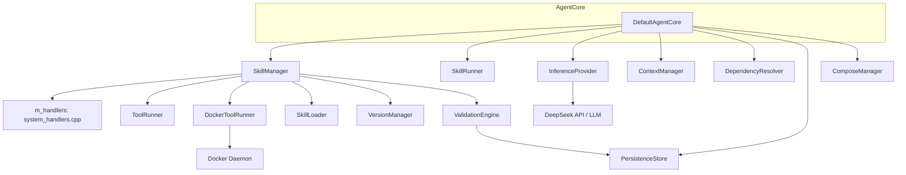
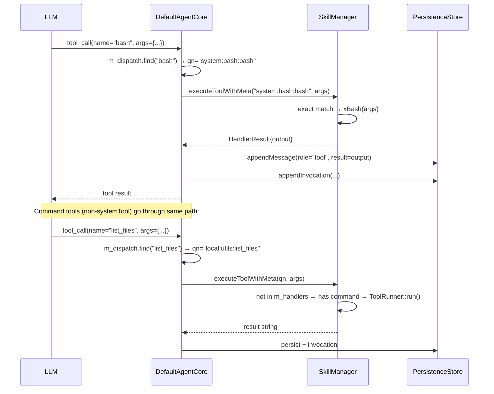

# DefaultAgentCore Spec

## 1. Overview

DefaultAgentCore is the central orchestrator of the agent system. It owns pointers to every subsystem (skill manager, runners, provider, context, resolver, inference engine, persistence, Docker infra) and exposes a high-level goal-processing loop. Its lifecycle is: construct → init (load skills + validate handlers + generate session ID) → run (REPL) or processGoal — resumeSession replays a prior session's log.

All tool dispatch (both system C++ handlers and command-based subprocess tools) goes through `SkillManager` exclusively.

**Dependencies:** `SkillManager`, `ToolRunner`, `SkillRunner`, `InferenceProvider`, `ContextManager`, `PersistenceStore`, `DependencyResolver`, optionally `DockerToolRunner` + `ComposeManager`

## 2. Component Specifications

```cpp
class DefaultAgentCore : public AgentCore {
public:
    DefaultAgentCore(ToolRunner* toolRunner,
                     SkillRunner* skillRunner,
                     InferenceProvider* provider,
                     ContextManager* context,
                     DependencyResolver* depResolver,

                     a0::skills::SkillManager* skillMgr,
                     a0::persistence::PersistenceStore* persistence = nullptr,
                     DockerToolRunner* dockerRunner = nullptr,
                     ComposeManager* composeMgr = nullptr);

    bool init(const std::string& skillsDir) override;
    json processGoal(const std::string& goal) override;
    json processGoal(const std::string& goal, const json& params);
    json runSkill(const std::string& skillName, const json& params);
    bool resumeSession(const std::string& sessionId) override;
    std::string currentSessionId() const override;
    void run() override;
    a0::StreamHandle processGoalStreaming(const std::string& goal,
                                           a0::StreamCallback onChunk) override;

private:
    a0::skills::SkillManager* m_skillMgr;
    ToolRunner* m_toolRunner;
    DockerToolRunner* m_dockerRunner;
    ComposeManager* m_composeMgr;
    SkillRunner* m_skillRunner;
    InferenceProvider* m_provider;
    ContextManager* m_context;
    DependencyResolver* m_depResolver;

    a0::persistence::PersistenceStore* m_persistence;
    std::string m_sessionId;
    bool m_initialized;

    std::unordered_map<std::string, std::string> m_dispatch;
    std::unordered_set<std::string> m_accumulatedTools;

    void xPushToContext(const std::string& goal, const json& result);
    void xBuildDispatchTable();
    std::string xRunForkedLoop(const std::string& userInput,
                                const std::vector<ToolSchema>& tools,
                                int maxTurns = 25);
};
```

## 3. Architecture Diagram



## 4. init() Sequence

```
1. skillMgr->loadAll()                    — load manifests from disk
2. skillMgr->missingHandlers()            — validate all systemTool entries have handlers
   If non-empty: print all missing, return false (fatal)
3. generateHexSessionId()
4. buildBasePrompt()
5. setGlobalVars: SESSION_ID, PROJECT_DIR, etc.
6. BuildIdentity → persistence.registerAgent()
7. m_initialized = true
```

## 5. Data Flow (Tool Dispatch)



## 6. processGoal() Flow

```
1. m_context->push(user)
2. persistence->createSession(), appendMessage(user)
3. Phase 1: Exact prompt match
   — SkillManager::getPromptResolved(goal) → expanded → xRunForkedLoop
   — Fallback: iterate components for qualified match
4. Phase 2: Forked tool-calling loop
   — xBuildDispatchTable()
   — SkillManager::schemas(true) → anchor schemas (9 default tools)
   — xRunForkedLoop(goal, schemas, 25)
5. persistence->endSession
```

## 7. xRunForkedLoop() Flow

```
1. Inject tools_for_prompt analysis via SkillManager::executeToolWithMeta()
   → m_accumulatedTools populated from analysis.recommendedTools
2. Combine anchor schemas + accumulated tool schemas
3. Loop (max 25 turns):
   a. LLM call with combined schemas
   b. If tool_calls returned:
      - Check each for prompt expansion (getPromptResolved)
      - For tool dispatch: m_dispatch → SkillManager::executeToolWithMeta()
      - Persist each tool call + result
   c. If text response: persist and return
4. Return on max turns exceeded
```

## 8. Error Handling

| Condition | Behaviour |
|-----------|-----------|
| `init()` called on non-existent directory | Returns `false` |
| `init()` with missing handler | Prints all missing handlers, returns `false` |
| `processGoal()` called before `init()` | Throws `std::logic_error` |
| Empty goal string | Returns JSON string `"no goal provided"` |

| Missing dependencies after skill resolution | Returns `"Missing dependencies: dep1, dep2"` |
| `resumeSession()` with non-existent session | Returns `false`, context remains empty |
| Forked loop exceeds max turns | Returns `"ERROR: max tool call turns exceeded"` |
| Cumulative message payload exceeds limit | Returns `"ERROR: cumulative message payload exceeds limit"` |

## 9. Testing Requirements

| Method | Test | Input | Expected |
|--------|------|-------|----------|
| `init` | Valid directory | `skillsDir` with tool/skill JSONs | Returns `true` |
| `init` | Non-existent directory | `/no/such/path` | Returns `false` |
| `init` | Missing C++ handler | SystemTool in manifest without registerHandler | Returns `false`, stderr lists missing |
| `processGoal` | Exact skill match | Registered skill name | Executes skill, returns result |
| `processGoal` | No match, forked loop | Unknown goal | Calls xRunForkedLoop |
| `processGoal` | Forked loop max turns exceeded | Loop with 25+ calls | Returns `"ERROR: max tool call turns exceeded"` |
| `xRunForkedLoop` | System tool dispatch | Short name in dispatch table → SkillManager::executeToolWithMeta | Handler output returned |
| `xRunForkedLoop` | Unknown tool | Name not in dispatch | Returns `"ERROR: unknown tool: <name>"` |
| `xRunForkedLoop` | tools_for_prompt injection | First turn auto-analysis | recommendedTools inserted into m_accumulatedTools |
| `runSkill` | Valid skill | `system:test` with params | Skill executed, result returned |
| `resumeSession` | Valid session | Existing session ID | Returns `true`, context rebuilt |
| `run` | EOF | Ctrl+D | Exits cleanly |
