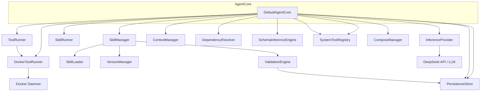
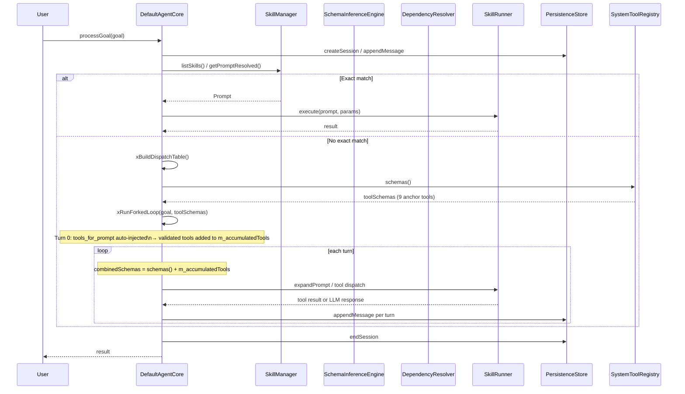

# DefaultAgentCore Spec

## 1. Overview

DefaultAgentCore is the central orchestrator of the agent system. It owns pointers to every subsystem (skill manager, runners, provider, context, resolver, inference engine, system tools, Docker infra, persistence) and exposes a high-level goal-processing loop. Its lifecycle is: construct → init (load skills + generate session ID) → run (REPL) or processGoal — resumeSession replays a prior session's log. It depends on SkillManager, ToolRunner, SkillRunner, InferenceProvider, ContextManager, PersistenceStore, DependencyResolver, SchemaInferenceEngine, SystemToolRegistry, and optionally DockerToolRunner + ComposeManager.

## 2. Component Specifications

```cpp
class DefaultAgentCore : public AgentCore {
public:
    /// \param toolRunner     Executes tool commands
    /// \param skillRunner    Executes skill pipelines
    /// \param provider       LLM inference (e.g. DeepSeek)
    /// \param context        Conversation context stack
    /// \param depResolver    Checks transitive dependencies
    /// \param inferenceEngine  Infers Skill/Tool from natural language
    /// \param systemTools    Built-in tool registry (bash, read, glob, etc.)
    /// \param skillMgr       Skills sub-module facade
    /// \param persistence    Optional SQLite session persistence
    /// \param dockerRunner   Optional – runs tools in Docker containers
    /// \param composeMgr     Optional – manages Docker Compose environments
    DefaultAgentCore(ToolRunner* toolRunner,
                     SkillRunner* skillRunner,
                     InferenceProvider* provider,
                     ContextManager* context,
                     DependencyResolver* depResolver,
                     SchemaInferenceEngine* inferenceEngine,
                     a0::SystemToolRegistry* systemTools,
                     a0::skills::SkillManager* skillMgr,
                     a0::persistence::PersistenceStore* persistence = nullptr,
                     DockerToolRunner* dockerRunner = nullptr,
                     ComposeManager* composeMgr = nullptr);

    bool init(const std::string& skillsDir) override;
    json processGoal(const std::string& goal) override;
    json runSkill(const std::string& skillName, const json& params);
    bool resumeSession(const std::string& sessionId) override;
    std::string currentSessionId() const override;
    void run() override;

    a0::StreamHandle processGoalStreaming(const std::string& goal,
                                           a0::StreamCallback onChunk) override;

private:
    SkillManager* m_skillManager;
    ToolRunner* m_toolRunner;
    DockerToolRunner* m_dockerRunner;
    ComposeManager* m_composeMgr;
    SkillRunner* m_skillRunner;
    InferenceProvider* m_provider;
    ContextManager* m_context;
    DependencyResolver* m_depResolver;
    SchemaInferenceEngine* m_inferenceEngine;
    std::string m_sessionId;
    bool m_initialized;
    int m_nextSubSession = 1;
    std::unordered_set<std::string> m_accumulatedTools;

    void xPushToContext(const std::string& goal, const json& result);
    std::string sanitizeUtf8(const std::string& input);
    std::string truncateForLLM(const std::string& input);
    void xRebuildBasePrompt();
    void xBuildDispatchTable();
    std::string xRunForkedLoop(const std::string& userInput,
                                const std::vector<ToolSchema>& tools,
                                int maxTurns = 20);
    static void xParseQualified(const std::string& qn,
                                 std::string& ns, std::string& comp, std::string& name);
    static int xNsToType(const std::string& ns);
};
```

## 3. Architecture Diagram



## 4. Data Flow



## 5. Error Handling

| Condition | Behaviour |
|-----------|-----------|
| `init()` called on non-existent directory | Returns `false` |
| `processGoal()` called before `init()` | Throws `std::logic_error("AgentCore not initialized")` |
| Empty goal string | Returns JSON string `"no goal provided"` |
| No exact prompt match and `inferPrompt` throws | Returns `"failed to infer prompt: <what>"` |
| Missing dependencies after skill resolution | Returns `"Missing dependencies: dep1, dep2"` without invoking LLM |
| `resumeSession()` with non-existent session | Returns `false`, context remains empty |
| Malformed log data during replay | Silently skipped (catch-all) |

## 6. Edge Cases

| Case | Behaviour |
|------|-----------|
| Goal equals skill name exactly (case-sensitive) | Exact match – `"Bash"` does not match `"bash"` |
| Goal is substring of a skill name | Not matched (exact match only) |
| Multiple rapid goals without await | Processed sequentially; context accumulates |
| EOF (Ctrl+D) on `run()` REPL | Loops exits cleanly |
| `resumeSession()` with valid ID but corrupted log entry | Corrupted entries skipped; valid entries replayed |
| All deps satisfied but `execute()` returns error | Error propagated as JSON result |
| DockerRunner / ComposeManager are nullptr | No Docker support; tools/skills that require containers will fail downstream |

## 7. Testing Requirements

| Method | Test | Input | Expected |
|--------|------|-------|----------|
| `init` | Valid directory with tool/skill JSONs | `componentsDir` pointing to dir with 1 tool, 1 skill | Returns `true`, `listTools()==1`, `listSkills()==1` |
| `init` | Non-existent directory | `componentsDir` = `/no/such/path` | Returns `false` |
| `init` | Empty directory | `componentsDir` = empty dir | Returns `true`, zero components loaded |
| `processGoal` | Not initialized | `"anything"` | Throws `std::logic_error` |
| `processGoal` | Empty goal | `""` | Returns `"no goal provided"` |
| `processGoal` | Exact skill match, deps satisfied | Registered skill `"test"` | Executes skill, returns result |
| `processGoal` | No match, forked loop runs | Unknown goal | Calls xBuildDispatchTable + xRunForkedLoop |
| `processGoal` | Forked loop exceeds max turns | Loop with 20+ tool calls | Returns `"ERROR: max tool call turns exceeded"` |
| `processGoal` | Forked loop total payload exceeds limit | Each turn adds large content | Returns `"ERROR: cumulative message payload exceeds limit"` |
| `processGoal` | LLM returns empty response | All tool calls done, no content | Returns `"ERROR: LLM returned empty response"` |
| `xRunForkedLoop` | System tool dispatch | `m_systemTools->isSystemTool()` true | Uses system tool registry |
| `xRunForkedLoop` | Accumulated tool dispatch | `m_accumulatedTools` contains name | Added to combinedSchemas, resolved via m_dispatch |
| `xRunForkedLoop` | tools_for_prompt returns validated tools | `analysis.recommendedTools` non-empty | Tools inserted into m_accumulatedTools |
| `xRunForkedLoop` | tools_for_prompt returns empty set | `analysis.recommendedTools` empty | Only 9 anchor tools available |
| `xRunForkedLoop` | Qualified tool dispatch | `m_dispatch` contains name | Resolves via SkillManager, runs tool |
| `xRunForkedLoop` | Prompt dispatch | `getPromptResolved` succeeds | Executes via SkillRunner |
| `xRunForkedLoop` | Unknown dispatch target | Name not in dispatch or system tools | Returns `"ERROR: unknown tool: <name>"` |
| `resumeSession` | Valid session with log entries | Existing session ID | Returns `true`, context rebuilt |
| `resumeSession` | Non-existent session | `"nosession"` | Returns `false` |
| `run` | REPL one line | Stdin `"test\n"` | processGoal called, result printed |
| `run` | EOF | Ctrl+D | Exits cleanly |
| `currentSessionId` | After init | – | Returns `"<32-char hex>"` format |
