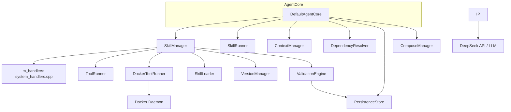
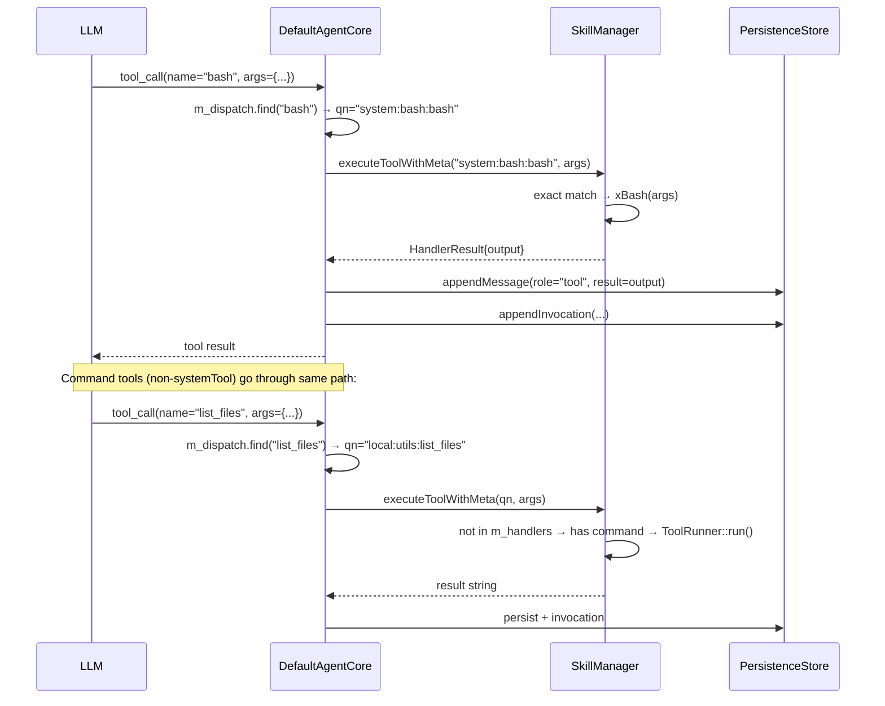

# DefaultAgentCore Spec

> **DEPRECATED — kept as reference only. Not compiled into the active binary.**
> Replaced by `DrivenCore` + `runSync()` which uses `LlmProvider*` and handles the
> tool-calling loop directly via `DependencyGraph`. All session management is now
> done through `PersistenceStore` directly (see `main.cpp` `cmdRun`/`cmdTui`).

## 1. Overview

DefaultAgentCore is the central orchestrator of the agent system. It owns pointers to every subsystem (skill manager, runners, provider, context, resolver, inference engine, persistence, Docker infra) and exposes a high-level goal-processing loop. Its lifecycle is: construct → init (load skills + validate handlers + generate session ID) → run (REPL) or processGoal — resumeSession replays a prior session's log.

All tool dispatch (both system C++ handlers and command-based subprocess tools) goes through `SkillManager` exclusively.

**Dependencies (original, for reference):** `SkillManager`, `ToolRunner`, `SkillRunner`, `ContextManager`, `PersistenceStore`, `DependencyResolver`, optionally `DockerToolRunner` + `ComposeManager`

## 2. Component Specifications

```cpp
class DefaultAgentCore : public AgentCore {
public:
    DefaultAgentCore(ToolRunner* toolRunner,
                     SkillRunner* skillRunner,
                     ContextManager* context,
                     DependencyResolver* depResolver,

                     a0::skills::SkillManager* skillMgr,
                     a0::persistence::PersistenceStore* persistence = nullptr,
                     DockerToolRunner* dockerRunner = nullptr,
                     ComposeManager* composeMgr = nullptr);

    bool init(const std::string& skillsDir) override;
    bool init(const std::string& skillsDir, const std::string& a0Dir);
    void setExternalRepo(const std::string& url) { m_externalRepoUrl = url; }
    void setSkillArgs(const std::unordered_map<std::string, std::string>& args) { m_skillArgs = args; }
    void setSessionId(const std::string& sessionId) { m_sessionId = sessionId; }
    json processGoal(const std::string& goal) override;
    json processGoal(const std::string& goal, const json& params);
    json runSkill(const std::string& skillName, const json& params);
    bool resumeSession(const std::string& sessionId) override;
    bool ensureSession() override;
    int64_t sessionDbId() const override { return m_sessionDbId; }
    std::string currentSessionId() const override;
    void run() override;
    a0::StreamHandle processGoalStreaming(const std::string& goal,
                                           a0::StreamCallback onChunk) override;

    int agentDbId() const { return m_agentDbId; }
    void setSession(const std::string& sessionId, int64_t sessionDbId,
                    a0::SessionContext* sessionCtx = nullptr);
    void setMaxParallel(int n) { m_maxParallel = n; }

private:
    std::string m_basePrompt;
    int m_agentDbId = -1;
    int64_t m_sessionDbId = 0;
    int64_t m_nextSubSession = 1;

    a0::skills::SkillManager* m_skillMgr;
    ToolRunner* m_toolRunner;
    a0::persistence::PersistenceStore* m_persistence;
    DockerToolRunner* m_dockerRunner;
    ComposeManager* m_composeMgr;
    SkillRunner* m_skillRunner;
    ContextManager* m_context;
    DependencyResolver* m_depResolver;
    std::string m_sessionId;
    bool m_initialized;
    a0::SessionContext* m_sessionCtx = nullptr;

    std::unordered_map<std::string, std::string> m_dispatch;
    std::unordered_set<std::string> m_accumulatedTools;
    int m_maxParallel = 4;
    std::string m_skillsDir;
    std::string m_externalRepoUrl = "https://github.com/opensassi/a0";
    std::string m_a0Dir;
    std::unordered_map<std::string, std::string> m_skillArgs;

    void xPushToContext(const std::string& goal, const json& result);
    void xBuildDispatchTable();
    std::string xRunForkedLoop(const std::string& userInput,
                                const std::vector<ToolSchema>& tools,
                                int maxTurns = 25);
};
```

## 3. Architecture Diagram



## 4. init() Sequence

```
1. skillMgr->loadAll()                    — load manifests from disk
2. skillMgr->missingHandlers()            — validate all systemTool entries have handlers
   If non-empty: print all missing, return false (fatal)
3. External repo clone:
   - If m_a0Dir non-empty and m_externalRepoUrl non-empty:
     - If external/a0 dir missing → git clone (depth 1, branch main)
     - If exists → git fetch origin main + checkout + reset --hard
   - Set global var "A0_SRC_DIR" = a0Dir/external/a0
4. Skill args injection:
   - For each (key, val) in m_skillArgs → toolState().set("args:"+key, val)
   - Also setGlobalVar(key, val)
5. generateHexSessionId() (if m_sessionId empty)
6. buildBasePrompt()
7. setGlobalVars: SESSION_ID, PROJECT_DIR, etc.
8. BuildIdentity → persistence.registerAgent()
9. m_initialized = true
```

## 4a. ensureSession()

```
1. If m_sessionDbId > 0: return true (already exists)
2. If !m_persistence || m_agentDbId <= 0: return false
3. If m_sessionId empty: generateHexSessionId()
4. m_persistence->createSession(m_sessionId, 0, 0, m_agentDbId) → m_sessionDbId
5. m_skillRunner->setGlobalVar("SESSION_ID", m_sessionId)
6. return m_sessionDbId > 0
```

## 4b. setSession()

```
Stores pre-created session info (called after init when session created early):
1. m_sessionId = sessionId
2. m_sessionDbId = sessionDbId
3. m_sessionCtx = sessionCtx
4. Update SESSION_ID global var
5. If sessionCtx provided, update PROJECT_DIR global var from getcwd()
```

## 4a. processGoal() Changes

At the start of `processGoal()`:
```
- skillMgr->toolState().clear()     — reset per-session tool state
```

## 4b. xRunForkedLoop() Changes

Tool dispatch now uses `DependencyGraph` batching:
```
For each LLM response with tool_calls:
  1. Collect all invocations into a vector<ToolInvocation>
  2. DependencyGraph::buildBatches(invocations) → batches
  3. DependencyGraph::executeBatches(batches, skillMgr, m_maxParallel) → batchResults
  4. Flatten results back into message order
```

## 5. Data Flow (Tool Dispatch)



## 6. processGoal() Flow

```
1. m_context->push(user)
2. persistence->createSession(), appendMessage(user)
3. Phase 1: Exact prompt match
   — SkillManager::getPromptResolved(goal) → expanded → xRunForkedLoop
   — Fallback: iterate components for qualified match
4. Phase 2: Forked tool-calling loop
   — xBuildDispatchTable()
   — SkillManager::schemas(true) → anchor schemas (9 default tools)
   — xRunForkedLoop(goal, schemas, 25)
5. persistence->endSession
```

## 7. xRunForkedLoop() Flow

```
1. Inject tools_for_prompt analysis via SkillManager::executeToolWithMeta()
   → m_accumulatedTools populated from analysis.recommendedTools
2. Combine anchor schemas + accumulated tool schemas
3. Loop (max 25 turns):
   a. LLM call with combined schemas
   b. If tool_calls returned:
      - Check each for prompt expansion (getPromptResolved)
      - For tool dispatch: m_dispatch → SkillManager::executeToolWithMeta()
      - Persist each tool call + result
   c. If text response: persist and return
4. Return on max turns exceeded
```

## 8. Error Handling

| Condition | Behaviour |
|-----------|-----------|
| `init()` called on non-existent directory | Returns `false` |
| `init()` with missing handler | Prints all missing handlers, returns `false` |
| `processGoal()` called before `init()` | Throws `std::logic_error` |
| Empty goal string | Returns JSON string `"no goal provided"` |
| Missing dependencies after skill resolution | Returns `"Missing dependencies: dep1, dep2"` |
| `resumeSession()` with non-existent session | Returns `false`, context remains empty |
| `ensureSession()` without persistence or agent ID | Returns `false` |
| Forked loop exceeds max turns | Returns `"ERROR: max tool call turns exceeded"` |
| Cumulative message payload exceeds limit | Returns `"ERROR: cumulative message payload exceeds limit"` |
| LLM returns empty response in forked loop | Returns `"ERROR: LLM returned empty response"` |
| No tools available for goal | Returns `"No tools available to process goal: <goal>"` |

## 9. Testing Requirements

| Method | Test | Input | Expected |
|--------|------|-------|----------|
| `init` | Valid directory | `skillsDir` with tool/skill JSONs | Returns `true` |
| `init` | Non-existent directory | `/no/such/path` | Returns `false` |
| `init` | Missing C++ handler | SystemTool in manifest without registerHandler | Returns `false`, stderr lists missing |
| `processGoal` | Exact skill match | Registered skill name | Executes skill, returns result |
| `processGoal` | No match, forked loop | Unknown goal | Calls xRunForkedLoop |
| `processGoal` | Forked loop max turns exceeded | Loop with 25+ calls | Returns `"ERROR: max tool call turns exceeded"` |
| `xRunForkedLoop` | System tool dispatch | Short name in dispatch table → SkillManager::executeToolWithMeta | Handler output returned |
| `xRunForkedLoop` | Unknown tool | Name not in dispatch | DependencyGraph returns error string |
| `xRunForkedLoop` | Batched tool dispatch | Multiple tool_calls in one turn | DependencyGraph::buildBatches + executeBatches called |
| `processGoal` | ToolState clear | Repeated processGoal calls | ToolState empty at each new call |
| `setMaxParallel` | Configure parallelism | Set to 8 | DependencyGraph uses 8 subprocess workers |
| `xRunForkedLoop` | tools_for_prompt injection | First turn auto-analysis | recommendedTools inserted into m_accumulatedTools |
| `runSkill` | Valid skill | `system:test` with params | Skill executed, result returned |
| `resumeSession` | Valid session | Existing session ID | Returns `true`, context rebuilt |
| `resumeSession` | Non-existent session | Bogus UUID | Returns `false`, m_initialized = true |
| `ensureSession` | Already exists | Already has m_sessionDbId > 0 | Returns `true`, no-op |
| `ensureSession` | Creates new | Clean state with persistence | New session created, returns `true` |
| `sessionDbId` | After ensureSession | | Returns valid DB ID |
| `agentDbId` | After init | | Returns agent row ID |
| `setSessionId` | Before init | UUID set | Used by init() if no session exists |
| `setSession` | After init | UUID + dbId + ctx | Global vars updated, session tracked |
| `run` | EOF | Ctrl+D | Exits cleanly |
| `processGoalStreaming` | Streaming goal | Goal with streaming flag | Routes to SkillRunner::executeStreaming |
