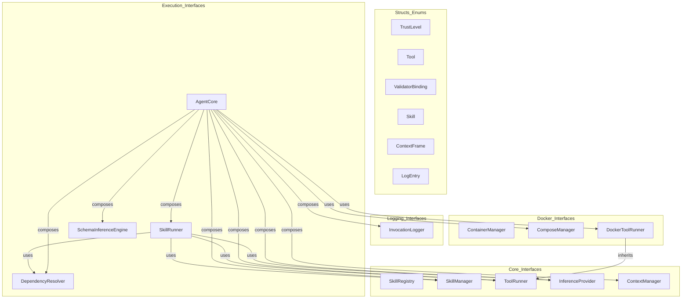
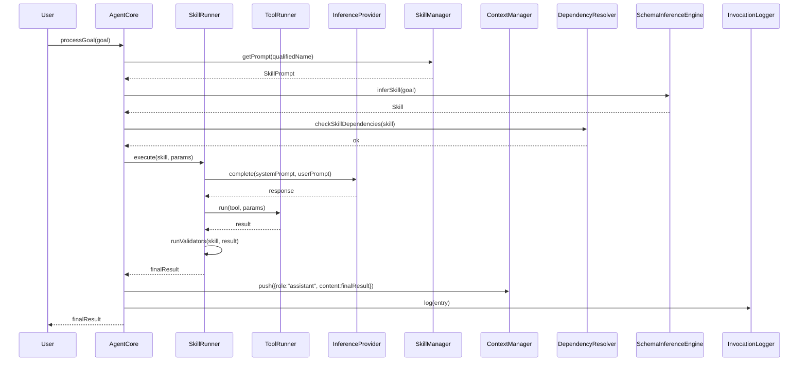

# Agent Interfaces Spec

## 1. Overview
Defines all abstract interfaces and data structures for the agent framework. These types are consumed by every concrete implementation in the system. No runtime dependencies beyond `nlohmann/json` and the C++ standard library.

## 2. Component Specifications

### `TrustLevel` enum
```cpp
enum class TrustLevel {
    HIGH,
    MEDIUM,
    LOW
};
```

### `Tool` struct
```cpp
struct Tool {
    std::string name;
    std::string description;
    std::string command;
    std::string inputMode = "stdin";
    std::string dockerImage;
    TrustLevel trustLevel = TrustLevel::MEDIUM;
    std::vector<std::string> aptDependencies;
    int timeoutSecs = 30;
};
```

### `ToolCall` struct
```cpp
struct ToolCall {
    std::string id;
    std::string name;
    json arguments;
};
```

### `ToolSchema` struct
```cpp
struct ToolSchema {
    std::string name;
    std::string description;
    json inputSchema;
};
```

### `ValidatorBinding` struct
```cpp
struct ValidatorBinding {
    std::string toolName;                 /**< Name of the validator tool */
    std::optional<std::string> transform; /**< Future: JSONPath binding */
};
```

### `Skill` struct (legacy — replaced by skills sub-module)
```cpp
struct Skill {
    std::string name;
    std::string description;
    std::string prompt;
    std::vector<std::string> dependencies;
    std::vector<ValidatorBinding> validators;
    std::string composeFile;
    std::vector<std::string> aptDependencies;
};
```

### `Prompt` struct (skills sub-module)
```cpp
struct Prompt {
    std::string name;
    std::string description;
    std::string prompt;
    std::vector<std::string> dependencies;
    std::vector<ValidatorBinding> validators;
};
```

### `CompatBridge` struct (skills sub-module)
```cpp
struct CompatBridge {
    std::string toolName;
    std::string since;
    std::string bridgeCommand;
    std::string description;
};
```

### `SkillRegistry` (abstract)
```cpp
class SkillRegistry {
public:
    virtual ~SkillRegistry() = default;
    /**
     * @param path Directory to scan for tool/skill JSON/YAML files
     * @retval true  All files loaded successfully
     * @retval false One or more files failed to parse
     */
    virtual bool loadFromDirectory(const std::string& path) = 0;
    /** @param name Tool name
     *  @return Tool if found, nullopt otherwise */
    virtual std::optional<Tool> getTool(const std::string& name) const = 0;
    /** @param name Skill name
     *  @return Skill if found, nullopt otherwise */
    virtual std::optional<Skill> getSkill(const std::string& name) const = 0;
    /** @return List of all registered tool names */
    virtual std::vector<std::string> listTools() const = 0;
    /** @return List of all registered skill names */
    virtual std::vector<std::string> listSkills() const = 0;
    /** @return List of all registered prompt names */
    virtual std::vector<std::string> listPrompts() const = 0;
    /** @param tool Tool to register
     *  @retval true  Added successfully
     *  @retval false Name conflict or invalid tool */
    virtual bool addTool(const Tool& tool) = 0;
    /** @param skill Skill to register
     *  @retval true  Added successfully
     *  @retval false Name conflict or invalid skill */
    virtual bool addSkill(const Skill& skill) = 0;
};
```

### `ContextFrame` struct
```cpp
struct ContextFrame {
    std::string role;    /**< "user", "assistant", or "system" */
    std::string content; /**< Message body */
};
```

### `ContextManager` (abstract)
```cpp
class ContextManager {
public:
    virtual ~ContextManager() = default;
    virtual void push(const ContextFrame& frame) = 0;
    virtual ContextFrame pop() = 0;
    virtual ContextFrame peek() const = 0;
    virtual size_t size() const = 0;
    virtual void clear() = 0;
    /** @return Complete copy of the conversation history */
    virtual std::vector<ContextFrame> snapshot() const = 0;
};
```

### `LogEntry` struct
```cpp
struct LogEntry {
    std::string sessionId;
    int64_t timestamp;   /**< Unix epoch milliseconds */
    std::string eventType;
    std::string data;    /**< JSON-encoded payload */
};
```

### `InvocationLogger` (abstract)
```cpp
class InvocationLogger {
public:
    virtual ~InvocationLogger() = default;
    virtual void log(const LogEntry& entry) = 0;
    /**
     * @param sessionId Session to replay
     * @param callback  Invoked for each matching entry in order
     * @retval true  Session found and replayed
     * @retval false Session not found
     */
    virtual bool replay(const std::string& sessionId,
                        std::function<void(const LogEntry&)> callback) = 0;
    /** @return All known session IDs */
    virtual std::vector<std::string> listSessions() const = 0;
};
```

### `ToolRunner` (abstract)
```cpp
class ToolRunner {
public:
    virtual ~ToolRunner() = default;
    /** @param tool   Tool definition
     *  @param params JSON parameters for the tool
     *  @return JSON result of execution */
    virtual json run(const Tool& tool, const json& params) = 0;
};
```

### `InferenceProvider` (abstract)
```cpp
class InferenceProvider {
public:
    virtual ~InferenceProvider() = default;
    /** @param systemPrompt System-level instruction
     *  @param userPrompt   User query
     *  @return Generated completion text */
    virtual std::string complete(const std::string& systemPrompt,
                                  const std::string& userPrompt) = 0;
    /** @param url Mock endpoint URL (for testing) */
    virtual void setMockUrl(const std::string& url) = 0;
};
```

### `DependencyResolver` (abstract)
```cpp
class DependencyResolver {
public:
    virtual ~DependencyResolver() = default;
    /**
     * @param tool Tool whose deps to check
     * @retval true  All dependencies satisfied
     * @retval false Missing dependencies
     */
    virtual bool checkToolDependencies(const Tool& tool) const = 0;
    /** @see checkToolDependencies */
    virtual bool checkSkillDependencies(const Skill& skill) const = 0;
    /** @param skill Skill to audit
     *  @return Names of unsatisfied dependencies */
    virtual std::vector<std::string> missingDependencies(const Skill& skill) const = 0;
};
```

### `SkillRunner` (abstract)
```cpp
class SkillRunner {
public:
    virtual ~SkillRunner() = default;
    /** @param skill  Skill definition
     *  @param params Parameters to interpolate
     *  @return Expanded prompt string */
    virtual std::string expandPrompt(const Skill& skill, const json& params) = 0;
    /** @param skill Skill whose validators to run
     *  @param input Data to validate
     *  @return Validated/transformed JSON */
    virtual json runValidators(const Skill& skill, const json& input) = 0;
    /** @param skill  Skill to execute
     *  @param params Parameters
     *  @return Execution result JSON */
    virtual json execute(const Skill& skill, const json& params) = 0;
};
```

### `SchemaInferenceEngine` (abstract)
```cpp
class SchemaInferenceEngine {
public:
    virtual ~SchemaInferenceEngine() = default;
    /** @param naturalLanguageDescription Human description of the tool
     *  @return Inferred Tool struct */
    virtual Tool inferTool(const std::string& naturalLanguageDescription) = 0;
    /** @param naturalLanguageDescription Human description of the skill
     *  @return Inferred Skill struct */
    virtual Skill inferSkill(const std::string& naturalLanguageDescription) = 0;
};
```

### `AgentCore` (abstract)
```cpp
class AgentCore {
public:
    virtual ~AgentCore() = default;
    /** @param componentsDir Path to components directory
     *  @retval true  Initialization successful
     *  @retval false Initialization failed */
    virtual bool init(const std::string& componentsDir) = 0;
    /** @param goal Natural-language goal
     *  @return Result JSON after processing */
    virtual json processGoal(const std::string& goal) = 0;
    /** @param sessionId Session identifier to restore
     *  @retval true  Session resumed
     *  @retval false Session not found */
    virtual bool resumeSession(const std::string& sessionId) = 0;
    /** @return Current session ID */
    virtual std::string currentSessionId() const = 0;
    /** Interactive REPL loop (blocking) */
    virtual void run() = 0;
};
```

### `ContainerManager` (abstract)
```cpp
class ContainerManager {
public:
    virtual ~ContainerManager() = default;
    /** @param tool Tool whose image config determines the container
     *  @return Container ID */
    virtual std::string acquireContainer(const Tool& tool) = 0;
    /** @param containerId Target container
     *  @param command     Command to run
     *  @param stdinData   Optional stdin payload
     *  @return stdout+stderr of the command */
    virtual std::string execInContainer(const std::string& containerId,
                                        const std::string& command,
                                        const std::string& stdinData = "") = 0;
    /** Prune containers idle beyond the configured timeout */
    virtual void pruneIdleContainers() = 0;
};
```

### `ComposeManager` (abstract)
```cpp
class ComposeManager {
public:
    virtual ~ComposeManager() = default;
    /** @param skill          Skill with composeFile set
     *  @param skillDirectory Working directory
     *  @return stdout of docker compose up */
    virtual std::string startEnvironment(const Skill& skill,
                                         const std::string& skillDirectory) = 0;
    virtual void stopEnvironment(const Skill& skill) = 0;
    virtual void markUsed(const Skill& skill) = 0;
    virtual void setCurrentSkill(const Skill& skill) = 0;
    /** @return Current compose network name */
    virtual std::string getCurrentNetwork() const = 0;
    virtual void clearCurrentSkill() = 0;
};
```

### `DockerToolRunner` (abstract, inherits `ToolRunner`)
```cpp
class DockerToolRunner : public ToolRunner {
public:
    virtual ~DockerToolRunner() = default;
};
```

## 3. Architecture Diagram



## 4. Data Flow



## 5. Error Handling

| Error Condition | Signal | Notes |
|---|---|---|
| `loadFromDirectory` fails | Returns `false` | No exception thrown |
| `getTool`/`getSkill` not found | Returns `nullopt` | Valid state, not an error |
| `addTool`/`addSkill` name conflict | Returns `false` | |
| `pop` on empty context manager | UB | Caller must check `size() > 0` |
| `replay` session not found | Returns `false` | |
| `init` fails | Returns `false` | Upstream component failure |
| `resumeSession` not found | Returns `false` | |
| Docker not available | Interface methods may throw | Concrete implementations define error policy |

## 6. Edge Cases

| Edge Case | Behavior |
|---|---|
| Empty `Tool.dockerImage` | Run on host (no container) |
| `Tool.inputMode = "args"` | Params serialized as CLI arguments |
| `Skill.composeFile` empty | No compose environment started |
| `Skill.validators` empty | No post-processing applied |
| `ValidatorBinding.transform` nullopt | No transformation (identity) |
| Concurrent access to `ContextManager` | Not thread-safe by default |
| Null `ToolRunner` injected into `SkillRunner` | Must handle gracefully |
| `DockerToolRunner` pure abstract | No default `run()` implementation |

## 7. Testing Requirements

### `SkillRegistry`
| Method | Test Case |
|---|---|
| `loadFromDirectory` | Valid directory, missing directory, malformed JSON |
| `getTool`/`getSkill` | Existing name, missing name, empty registry |
| `listTools`/`listSkills` | Empty, single, multiple entries |
| `addTool`/`addSkill` | New entry, duplicate name, invalid data |

### `ToolRunner`
| Method | Test Case |
|---|---|
| `run` | Tool with stdin mode, args mode, empty params, timeout |

### `InferenceProvider`
| Method | Test Case |
|---|---|
| `complete` | Valid prompts, empty prompt, network failure |
| `setMockUrl` | Valid URL, invalid URL, null URL |

### `ContextManager`
| Method | Test Case |
|---|---|
| `push`/`pop` | Single frame, multiple frames, underflow |
| `peek` | Non-empty, empty |
| `size`/`clear` | After pushes, after clear |
| `snapshot` | Returns copy, modification isolation |

### `InvocationLogger`
| Method | Test Case |
|---|---|
| `log` | Single entry, multiple entries, large data |
| `replay` | Existing session, missing session, empty session |
| `listSessions` | No sessions, multiple sessions |

### `DependencyResolver`
| Method | Test Case |
|---|---|
| `checkToolDependencies` | Satisfied, missing tool dep, missing binary |
| `checkSkillDependencies` | All satisfied, missing skill dep |
| `missingDependencies` | Fully satisfied, partially missing, all missing |

### `SkillRunner`
| Method | Test Case |
|---|---|
| `expandPrompt` | All params provided, missing params, empty template |
| `runValidators` | Passing validation, failing validation, no validators |
| `execute` | Successful run, tool failure, dependency failure |

### `SchemaInferenceEngine`
| Method | Test Case |
|---|---|
| `inferTool` | Clear description, ambiguous description, empty string |
| `inferSkill` | Same as inferTool |

### `AgentCore`
| Method | Test Case |
|---|---|
| `init` | Valid dir, invalid dir, already initialized |
| `processGoal` | Simple goal, multi-step goal, empty goal |
| `resumeSession` | Valid session ID, invalid session ID |
| `currentSessionId` | Before init, after init, after resume |
| `run` | Interactive input, EOF, interrupt |

### `ContainerManager`
| Method | Test Case |
|---|---|
| `acquireContainer` | Image exists, image missing, pool reuse |
| `execInContainer` | Valid command, invalid command, stdin provided |
| `pruneIdleContainers` | No idle containers, all idle, mixed |

### `ComposeManager`
| Method | Test Case |
|---|---|
| `startEnvironment` | Compose file exists, missing compose file |
| `stopEnvironment` | Running environment, already stopped |
| `getCurrentNetwork` | After setCurrentSkill, after clearCurrentSkill |

### `DockerToolRunner`
| Method | Test Case |
|---|---|
| `run` (inherited) | Via ToolRunner interface contract |
