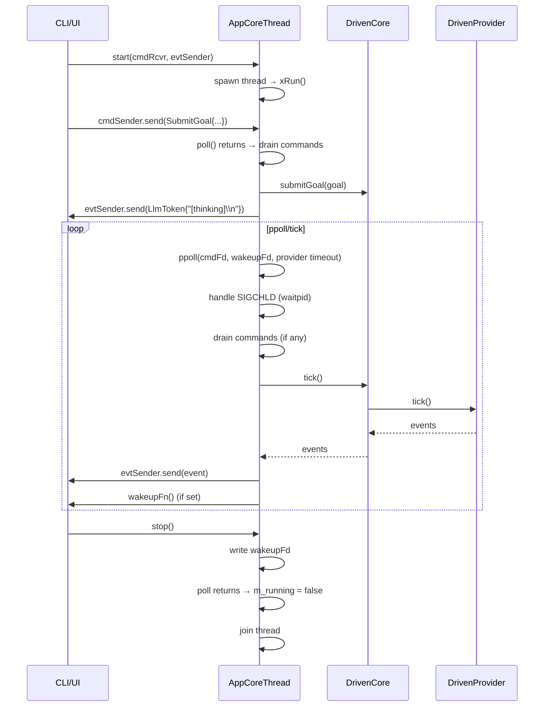

# AppCoreThread Spec

## 1. Overview

Thread-safe application core that owns a `DrivenCore` and runs it in a dedicated thread with a `ppoll()`-based event loop. Commands arrive via an MPSC `Receiver<mpsc::Command>`, events are sent back via an MPSC `Sender<mpsc::AppCoreEvent>`. Uses a wakeup eventfd for graceful shutdown.

**Source files:** `src/app_core_thread.h/.cpp`

**Dependencies:** `driven_core.h`, `driven_provider.h`, `mpsc.h`, `skills/skills.h`, `persistence/persistence_store.h`

## 2. Component Specifications

```cpp
namespace a0 {

class AppCoreThread {
public:
    AppCoreThread(const std::string& apiKey,
                  const std::string& model,
                  a0::skills::SkillManager* skillMgr,
                  a0::persistence::PersistenceStore* persistence = nullptr);
    ~AppCoreThread();

    AppCoreThread(const AppCoreThread&) = delete;
    AppCoreThread& operator=(const AppCoreThread&) = delete;

    void setMockUrl(const std::string& url);

    void start(mpsc::Receiver<mpsc::Command> cmdRcvr,
               mpsc::Sender<mpsc::AppCoreEvent> evtSender,
               std::function<void()> wakeupFn = nullptr);

    void setWakeupFn(std::function<void()> fn);
    void stop();
    bool running() const { return m_running.load(); }

private:
    std::string m_apiKey;
    std::string m_model;
    std::string m_mockUrl;
    a0::skills::SkillManager* m_skillMgr;
    a0::persistence::PersistenceStore* m_persistence;

    mpsc::Receiver<mpsc::Command> m_cmdReceiver;
    mpsc::Sender<mpsc::AppCoreEvent> m_evtSender;
    std::function<void()> m_wakeupFn;

    int m_wakeupFd = -1;          // eventfd for poll loop wakeup
    std::thread m_thread;
    std::atomic<bool> m_running{false};

    void xRun();                  // thread entry point
};

} // namespace a0
```

## 3. Architecture Diagram

```mermaid
graph TB
    subgraph External
        UI[CLI / UI Thread]
        CMD_S[Command Sender]
        EVT_R[Event Receiver]
    end

    subgraph AppCoreThread
        THD[std::thread]
        RUN[xRun poll loop]

        subgraph Poll_FDs
            WFD[wakeupFd]
            CFD[cmdFd from Receiver]
        end

        subgraph Owned_Objects
            PROV[DrivenProvider]
            CORE[DrivenCore]
        end
    end

    subgraph Channels
        CMD_CH[mpsc::Channel&lt;Command&gt;]
        EVT_CH[mpsc::Channel&lt;AppCoreEvent&gt;]
    end

    UI -->|submitGoal / cancel / shutdown| CMD_S
    CMD_S --> CMD_CH
    CMD_CH -->|Receiver.poll_fd| CFD
    CFD --> RUN

    RUN -->|drain commands| CORE
    RUN -->|tick core| CORE
    CORE --> PROV

    CORE -->|events| EVT_CH
    EVT_CH -->|Sender.send| EVT_R
    EVT_R --> UI

    UI -->|stop() write wakeupFd| WFD
    WFD --> RUN
```

## 4. Data Flow



## 5. Testing Requirements

| Test | Verification |
|------|-------------|
| start() launches thread | running() returns true |
| SubmitGoal command | Core receives goal, events sent back |
| Cancel command | Core.cancel() called, returns to idle |
| Shutdown command | Thread exits, running() returns false |
| stop() from idle | Thread joins cleanly, no crash |
| Double start() | No-op (second call ignored) |
| Double stop() | No-op (second call ignored) |
| wakeupFn callback | Called after events are sent |
| SIGCHLD handling | Zombie children reaped in poll loop |
| provider timeout in poll | ppoll timeout matches provider.timeoutMs() |
| setMockUrl before start | Provider created with mock URL |
| Destruction | stop() called, resources cleaned up |
