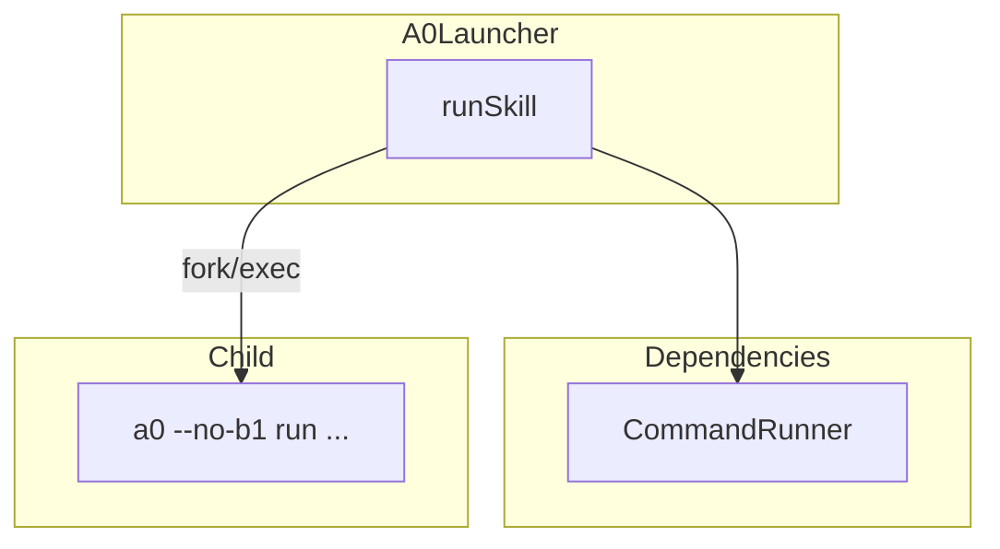
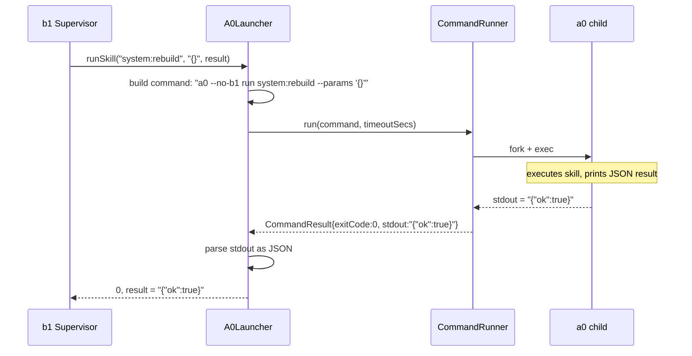

# A0Launcher Spec

## 1. Overview

Invokes a0 as a child process for the self-improvement loop. Wraps `CommandRunner::run()` with a0-specific argument construction (`--no-b1 run <skill> --params <json>`) and result parsing.

**Dependencies:** `CommandRunner`, nlohmann/json

**Lifecycle:** Stateless. Constructed once with the a0 binary path; each `runSkill()` call is independent.

## 2. Component Specifications

```cpp
namespace a0::b1 {

class A0Launcher {
public:
    explicit A0Launcher(const std::string& a0Binary);

    int runSkill(const std::string& skill,
                 const std::string& params,
                 std::string& result,
                 int timeoutSeconds = 300);

private:
    std::string m_a0Binary;
};

} // namespace a0::b1
```

## 3. Architecture Diagram



## 4. Data Flow



## 5. Error Handling

| Scenario | Behaviour |
|----------|-----------|
| a0 binary not found | `CommandRunner` returns exitCode=127 |
| a0 exits with non-zero code | Returns -1, result contains stderr |
| a0 timeout (exceeds timeoutSecs) | `CommandRunner` kills child, returns -2 |
| a0 stdout is not valid JSON | Returns -1, result = raw stdout |
| a0 binary path empty | Falls back to "a0" in PATH |

## 6. Edge Cases

| Case | Expected Result |
|------|----------------|
| Skill name with special characters | Shell-escaped by CommandRunner::shellEscape |
| Params JSON containing shell metacharacters | Single-quote escaped by CommandRunner::shellEscape |
| a0 child produces multi-line JSON stdout | Captured as-is by CommandRunner |
| a0 child crashes with signal | CommandResult.exitCode = -signal |

## 7. Testing Requirements

| Method | Test Case | Input | Expected |
|--------|-----------|-------|----------|
| `runSkill` | a0 exits 0 | Echo script that prints `{"ok":true}` | Result = `{"ok":true}`, returns 0 |
| `runSkill` | a0 exits non-zero | Script that exits 1 | Returns -1 |
| `runSkill` | a0 timeout | Script that sleeps 10, timeout=1 | Returns -2 |
| `runSkill` | a0 not found | Binary = "/nonexistent/path" | Returns -1 |
| `runSkill` | Non-JSON stdout | Script that prints "hello" | Returns -1, result = "hello" |

## 8. Integration

Used by `Supervisor` when a self-improvement trigger fires. The a0 binary path is resolved at startup from `argv[0]` and passed to the `A0Launcher` constructor. b1 checks `A0Launcher::runSkill()` return before signalling running a0 instances to restart.
