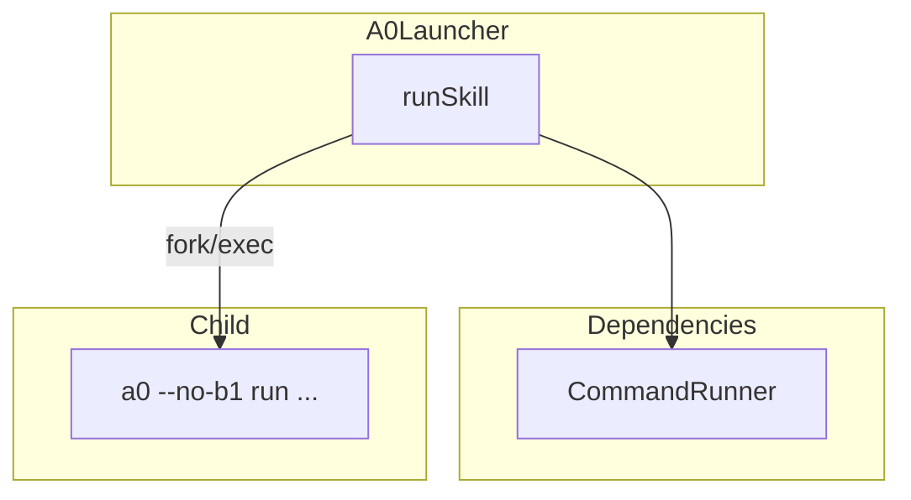
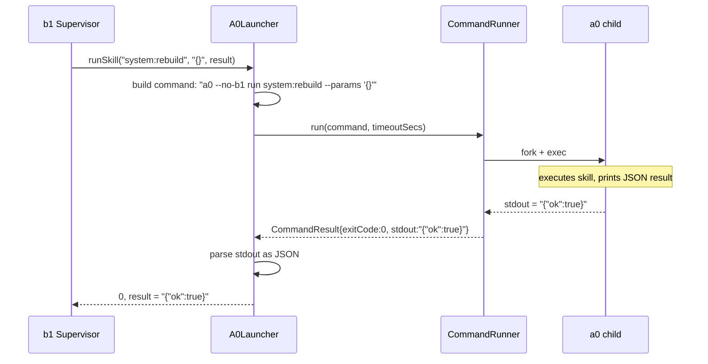

# A0Launcher Spec

## §1. Overview

Invokes a0 as a child process for the self-improvement loop. Wraps `CommandRunner::run()` with a0-specific argument construction (`--no-b1 run <skill> --params <json>`) and JSON result parsing.

**Source files:** `src/b1/a0_launcher.h`, `src/b1/a0_launcher.cpp`

**Dependencies:** `CommandRunner` (executor/command_runner.h), nlohmann/json

**Lifecycle:** Stateless. Constructed once with the a0 binary path; each `runSkill()` call is independent.

## §2. Component Specifications

```cpp
namespace a0::b1 {

class A0Launcher {
public:
    explicit A0Launcher(const std::string& a0Binary);

    int runSkill(const std::string& skill,
                 const std::string& params,
                 std::string& result,
                 int timeoutSeconds = 300);

private:
    std::string m_a0Binary;
};

} // namespace a0::b1
```

| Member | Type | Description |
|--------|------|-------------|
| `m_a0Binary` | `std::string` | Path to the a0 executable (empty → fallback to `"a0"` in PATH) |

## §3. Architecture Diagram



## §4. Data Flow



## §5. Testing Requirements

| Method | Test Case | Input | Expected |
|--------|-----------|-------|----------|
| `runSkill` | a0 exits 0 | Echo script that prints `{"ok":true}` | result = `{"ok":true}`, returns 0 |
| `runSkill` | a0 exits non-zero | Script that exits 1 | Returns -1 |
| `runSkill` | a0 timeout | Script that sleeps 10, timeout=1 | Returns -2 |
| `runSkill` | a0 not found | Binary = "/nonexistent/path" | Returns -1 |
| `runSkill` | Non-JSON stdout | Script that prints "hello" | Returns -1, result = "hello" |
| `runSkill` | Empty binary path | a0Binary = "" | Falls back to "a0" in PATH |

## §6. (skipped — no D3)

## §7. CLI Entry Point

Used by `Supervisor` when a self-improvement trigger fires. The a0 binary path is resolved at startup from `/proc/self/exe` sibling directory and passed to the `A0Launcher` constructor. b1 checks `A0Launcher::runSkill()` return before signalling running a0 instances to restart.

No direct CLI entry — always invoked programmatically.
