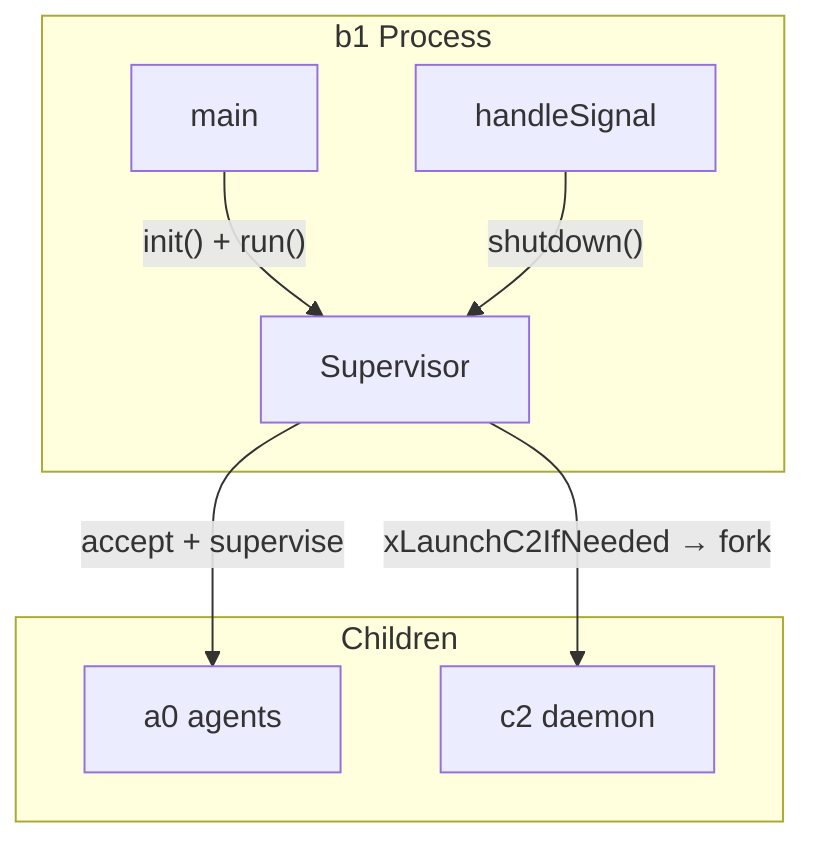
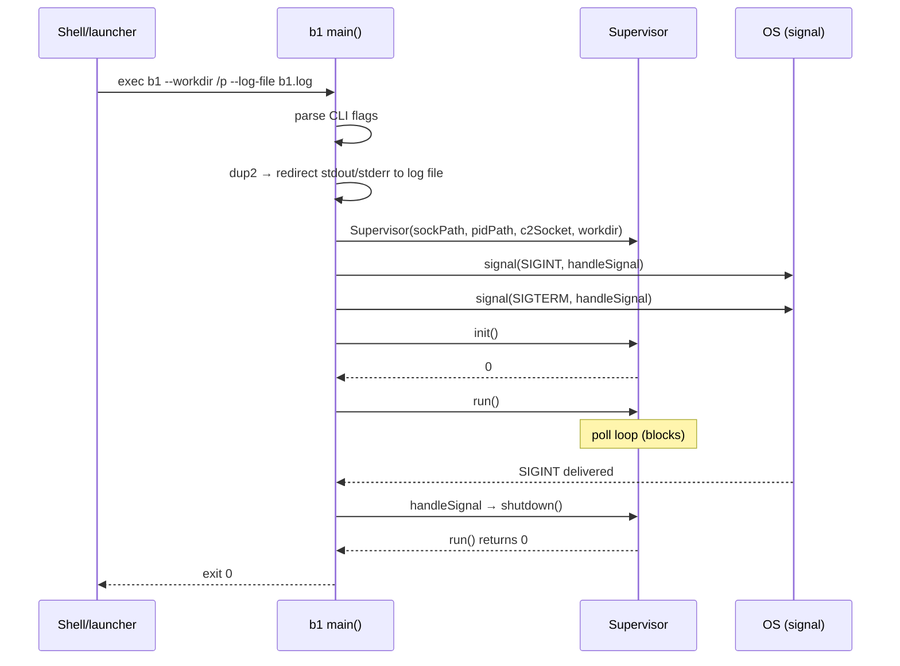

# B1Main Spec

## §1. Overview

Entry point for the b1 supervisor daemon (per-project supervisor). Parses CLI flags, creates a `Supervisor` instance, registers SIGINT/SIGTERM handlers, and blocks on the supervisor event loop.

**Source file:** `src/b1/b1_main.cpp` (headerless — no `.h` file)

**Dependencies:** `supervisor.h`, `<csignal>`, `<fcntl.h>`, `<unistd.h>`

**Lifecycle:** Single invocation: CLI parse → init → run → shutdown → exit. Process terminates when `Supervisor::run()` returns (shutdown requested) or a signal is caught.

## §2. Entry Point

```cpp
namespace { // anonymous

static a0::b1::Supervisor* g_supervisor = nullptr;
extern std::string g_b1LogFile;

static void handleSignal(int sig);  // SIGINT/SIGTERM → g_supervisor->shutdown()

} // anonymous namespace

int main(int argc, char* argv[]);
```

| Function | Role |
|----------|------|
| `main(int argc, char* argv[])` | Parses flags, creates `Supervisor`, calls `init()` + `run()` |
| `handleSignal(int sig)` | Signal handler that calls `Supervisor::shutdown()` to gracefully stop the poll loop |

### CLI Flags

```
b1 --workdir <path> [--a0-dir <path>] [--no-c2] [--c2-socket <path>] [--log-file <path>]
```

| Flag | Default | Description |
|------|---------|-------------|
| `--workdir` | `.` | Working directory to supervise |
| `--a0-dir` | `<workdir>/.a0` | a0 agent state directory (socket + PID files live here) |
| `--no-c2` | — | Skip launching c2 daemon |
| `--c2-socket` | `$XDG_RUNTIME_DIR/a0-c2.sock` | c2 Unix socket path (cleared when `--no-c2` is set) |
| `--log-file` | — | Redirect stdout+stderr to file; child a0 terminals derive own paths from this |
| `--help` | — | Print usage and exit 0 |

### Startup Sequence

1. Parse CLI flags from `argv`
2. Compute socket path (`<a0Dir>/b1.sock`) and PID path (`<a0Dir>/b1.pid`)
3. If `--log-file` specified: `open()` + `dup2(fd, STDOUT_FILENO)` + `dup2(fd, STDERR_FILENO)`
4. Create `Supervisor(sockPath, pidPath, c2Socket, workdir)`
5. Register `SIGINT` and `SIGTERM` → `handleSignal` (which calls `g_supervisor->shutdown()`)
6. `Supervisor::init()` — PID file, clean stale socket, bind, launch c2
7. `Supervisor::run()` — block on poll loop until shutdown

### Error Handling

| Condition | Behaviour |
|-----------|-----------|
| init fails (returns < 0) | Prints `"b1: init failed (rc)"` to stderr, exits 1 |
| Stale socket | Cleaned in init via `xCleanupStaleSocket()` |
| Stale PID file | Overwritten on init |
| Signal received (SIGINT/SIGTERM) | `handleSignal` → `Supervisor::shutdown()` → poll loop exits → `main` returns 0 |

## §3. Architecture Diagram



## §4. Data Flow



## §5. Testing Requirements

| Test Case | Verification |
|-----------|-------------|
| `--help` flag | Prints usage and exits 0 |
| Default workdir | Uses "." when no `--workdir` given |
| `--no-c2` flag | `c2Socket` empty, no c2 launch attempt |
| `--log-file` writes banner | Stderr redirected; file contains `"b1: running"` |
| `--workdir` custom | Supervisor created with the given directory |
| Init failure | If `init()` returns negative, `main` prints error and exits 1 |
| SIGINT shutdown | Signal triggers `shutdown()`, `run()` returns, exit 0 |
| SIGTERM shutdown | Same as SIGINT |

## §6. (skipped — no D3)

## §7. CLI Entry Point

The `b1` executable is the entry point. It is launched automatically by a0 when an a0 instance starts in a working directory and no b1 is already running. The a0 process checks `.a0/b1.pid`, and if stale or missing, fork/execs `b1 --workdir <cwd>`.

Build wiring: `src/b1/CMakeLists.txt` defines `add_executable(b1 b1_main.cpp)` linked against `b1_lib` (supervisor + a0_launcher). Installed to `bin/b1`.
