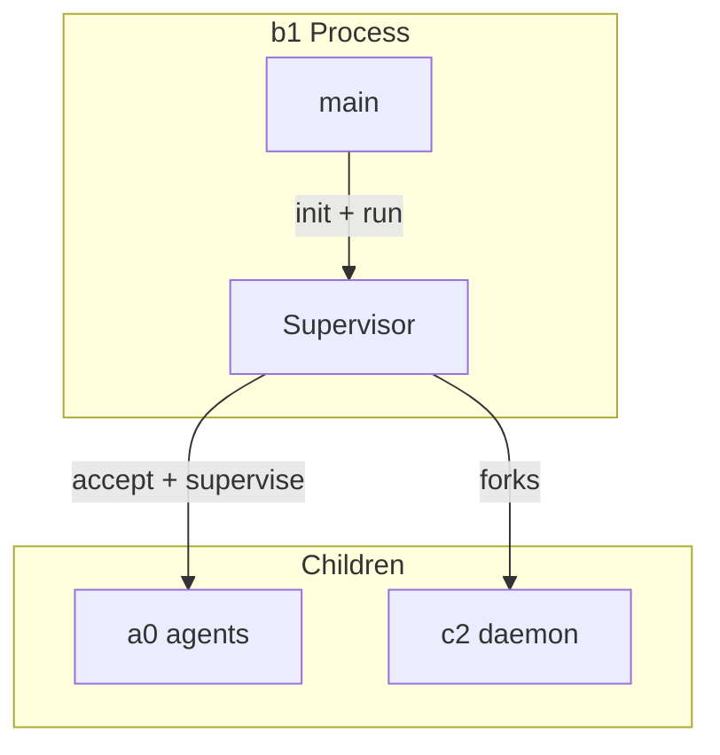

# B1Main Spec

## 1. Overview

Entry point for the b1 supervisor daemon (per-project supervisor). Parses CLI flags, creates a `Supervisor` instance, registers SIGINT/SIGTERM handlers, and blocks on the supervisor event loop.

**Source file:** `src/b1/b1_main.cpp`

**Dependencies:** `supervisor.h`

## 2. Entry Point

```
b1 --workdir <path> [--a0-dir <path>] [--no-c2] [--c2-socket <path>]
```

| Flag | Default | Description |
|------|---------|-------------|
| `--workdir` | `.` | Working directory to supervise |
| `--a0-dir` | `<workdir>/.a0` | a0 agent state directory |
| `--no-c2` | — | Skip launching c2 |
| `--c2-socket` | `$XDG_RUNTIME_DIR/a0-c2.sock` | c2 Unix socket path |

## 3. Architecture



## 4. Startup Sequence

1. Parse CLI flags
2. Compute socket path (`a0Dir + "/b1.sock"`) and PID path (`a0Dir + "/b1.pid"`)
3. Create `Supervisor` with paths
4. Register signal handlers (SIGINT/SIGTERM → `Supervisor::shutdown()`)
5. `Supervisor::init()` — clean stale socket, write PID, bind socket, launch c2
6. `Supervisor::run()` — block on poll loop until shutdown

## 5. Error Handling

| Condition | Behaviour |
|-----------|-----------|
| init fails | Prints error, exits 1 |
| Stale socket | Cleaned in init via xCleanupStaleSocket |
| Stale PID | Overwritten on init |

## 6. Testing Requirements

| Test | Verification |
|------|-------------|
| `--help` flag | Prints usage and exits 0 |
| `--no-c2` flag | Skips c2 launch, runs independently |
| Supervisor init | Writes PID, binds socket |
