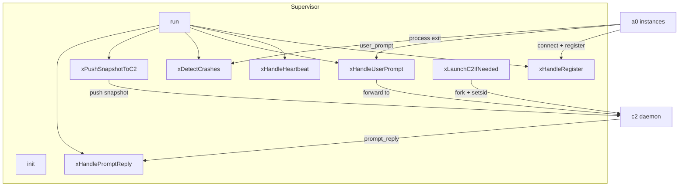
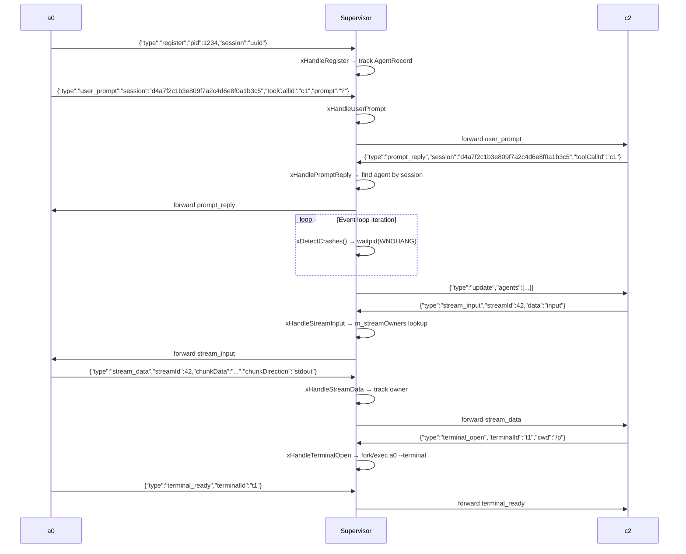

# Supervisor Spec

## 1. Overview

Central class for the b1 supervisor lifecycle. Manages the accept loop over `.a0/b1.sock`, tracks connected a0 instances via PID and socket disconnect, monitors for crashes via `waitpid(WNOHANG)`, pushes periodic snapshots to c2, and forwards `user_prompt` IPC messages upstream and `prompt_reply` IPC messages downstream.

**Dependencies:** `UnixSocket`, `Message` (from `ipc`), `CommandRunner`, POSIX (`poll`, `waitpid`, `kill`, `unlink`)

**Lifecycle:** Short-lived setup (`init`), long-running event loop (`run`), then shutdown.

## 2. Component Specifications

```cpp
namespace a0::b1 {

enum class AgentState { RUNNING, CRASHED, STOPPED };

struct AgentRecord {
    int pid = 0;
    int fd = -1;
    std::string sessionUuid;
    AgentState state = AgentState::RUNNING;
    std::chrono::steady_clock::time_point connectedAt;
    std::chrono::steady_clock::time_point lastHeartbeat;
};

class Supervisor {
public:
    Supervisor(const std::string& socketPath,
               const std::string& pidPath,
               const std::string& c2SocketPath,
               const std::string& workdir);
    ~Supervisor();

    int init();
    int run();
    void shutdown();
    size_t agentCount() const;

private:
    std::string m_socketPath, m_pidPath, m_c2SocketPath, m_workdir;
    ipc::UnixSocket m_listenSocket;
    bool m_running = false;
    std::unordered_map<int, AgentRecord> m_agents;
    int m_c2Fd = -1;
    std::chrono::steady_clock::time_point m_lastC2Push;
    int m_listenFd = -1;
    int m_c2ChildPid = -1;

    int xHandleRegister(const ipc::Message& msg, int peerFd);
    int xHandleHeartbeat(const ipc::Message& msg, int peerPid);
    int xHandleUserPrompt(const ipc::Message& msg, int peerFd);
    int xHandlePromptReply(const ipc::Message& msg);
    int xHandleStreamData(const ipc::Message& msg, int peerFd);
    int xHandleStreamEnd(const ipc::Message& msg, int peerFd);
    int xHandleStreamInput(const ipc::Message& msg);
    int xHandleTerminalOpen(const ipc::Message& msg, int peerFd);
    int xDetectCrashes();
    int xPushSnapshotToC2();
    int xLaunchC2IfNeeded();
    int xSendToC2(const ipc::Message& msg);
    int xSendToAgent(int agentFd, const ipc::Message& msg);
    int xFindAgentFdBySession(const std::string& sessionUuid) const;
    int xFindAgentFdByStream(int64_t streamId) const;
    int xCheckExistingInstance();
    void xCleanupStaleSocket();
    int xWritePidFile();

    // streamId → agent fd mapping for routing STREAM_INPUT
    std::unordered_map<int64_t, int> m_streamOwners;
};

} // namespace a0::b1
```

## 3. Architecture Diagram



## 4. Data Flow



## 5. Terminal Open Handler

`xHandleTerminalOpen` receives a `TERMINAL_OPEN` IPC from c2. It:

1. Resolves the requested `cwd` to an absolute path via `realpath()`
2. Resolves the a0 binary path from `/proc/self/exe` (same directory as b1)
3. Derives child `--log-file` from `g_b1LogFile` if set (`/parent-b1.log` → `/parent-a0.log`)
4. Redirects child stdout/stderr to a session-specific log file at `A0_LOG_DIR/a0-<sessionId>-<childPid>-term.log`, or to `/dev/null` if env vars are unset
5. Forks a child process that:
   - Calls `setsid()` to detach
   - `execlp`s `a0 --a0-dir <cwd>/.a0 [--log-file <path>] terminal --cwd <cwd> [--terminal-id <id>]`

### Shutdown

`shutdown()` kills the c2 child process (`m_c2ChildPid`) with SIGTERM, waits up to 2s, then escalates to SIGKILL. Waits on the pid with `waitpid()` before returning.

### TRACE_LOG instrumentation

Critical relay points include TRACE_LOG calls (enabled via `-DENABLE_TRACE=ON`):
- `xHandleRegister` → `"b1: agent register pid=... session=..."`
- Agent POLLHUP/disconnect → `"b1: agent disconnected pid=..."`
- `xHandleStreamData` → `"b1: relay stream_data streamId=..."`
- `xHandleTerminalOpen` → `"b1: terminal_open cwd=..."`

## 6. Error Handling

| Scenario | Behaviour |
|----------|-----------|
| Another b1 already running for workdir | `xCheckExistingInstance` → `init` returns -3 |
| Socket path already in use | `xCleanupStaleSocket` unlinks before bind |
| PID file write fails | `init` returns -2 |
| poll() returns error | `run` continues (logs error) |
| c2 socket unreachable | `xLaunchC2IfNeeded` fork/execs new c2 via setsid() |
| user_prompt from unknown agent | Forwarded to c2 with pid=0 |
| prompt_reply for unknown session | Logged to stderr, dropped |
| c2 connection lost mid-operation | Next send returns -1 → fd closed, c2 auto-relaunch via `xLaunchC2IfNeeded` |
| --log-file derivation | Child a0 terminal receives derived log path; if parent log is empty, no --log-file passed |
| shutdown with live c2 child | SIGTERM with 2s grace, SIGKILL if still alive, then `waitpid` |

## 7. Testing Requirements

| Method | Test Case | Input | Expected |
|--------|-----------|-------|----------|
| `init` | Writes PID file | Valid path | File exists, matches getpid() |
| `init` | Binds socket | Valid path | Socket file exists |
| `xHandleRegister` | Valid register JSON | `{"type":"register","pid":99}` | AgentRecord created, m_agents size=1 |
| `xHandleUserPrompt` | Valid prompt | `{"type":"user_prompt","session":"s","toolCallId":"c"}` | Forwarded to c2 |
| `xHandlePromptReply` | Known session | `{"type":"prompt_reply","session":"s"}` | Forwarded to agent fd |
| `xHandlePromptReply` | Unknown session | `{"type":"prompt_reply","session":"?"}` | Returns -1 |
| `xFindAgentFdBySession` | Known session | UUID of registered agent | Returns agent fd |
| `xFindAgentFdBySession` | Unknown session | Random UUID | Returns -1 |
| `xDetectCrashes` | No children | — | Returns 0 |
| `agentCount` | One registered | 1 register | Returns 1 |
