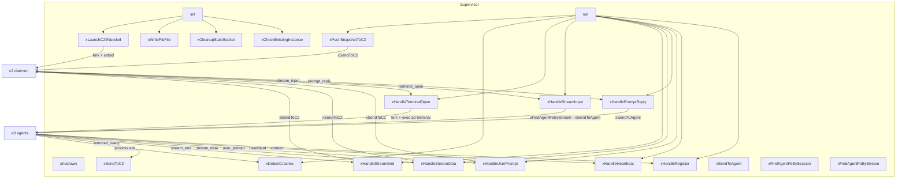
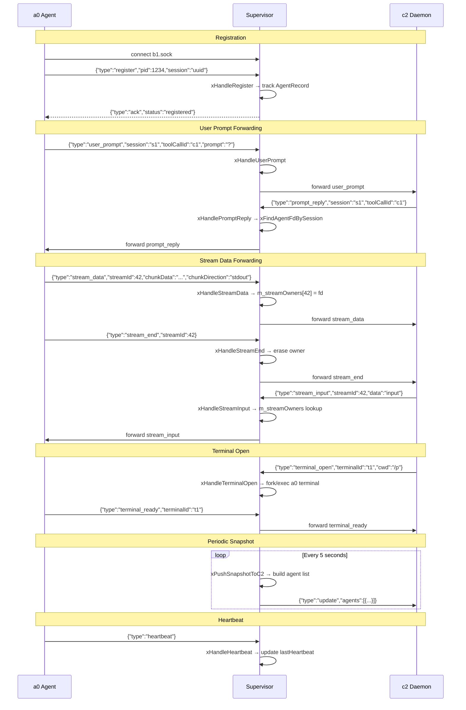

# Supervisor Spec

## §1. Overview

Central class for the b1 supervisor lifecycle. Manages the accept loop over `.a0/b1.sock`, tracks connected a0 instances via PID and socket fd, detects crashes via `waitpid(WNOHANG)`, pushes periodic snapshots to c2, and forwards `user_prompt` IPC messages upstream and `prompt_reply` / `stream_input` messages downstream.

**Source files:** `src/b1/supervisor.h`, `src/b1/supervisor.cpp`

**Dependencies:** `UnixSocket`, `BufferedSocket`, `Message` (from `ipc`), `CommandRunner`, POSIX (`poll`, `waitpid`, `kill`, `unlink`, `fork`, `setsid`, `realpath`), nlohmann/json

**Lifecycle:** Constructed → `init()` (PID file, socket bind, c2 connect/launch) → `run()` (blocking poll loop) → `shutdown()` (close sockets, kill c2 child).

## §2. Component Specifications

```cpp
namespace a0::b1 {

enum class AgentState {
    RUNNING,
    CRASHED,
    STOPPED
};

struct AgentRecord {
    int pid = 0;
    int fd = -1;
    std::string sessionUuid;
    AgentState state = AgentState::RUNNING;
    std::chrono::steady_clock::time_point connectedAt;
    std::chrono::steady_clock::time_point lastHeartbeat;
};

class Supervisor {
public:
    Supervisor(const std::string& socketPath,
               const std::string& pidPath,
               const std::string& c2SocketPath,
               const std::string& workdir);
    ~Supervisor();

    int init();
    int run();
    void shutdown();
    size_t agentCount() const;

private:
    std::string m_socketPath;
    std::string m_pidPath;
    std::string m_c2SocketPath;
    std::string m_workdir;
    ipc::UnixSocket m_listenSocket;
    bool m_running = false;
    std::unordered_map<int, AgentRecord> m_agents;
    std::unordered_map<int, ipc::BufferedSocket> m_agentSockets;
    ipc::BufferedSocket m_c2Socket;
    std::chrono::steady_clock::time_point m_lastC2Push;
    int m_listenFd = -1;
    int m_c2ChildPid = -1;
    std::unordered_map<int64_t, int> m_streamOwners;

    int xHandleRegister(const ipc::Message& msg, int peerFd);
    int xHandleHeartbeat(const ipc::Message& msg, int peerPid);
    int xHandleUserPrompt(const ipc::Message& msg, int peerFd);
    int xHandlePromptReply(const ipc::Message& msg);
    int xHandleStreamData(const ipc::Message& msg, int peerFd);
    int xHandleStreamEnd(const ipc::Message& msg, int peerFd);
    int xHandleStreamInput(const ipc::Message& msg);
    int xHandleTerminalOpen(const ipc::Message& msg, int peerFd);
    int xDetectCrashes();
    int xPushSnapshotToC2();
    int xLaunchC2IfNeeded();
    int xSendToC2(const ipc::Message& msg);
    int xSendToAgent(int agentFd, const ipc::Message& msg);
    int xFindAgentFdBySession(const std::string& sessionUuid) const;
    int xFindAgentFdByStream(int64_t streamId) const;
    int xCheckExistingInstance();
    void xCleanupStaleSocket();
    int xWritePidFile();
};

} // namespace a0::b1
```

### Private Members

| Member | Type | Description |
|--------|------|-------------|
| `m_socketPath` | `std::string` | Path for the b1 Unix domain listening socket |
| `m_pidPath` | `std::string` | Path for the PID file |
| `m_c2SocketPath` | `std::string` | Path to c2's Unix domain socket |
| `m_workdir` | `std::string` | Working directory under supervision |
| `m_listenSocket` | `ipc::UnixSocket` | Bound listening socket for a0 connections |
| `m_running` | `bool` | Flag controlling the poll loop |
| `m_agents` | `unordered_map<int, AgentRecord>` | Peer fd → agent record |
| `m_agentSockets` | `unordered_map<int, BufferedSocket>` | Peer fd → buffered socket reader |
| `m_c2Socket` | `ipc::BufferedSocket` | Persistent buffered connection to c2 |
| `m_lastC2Push` | `steady_clock::time_point` | Timestamp of last snapshot push to c2 |
| `m_listenFd` | `int` | Raw fd of the listening socket |
| `m_c2ChildPid` | `int` | PID of forked c2 child (-1 if none) |
| `m_streamOwners` | `unordered_map<int64_t, int>` | Stream ID → agent fd for STREAM_INPUT routing |

### Private x Helpers

| Method | Signature | Purpose |
|--------|-----------|---------|
| `xHandleRegister` | `(const ipc::Message& msg, int peerFd) → int` | Handle agent REGISTER: record pid/session, send ACK |
| `xHandleHeartbeat` | `(const ipc::Message& msg, int peerPid) → int` | Update lastHeartbeat for an agent |
| `xHandleUserPrompt` | `(const ipc::Message& msg, int peerFd) → int` | Forward USER_PROMPT from agent to c2 |
| `xHandlePromptReply` | `(const ipc::Message& msg) → int` | Forward PROMPT_REPLY from c2 to agent by session |
| `xHandleStreamData` | `(const ipc::Message& msg, int peerFd) → int` | Track stream owner and forward STREAM_DATA to c2 |
| `xHandleStreamEnd` | `(const ipc::Message& msg, int peerFd) → int` | Erase stream owner and forward STREAM_END to c2 |
| `xHandleStreamInput` | `(const ipc::Message& msg) → int` | Route STREAM_INPUT from c2 to agent by stream owner |
| `xHandleTerminalOpen` | `(const ipc::Message& msg, int peerFd) → int` | Fork/exec `a0 terminal` in requested cwd |
| `xDetectCrashes` | `() → int` | `waitpid(WNOHANG)` on all tracked agent PIDs; returns crash count |
| `xPushSnapshotToC2` | `() → int` | Send UPDATE message with agent snapshot to c2 |
| `xLaunchC2IfNeeded` | `() → int` | Connect to c2; if unreachable, fork/exec c2 and retry |
| `xSendToC2` | `(const ipc::Message& msg) → int` | Send message to c2; close socket on failure |
| `xSendToAgent` | `(int agentFd, const ipc::Message& msg) → int` | Send message to an agent via raw UnixSocket |
| `xFindAgentFdBySession` | `(const std::string& sessionUuid) → int` | Lookup agent fd by session UUID |
| `xFindAgentFdByStream` | `(int64_t streamId) → int` | Lookup agent fd by stream ID |
| `xCheckExistingInstance` | `() → int` | Read PID file; return -1 if another b1 is alive |
| `xCleanupStaleSocket` | `()` | Unlink socket path before bind |
| `xWritePidFile` | `() → int` | Write current PID to pidPath |

## §3. Architecture Diagram



## §4. Data Flow



## §5. Testing Requirements

| Method | Test Case | Input | Expected |
|--------|-----------|-------|----------|
| `init` | Writes PID file | Valid path | File exists, content matches getpid() |
| `init` | Binds socket | Valid path | Socket file exists |
| `init` | Stale socket cleaned | Existing socket file at m_socketPath | Socket unlinked before bind |
| `init` | Existing instance blocked | Live b1 pid in pidPath | Returns -3 |
| `run` | Accept loop accepts connection | Connect to listening socket | New AgentRecord appears in m_agents |
| `run` | Agent disconnect detected | Close peer socket | AgentRecord removed from m_agents |
| `shutdown` | Closes all agent connections | 3 registered agents | m_agents.empty(), m_agentSockets.empty() |
| `shutdown` | Kills c2 child | c2 child alive (m_c2ChildPid > 0) | c2 process terminated |
| `agentCount` | Zero agents | — | Returns 0 |
| `agentCount` | One registered agent | 1 register | Returns 1 |
| `xHandleRegister` | Valid register | `msg.pid=99, msg.sessionUuid="s1"` | AgentRecord created, pid=99, sessionUuid="s1" |
| `xHandleHeartbeat` | Known agent | msg on known peerFd | lastHeartbeat updated |
| `xHandleHeartbeat` | Unknown agent | msg on unknown peerFd | Returns -1 |
| `xHandleUserPrompt` | c2 connected | Valid prompt message | Forwarded to c2 socket |
| `xHandleUserPrompt` | c2 disconnected | c2Socket.fd() < 0 | Returns -1 |
| `xHandlePromptReply` | Known session | msg.sessionUuid matches registered agent | Forwarded to agent fd |
| `xHandlePromptReply` | Unknown session | Random UUID | Returns -1, logged to stderr |
| `xHandleStreamData` | Stream data | msg.streamId=42 | Owner recorded, forwarded to c2 |
| `xHandleStreamEnd` | End stream | msg.streamId=42 | Owner erased, forwarded to c2 |
| `xHandleStreamInput` | Known stream | msg.streamId=42, owner exists | Forwarded to agent fd |
| `xHandleStreamInput` | Unknown stream | msg.streamId=99, no owner | Returns -1 |
| `xHandleTerminalOpen` | Fork success | Valid cwd + terminalId | Child process launched, returns 0 |
| `xDetectCrashes` | No children | — | Returns 0 |
| `xDetectCrashes` | Crashed child | Fork + kill child | Returns 1, state=CRASHED |
| `xPushSnapshotToC2` | c2 connected | 2 registered agents | UPDATE message sent with agents array size 2 |
| `xPushSnapshotToC2` | c2 disconnected | c2Socket closed | Returns -1 |
| `xFindAgentFdBySession` | Known session | UUID of registered agent | Returns peer fd |
| `xFindAgentFdBySession` | Unknown session | Random UUID | Returns -1 |
| `xFindAgentFdByStream` | Known stream | streamId of tracked owner | Returns peer fd |
| `xFindAgentFdByStream` | Unknown stream | Random streamId | Returns -1 |
| `xLaunchC2IfNeeded` | c2 alive | Connect to existing c2 socket | Returns 0, m_c2Socket connected |
| `xLaunchC2IfNeeded` | c2 stale | No c2 at socket path | fork/exec c2, retry connect, returns 0 |
| `xCheckExistingInstance` | No PID file | m_pidPath doesn't exist | Returns 0 |
| `xCheckExistingInstance` | Stale PID | PID file but process dead | Returns 0 |
| `xCheckExistingInstance` | Live instance | PID file + process alive | Returns -1 |
| `xWritePidFile` | Write success | Valid path | File written, contains getpid() |
| `xWritePidFile` | Write failure | Invalid path | Returns -1 |

## §6. (skipped — no D3)

## §7. CLI Entry Point

The `Supervisor` class is created and managed by `b1_main.cpp`. `main()` instantiates `Supervisor` with paths derived from CLI flags:

```cpp
Supervisor supervisor(sockPath, pidPath, c2Socket, workdir);
g_supervisor = &supervisor;
supervisor.init();
supervisor.run();
```

The `SIGINT`/`SIGTERM` signal handler calls `supervisor.shutdown()`, which causes `run()` to return and the process to exit cleanly.

Build wiring: `supervisor.cpp` is compiled as part of `b1_lib` (static library) in `src/b1/CMakeLists.txt`. The `b1` executable links `b1_lib`.
