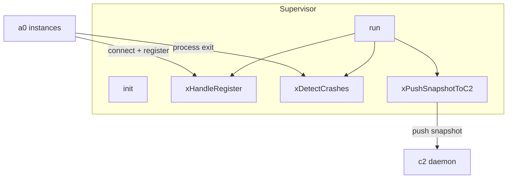
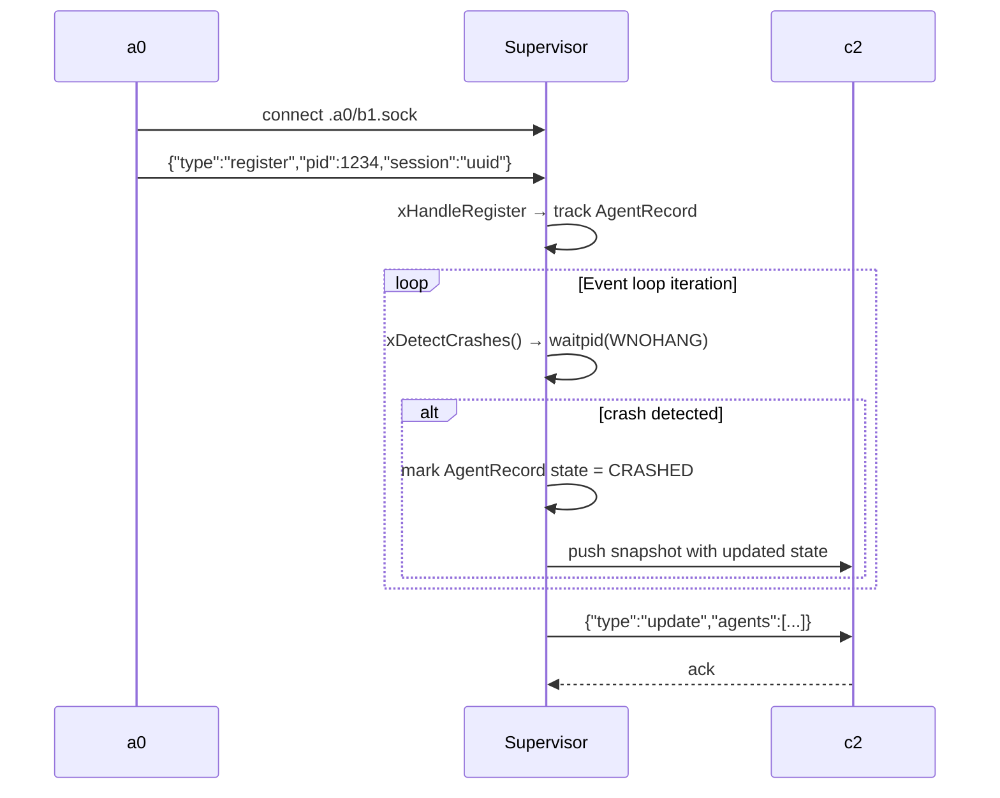

# Supervisor Spec

## 1. Overview

Central class for the b1 supervisor lifecycle. Manages the accept loop over `.a0/b1.sock`, tracks connected a0 instances via PID and socket disconnect, monitors for crashes via `waitpid(WNOHANG)`, and pushes periodic snapshots to c2.

**Dependencies:** `UnixSocket`, `Message` (from `ipc`), `CommandRunner`, POSIX (`poll`, `waitpid`, `kill`, `unlink`)

**Lifecycle:** Short-lived setup (`init`), long-running event loop (`run`), then shutdown.

## 2. Component Specifications

```cpp
namespace a0::b1 {

class Supervisor {
public:
    Supervisor(const std::string& socketPath,
               const std::string& pidPath,
               const std::string& c2SocketPath,
               const std::string& workdir);
    ~Supervisor();

    int init();
    int run();
    void shutdown();
    size_t agentCount() const;

private:
    int m_listenFd;
    std::string m_socketPath;
    std::string m_pidPath;
    std::string m_c2SocketPath;
    std::string m_workdir;
    bool m_running;
    std::unordered_map<int, AgentRecord> m_agents;
    int m_c2Fd;
    std::chrono::steady_clock::time_point m_lastC2Push;

    int xHandleRegister(const nlohmann::json& msg, int peerPid);
    int xHandleHeartbeat(const nlohmann::json& msg, int peerPid);
    int xDetectCrashes();
    int xPushSnapshotToC2();
    int xLaunchC2IfNeeded();
    void xCleanupStaleSocket();
    int xWritePidFile();
};

} // namespace a0::b1
```

## 3. Architecture Diagram



**Caption:** `run()` is a poll(2) event loop that dispatches to handlers. Registration, crash detection, and c2 snapshot push happen on each iteration.

## 4. Data Flow



## 5. Error Handling

| Scenario | Behaviour |
|----------|-----------|
| Socket path already in use | `xCleanupStaleSocket` unlinks before bind |
| PID file write fails | `init` returns -2 |
| poll() returns error | `run` continues (logs error) |
| c2 socket unreachable | `xLaunchC2IfNeeded` fork/execs new c2 |
| Register from unknown PID | Treated as new agent record |
| waitpid returns -1 (ECHILD) | No tracked children have exited |

## 6. Edge Cases

| Case | Expected Result |
|------|----------------|
| No a0 instances connected | Poll loop idles, no c2 push (or pushes empty list) |
| Two a0 instances with same PID (impossible) | Last register overwrites previous |
| Supervisor killed with SIGKILL | Stale socket left; next startup calls xCleanupStaleSocket |
| c2 crashes after successful registration | Next xPushSnapshotToC2 detects failure, relauches c2 |
| Multiple rapid register/disconnect cycles | Handled one per poll iteration |

## 7. Testing Requirements

| Method | Test Case | Input | Expected |
|--------|-----------|-------|----------|
| `init` | Writes PID file | Valid path | File exists, matches getpid() |
| `init` | Binds socket | Valid path | Socket file exists, mode S_IFSOCK |
| `run` | Accepts connection | Connect from client | Calls xHandleRegister |
| `xHandleRegister` | Valid register JSON | `{"type":"register","pid":99}` | AgentRecord created, m_agents size=1 |
| `xHandleRegister` | Missing pid field | `{"type":"register"}` | Returns -1, no record created |
| `xDetectCrashes` | No children | — | Returns 0, no state changes |
| `xDetectCrashes` | Child exited | Fork+exit child | Returns PID of exited child |
| `agentCount` | One registered agent | 1 register | Returns 1 |
| `agentCount` | No agents | — | Returns 0 |

## 8. Integration

Supervisor is owned by `b1_main.cpp`. It is constructed with paths derived from the working directory and CLI arguments. When `--no-c2` is set, `xLaunchC2IfNeeded` is skipped and `m_c2Fd` stays -1.
