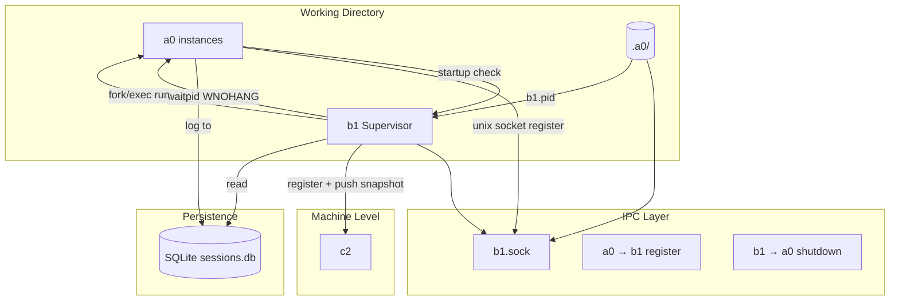
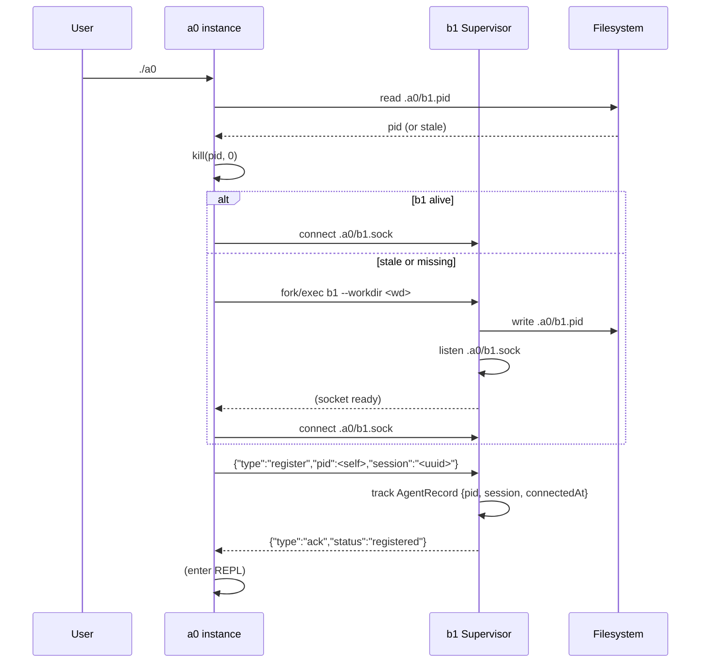
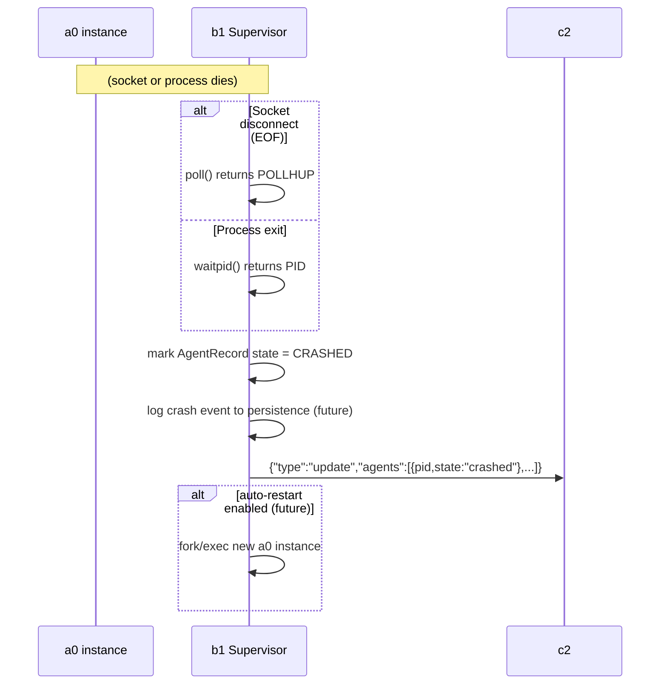
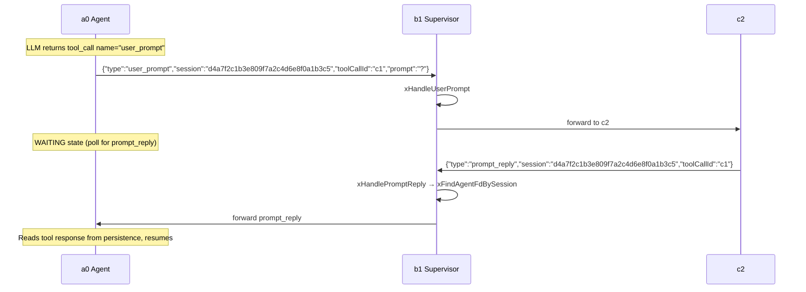
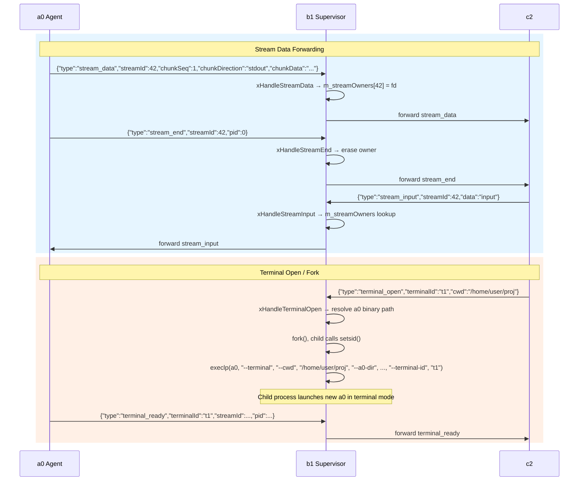
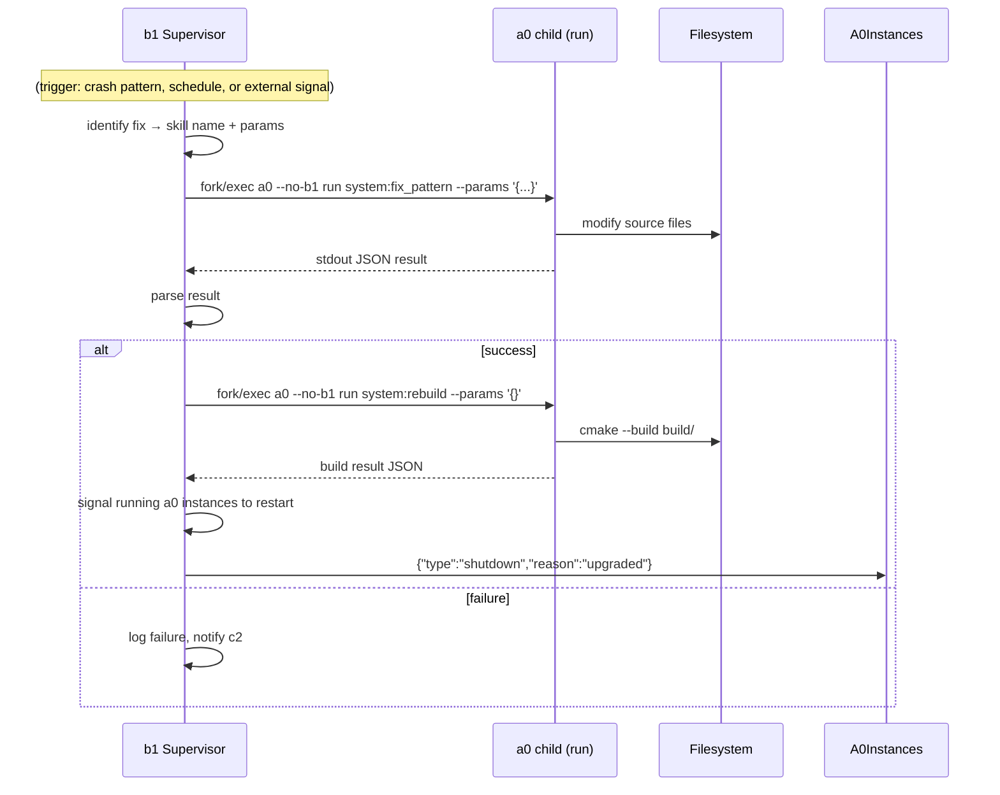
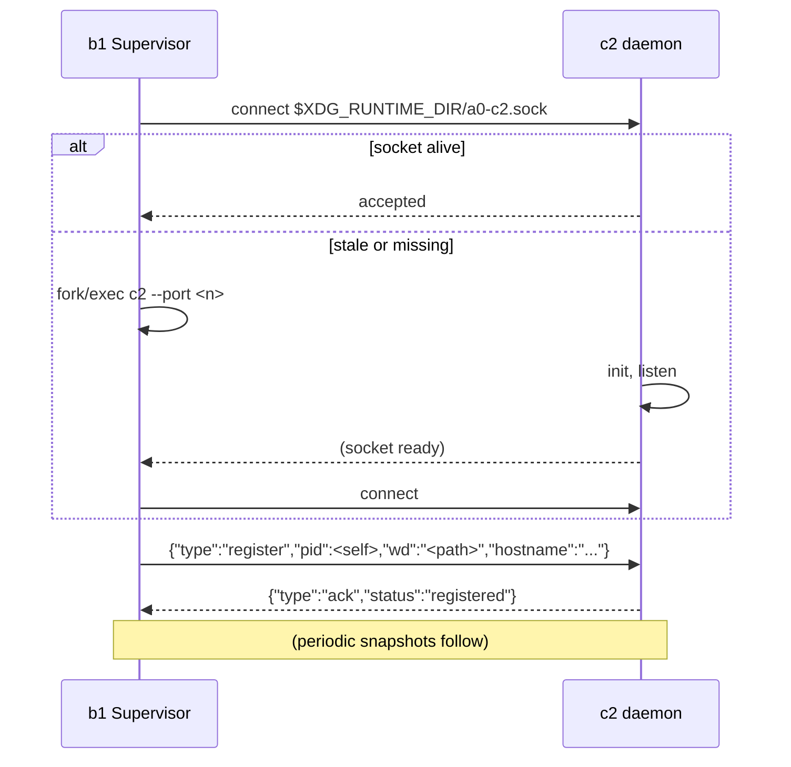

# Technical Specification: b1 Agent Supervisor Sub-Module

## For a0 Agent — Version 1.0

---

## 1. Overview

This document specifies a **b1 agent supervisor sub-module** for the existing a0 C++17 agent. The sub-module builds a standalone executable (`b1`) and the supporting IPC infrastructure.

**Purpose**: b1 is a per-working-directory daemon that supervises a0 agent instances running in that directory. It detects a0 crashes, reports status to the machine-level c2 monitor, and orchestrates the self-improvement loop (using a0 to modify a0).

**Key behaviors**:

- **One instance per working directory** — identified by `.a0/b1.pid` and `.a0/b1.sock`
- **a0 auto-discovery** — when an a0 starts in a working directory, it checks for b1 and starts one if missing
- **Crash detection** — b1 tracks connected a0 PIDs via `waitpid(WNOHANG)`; disconnect from the Unix socket is an immediate crash signal
- **c2 registration** — b1 connects to the machine-level c2 daemon on startup
- **Self-improvement** — b1 invokes `a0 run` as a child process to execute build/modification skills, then signals running a0 instances to restart
- **Bidirectional IPC** — b1 monitors the c2 socket for incoming messages (prompt_reply from user responses) and forwards them to the correct a0 agent, enabling user prompt routing through the c2 web UI
- **Binary path resolution** — b1 resolves its own path via `readlink("/proc/self/exe")` to find `c2` in the same directory; no PATH dependency. Uses `setsid()` in fork to detach c2 from the terminal process group
- **`--no-c2` flag** — disables automatic c2 launch; run c2 independently if desired

---

## 2. Component Specifications (C++ Interfaces)

All new classes are defined in the `a0::b1` namespace, declared in `src/b1/`.

### 2.1 Core Data Structures

```cpp
#pragma once

#include <string>
#include <vector>
#include <chrono>
#include <cstdint>
#include <functional>
#include <unordered_map>
#include "nlohmann/json.hpp"

namespace a0::b1 {

/// Runtime state of a supervised a0 instance.
enum class AgentState {
    RUNNING,
    CRASHED,
    STOPPED
};

/// Descriptor for a supervised a0 instance.
struct AgentRecord {
    int pid = 0;                          // Process ID of the a0 instance
    int fd = -1;                          // Peer socket fd (key in m_agents)
    std::string sessionUuid;              // Session UUID the agent reported
    AgentState state = AgentState::RUNNING;
    std::chrono::steady_clock::time_point connectedAt;
    std::chrono::steady_clock::time_point lastHeartbeat;
};

/// Summary snapshot sent to c2.
struct SupervisorSnapshot {
    int pid;
    std::string workdir;
    std::vector<AgentRecord> agents;
    int64_t uptimeSeconds;
};

} // namespace a0::b1
```

### 2.2 Supervisor

```cpp
namespace a0::b1 {

/// Central class for the b1 supervisor lifecycle.
/// Manages the accept loop, agent tracking, crash detection, and c2 reporting.
class Supervisor {
public:
    /// \param socketPath  Path for the Unix domain socket (e.g., ".a0/b1.sock").
    /// \param pidPath     Path for the PID file (e.g., ".a0/b1.pid").
    /// \param c2SocketPath Path to c2's Unix domain socket.
    /// \param workdir     The working directory this b1 supervises.
    Supervisor(const std::string& socketPath,
               const std::string& pidPath,
               const std::string& c2SocketPath,
               const std::string& workdir);

    virtual ~Supervisor();

    /// Check existing instance, write PID file, create + bind socket, connect to c2 (or launch it).
    /// \retval 0  Initialized successfully.
    /// \retval -1  Socket bind failed.
    /// \retval -2  PID file write failed.
    /// \retval -3  Another b1 instance already running for this workdir.
    /// \retval -3  Another b1 instance already running for this workdir.
    int init();

    /// Main event loop. Uses poll(2) on the listening socket and the c2 socket.
    /// On each iteration:
    ///   - Accept new a0 connections (recv register JSON).
    ///   - Detect disconnected peers (EOF on existing connections) → mark crashed.
    ///   - Receive messages from c2 (prompt_reply) and forward to the correct a0.
    ///   - Receive messages from a0 (user_prompt) and forward to c2.
    ///   - waitpid(WNOHANG) for child a0 processes → update state.
    ///   - Periodically push snapshot to c2.
    /// Blocks forever. Only returns on fatal error.
    /// \retval 0  Normal shutdown requested via socket.
    /// \retval -1  Fatal error.
    int run();

    /// Request graceful shutdown. Wakes the poll loop.
    void shutdown();

    /// Number of currently supervised a0 instances.
    size_t agentCount() const;

private:
    std::string m_socketPath;
    std::string m_pidPath;
    std::string m_c2SocketPath;
    std::string m_workdir;
    ipc::UnixSocket m_listenSocket;
    bool m_running = false;
    std::unordered_map<int, AgentRecord> m_agents;  // keyed by peer fd
    int m_c2Fd = -1;                     // -1 if not connected
    std::chrono::steady_clock::time_point m_lastC2Push;
    int m_listenFd = -1;
    int m_c2ChildPid = -1;               // PID of forked c2 child

    int xHandleRegister(const ipc::Message& msg, int peerFd);
    int xHandleHeartbeat(const ipc::Message& msg, int peerPid);
    int xHandleUserPrompt(const ipc::Message& msg, int peerFd);
    int xHandlePromptReply(const ipc::Message& msg);
    int xHandleStreamData(const ipc::Message& msg, int peerFd);
    int xHandleStreamEnd(const ipc::Message& msg, int peerFd);
    int xHandleStreamInput(const ipc::Message& msg);
    int xHandleTerminalOpen(const ipc::Message& msg, int peerFd);
    int xDetectCrashes();
    int xPushSnapshotToC2();
    int xLaunchC2IfNeeded();
    int xSendToC2(const ipc::Message& msg);
    int xSendToAgent(int agentFd, const ipc::Message& msg);
    int xFindAgentFdBySession(const std::string& sessionUuid) const;
    int xFindAgentFdByStream(int64_t streamId) const;
    int xCheckExistingInstance();
    void xCleanupStaleSocket();
    int xWritePidFile();

    // streamId → agent fd mapping for routing STREAM_INPUT
    std::unordered_map<int64_t, int> m_streamOwners;
};

} // namespace a0::b1
```

### 2.3 A0Launcher

```cpp
namespace a0::b1 {

/// Invokes a0 as a child process for the self-improvement loop.
/// Uses CommandRunner internally for fork/exec.
class A0Launcher {
public:
    /// \param a0Binary  Path to the a0 executable (argv[0] discovery).
    explicit A0Launcher(const std::string& a0Binary);

    /// Run a0 in non-interactive mode.
    /// \param skill    Qualified skill name (e.g., "system:rebuild").
    /// \param params   JSON params string.
    /// \param[out] result  stdout captured from a0.
    /// \param timeoutSeconds  Max execution time (default 300).
    /// \retval 0  a0 exited with code 0, result populated.
    /// \retval -1 a0 exited with non-zero code.
    /// \retval -2 Timeout.
    int runSkill(const std::string& skill,
                 const std::string& params,
                 std::string& result,
                 int timeoutSeconds = 300);

private:
    std::string m_a0Binary;
};

} // namespace a0::b1
```

---

## 3. System Architecture (C4 Diagram)



**Caption**: b1 runs one instance per working directory, identified by `.a0/b1.pid`. a0 instances connect to `.a0/b1.sock` on startup. b1 monitors them via `waitpid` and socket disconnect detection. b1 communicates with c2 for machine-level aggregation and invokes a0 as a child for the self-improvement loop.

---

## 4. Data Flow Diagrams

### 4.1 a0 Startup and Registration



### 4.2 Crash Detection



### 4.3 User Prompt Forwarding



### 4.4 Streaming and Terminal IPC



### 4.5 Self-Improvement Loop



### 4.4 b1 to c2 Registration



---

## 5. Configuration & CLI Extensions

### 5.1 b1 CLI

```
b1 --workdir <path> [--no-c2] [--c2-socket <path>]
```

| Flag | Default | Description |
|------|---------|-------------|
| `--workdir` | *(required)* | Working directory to supervise |
| `--no-c2` | `false` | Skip c2 launch and registration |
| `--c2-socket` | `$XDG_RUNTIME_DIR/a0-c2.sock` | c2 socket path |

### 5.2 a0 CLI Additions

| Flag | Default | Description |
|------|---------|-------------|
| `--a0-dir <path>` | `./.a0` | Root directory for non-committed agent artifacts. b1 socket/pid and SQLite DB resolve under this path. Auto-created on startup |
| `run <skill>` | — | Non-interactive mode: execute qualified skill, print JSON result, exit |
| `--params <json>` | `{}` | JSON params for `run` subcommand |
| `--no-b1` | `false` | Skip b1 launch check and socket registration |
| `--kill-all` | `false` | On exit (or standalone): send SIGTERM to b1 and c2, unlink sockets |

### 5.3 Environment Variables

| Variable | Used by | Description |
|----------|---------|-------------|
| `A0_DIR` | a0, b1 | Override default `.a0/` root path (overridden by `--a0-dir`) |
| `A0_B1_SOCKET` | a0, b1 | Override `.a0/b1.sock` path |
| `A0_C2_SOCKET` | b1, c2 | Override c2 socket path |
| `XDG_RUNTIME_DIR` | b1, c2 | Base for c2 socket path |

---

## 6. Testing Requirements

### 6.1 Unit Tests

| Class | Test Case | Verification |
|-------|-----------|-------------|
| `Supervisor` | init writes PID file | File exists at pidPath, content matches getpid() |
| `Supervisor` | init binds socket | Socket file exists at socketPath, listening |
| `Supervisor` | agent registration via socket | Send JSON register → AgentRecord appears in m_agents |
| `Supervisor` | agent disconnect detection | Close peer socket → Supervisor detects POLLHUP, state = CRASHED |
| `Supervisor` | waitpid crash detection | Fork child, kill it → Supervisor detects exit via waitpid |
| `Supervisor` | duplicate PID rejection | Register same PID twice → second is ignored or updates |
| `A0Launcher` | runSkill success | `a0 --no-b1 run <skill>` exits 0, result captured |
| `A0Launcher` | runSkill timeout | Child exceeds timeout → -2 returned, child killed |
| `A0Launcher` | runSkill non-zero exit | Child exits 1 → -1 returned |

### 6.2 Integration Tests

| ID | Scenario | Steps | Expected |
|----|----------|-------|----------|
| INT‑B1‑01 | a0 starts b1 automatically | Run `a0` in a clean directory | `.a0/b1.pid` created, `.a0/b1.sock` listening |
| INT‑B1‑02 | a0 reuses existing b1 | Run second `a0` in same directory | Connects to existing b1, no new b1 process |
| INT‑B1‑03 | a0 crash detected by b1 | Run `a0`, kill -9 its PID | b1 detects crash, state updated |
| INT‑B1‑04 | --no-b1 disables launch | Run `a0 --no-b1` | No b1 process started, no socket |
| INT‑B1‑05 | --kill-all cleans up | Run `a0 --kill-all` | b1 process dead, socket unlinked |
| INT‑B1‑06 | b1 registers with c2 | Start `b1`, verify c2 registration | c2 receives register message |
| INT‑B1‑07 | Self-improvement loop | b1 invokes `a0 run system:rebuild` | Build succeeds, existing a0 instances notified |

### 6.3 Error Handling / Edge Cases

| Scenario | Behaviour |
|----------|-----------|
| c2 socket unreachable | `xLaunchC2IfNeeded` fork/execs new c2 via setsid(); `m_c2ChildPid` tracks the child |
| c2 connection lost mid-operation | Next send returns -1 → fd closed, c2 auto-relaunch via `xLaunchC2IfNeeded` |
| user_prompt from unknown agent | Forwarded to c2 with pid=0 |
| prompt_reply for unknown session | Logged to stderr, dropped |
| --log-file derivation | Child a0 terminal receives derived log path; if parent log is empty, no --log-file passed |
| Terminal child redirect | Child stdout/stderr sent to `A0_LOG_DIR/a0-<sessionId>-<childPid>-term.log` or `/dev/null` if unset |
| shutdown with live c2 child | SIGTERM with 2s grace, SIGKILL if still alive, then `waitpid` on `m_c2ChildPid` |

### 6.4 Mocking

All socket tests use a loopback Unix socket pair (socketpair(AF_UNIX)). No real a0 binary is needed — a mock echo script acts as the child. The `A0Launcher` tests use a minimal shell script as the "a0" binary.

---

## 7. Integration with Existing Main Specification

### 7.1 a0 Changes (`src/main.cpp`)

1. **Parsing**: Add `--a0-dir`, `run` subcommand, `--params`, `--no-b1`, `--kill-all` to existing argument parser.
2. **`.a0/` initialization**: Call `ensureA0Dir(a0Dir)` after flag parsing. Creates the directory if missing; on first creation, appends `.a0/` to `.gitignore` if CWD is a git repo. All b1 paths resolve under `a0Dir`.
3. **Early exit** (`--kill-all` without `run` subcommand): Read `a0Dir/b1.pid`, send SIGTERM (2s grace), then SIGKILL. Unlink `a0Dir/b1.sock`. Read c2 PID, same sequence. Exit 0.
4. **Component init** (unchanged): All existing components initialize as before.
5. **Post-init** (if not `--no-b1` and not `run` subcommand): 
   - Read `a0Dir/b1.pid`. If process alive → connect. If stale → remove socket, fork/exec `b1 --workdir <cwd>`, poll for socket readiness (exponential backoff, max 5s), then connect.
   - Send `{"type":"register","pid":<getpid()>,"session":"<sessionUuid>"}`.
   - Registration is fire-and-forget — disconnect detection handles crash monitoring.
6. **`run` subcommand**: Skip b1 init entirely. Resolve skill, execute via `DefaultAgentCore::processGoal()` (or new `runSkill()` method), print JSON result to stdout. Exit. If `--kill-all` also set, clean up b1/c2 before exit.
7. **REPL loop**: Existing behavior. On loop exit, if `--kill-all`, run cleanup.

### 7.2 Build System

`src/b1/CMakeLists.txt`:
```cmake
add_library(b1_lib STATIC
    supervisor.cpp
    a0_launcher.cpp
)
target_include_directories(b1_lib PUBLIC ${CMAKE_CURRENT_SOURCE_DIR})
target_link_libraries(b1_lib PUBLIC ipc_lib cmd_runner_lib nlohmann_json::nlohmann_json)

add_executable(b1 b1_main.cpp)
target_link_libraries(b1 PRIVATE b1_lib)
install(TARGETS b1 RUNTIME DESTINATION bin)
```

`a0_lib` gains new source files for b1 registration logic. `a0` executable links `ipc_lib` and `b1_lib`.

### 7.3 IPC Library (`src/ipc/`)

The shared `ipc_lib` is defined in a separate spec (the next section's companion file in `src/ipc/`). It provides:

- `UnixSocket::create()` / `bind()` / `listen()` / `accept()` / `connect()`
- `UnixSocket::send()` / `recv()` — framed JSON-line messages with timeouts
- `Message` type — parse/serialize `{"type":"...", ...}` JSON objects

Both b1 and c2 depend on this library.

---

## 8. Implementation Outline

### Phase 1: IPC Library

- Implement `UnixSocket` class wrapping all socket operations
- Implement JSON-line message framing (recv until `\n`, send with `\n`)
- Define message types as constants + serialize/deserialize helpers
- Unit tests with `socketpair()`

### Phase 2: Supervisor Core

- Implement `Supervisor::init()` — PID file, socket bind, c2 connect/launch
- Implement `Supervisor::run()` — poll loop, accept, recv, dispatch to handlers
- Implement `xHandleRegister()` — agent tracking
- Implement `xDetectCrashes()` — waitpid WNOHANG
- Unit tests for each handler

### Phase 3: a0 Integration

- Add `run` subcommand, `--params`, `--no-b1`, `--kill-all` to `main.cpp` argument parser
- Implement b1 startup check + registration in post-init
- Implement `--kill-all` cleanup logic
- Add non-interactive execution path for `run` subcommand in `DefaultAgentCore`
- Integration tests with mock b1 binary

### Phase 4: A0Launcher

- Implement `A0Launcher` using `CommandRunner`
- Integrate with self-improvement trigger points in `Supervisor`
- Unit tests with mock a0 script

### Phase 5: Testing

- Full unit test suite for all new classes
- Integration tests: a0 + b1 interaction, crash detection, --kill-all
- Socket-level stress tests (concurrent a0 registrations, rapid connect/disconnect)

---

## 9. Future Extensions

- **Auto-restart**: b1 automatically re-launches crashed a0 instances
- **Resource limits**: b1 enforces CPU/memory limits on a0 instances
- **Multiple socket protocols**: versioned message types for future extensions
- **Crash log aggregation**: b1 reads a0's persistence logs and reports crash context
- **Graceful degradation**: if c2 is unreachable, b1 operates in standalone mode with retry
