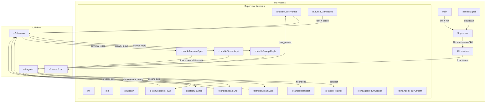
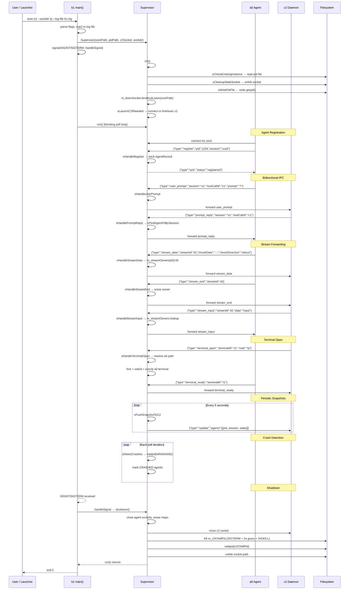

# Technical Specification: b1 Agent Supervisor Sub-Module

## Version 1.0

---

## §1. Overview

This document specifies the **b1 agent supervisor sub-module** for the a0 C++17 agent system. The sub-module builds a standalone executable (`b1`) with supporting IPC infrastructure.

**Purpose:** b1 is a per-working-directory daemon that supervises a0 agent instances running in that directory. It detects a0 crashes, reports status to the machine-level c2 monitor, and orchestrates bidirectional IPC between agents and c2.

**Key behaviors:**
- **One instance per working directory** — identified by `.a0/b1.pid` and `.a0/b1.sock`
- **a0 auto-discovery** — when an a0 starts in a working directory, it checks for b1 and starts one if missing
- **Crash detection** — b1 tracks connected a0 PIDs via `waitpid(WNOHANG)`; socket disconnect is an immediate crash signal
- **c2 registration** — b1 connects to the machine-level c2 daemon on startup, auto-launching it via `fork`+`setsid` if unreachable
- **Terminal spawning** — on c2 request (`terminal_open`), b1 fork/execs `a0 terminal` in the requested cwd
- **Bidirectional IPC** — b1 relays `user_prompt` from agents to c2, and `prompt_reply`/`stream_input` from c2 to the correct agent
- **Stream forwarding** — `stream_data`/`stream_end` from agents are forwarded to c2; `stream_input` from c2 is routed to the owning agent via `m_streamOwners`
- **Periodic snapshots** — every 5 seconds b1 pushes an `UPDATE` message with the full agent snapshot to c2
- **Binary path resolution** — resolves sibling binaries (`c2`, `a0`) via `readlink("/proc/self/exe")`; no PATH dependency
- **`--no-c2` flag** — disables automatic c2 launch

### Source Files

| File | Role |
|------|------|
| `src/b1/supervisor.h` | `Supervisor` class, `AgentState` enum, `AgentRecord` struct |
| `src/b1/supervisor.cpp` | Supervisor implementation (poll loop, IPC handlers, lifecycle) |
| `src/b1/a0_launcher.h` | `A0Launcher` class for invoking a0 as child process |
| `src/b1/a0_launcher.cpp` | A0Launcher implementation (command construction, JSON parsing) |
| `src/b1/b1_main.cpp` | Entry point (headerless — no .h file): CLI parse, Supervisor init/run |
| `src/b1/CMakeLists.txt` | Build: `b1_lib` static library + `b1` executable |

### Dependencies

| Dependency | Source |
|------------|--------|
| `ipc::UnixSocket` | `src/ipc/unix_socket.h` |
| `ipc::BufferedSocket` | `src/ipc/ipc_protocol.h` |
| `ipc::Message` / `ipc::MessageType` | `src/ipc/ipc_protocol.h` |
| `CommandRunner` | `src/executor/command_runner.h` |
| `nlohmann/json` | External (v3.11+) |
| POSIX | `poll`, `waitpid`, `fork`, `setsid`, `kill`, `unlink`, `realpath`, `readlink` |

### Lifecycle

```
Constructed → init() → run() → shutdown() → destructed
     │           │         │          │
     │     ┌─────┘         │          └── close sockets
     │     │               │              kill c2 child
     │     ├─ PID file     │
     │     ├─ bind socket  │
     │     └─ launch c2    │
     │                     │
     │              poll loop:
     │                accept new agents
     │                recv agent messages
     │                recv c2 messages
     │                detect crashes
     │                push snapshots (5s)
```

---

## §2. Component Specifications

### 2.1 Supervisor

```cpp
namespace a0::b1 {

enum class AgentState {
    RUNNING,
    CRASHED,
    STOPPED
};

struct AgentRecord {
    int pid = 0;
    int fd = -1;
    std::string sessionUuid;
    AgentState state = AgentState::RUNNING;
    std::chrono::steady_clock::time_point connectedAt;
    std::chrono::steady_clock::time_point lastHeartbeat;
};

class Supervisor {
public:
    Supervisor(const std::string& socketPath,
               const std::string& pidPath,
               const std::string& c2SocketPath,
               const std::string& workdir);
    ~Supervisor();

    int init();
    int run();
    void shutdown();
    size_t agentCount() const;

private:
    std::string m_socketPath;
    std::string m_pidPath;
    std::string m_c2SocketPath;
    std::string m_workdir;
    ipc::UnixSocket m_listenSocket;
    bool m_running = false;
    std::unordered_map<int, AgentRecord> m_agents;
    std::unordered_map<int, ipc::BufferedSocket> m_agentSockets;
    ipc::BufferedSocket m_c2Socket;
    std::chrono::steady_clock::time_point m_lastC2Push;
    int m_listenFd = -1;
    int m_c2ChildPid = -1;
    std::unordered_map<int64_t, int> m_streamOwners;

    int xHandleRegister(const ipc::Message& msg, int peerFd);
    int xHandleHeartbeat(const ipc::Message& msg, int peerPid);
    int xHandleUserPrompt(const ipc::Message& msg, int peerFd);
    int xHandlePromptReply(const ipc::Message& msg);
    int xHandleStreamData(const ipc::Message& msg, int peerFd);
    int xHandleStreamEnd(const ipc::Message& msg, int peerFd);
    int xHandleStreamInput(const ipc::Message& msg);
    int xHandleTerminalOpen(const ipc::Message& msg, int peerFd);
    int xDetectCrashes();
    int xPushSnapshotToC2();
    int xLaunchC2IfNeeded();
    int xSendToC2(const ipc::Message& msg);
    int xSendToAgent(int agentFd, const ipc::Message& msg);
    int xFindAgentFdBySession(const std::string& sessionUuid) const;
    int xFindAgentFdByStream(int64_t streamId) const;
    int xCheckExistingInstance();
    void xCleanupStaleSocket();
    int xWritePidFile();
};

} // namespace a0::b1
```

### 2.2 A0Launcher

```cpp
namespace a0::b1 {

class A0Launcher {
public:
    explicit A0Launcher(const std::string& a0Binary);

    int runSkill(const std::string& skill,
                 const std::string& params,
                 std::string& result,
                 int timeoutSeconds = 300);

private:
    std::string m_a0Binary;
};

} // namespace a0::b1
```

### 2.3 Entry Point (b1_main.cpp)

```cpp
namespace {
    static a0::b1::Supervisor* g_supervisor = nullptr;
    extern std::string g_b1LogFile;
    static void handleSignal(int sig);  // SIGINT/SIGTERM → g_supervisor->shutdown()
}

int main(int argc, char* argv[]);
```

| Function | Role |
|----------|------|
| `main(int argc, char* argv[])` | Parses `--workdir`, `--a0-dir`, `--no-c2`, `--c2-socket`, `--log-file`; creates `Supervisor`; calls `init()` + `run()` |
| `handleSignal(int sig)` | SIGINT/SIGTERM handler — calls `Supervisor::shutdown()` to stop the poll loop |

---

## §3. Architecture Diagram



---

## §4. Data Flow



---

## §5. Testing Requirements

### 5.1 Supervisor Public Methods

| Method | Test Case | Input | Expected |
|--------|-----------|-------|----------|
| `init` | Writes PID file | Valid path | File exists, content matches getpid() |
| `init` | Binds socket | Valid path | Socket file exists |
| `init` | Stale socket cleaned | Existing socket file | Socket unlinked before bind |
| `init` | Existing instance blocked | Live b1 pid in pidPath | Returns -3 |
| `run` | Accept loop accepts connection | Connect to listening socket | New AgentRecord appears in m_agents |
| `run` | Agent disconnect detected | Close peer socket | AgentRecord removed from m_agents |
| `shutdown` | Closes all agent connections | 3 registered agents | m_agents.empty(), m_agentSockets.empty() |
| `shutdown` | Kills c2 child | c2 child alive | c2 process terminated |
| `agentCount` | Zero agents | — | Returns 0 |
| `agentCount` | One registered agent | 1 register | Returns 1 |

### 5.2 Supervisor Private Handlers

| Method | Test Case | Input | Expected |
|--------|-----------|-------|----------|
| `xHandleRegister` | Valid register | msg.pid=99, msg.sessionUuid="s1" | AgentRecord created |
| `xHandleHeartbeat` | Known agent | msg on known peerFd | lastHeartbeat updated |
| `xHandleHeartbeat` | Unknown agent | msg on unknown peerFd | Returns -1 |
| `xHandleUserPrompt` | c2 connected | Valid prompt message | Forwarded to c2 socket |
| `xHandleUserPrompt` | c2 disconnected | c2Socket.fd() < 0 | Returns -1 |
| `xHandlePromptReply` | Known session | Known session UUID | Forwarded to agent fd |
| `xHandlePromptReply` | Unknown session | Random UUID | Returns -1, logged |
| `xHandleStreamData` | Stream data | msg.streamId=42 | Owner recorded, forwarded to c2 |
| `xHandleStreamEnd` | End stream | msg.streamId=42 | Owner erased, forwarded to c2 |
| `xHandleStreamInput` | Known stream | msg.streamId=42, owner exists | Forwarded to agent fd |
| `xHandleStreamInput` | Unknown stream | msg.streamId=99 | Returns -1 |
| `xHandleTerminalOpen` | Fork success | Valid cwd + terminalId | Child process launched, returns 0 |
| `xDetectCrashes` | No children | — | Returns 0 |
| `xDetectCrashes` | Crashed child | Fork + kill child | Returns 1, state=CRASHED |
| `xPushSnapshotToC2` | c2 connected | 2 registered agents | UPDATE with agents array size 2 |
| `xPushSnapshotToC2` | c2 disconnected | c2Socket closed | Returns -1 |
| `xFindAgentFdBySession` | Known session | UUID of registered agent | Returns peer fd |
| `xFindAgentFdBySession` | Unknown session | Random UUID | Returns -1 |
| `xFindAgentFdByStream` | Known stream | streamId of tracked owner | Returns peer fd |
| `xFindAgentFdByStream` | Unknown stream | Random streamId | Returns -1 |
| `xLaunchC2IfNeeded` | c2 alive | Connect to existing c2 socket | Returns 0, m_c2Socket connected |
| `xLaunchC2IfNeeded` | c2 stale | No c2 at socket path | fork/exec c2, retry, returns 0 |
| `xCheckExistingInstance` | No PID file | Path doesn't exist | Returns 0 |
| `xCheckExistingInstance` | Stale PID | PID file + process dead | Returns 0 |
| `xCheckExistingInstance` | Live instance | PID file + process alive | Returns -1 |
| `xWritePidFile` | Write success | Valid path | File written, contains getpid() |
| `xWritePidFile` | Write failure | Invalid path | Returns -1 |

### 5.3 A0Launcher

| Method | Test Case | Input | Expected |
|--------|-----------|-------|----------|
| `runSkill` | a0 exits 0 | Echo script printing `{"ok":true}` | result = `{"ok":true}`, returns 0 |
| `runSkill` | a0 exits non-zero | Script exiting 1 | Returns -1 |
| `runSkill` | a0 timeout | Sleep 10, timeout=1 | Returns -2 |
| `runSkill` | a0 not found | Binary = "/nonexistent" | Returns -1 |
| `runSkill` | Non-JSON stdout | Script printing "hello" | Returns -1, result = "hello" |
| `runSkill` | Empty binary path | a0Binary = "" | Falls back to "a0" in PATH |

### 5.4 Entry Point (b1_main)

| Test Case | Verification |
|-----------|-------------|
| `--help` flag | Prints usage and exits 0 |
| Default workdir | Uses "." when no `--workdir` given |
| `--no-c2` flag | c2Socket empty, no c2 launch |
| `--log-file` writes banner | File contains `"b1: running"` |
| Init failure | Prints `"b1: init failed (rc)"`, exits 1 |
| SIGINT/SIGTERM shutdown | Signal triggers shutdown, exit 0 |

---

## §6. (skipped — no D3)

---

## §7. CLI Entry Point

### b1 Executable

```
b1 --workdir <path> [--a0-dir <path>] [--no-c2] [--c2-socket <path>] [--log-file <path>]
```

The `b1` executable is launched automatically by a0 when an a0 instance starts in a working directory and no b1 is already running. The a0 process checks `.a0/b1.pid`, and if stale or missing, fork/execs `b1 --workdir <cwd>`.

### Build Wiring

```cmake
add_library(b1_lib STATIC
    supervisor.cpp
    a0_launcher.cpp
)
target_include_directories(b1_lib PUBLIC ${CMAKE_CURRENT_SOURCE_DIR} ${CMAKE_SOURCE_DIR}/src)
target_link_libraries(b1_lib PUBLIC ipc_lib executor_lib shared_lib nlohmann_json::nlohmann_json)

add_executable(b1 b1_main.cpp)
target_link_libraries(b1 PRIVATE b1_lib)
set_target_properties(b1 PROPERTIES RUNTIME_OUTPUT_DIRECTORY "${CMAKE_BINARY_DIR}")
install(TARGETS b1 RUNTIME DESTINATION bin)
```

### IPC Protocol Summary

All IPC messages are JSON-line framed (`\n`-delimited). Common fields:

| Field | Type | Description |
|-------|------|-------------|
| `type` | string | Message type (`register`, `ack`, `user_prompt`, `prompt_reply`, `stream_data`, `stream_end`, `stream_input`, `terminal_open`, `terminal_ready`, `heartbeat`, `update`) |
| `pid` | int | Process ID of sender |
| `sessionUuid` | string | Session UUID |
| `toolCallId` | string | Tool call identifier for prompt routing |
| `streamId` | int64 | Stream identifier for data forwarding |
| `terminalId` | string | Terminal instance identifier |

### Error Handling Summary

| Scenario | Behaviour |
|----------|-----------|
| Another b1 already running for workdir | `xCheckExistingInstance` → `init` returns -3 |
| Socket path already in use | `xCleanupStaleSocket` unlinks before bind |
| PID file write fails | `init` returns -2 |
| poll() error | `run` continues (EINTR restart) |
| c2 socket unreachable | `xLaunchC2IfNeeded` fork/execs new c2 via setsid() |
| user_prompt from unknown agent | Forwarded to c2 with pid=0 |
| prompt_reply for unknown session | Logged to stderr, dropped |
| c2 connection lost mid-operation | Next send returns -1 → socket closed |
| recv returns RECV_AGAIN | No action — poll loop retries |
| recv returns RECV_ERR | Socket closed, erased from maps |
| shutdown with live c2 child | SIGTERM + 2s grace + SIGKILL + waitpid |
| Terminal child cwd resolution | `realpath()` fallback to m_workdir |
| --log-file derivation | Child a0 terminal derives path: `<parent>.log` → `<parent>-a0.log` |
| a0 terminal launch failure | Child `execlp` failure → `_exit(127)` |
