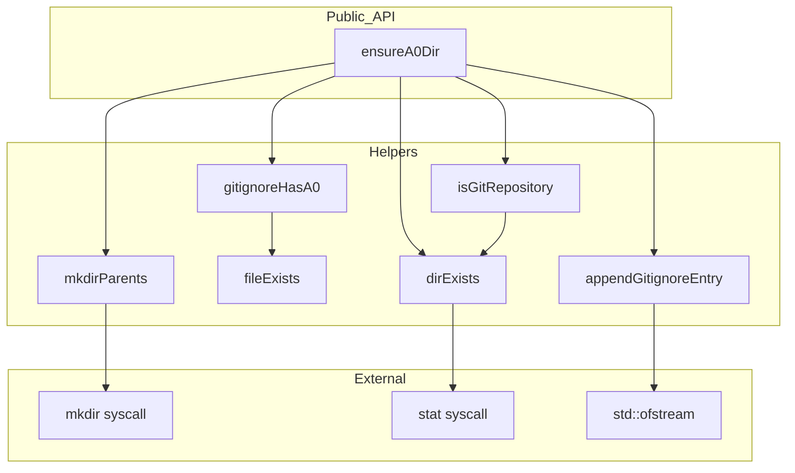
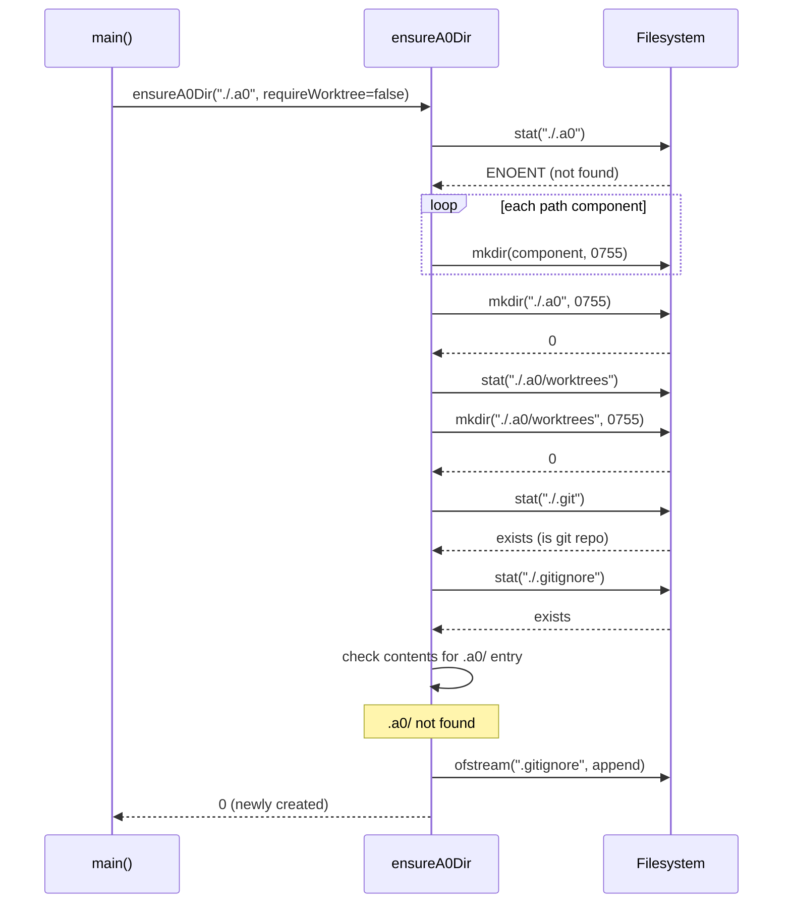

# A0Dir Spec

## §1. Overview

Ensures the `.a0/` runtime directory exists at startup. Creates the directory and any missing parents. On first creation, if the CWD is a git repository, appends `.a0/` to `.gitignore` to prevent committing runtime state.

**Source files:** `src/bootstrap/a0_dir.h`, `src/bootstrap/a0_dir.cpp`

**Dependencies:** POSIX (`mkdir`, `stat`, `cerrno`), `fstream`, `iostream`

**Lifecycle:** Called once during `main()` before any subcommand dispatch (except `kill-all`). If the directory cannot be created, the process exits with code 1.

---

## §2. Component Specifications

```cpp
namespace a0 {

/// Ensure the .a0/ directory exists at @p a0Path.
/// Creates it (and parent dirs) if missing.
/// On first creation, if the CWD is a git repository, appends ".a0/" to .gitignore.
///
/// \param a0Path         Path to the .a0/ directory (e.g. "./.a0").
/// \param requireWorktree  If true, verify worktrees/ subdir exists (for resume).
///                         If false, create worktrees/ subdir if missing.
/// \retval 0  Directory was newly created (gitignore may have been updated).
/// \retval 1  Directory already existed.
/// \retval -1 Failed to create directory or required subdir missing.
int ensureA0Dir(const std::string& a0Path, bool requireWorktree = false);

} // namespace a0
```

### File-static helpers (translation unit only)

| Helper | Signature | Purpose |
|--------|-----------|---------|
| `dirExists` | `static bool dirExists(const std::string& path)` | Check if `path` exists and is a directory |
| `fileExists` | `static bool fileExists(const std::string& path)` | Check if `path` exists and is a regular file |
| `mkdirParents` | `static int mkdirParents(const std::string& path)` | Walk each path component, create if missing |
| `isGitRepository` | `static bool isGitRepository(const std::string& cwd)` | Check for `cwd + "/.git"` directory |
| `gitignoreHasA0` | `static bool gitignoreHasA0(const std::string& gitignorePath)` | Check if `.gitignore` already contains `.a0` or `.a0/` |
| `appendGitignoreEntry` | `static int appendGitignoreEntry(const std::string& gitignorePath)` | Append `.a0/` to `.gitignore` |

---

## §3. Architecture Diagram



---

## §4. Data Flow



---

## §5. Testing Requirements

| Test | Verification |
|------|-------------|
| Directory does not exist | Created, returns 0 |
| Directory already exists | Returns 1, no changes |
| Path with parent dirs | Parents created as needed |
| Git repo on first creation | `.a0/` appended to `.gitignore` |
| requireWorktree=true, worktrees/ missing | Returns -1, error message printed |
| requireWorktree=false, worktrees/ missing | Created automatically |
| requireWorktree=true, worktrees/ exists | Returns 0/1, normal behaviour |
| Empty a0Path parameter | Returns -1 |

---

## §6. *(skipped — no D3 animations)*

---

## §7. CLI Entry Point

Called in `main()` at `src/main.cpp:1118-1126`:

```cpp
if (!app.got_subcommand(killCmd)) {
    int r = a0::ensureA0Dir(a0Dir, !resumeSessionId.empty());
    if (r < 0) {
        std::cerr << "a0: fatal: could not create " << a0Dir << std::endl;
        return 1;
    }
    if (a0Dir[0] != '/')
        a0Dir = xAbsPath(a0Dir);
}
```

- Runs before any subcommand dispatch (except `kill-all`).
- `requireWorktree=true` when `--resume` is passed, `false` otherwise.
- Failure causes immediate exit with code 1.
- After success, the relative path is resolved to absolute via `xAbsPath()`.
