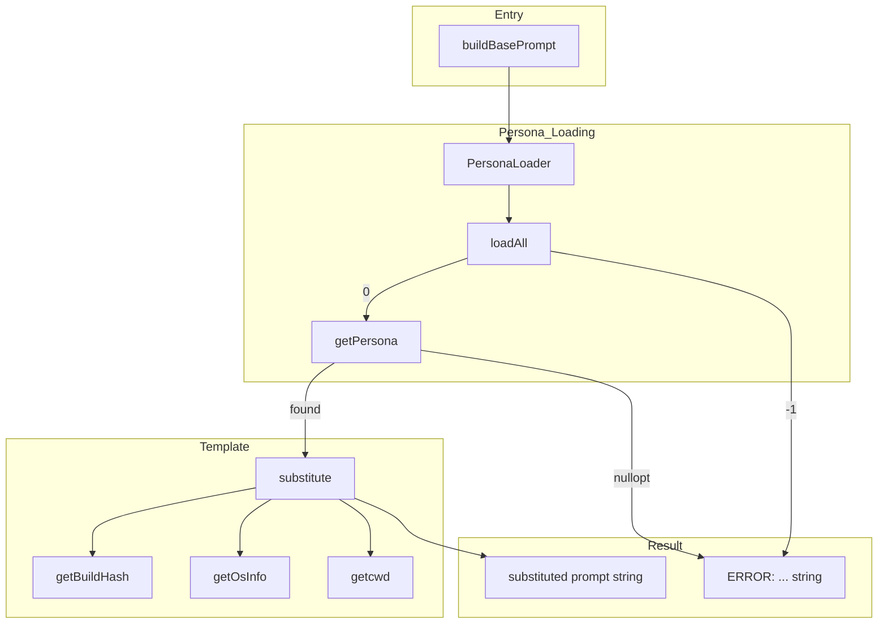
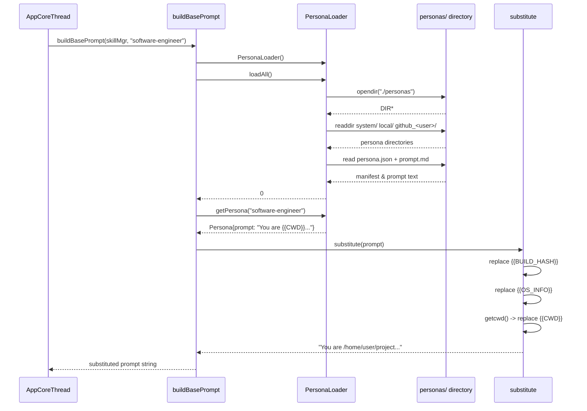

# BasePrompt Spec

## §1. Overview

Loads the selected persona's `prompt.md` file with `{{BUILD_HASH}}`, `{{OS_INFO}}`, and `{{CWD}}` template substitution. Uses `PersonaLoader` to discover and load persona prompts from the three-tier namespace directory.

**Source files:** `src/bootstrap/base_prompt.h`, `src/bootstrap/base_prompt.cpp`

**Dependencies:** `personas.h` / `PersonaLoader`, `BuildIdentity::binarySha1()`, POSIX `uname`, `getcwd`

**Lifecycle:** Called during agent session initialization (both `run` and `tui` modes) via `AppCoreThread` construction. Not cached — a new `PersonaLoader` is created on each invocation.

---

## §2. Component Specifications

```cpp
namespace a0 {

/// Build the base system prompt for all LLM sessions.
/// Loads the selected persona's prompt.md and substitutes {{VARS}}.
///
/// \param skillMgr     Loaded SkillManager (unused, reserved)
/// \param personaName  Persona name (default: "software-engineer")
std::string buildBasePrompt(const skills::SkillManager* skillMgr,
                             const std::string& personaName = "software-engineer");

} // namespace a0
```

### Template Variables

| Variable | Source | Example |
|----------|--------|---------|
| `{{BUILD_HASH}}` | `BuildIdentity::binarySha1()` | `abc123def456` |
| `{{OS_INFO}}` | `uname()` sysname + release + machine | `Linux 6.2.0 x86_64` |
| `{{CWD}}` | `getcwd()` | `/home/user/project` |

### File-static helpers

| Helper | Signature | Purpose |
|--------|-----------|---------|
| `getBuildHash` | `static std::string getBuildHash()` | Cached `BuildIdentity::binarySha1()` |
| `getOsInfo` | `static std::string getOsInfo()` | Cached `uname()` result |
| `substitute` | `static std::string substitute(std::string tmpl)` | Replace `{{VAR}}` placeholders with values |

---

## §3. Architecture Diagram



---

## §4. Data Flow



---

## §5. Testing Requirements

| Test | Verification |
|------|-------------|
| Persona not found | Returns `"ERROR: persona \"<name>\" not found"` |
| personas/ directory missing | Returns `"ERROR: personas/ directory not found"` |
| Template substitution: `{{BUILD_HASH}}` | Replaced with 40-char hex SHA1 |
| Template substitution: `{{OS_INFO}}` | Replaced with `uname` triplet |
| Template substitution: `{{CWD}}` | Replaced with `getcwd()` path |
| Default persona name (empty string) | Falls back to `"software-engineer"` |
| `skillMgr` parameter ignored | Compiles and runs without accessing pointer |

---

## §6. *(skipped — no D3 animations)*

---

## §7. CLI Entry Point

Used indirectly — `buildBasePrompt()` is called inside `AppCoreThread` (see `src/core/app_core_thread.cpp`) during the prompt building phase of session initialization. The `personaName` is forwarded from the `--persona` CLI flag parsed in `main()`:

```cpp
std::string personaName = "software-engineer";
app.add_option("--persona", personaName, "Persona name (default: software-engineer)");
```

The persona name flows through:

```
main() → cmdTui() / cmdRun() → AppCoreThread(personaName)
                                  ↓
                             buildBasePrompt(skillMgr, personaName)
```

Both `cmdRun()` and `cmdTui()` also load the persona's skills/tools list separately using `PersonaLoader` to filter which tool schemas are sent to the LLM.
