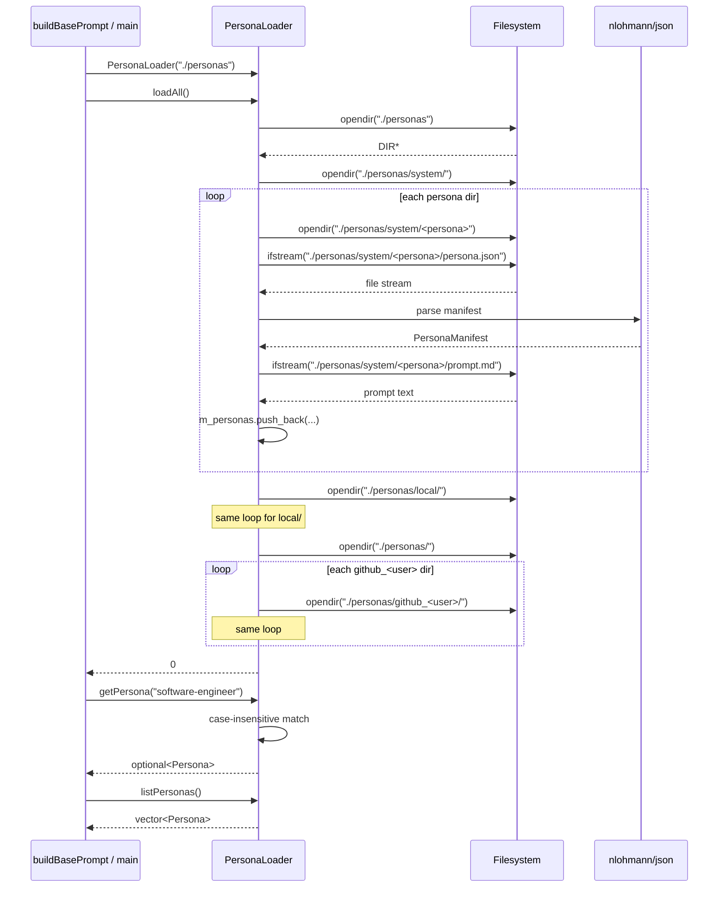

# Personas Spec

## §1. Overview

Manages persona profiles — bundles of system prompts with associated skill/tool filters. Personas are loaded from a three-tier namespace directory (`personas/system/`, `personas/local/`, `personas/github_<user>/`). Each persona has a `persona.json` manifest and a `prompt.md` text file. The selected persona's skills and tools control which tool schemas are exposed to the LLM.

**Source files:** `src/bootstrap/personas.h`, `src/bootstrap/personas.cpp`

**Dependencies:** nlohmann/json, POSIX `dirent.h`, `sys/stat.h`

**Lifecycle:** `PersonaLoader` is created on-demand during agent startup (both `run` and `tui` modes). Not cached — a fresh loader is constructed per invocation.

---

## §2. Component Specifications

```cpp
namespace a0::personas {

enum class PersonaNamespace {
    SYSTEM,
    LOCAL,
    GITHUB
};

/// Manifest parsed from persona.json.
struct PersonaManifest {
    std::string name;                ///< Persona display name (e.g. "software-engineer")
    std::string description;         ///< Human-readable description
    std::string promptFile;          ///< Relative path to prompt text file (e.g. "prompt.md")
    std::vector<std::string> skills; ///< Qualified skill references (e.g. "system_task-manager")
    std::vector<std::string> tools;  ///< Qualified tool names (e.g. "system_fs_read")
    PersonaNamespace ns;             ///< Namespace tier (SYSTEM / LOCAL / GITHUB)
    std::string dir;                 ///< Full path to persona directory
};

/// Fully resolved persona with loaded prompt text.
struct Persona {
    PersonaManifest manifest;        ///< Parsed manifest metadata
    std::string prompt;              ///< Resolved content of promptFile
};

class PersonaLoader {
public:
    explicit PersonaLoader(const std::string& root = "./personas");

    /// Walk system/, local/, github_<user>/ directories.
    /// Clears any previously loaded personas.
    /// \retval 0  Successfully loaded (zero or more personas found)
    /// \retval -1 Root directory does not exist
    int loadAll();

    /// Case-insensitive lookup by name.
    /// \param name  Persona name (case-insensitive)
    /// \returns     Populated Persona or std::nullopt
    std::optional<Persona> getPersona(const std::string& name) const;

    /// All loaded personas across all namespaces.
    std::vector<Persona> listPersonas() const;

private:
    std::string m_root;                  ///< Root personas directory path
    std::vector<Persona> m_personas;     ///< Accumulated persona list

    int xLoadNamespace(const std::string& dirPath, PersonaNamespace ns);
    std::optional<PersonaManifest> xParseManifest(const std::string& dir) const;
    std::string xReadPrompt(const std::string& dir, const std::string& promptFile) const;
};

} // namespace a0::personas
```

---

## §3. Architecture Diagram

```mermaid
graph TB
    subgraph Public_API
        CTOR[PersonaLoader(root)]
        LOAD[loadAll]
        GET[getPersona]
        LIST[listPersonas]
    end

    subgraph Private
        XLOAD[xLoadNamespace]
        XPARSE[xParseManifest]
        XREAD[xReadPrompt]
    end

    subgraph Namespace_Tiers
        TIER1[system/]
        TIER2[local/]
        TIER3[github_<user>/]
    end

    subgraph Persona_Data
        JSON[persona.json]
        PROMPT[prompt.md]
    end

    LOAD --> XLOAD
    XLOAD --> TIER1
    XLOAD --> TIER2
    XLOAD --> TIER3
    XLOAD --> XPARSE
    XLOAD --> XREAD
    XPARSE --> JSON
    XREAD --> PROMPT
    GET --> m_personas
    LIST --> m_personas
```

---

## §4. Data Flow



---

## §5. Testing Requirements

| Test | Verification |
|------|-------------|
| `loadAll` with valid personas | Returns 0, personas indexed |
| `loadAll` with missing root | Returns -1 |
| `loadAll` with invalid persona.json | Skipped with warning |
| `loadAll` with missing prompt file | Loads with empty prompt |
| `getPersona` by exact name | Returns populated Persona |
| `getPersona` case-insensitive | Matches regardless of case |
| `getPersona` not found | Returns `std::nullopt` |
| `listPersonas` across namespaces | All namespaces represented |
| Skills/tools parsed from manifest | Arrays populated correctly |
| Namespace loading (system/local/github) | All three tiers scanned |

---

## §6. *(skipped — no D3 animations)*

---

## §7. CLI Entry Point

Used in two places in `main.cpp`:

### 1. Persona skills/tools filtering (both `cmdRun` and `cmdTui`)

```cpp
// src/main.cpp:563-571 and src/main.cpp:679-687
a0::personas::PersonaLoader pl;
if (pl.loadAll() == 0) {
    auto p = pl.getPersona(personaName);
    if (p) {
        personaSkills = p->manifest.skills;
        personaTools = p->manifest.tools;
    }
}
```

The loaded skill/tool lists are passed to `AppCoreThread` constructor, which forwards them to `DrivenCore::xBuildToolSchemas()` to filter the tool schema sent to the LLM.

### 2. Prompt building (via `buildBasePrompt`)

The `PersonaLoader` is also used internally by `buildBasePrompt()` in `base_prompt.cpp` to load the persona prompt text for substitution.

### CLI flag

```cpp
std::string personaName = "software-engineer";
app.add_option("--persona", personaName, "Persona name (default: software-engineer)");
```
