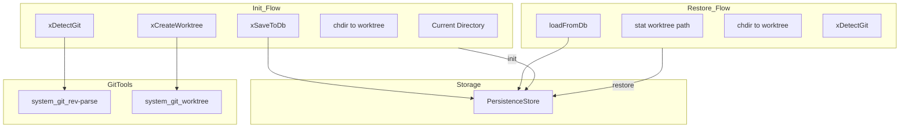
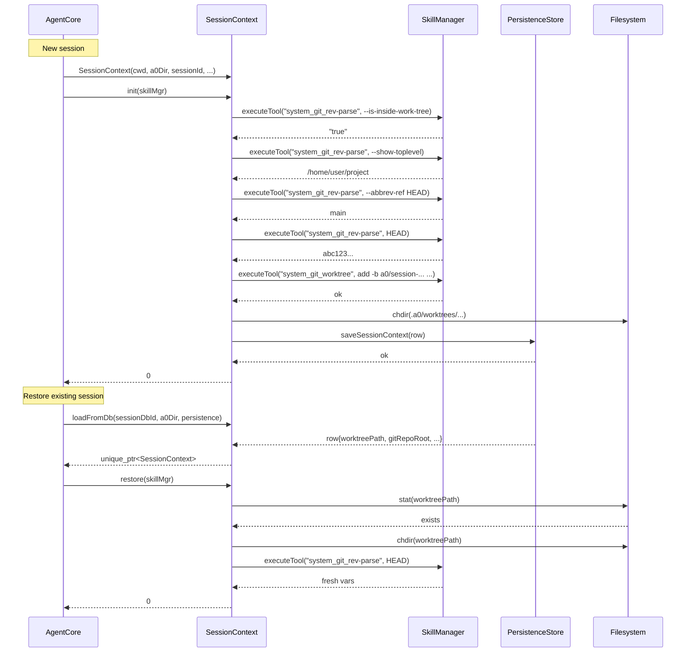

# SessionContext Spec

## §1. Overview

Manages session-level state for a single opencode agent session. On `init()`, it detects whether CWD is inside a git repository, creates an isolated git worktree at `.a0/worktrees/session-<prefix>`, and persists the session context to the database. On `restore()`, it re-attaches to an existing worktree from a prior session. The `containerName()` method derives Docker container names using an 8-character session prefix to ensure isolation between sessions.

**Source files:** `src/bootstrap/session_context.h`, `src/bootstrap/session_context.cpp`

**Dependencies:** `SkillManager` (for git tool execution), `PersistenceStore`, `trace.h`, POSIX `chdir`, `stat`

**Lifecycle:** Created in `cmdTui()` for interactive sessions. `init()` is called for new sessions; `loadFromDb()` + `restore()` for resumed sessions. The `m_sessionPrefix` is derived from the first 8 characters of the session UUID.

---

## §2. Component Specifications

```cpp
namespace a0 {

/// Git repository information detected at session start.
struct GitInfo {
    bool isRepo = false;                ///< Whether CWD is inside a git repo
    std::string repoRoot;               ///< Absolute path to repo root (git rev-parse --show-toplevel)
    std::string currentBranch;          ///< Current branch name (git rev-parse --abbrev-ref HEAD)
    std::string commitHash;             ///< Current commit hash (git rev-parse HEAD)
};

class SessionContext {
public:
    /// Create a new session context.
    /// \param cwd         Original working directory at session start
    /// \param a0Dir       Path to .a0/ directory
    /// \param sessionId   32-char hex session UUID
    /// \param sessionDbId Database row ID for the session
    /// \param persistence Optional PersistenceStore for saving context
    SessionContext(const std::string& cwd, const std::string& a0Dir,
                   const std::string& sessionId, int64_t sessionDbId,
                   a0::persistence::PersistenceStore* persistence = nullptr);

    /// Run git detection and worktree creation.
    /// \param skillMgr  Initialized SkillManager with git tool handlers
    /// \retval 0  Success (worktree may or may not have been created)
    /// \retval -1 skillMgr is null
    int init(a0::skills::SkillManager* skillMgr);

    /// Load an existing session context from the database.
    /// \param sessionDbId Database row ID
    /// \param a0Dir       Path to .a0/ directory
    /// \param persistence PersistenceStore to query
    /// \returns           Populated SessionContext or nullptr if no record exists
    static std::unique_ptr<SessionContext> loadFromDb(
        int64_t sessionDbId,
        const std::string& a0Dir,
        a0::persistence::PersistenceStore* persistence);

    /// Restore a loaded session context: chdir to worktree, re-detect for vars.
    /// \param skillMgr  Initialized SkillManager for re-detection
    /// \retval 0  Successfully restored
    /// \retval -1 Worktree path missing or chdir failed
    int restore(a0::skills::SkillManager* skillMgr);

    /// Git info accessor.
    const GitInfo& gitInfo() const { return m_git; }

    /// Original working directory (pre-worktree).
    const std::string& originalCwd() const { return m_cwd; }

    /// Worktree path (may be empty if no worktree was created).
    const std::string& worktreePath() const { return m_worktreePath; }

    /// Derive a Docker container name with session prefix.
    /// \param base  Base container name (e.g. "b1")
    /// \returns     "a0-<8-char-prefix>-<base>"
    std::string containerName(const std::string& base) const;

private:
    int xDetectGit(a0::skills::SkillManager* skillMgr, int& seq);
    int xCreateWorktree(a0::skills::SkillManager* skillMgr, int& seq);
    int xSaveToDb();

    std::string m_cwd;                                   ///< Original working directory
    std::string m_a0Dir;                                 ///< .a0/ directory path
    std::string m_sessionId;                             ///< 32-char session UUID
    std::string m_sessionPrefix;                         ///< First 8 chars of sessionId
    std::string m_effectiveCwd;                          ///< Current effective working directory
    std::string m_worktreePath;                          ///< Worktree path (empty if none)
    GitInfo m_git;                                       ///< Detected git information
    bool m_hasWorktree = false;                          ///< Whether worktree was successfully created
    a0::persistence::PersistenceStore* m_persistence = nullptr;  ///< Non-owning DB pointer
    int64_t m_sessionDbId = 0;                           ///< Database row ID
};

} // namespace a0
```

### Container naming scheme

```
containerName("b1") → "a0-a1b2c3d4-b1"
                       ↑   ↑        ↑
                    fixed prefix   base name
                         8-char session prefix
```

---

## §3. Architecture Diagram



---

## §4. Data Flow



---

## §5. Testing Requirements

| Test | Verification |
|------|-------------|
| Null `skillMgr` to `init` | Returns -1, no crash |
| Not in a git repo | `m_git.isRepo == false`, returns 0 |
| Worktree creation succeeds | chdir to worktree, `xSaveToDb` called |
| Worktree creation fails | Returns 0, stays in CWD, error logged |
| `loadFromDb` null persistence | Returns `nullptr` |
| `loadFromDb` no record | Returns `nullptr` |
| `restore` missing worktree | Returns -1 |
| `containerName` format | Returns `"a0-<prefix>-<base>"` |
| `m_sessionPrefix` is first 8 chars of sessionId | Verified in constructor |

---

## §6. *(skipped — no D3 animations)*

---

## §7. CLI Entry Point

Created and used in `cmdTui()` at `src/main.cpp:700-719`:

```cpp
std::unique_ptr<a0::SessionContext> sessionCtx;
if (resumeSessionId.empty()) {
    // New session
    sessionCtx = std::make_unique<a0::SessionContext>(
        initialCwd, a0Dir, sid, sessionDbId, &stack.persistence);
    sessionCtx->init(&stack.skillMgr);

    if (stack.containerMgr) {
        stack.containerMgr->setSessionPrefix(sid.substr(0, 8));
    }
} else {
    // Resume existing session
    sessionCtx = a0::SessionContext::loadFromDb(
        sessionDbId, a0Dir, &stack.persistence);
    if (sessionCtx) {
        sessionCtx->restore(&stack.skillMgr);
        if (stack.containerMgr && !sessionCtx->gitInfo().currentBranch.empty()) {
            stack.containerMgr->setSessionPrefix(sid.substr(0, 8));
        }
    }
}
```

- The `initialCwd` is captured via `getcwd()` before any `chdir`.
- `SessionContext` is only used in `tui` mode (not in `run` or `terminal`).
- The session prefix from `containerName()` is used by `DockerContainerManager` to name containers.
