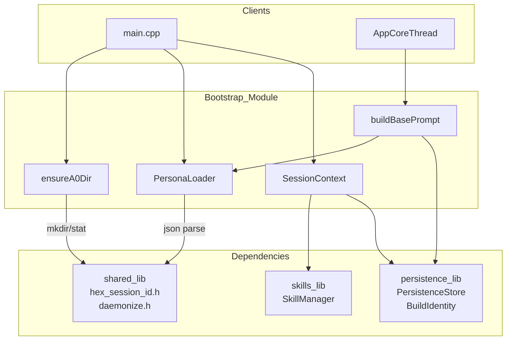
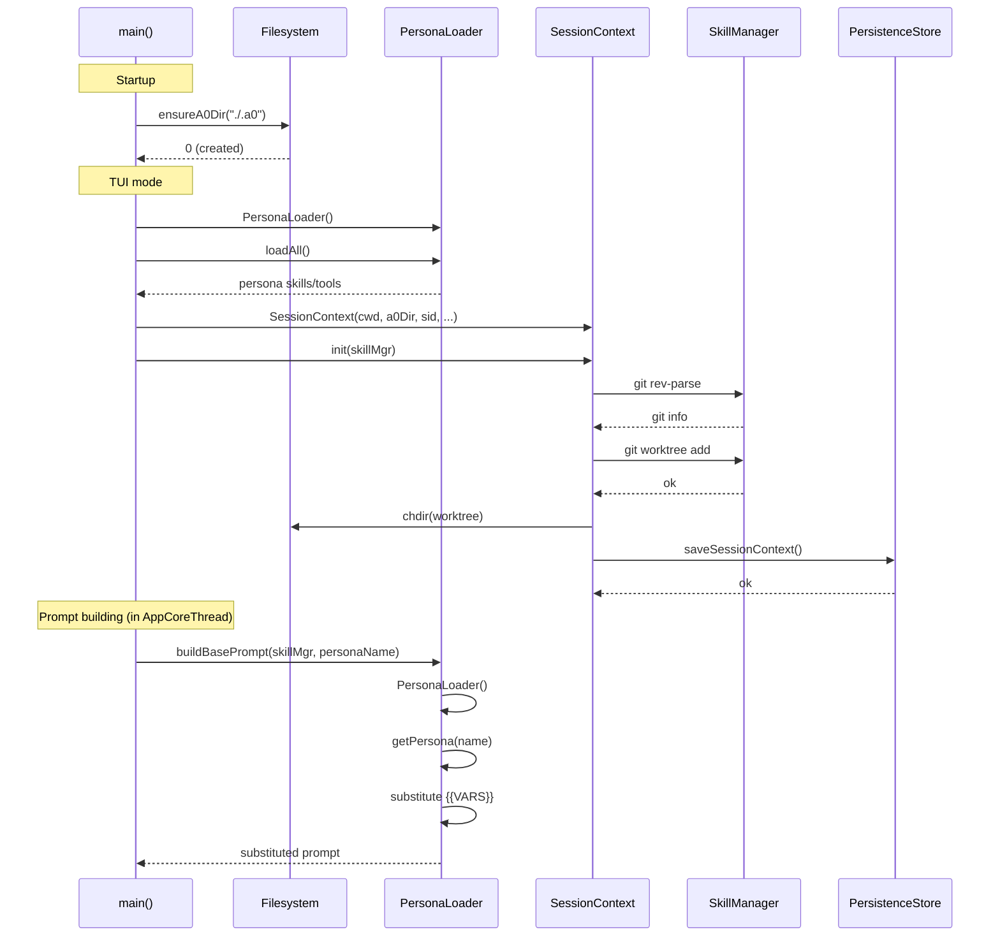

# Technical Specification: Bootstrap Sub-Module

## Version 1.0

---

## §1. Overview

The Bootstrap sub-module owns all startup and configuration logic — the `.a0/` directory lifecycle, persona system, base prompt construction, and session context (git info, worktree). These are the first components initialized during agent startup.

**Source files:**

| Component | Header | Implementation |
|-----------|--------|---------------|
| A0Dir | `src/bootstrap/a0_dir.h` | `src/bootstrap/a0_dir.cpp` |
| BasePrompt | `src/bootstrap/base_prompt.h` | `src/bootstrap/base_prompt.cpp` |
| Personas | `src/bootstrap/personas.h` | `src/bootstrap/personas.cpp` |
| SessionContext | `src/bootstrap/session_context.h` | `src/bootstrap/session_context.cpp` |

**Build system:** `src/bootstrap/CMakeLists.txt` — static library `bootstrap_lib`

```cmake
add_library(bootstrap_lib STATIC
    a0_dir.cpp
    base_prompt.cpp
    personas.cpp
    session_context.cpp
)
target_include_directories(bootstrap_lib PUBLIC ${CMAKE_CURRENT_SOURCE_DIR})
target_link_libraries(bootstrap_lib PUBLIC
    shared_lib
    persistence_lib
    skills_lib
)
```

**Dependencies:** `shared_lib` (hex_session_id.h, daemonize.h), `persistence_lib` (PersistenceStore, BuildIdentity), `skills_lib` (SkillManager)

**Lifecycle:**

1. `ensureA0Dir()` called first in `main()` — creates `.a0/` directory
2. `PersonaLoader` constructed by `cmdRun()` / `cmdTui()` to load persona skills/tools
3. `buildBasePrompt()` called by `AppCoreThread` to construct the system prompt
4. `SessionContext` created by `cmdTui()` for worktree management and container naming

---

## §2. Component Specifications

### 2.1 A0Dir

```cpp
/// Ensure the .a0/ directory exists at @p a0Path.
/// Creates it (and parent dirs) if missing.
/// On first creation, if the CWD is a git repository, appends ".a0/" to .gitignore.
///
/// \param a0Path         Path to the .a0/ directory (e.g. "./.a0").
/// \param requireWorktree  If true, verify worktrees/ subdir exists (for resume).
///                         If false, create worktrees/ subdir if missing.
/// \retval 0  Directory was newly created (gitignore may have been updated).
/// \retval 1  Directory already existed.
/// \retval -1 Failed to create directory or required subdir missing.
int ensureA0Dir(const std::string& a0Path, bool requireWorktree = false);
```

### 2.2 BasePrompt

```cpp
/// Build the base system prompt for all LLM sessions.
/// Loads the selected persona's prompt.md and substitutes {{VARS}}.
///
/// \param skillMgr     Loaded SkillManager (unused, reserved)
/// \param personaName  Persona name (default: "software-engineer")
std::string buildBasePrompt(const skills::SkillManager* skillMgr,
                             const std::string& personaName = "software-engineer");
```

### 2.3 Personas

```cpp
namespace a0::personas {

enum class PersonaNamespace {
    SYSTEM,
    LOCAL,
    GITHUB
};

struct PersonaManifest {
    std::string name;
    std::string description;
    std::string promptFile;
    std::vector<std::string> skills;
    std::vector<std::string> tools;
    PersonaNamespace ns;
    std::string dir;
};

struct Persona {
    PersonaManifest manifest;
    std::string prompt;
};

class PersonaLoader {
public:
    explicit PersonaLoader(const std::string& root = "./personas");

    /// Walk system/, local/, github_<user>/ directories.
    /// \retval 0  Successfully loaded (zero or more personas found)
    /// \retval -1 Root directory does not exist
    int loadAll();

    /// Case-insensitive lookup by name.
    /// \returns     Populated Persona or std::nullopt
    std::optional<Persona> getPersona(const std::string& name) const;

    /// All loaded personas across all namespaces.
    std::vector<Persona> listPersonas() const;

private:
    std::string m_root;
    std::vector<Persona> m_personas;

    int xLoadNamespace(const std::string& dirPath, PersonaNamespace ns);
    std::optional<PersonaManifest> xParseManifest(const std::string& dir) const;
    std::string xReadPrompt(const std::string& dir, const std::string& promptFile) const;
};

} // namespace a0::personas
```

### 2.4 SessionContext

```cpp
namespace a0 {

struct GitInfo {
    bool isRepo = false;
    std::string repoRoot;
    std::string currentBranch;
    std::string commitHash;
};

class SessionContext {
public:
    /// Create a new session context.
    /// \param cwd         Original working directory at session start
    /// \param a0Dir       Path to .a0/ directory
    /// \param sessionId   32-char hex session UUID
    /// \param sessionDbId Database row ID for the session
    /// \param persistence Optional PersistenceStore for saving context
    SessionContext(const std::string& cwd, const std::string& a0Dir,
                   const std::string& sessionId, int64_t sessionDbId,
                   a0::persistence::PersistenceStore* persistence = nullptr);

    /// Run git detection and worktree creation.
    /// \retval 0  Success
    /// \retval -1 skillMgr is null
    int init(a0::skills::SkillManager* skillMgr);

    /// Load an existing session context from the database.
    /// \returns Populated SessionContext or nullptr if no record exists
    static std::unique_ptr<SessionContext> loadFromDb(
        int64_t sessionDbId,
        const std::string& a0Dir,
        a0::persistence::PersistenceStore* persistence);

    /// Restore a loaded session context: chdir to worktree, re-detect for vars.
    /// \retval 0  Successfully restored
    /// \retval -1 Worktree path missing or chdir failed
    int restore(a0::skills::SkillManager* skillMgr);

    const GitInfo& gitInfo() const { return m_git; }
    const std::string& originalCwd() const { return m_cwd; }
    const std::string& worktreePath() const { return m_worktreePath; }

    /// Derive a Docker container name: "a0-<8-char-prefix>-<base>"
    std::string containerName(const std::string& base) const;

private:
    int xDetectGit(a0::skills::SkillManager* skillMgr, int& seq);
    int xCreateWorktree(a0::skills::SkillManager* skillMgr, int& seq);
    int xSaveToDb();

    std::string m_cwd;
    std::string m_a0Dir;
    std::string m_sessionId;
    std::string m_sessionPrefix;
    std::string m_effectiveCwd;
    std::string m_worktreePath;
    GitInfo m_git;
    bool m_hasWorktree = false;
    a0::persistence::PersistenceStore* m_persistence = nullptr;
    int64_t m_sessionDbId = 0;
};

} // namespace a0
```

---

## §3. Architecture Diagram



---

## §4. Data Flow



---

## §5. Testing Requirements

### A0Dir

| Test | Verification |
|------|-------------|
| Directory does not exist | Created, returns 0 |
| Directory already exists | Returns 1, no changes |
| Path with parent dirs | Parents created as needed |
| Git repo on first creation | `.a0/` appended to `.gitignore` |
| requireWorktree=true, worktrees/ missing | Returns -1, error printed |

### BasePrompt

| Test | Verification |
|------|-------------|
| Persona not found | Returns `"ERROR: persona \"...\" not found"` |
| `{{BUILD_HASH}}` substitution | Replaced with 40-char hex SHA1 |
| `{{OS_INFO}}` substitution | Replaced with `uname` triplet |
| `{{CWD}}` substitution | Replaced with `getcwd()` path |

### PersonaLoader

| Test | Verification |
|------|-------------|
| `loadAll` with valid personas | Returns 0, personas indexed |
| `loadAll` with missing root | Returns -1 |
| Invalid persona.json | Skipped with warning |
| `getPersona` case-insensitive | Matches regardless of case |
| `getPersona` not found | Returns `std::nullopt` |

### SessionContext

| Test | Verification |
|------|-------------|
| Null `skillMgr` to `init` | Returns -1, no crash |
| Not in a git repo | `m_git.isRepo == false`, returns 0 |
| Worktree creation fails | Returns 0, stays in CWD |
| `loadFromDb` no record | Returns `nullptr` |
| `restore` missing worktree | Returns -1 |
| `containerName` format | Returns `"a0-<prefix>-<base>"` |

---

## §6. *(skipped — no D3 animations)*

---

## §7. CLI Entry Point

The bootstrap module is wired into `main()` via:

| Component | `main.cpp` location | Usage |
|-----------|-------------------|-------|
| `ensureA0Dir` | Lines 1118-1126 | Called before any subcommand dispatch (except `kill-all`). `requireWorktree` is set from `!resumeSessionId.empty()`. |
| `PersonaLoader` | Lines 563-571 (cmdRun), 679-687 (cmdTui) | Loads persona skills/tools lists to filter LLM tool schemas. |
| `SessionContext` | Lines 700-719 (cmdTui) | Created for new sessions (`init`) or loaded from DB + restored for resumed sessions (`loadFromDb` + `restore`). |
| `buildBasePrompt` | Inside `AppCoreThread` | Called during prompt construction using the `personaName` from `--persona` flag. |

```cpp
// main.cpp:1118-1126 — A0Dir
int r = a0::ensureA0Dir(a0Dir, !resumeSessionId.empty());
if (r < 0) { std::cerr << "a0: fatal: could not create " << a0Dir << std::endl; return 1; }

// main.cpp:563-571 — PersonaLoader (cmdRun)
a0::personas::PersonaLoader pl;
if (pl.loadAll() == 0) { auto p = pl.getPersona(personaName); ... }

// main.cpp:703-705 — SessionContext (new session)
sessionCtx = std::make_unique<a0::SessionContext>(initialCwd, a0Dir, sid, sessionDbId, &stack.persistence);
sessionCtx->init(&stack.skillMgr);

// main.cpp:711-714 — SessionContext (resume)
sessionCtx = a0::SessionContext::loadFromDb(sessionDbId, a0Dir, &stack.persistence);
if (sessionCtx) { sessionCtx->restore(&stack.skillMgr); }
```
