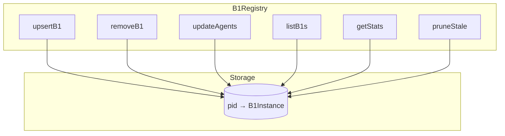
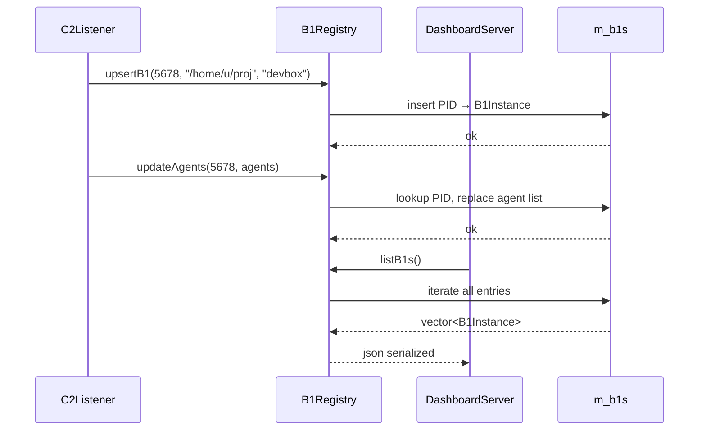

# B1Registry Spec

## 1. Overview

In-memory registry of all connected b1 supervisors and their a0 agents. Maintains a `pid → B1Instance` map with agent lists. Provides O(1) upsert/lookup and O(n) list/stats queries. Thread-safe for dual-thread c2 design.

**Dependencies:** STL (`unordered_map`, `vector`, `mutex`), nlohmann/json

**Lifecycle:** Created at c2 startup, lives for the lifetime of the process.

## 2. Component Specifications

```cpp
namespace a0::c2 {

class B1Registry {
public:
    B1Registry();

    int upsertB1(int pid, const std::string& workdir, const std::string& hostname);
    int removeB1(int pid);
    int updateAgents(int pid, const std::vector<AgentSummary>& agents);
    std::vector<B1Instance> listB1s() const;
    void getStats(int& totalB1s, int& totalAgents, int& crashedCount) const;
    int pruneStale(int maxAgeSeconds = 60);

private:
    mutable std::mutex m_mutex;
    std::unordered_map<int, B1Instance> m_b1s;
};

} // namespace a0::c2
```

## 3. Architecture Diagram



**Caption:** All operations read or mutate the central `m_b1s` unordered_map. A mutex guards concurrent access from the listener thread and the HTTP server thread.

## 4. Data Flow



## 5. Error Handling

| Scenario | Behaviour |
|----------|-----------|
| upsertB1 with new PID | Inserts new entry, returns 0 |
| upsertB1 with existing PID | Updates fields (lastUpdate), returns 0 |
| removeB1 with nonexistent PID | Returns -1, no state change |
| updateAgents with unknown PID | Returns -1 |
| pruneStale with no stale entries | Returns 0 |
| Concurrent read+write | Mutex ensures consistency |

## 6. Edge Cases

| Case | Expected Result |
|------|----------------|
| Empty registry | listB1s returns empty vector, getStats all zeros |
| Single b1 with 1000 agents | listB1s returns one entry with 1000 agents |
| b1 register then immediately disconnect | upsertB1 then removeB1 → empty |
| b1 crashes without deregistering | pruneStale eventually removes it |
| Two b1s with same PID (impossible) | Second upsertB1 overwrites first |

## 7. Testing Requirements

| Method | Test Case | Input | Expected |
|--------|-----------|-------|----------|
| `upsertB1` | New instance | pid=1, wd="/x", host="h" | Returns 0, listB1s size=1 |
| `upsertB1` | Existing instance | Same pid, new hostname | Hostname updated, size still 1 |
| `removeB1` | Existing | pid=1 | Returns 0, listB1s empty |
| `removeB1` | Nonexistent | pid=999 | Returns -1 |
| `updateAgents` | Known b1 | pid=1, agents=[{pid:5,state:"running"}] | Returns 0, listB1s has 1 agent |
| `updateAgents` | Unknown b1 | pid=999 | Returns -1 |
| `getStats` | Mixed states | 2 b1s, 3 running + 1 crashed | totalB1s=2, totalAgents=4, crashedCount=1 |
| `getStats` | Empty | — | All zeros |
| `pruneStale` | One stale | Last update 120s ago, maxAge=60 | Returns 1, registry empty |
| `pruneStale` | None stale | Last update 30s ago, maxAge=60 | Returns 0 |

## 8. Integration

`B1Registry` is constructed in `c2_main.cpp` and passed via raw pointer to both `C2Listener` and `DashboardServer`. Both threads share the same instance under mutex protection.
