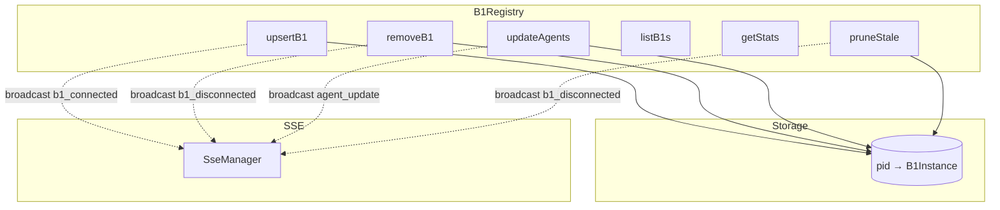
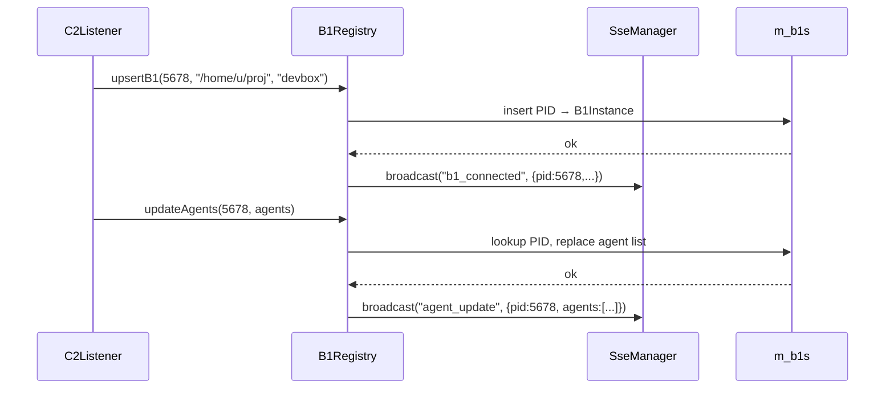

# B1Registry Spec

## 1. Overview

In-memory registry of all connected b1 supervisors and their a0 agents. Maintains a `pid → B1Instance` map with agent lists. Thread-safe for dual-thread c2 design. On every state mutation, broadcasts the corresponding SSE event (b1_connected, b1_disconnected, agent_update) to all connected UI clients.

**Dependencies:** STL (`unordered_map`, `vector`, `mutex`), `SseManager`, nlohmann/json

**Lifecycle:** Created at c2 startup, lives for the lifetime of the process.

## 2. Component Specifications

```cpp
namespace a0::c2 {

class B1Registry {
public:
    B1Registry() = default;

    void setSseManager(SseManager* sse);

    int upsertB1(int pid, const std::string& workdir, const std::string& hostname);
    int removeB1(int pid);
    int updateAgents(int pid, const std::vector<AgentSummary>& agents);
    std::vector<B1Instance> listB1s() const;
    void getStats(int& totalB1s, int& totalAgents, int& crashedCount) const;
    int pruneStale(int maxAgeSeconds = 60);

private:
    mutable std::mutex m_mutex;
    std::unordered_map<int, B1Instance> m_b1s;
    SseManager* m_sse = nullptr;
};

} // namespace a0::c2
```

## 3. Architecture Diagram



## 4. Data Flow



## 5. Error Handling

| Scenario | Behaviour |
|----------|-----------|
| upsertB1 with new PID | Inserts new entry, broadcasts b1_connected |
| upsertB1 with existing PID | Updates fields, returns 0 |
| removeB1 with nonexistent PID | Returns -1, no broadcast |
| updateAgents with unknown PID | Returns -1 |
| pruneStale with no stale entries | Returns 0 |
| m_sse is null | No broadcasts, state changes work normally |

## 6. Testing Requirements

| Method | Test Case | Input | Expected |
|--------|-----------|-------|----------|
| `upsertB1` | New instance | pid=1, wd="/x", host="h" | Returns 0, SSE broadcast sent |
| `upsertB1` | Existing instance | Same pid, new hostname | Hostname updated |
| `removeB1` | Existing | pid=1 | Returns 0, SSE broadcast |
| `removeB1` | Nonexistent | pid=999 | Returns -1, no broadcast |
| `updateAgents` | Known b1 | pid=1, agents=[{pid:5,state:"running"}] | SSE broadcast with agents |
| `getStats` | Mixed states | 2 b1s, 3 running + 1 crashed | totalB1s=2, totalAgents=4, crashedCount=1 |
| `setSseManager(null)` | No SSE | nullptr | All operations work without broadcasts |
