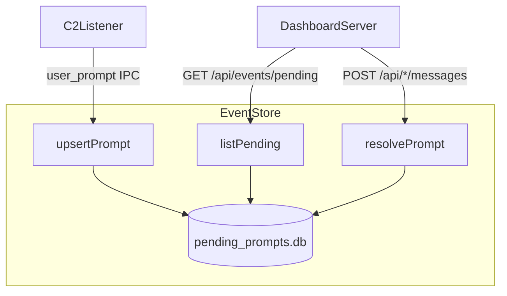
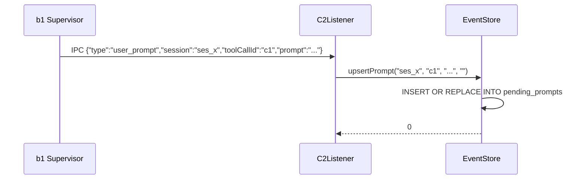

# C2EventStore Spec

## 1. Overview

SQLite-backed store for pending user_prompt events in the c2 supervisor daemon. Manages the lifecycle of prompts that require user input — created on incoming `user_prompt` IPC messages, resolved when the user responds via the UI, or dismissed without answer.

**Dependencies:** SQLite3

**Lifecycle:** Created at c2 startup, persists to `<socketPath>.db`. Rows survive c2 restarts.

## 2. Component Specifications

```cpp
namespace a0::c2 {

struct PendingPrompt {
    std::string session;
    std::string toolCallId;
    std::string prompt;
    std::string context;
    int64_t createdAt = 0;
};

class EventStore {
public:
    explicit EventStore(const std::string& dbPath);
    ~EventStore();

    int upsertPrompt(const std::string& session, const std::string& toolCallId,
                     const std::string& prompt, const std::string& context);
    std::vector<PendingPrompt> listPending() const;
    int resolvePrompt(const std::string& session, const std::string& toolCallId);
    int dismissPrompt(const std::string& session, const std::string& toolCallId);

private:
    class Impl;
    std::unique_ptr<Impl> m_impl;
};

} // namespace a0::c2
```

## 3. Architecture Diagram



## 4. Data Flow



## 5. Schema

```sql
CREATE TABLE pending_prompts (
    session      TEXT PRIMARY KEY,
    tool_call_id TEXT NOT NULL,
    prompt       TEXT NOT NULL,
    context      TEXT DEFAULT '',
    created_at   INTEGER NOT NULL
);
```

## 6. Error Handling

| Condition | Behaviour |
|-----------|-----------|
| DB file cannot be opened | `listPending` returns empty vector; `upsertPrompt` returns -1 |
| SQL query failure | Returns -1 |
| Raced resolve/dismiss from two UI tabs | Both succeed; second is a no-op (already deleted) |

## 7. Testing Requirements

| Method | Test | Expected |
|--------|------|----------|
| upsertPrompt + listPending | Insert one prompt | listPending returns 1 entry with matching fields |
| upsertPrompt overwrite | Same session twice | Fields updated, still 1 entry |
| resolvePrompt | Existing prompt | Prompt removed from listPending |
| dismissPrompt | Existing prompt | Prompt removed from listPending |
| listPending | Empty store | Returns empty vector |
| resolvePrompt | Non-existing prompt | Returns -1 |
