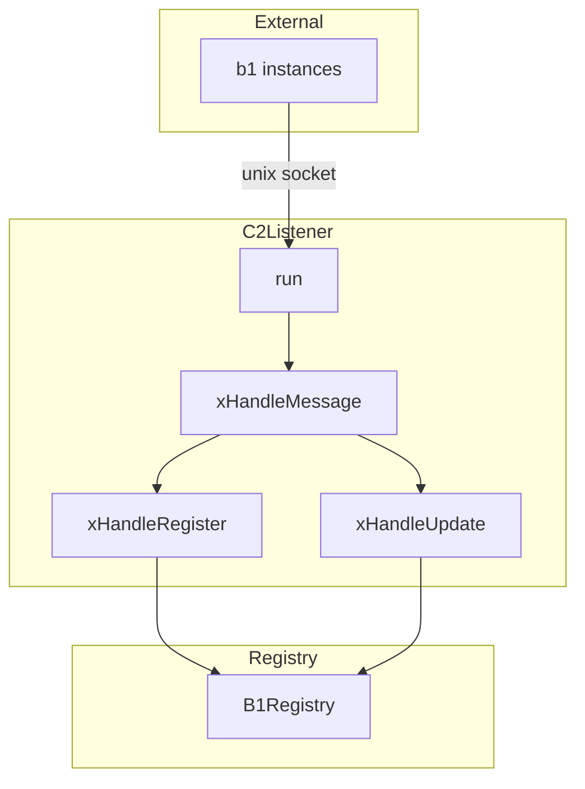
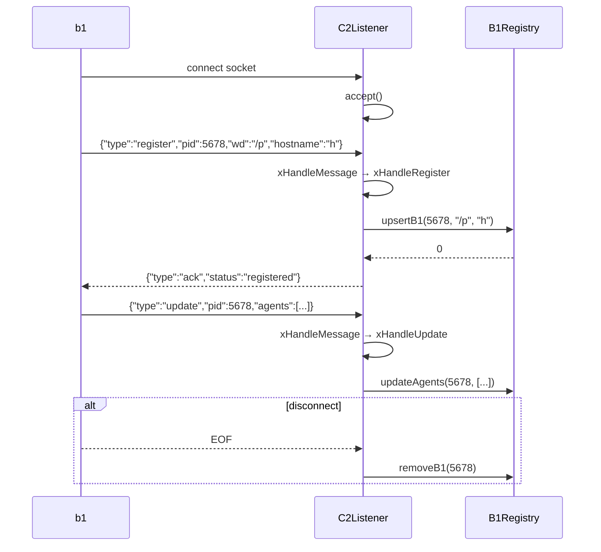

# C2Listener Spec

## 1. Overview

Listens on the c2 Unix domain socket for b1 registration and update messages. Runs in a dedicated thread alongside the HTTP dashboard server. Parses JSON-line messages and delegates to `B1Registry`.

**Dependencies:** `UnixSocket`, `Message` (from ipc), `B1Registry`, POSIX (`poll`)

**Lifecycle:** Created at c2 startup, runs in a loop until shutdown signal.

## 2. Component Specifications

```cpp
namespace a0::c2 {

class C2Listener {
public:
    C2Listener(const std::string& socketPath, B1Registry* registry);
    ~C2Listener();

    int run();
    void shutdown();

private:
    std::string m_socketPath;
    B1Registry* m_registry;
    int m_listenFd;
    bool m_running;

    int xHandleMessage(const nlohmann::json& msg, int peerFd);
    int xHandleRegister(const nlohmann::json& msg);
    int xHandleUpdate(const nlohmann::json& msg);
    void xCleanupStaleSocket();
};

} // namespace a0::c2
```

## 3. Architecture Diagram



## 4. Data Flow



## 5. Error Handling

| Scenario | Behaviour |
|----------|-----------|
| Malformed JSON from b1 | Returns error ack, no crash |
| Unknown message type | Ignores, sends ack with error field |
| accept() fails (EAGAIN) | Continues poll loop |
| poll() returns error | Logs error, continues |
| Socket path stale from crash | `xCleanupStaleSocket` unlinks before bind |

## 6. Edge Cases

| Case | Expected Result |
|------|----------------|
| Empty message (empty JSON line) | `xHandleMessage` returns error ack |
| b1 connects but never sends | Poll loop detects timeout; close connection |
| b1 sends partial line then disconnects | Next recv returns EOF; connection closed |
| Multiple b1s register simultaneously | Each handled by accept→recv in sequence |
| b1 sends update for unknown pid | updateAgents returns -1, listener logs warning |

## 7. Testing Requirements

| Method | Test Case | Input | Expected |
|--------|-----------|-------|----------|
| `xHandleRegister` | Valid register | `{"type":"register","pid":1,"wd":"/x"}` | Calls upsertB1, returns 0 |
| `xHandleRegister` | Missing pid | `{"type":"register"}` | Returns -1 |
| `xHandleUpdate` | Valid update | `{"type":"update","pid":1,"agents":[]}` | Calls updateAgents, returns 0 |
| `xHandleUpdate` | Unknown b1 pid | `{"type":"update","pid":999}` | Returns -1, no crash |
| `xHandleMessage` | Unknown type | `{"type":"unknown"}` | Returns -1, no crash |
| `xHandleMessage` | Malformed JSON | `{bad` | Returns -1, no crash |
| `run` | Accept+dispatch | Connect, send register, disconnect | Registry has 1 entry after |
| `shutdown` | During poll wait | Call from another thread | run() returns 0 |

## 8. Integration

`C2Listener` runs in its own thread, started by `c2_main.cpp`. It shares the `B1Registry` instance with `DashboardServer`. On shutdown, `c2_main.cpp` signals the listener thread and joins before exit.
