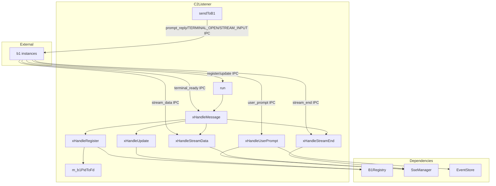
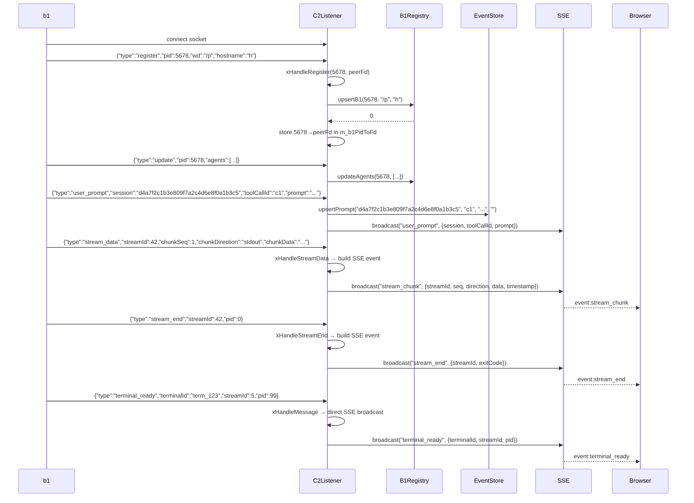

# C2Listener Spec

## 1. Overview

Listens on the c2 Unix domain socket for b1 registration, update, and user_prompt messages. Runs in a dedicated thread alongside the HTTP dashboard server. Parses JSON-line messages, delegates to `B1Registry` and `EventStore`, and broadcasts user_prompt events via `SseManager`. Also exposes `sendToB1()` for the DashboardServer to send `prompt_reply` signals to specific b1 instances.

**Dependencies:** `UnixSocket`, `Message` (from ipc), `B1Registry`, `SseManager`, `EventStore`, POSIX (`poll`)

**Lifecycle:** Created at c2 startup, runs in a loop until shutdown signal.

## 2. Component Specifications

```cpp
namespace a0::c2 {

class C2Listener {
public:
    C2Listener(const std::string& socketPath, B1Registry* registry,
               SseManager* sse, EventStore* events);
    ~C2Listener();

    int run();
    void shutdown();

    /// Send an IPC message to a b1 instance by PID. Thread-safe.
    int sendToB1(int b1Pid, const ipc::Message& msg);

private:
    std::string m_socketPath;
    B1Registry* m_registry;
    SseManager* m_sse;
    EventStore* m_events;
    ipc::UnixSocket m_listenSocket;
    int m_listenFd = -1;
    bool m_running = false;
    std::unordered_map<int, ipc::BufferedSocket> m_peers;
    std::unordered_map<int, int> m_b1PidToFd;
    std::mutex m_b1Mutex;

    int xHandleMessage(const nlohmann::json& msg, int peerFd);
    int xHandleRegister(const nlohmann::json& msg, int peerFd);
    int xHandleUpdate(const nlohmann::json& msg);
    int xHandleUserPrompt(const nlohmann::json& msg);
    int xHandleStreamData(const nlohmann::json& msg);
    int xHandleStreamEnd(const nlohmann::json& msg);
    void xCleanupStaleSocket();
};

} // namespace a0::c2
```

## 3. Architecture Diagram



## 4. Data Flow



## 5. Error Handling

| Scenario | Behaviour |
|----------|-----------|
| Malformed JSON from b1 | Returns -1, connection stays open |
| Unknown message type | Returns -1, ignored |
| accept() fails (EAGAIN) | Continues poll loop |
| poll() returns error | Continues poll loop |
| Socket path stale from crash | `xCleanupStaleSocket` unlinks before bind |
| sendToB1 to disconnected b1 | Returns -1 (fd closed or not found) |
| stream_data with missing fields | Returns -1, no SSE broadcast |
| b1 socket hangup or POLLHUP/POLLERR | Inline cleanup lambda erases peer fd, removes pid mapping, calls `removeB1(pid)` |
| recv returns RECV_AGAIN | No action — poll loop retries |
| recv returns RECV_ERR | m_peers entry erased, fd closed, cleanup lambda called |

## 6. Testing Requirements

| Method | Test Case | Input | Expected |
|--------|-----------|-------|----------|
| `xHandleRegister` | Valid register | `{"type":"register","pid":1,"wd":"/x","hostname":"h"}` | Calls upsertB1, stores fd→pid mapping |
| `xHandleRegister` | Missing pid | `{"type":"register"}` | Returns -1 |
| `xHandleUpdate` | Valid update | `{"type":"update","pid":1,"agents":[...]}` | Calls updateAgents |
| `xHandleUserPrompt` | Valid user_prompt | `{"type":"user_prompt","session":"s","toolCallId":"c","prompt":"?"}` | Upserts EventStore, broadcasts SSE |
| `xHandleUserPrompt` | Missing fields | `{"type":"user_prompt"}` | Returns -1 |
| `xHandleStreamData` | Valid stream_data | `{"streamId":1,"chunkSeq":0,"chunkDirection":"stdout","chunkData":"o"}` | Broadcasts stream_chunk SSE |
| `xHandleStreamData` | Missing sse | Call when m_sse is null | Returns -1 |
| `xHandleStreamEnd` | Valid stream_end | `{"streamId":1,"pid":0}` | Broadcasts stream_end SSE |
| `xHandleStreamEnd` | Missing sse | Call when m_sse is null | Returns -1 |
| `sendToB1` | Known b1 pid | b1 pid, PROMPT_REPLY msg | Sends IPC message |
| `sendToB1` | Unknown pid | pid=999 | Returns -1 |
| `shutdown` | During poll wait | Call from another thread | run() returns 0 |
