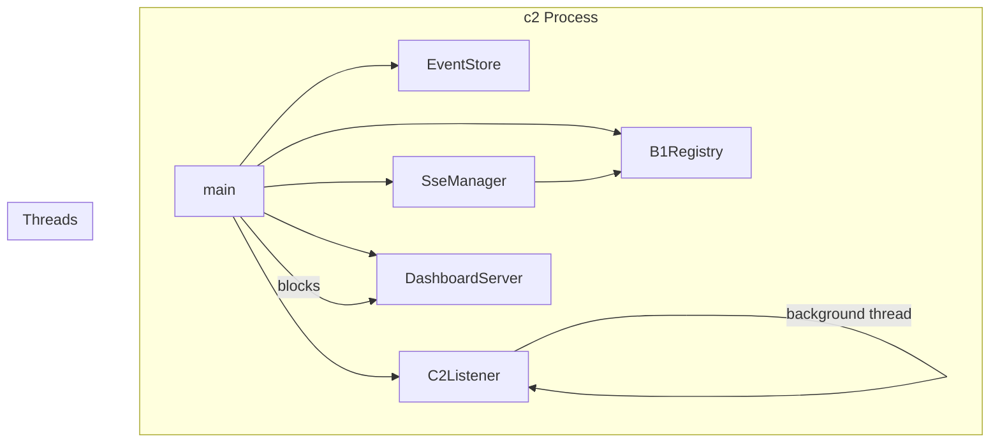

# C2Main Spec

## 1. Overview

Entry point for the c2 daemon (machine-level monitor). Parses CLI flags, wires `B1Registry`, `SseManager`, `EventStore`, `C2Listener`, and `DashboardServer`, then blocks on the HTTP server. Handles SIGINT/SIGTERM via `sigaction` to perform a clean shutdown (`_exit(0)` after closing sockets and unlinking PID file).

**Source file:** `src/c2/c2_main.cpp`

**Dependencies:** All c2 lib components, `unix_socket.h`, `unistd.h` (for `getcwd`, `_exit`)

## 2. Entry Point

```
c2 [--port <n>] [--socket <path>] [--web-root <path>] [--ssl-key <file> --ssl-cert <file>] [--log-file <path>]

| Flag | Default | Description |
|------|---------|-------------|
| `--port` | `8080` (or `A0_C2_PORT` env) | HTTP dashboard port |
| `--socket` | `$XDG_RUNTIME_DIR/a0-c2.sock` | Unix socket path for b1 registrations |
| `--web-root` | `<cwd>/.a0/git/opensassi/a0/c2/web` | Static file root |
| `--ssl-key` | — | TLS key file |
| `--ssl-cert` | — | TLS cert file |
| `--log-file` | — | Redirect stderr to file; child daemons derive paths automatically |

## 3. Architecture



## 4. Startup Sequence

1. Parse CLI flags and env vars
2. Compute `baseDir` from `XDG_RUNTIME_DIR` or `/tmp`
3. **Clean up stale socket** from previous crash (`unlinkPath`)
4. **Redirect stderr** to `--log-file` path if specified (`dup2`)
5. Write PID file at `baseDir/a0-c2.pid`
6. Create `EventStore` (SQLite, `<socket>.db`)
7. Create `SseManager`
8. Create `B1Registry`, wire `SseManager`
9. Create `C2Listener` on background thread
10. Register `sigaction` handlers for SIGINT/SIGTERM
11. Block on `DashboardServer::run()` (uWS event loop)
12. On signal: `DashboardServer::shutdown()` + `C2Listener::shutdown()` + unlink socket + `_exit(0)`

## 5. Error Handling

| Condition | Behaviour |
|-----------|-----------|
| Port in use | `DashboardServer::run()` returns -1 |
| Socket path too long | Returns -1 (invalid socket path) |
| Stale socket from crash | `xCleanupStaleSocket` in C2Listener unlinks before bind |
| Stale PID from crash | Removed at startup; `killByPidFile` in a0 handles stale PID files |

## 6. Testing Requirements

| Test | Verification |
|------|-------------|
| `--port` override | Server listens on specified port |
| `--help` flag | Prints usage and exits 0 |
| SIGINT handler | Process exits 0, socket file unlinked, PID file removed |
| SIGTERM handler | Process exits 0, socket file unlinked |
| PID file written | Contains PID of running process |
| Web root path | Serves files from correct directory |
| `--log-file` | Stderr redirected to specified file; file contains `"c2: running"` startup banner |
| Stale socket cleanup | Restart after SIGKILL completes without bind error |
