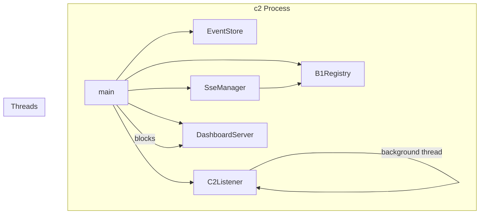

# C2Main Spec

## 1. Overview

Entry point for the c2 daemon (machine-level monitor). Parses CLI flags, wires `B1Registry`, `SseManager`, `EventStore`, `C2Listener`, and `DashboardServer`, then blocks on the HTTP server. Handles SIGINT/SIGTERM via `sigaction` to perform a clean shutdown (`_exit(0)` after closing sockets and unlinking PID file).

**Source file:** `src/c2/c2_main.cpp`

**Dependencies:** All c2 lib components, `unix_socket.h`, `unistd.h` (for `getcwd`, `_exit`)

## 2. Entry Point

```
c2 [--port <n>] [--socket <path>] [--web-root <path>] [--ssl-key <file> --ssl-cert <file>] [--log-file <path>]

| Flag | Default | Description |
|------|---------|-------------|
| `--port` | `8080` (or `A0_C2_PORT` env) | HTTP dashboard port |
| `--socket` | `$XDG_RUNTIME_DIR/a0-c2.sock` | Unix socket path for b1 registrations |
| `--web-root` | `<cwd>/.a0/git/opensassi/a0/c2/web` (or `C2_DEFAULT_WEB_ROOT` compile-time define) | Static file root |
| `--ssl-key` | — | TLS key file |
| `--ssl-cert` | — | TLS cert file |
| `--log-file` | — | Redirect stdout+stderr to file; child daemons derive paths automatically |
| `--help` | — | Print usage and exit 0 |

## 3. Architecture



## 4. Startup Sequence

1. Parse CLI flags and env vars (`A0_C2_PORT`, `XDG_RUNTIME_DIR`)
2. Compute `baseDir` from `XDG_RUNTIME_DIR` or `/tmp`
3. **Clean up stale socket** from previous crash (`unlinkPath` before bind)
4. **Redirect stdout+stderr** to `--log-file` path if specified (`dup2` both fd 1 and 2)
5. Write PID file at `baseDir/a0-c2.pid`
6. Create `EventStore` (SQLite, `<socket>.db`)
7. Create `SseManager`
8. Create `B1Registry`, wire `SseManager` via `setSseManager()`
9. Create `C2Listener` on background thread
10. Register `sigaction` handlers for SIGINT/SIGTERM
11. Block on `DashboardServer::run()` (uWS event loop on main thread)
12. On signal: `DashboardServer::shutdown()` + `C2Listener::shutdown()` + unlink socket + remove PID file + `_exit(0)`

## 5. Error Handling

| Condition | Behaviour |
|-----------|-----------|
| Port in use | `DashboardServer::run()` returns -1 |
| Socket path too long | `UnixSocket::bindAndListen` returns -1 |
| Stale socket from crash | `unlinkPath` called before bind in `main()` + `C2Listener::xCleanupStaleSocket` |
| Stale PID from crash | Removed at startup by `std::remove` |
| `--log-file` open failure | `::open` returns -1, stderr not redirected, process continues |
| `--help` flag | Prints usage and exits 0 |
| `C2_DEFAULT_WEB_ROOT` not defined | Falls back to `<cwd>/.a0/git/opensassi/a0/c2/web` |

## 6. Testing Requirements

| Test | Verification |
|------|-------------|
| `--port` override | DashboardServer listens on specified port |
| `A0_C2_PORT` env | Same as `--port` when flag not provided |
| `--help` flag | Prints usage and exits 0 |
| `--socket` path | C2Listener binds to specified path |
| `--web-root` flag | Static files served from specified directory |
| `--log-file` | stdout+stderr redirected to file; file contains `"c2: running"` banner |
| `--ssl-key` + `--ssl-cert` | DashboardServer creates uWS::SSLApp |
| SIGINT handler | `_exit(0)`, socket unlinked, PID file removed |
| SIGTERM handler | Same as SIGINT |
| PID file written | Contains PID of running process |
| Stale socket cleanup | Restart after SIGKILL succeeds without bind error |
| Listener thread failure | `cerr` message printed, main thread continues |
| `C2_DEFAULT_WEB_ROOT` compile define | Overrides default web root path |
