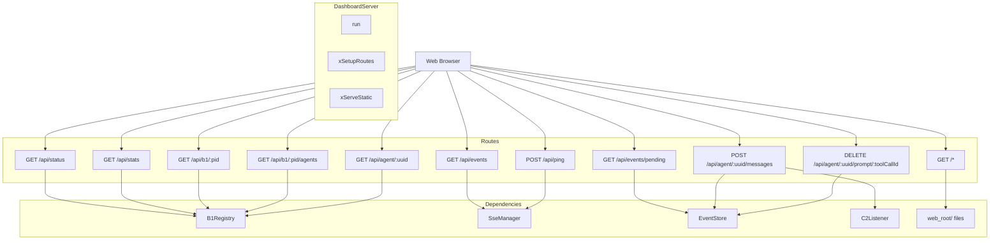
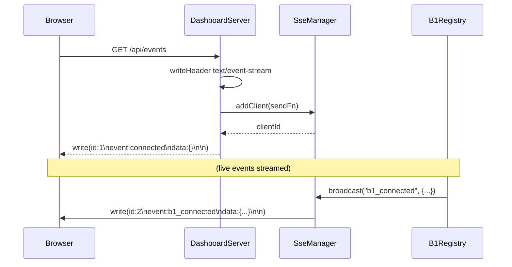
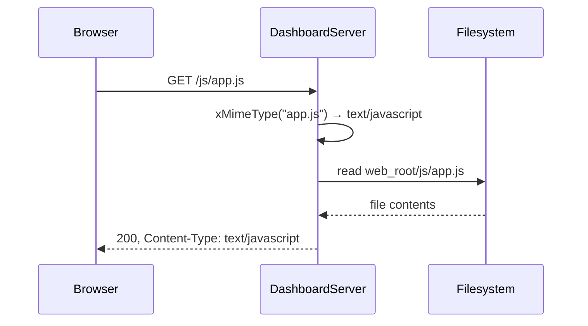
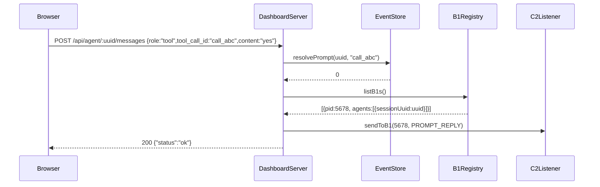

# DashboardServer Spec

## 1. Overview

HTTP dashboard server using uWebSockets. Serves JSON REST API endpoints, an SSE event stream, and static Web UI files from disk. Runs on the main thread alongside `C2Listener` on a separate thread.

**Dependencies:** uWebSockets, `B1Registry`, `SseManager`, `EventStore`, `C2Listener`, SQLite3, POSIX

**Lifecycle:** Created at c2 startup, blocks on `run()` until shutdown.

## 2. Component Specifications

```cpp
namespace a0::c2 {

class DashboardServer {
public:
    DashboardServer(int port, B1Registry* registry, SseManager* sse,
                    EventStore* events, C2Listener* listener,
                    const std::string& webRoot,
                    const std::string& sslKey = "",
                    const std::string& sslCert = "");
    ~DashboardServer();

    int run();
    void shutdown();

private:
    int m_port;
    B1Registry* m_registry;
    SseManager* m_sse;
    EventStore* m_events;
    C2Listener* m_listener;
    std::string m_webRoot;
    std::string m_sslKey;
    std::string m_sslCert;
    bool m_running = false;
    bool m_shutdownRequested = false;
    struct us_listen_socket_t* m_listenToken = nullptr;
    std::unordered_map<std::string, std::string> m_directTerminals; // terminalId → cwd

    template<typename App> void xSetupRoutes(App* app);
    template<typename Res> void xServeStatic(Res* res, const std::string& urlPath);
    std::string xBuildStatusJson();
    std::string xBuildStatsJson();
    std::string xBuildPendingJson();
    static std::string xMimeType(const std::string& path);
    static std::string xReadFile(const std::string& path);
};

} // namespace a0::c2
```

## 3. Architecture Diagram



## 4. Data Flow

### 4.1 SSE Connection



### 4.2 Static File Serving



### 4.3 User Prompt Resolution



## 5. Route Table

| Method | Path | Handler | Description |
|--------|------|---------|-------------|
| GET | `/api/status` | `xBuildStatusJson()` | All b1s + agents |
| GET | `/api/stats` | `xBuildStatsJson()` | Aggregate counts |
| GET | `/api/events` | SSE stream | Live event push |
| GET | `/api/events/pending` | `xBuildPendingJson()` | Unresolved user_prompts |
| GET | `/api/b1/:pid` | Registry lookup | Single b1 details |
| GET | `/api/b1/:pid/agents` | Registry lookup | Agents under b1 |
| GET | `/api/agent/:uuid` | Registry scan | Agent session info |
| POST | `/api/agent/:uuid/messages` | Append message; resolves prompt if tool role | User input or tool response |
| DELETE | `/api/agent/:uuid/prompt/:toolCallId` | Dismiss prompt | Cancel without answer |
| POST | `/api/ping` | Sends pong via SSE; registers `onAborted` handler | Client keepalive |
| POST | `/api/terminal/open` | Terminal launch | Opens PTY terminal via b1 or direct a0 fork |
| GET | `/api/terminal/status/:terminalId` | Terminal status | Poll SQLite for stream readiness |
| POST | `/api/stream/:id/input` | Terminal stdin | Forward input via b1 IPC |
| GET | `/api/stream/:id/chunks` | Read chunks | Stream output from SQLite ordered by seq |
| GET | `/api/session/:uuid/streams` | List streams | All streams for a session |
| GET | `/*` | `xServeStatic()` | Static files, SPA fallthrough |

## 6. Static File Serving

Files are served from the path specified by `--web-root` (default: `<cwd>/.a0/git/opensassi/a0/c2/web`). MIME types are determined by file extension. For paths without a recognized extension or when the file doesn't exist, `index.html` is served (SPA fallthrough).

MIME mapping: `.html` → `text/html`, `.js` → `text/javascript`, `.css` → `text/css`, `.svg` → `image/svg+xml`, `.png` → `image/png`, `.ico` → `image/x-icon`.

## 7. Error Handling

| Scenario | Behaviour |
|----------|-----------|
| Port already in use | `run` returns -1 |
| File not found in web_root | Serves `index.html` (SPA fallthrough) |
| Registry empty | `/api/status` returns `[]`, `/api/stats` returns all zeros |
| uWS internal error | uWS handles internally; server continues |
| SSE client disconnected | `onAborted` removes client from `SseManager` |
| `sendToB1` to disconnected b1 | Returns -1, logged silently |

## 8. Testing Requirements

| Method | Test Case | Input | Expected |
|--------|-----------|-------|----------|
| `xBuildStatusJson` | Two b1s registered | — | JSON array with 2 entries |
| `xBuildStatusJson` | Empty registry | — | `[]` |
| `xBuildStatsJson` | Mixed | 2 b1s, 1 crashed | `{"totalB1s":2,"totalAgents":3,"crashedCount":1}` |
| `xBuildPendingJson` | One pending prompt | — | JSON array with 1 entry containing session/toolCallId/prompt |
| `xBuildPendingJson` | No pending | — | `[]` |
| `xServeStatic` | Existing file | `/js/app.js` | 200, correct MIME type |
| `xServeStatic` | Non-existent path | `/nope` | 200, serves index.html (SPA) |
| `xMimeType` | .js file | — | `text/javascript` |
| `xMimeType` | .unknown file | — | `application/octet-stream` |

## 9. Terminal Launch Flow

When `POST /api/terminal/open` is received with `{cwd, contextType}`:

1. **B1 lookup**: Iterate registered b1s by workdir. If a b1 matches:
   - Send `TERMINAL_OPEN` IPC message to b1
   - b1 forks `a0 terminal` with `--cwd`, `--terminal-id`, (derived `--log-file`)
2. **Direct fork** (no matching b1):
   - Record `m_directTerminals[terminalId] = cwd`
   - Fork/exec `a0 --a0-dir <cwd>/.a0 --log-file <derivedPath> terminal --terminal-id <id> --cwd <cwd>`
   - a0 auto-launches b1 if needed, which registers with c2

### Log File Derivation

```cpp
// dashboard_server.cpp
std::string a0Log;
if (!g_c2LogFile.empty()) {
    auto dot = g_c2LogFile.rfind('.');
    a0Log = (dot != std::string::npos)
        ? g_c2LogFile.substr(0, dot) + "-a0" + g_c2LogFile.substr(dot)
        : g_c2LogFile + "-a0";
}
```

When `--log-file` is set on c2, forked a0 terminal processes receive `--log-file /tmp/c2-e2e-a0.log`. The a0 terminal further propagates to b1.

## 10. Integration

`DashboardServer` is constructed in `c2_main.cpp` with pointers to `B1Registry`, `SseManager`, `EventStore`, and `C2Listener`. It runs on the main thread. On SIGINT/SIGTERM, `c2_main.cpp` calls `shutdown()` which sets `m_running = false`.
