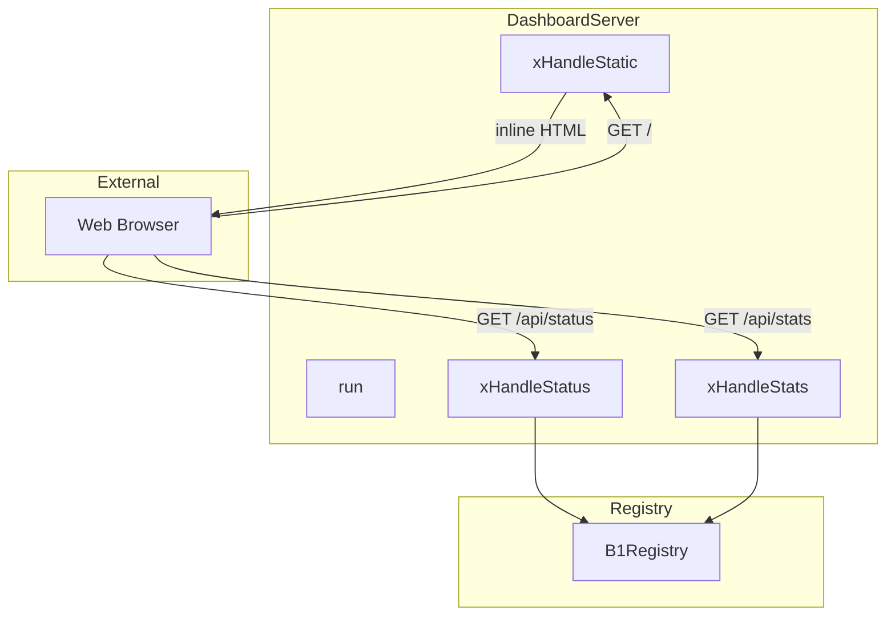
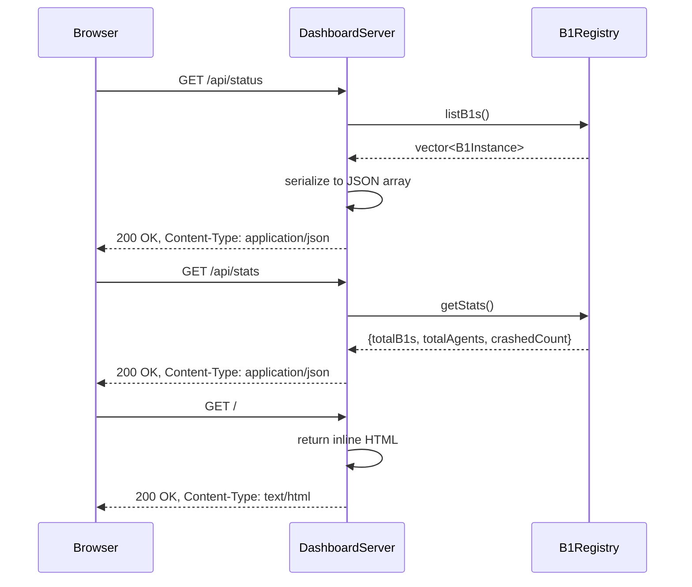

# DashboardServer Spec

## 1. Overview

HTTP dashboard server using uWebSockets. Serves JSON REST API endpoints for agent status and a static HTML dashboard page. Runs on the main thread alongside `C2Listener` on a separate thread.

**Dependencies:** uWebSockets, `B1Registry`, nlohmann/json

**Lifecycle:** Created at c2 startup, blocks on `run()` until shutdown.

## 2. Component Specifications

```cpp
namespace a0::c2 {

class DashboardServer {
public:
    DashboardServer(int port, B1Registry* registry);
    ~DashboardServer();

    int run();
    void shutdown();

private:
    int m_port;
    B1Registry* m_registry;
    bool m_running;

    void xHandleStatus(struct uWS::HttpResponse<true>* res,
                       struct uWS::HttpRequest* req);
    void xHandleStats(struct uWS::HttpResponse<true>* res,
                      struct uWS::HttpRequest* req);
    void xHandleStatic(struct uWS::HttpResponse<true>* res,
                       struct uWS::HttpRequest* req);
};

} // namespace a0::c2
```

## 3. Architecture Diagram



## 4. Data Flow



## 5. Error Handling

| Scenario | Behaviour |
|----------|-----------|
| Port already in use | `run` returns -1 |
| Unknown route requested | uWS returns 404 (default handler) |
| Registry empty | `/api/status` returns `[]`, `/api/stats` returns all zeros |
| uWS internal error | uWS handles internally; server continues |
| shutdown() called while handling request | Graceful: uWS finishes in-flight requests |

## 6. Edge Cases

| Case | Expected Result |
|------|----------------|
| Browser with no JavaScript | Static HTML with message: "Dashboard requires JavaScript" |
| 1000 concurrent /api/status requests | uWS handles async; each serializes registry under mutex |
| Registry updated between /api/status calls | Each call sees current state |
| c2 starts before any b1 connects | Dashboard shows "0 supervisors" |
| c2 started with --port 0 | run() returns -1 (invalid port) |

## 7. Testing Requirements

| Method | Test Case | Input | Expected |
|--------|-----------|-------|----------|
| `xHandleStatus` | Two b1s registered | — | JSON array with 2 entries, each has pid/workdir/agents |
| `xHandleStatus` | Empty registry | — | `[]` |
| `xHandleStatus` | b1 with crashed agents | 1 crashed agent | JSON includes state:"crashed" |
| `xHandleStats` | Mixed | 2 b1s, 1 crashed | `{"totalB1s":2,"totalAgents":3,"crashedCount":1}` |
| `xHandleStats` | Empty | — | `{"totalB1s":0,"totalAgents":0,"crashedCount":0}` |
| `xHandleStatic` | GET / | — | 200, HTML containing expected elements |
| `run` | Port 8080 | — | Service responds on :8080 |
| `run` | Port in use | — | Returns -1 |

## 8. Integration

`DashboardServer` is constructed in `c2_main.cpp` and runs on the main thread. The `B1Registry` pointer is shared with `C2Listener`. On SIGINT/SIGTERM, `c2_main.cpp` calls `shutdown()` and joins the listener thread.
