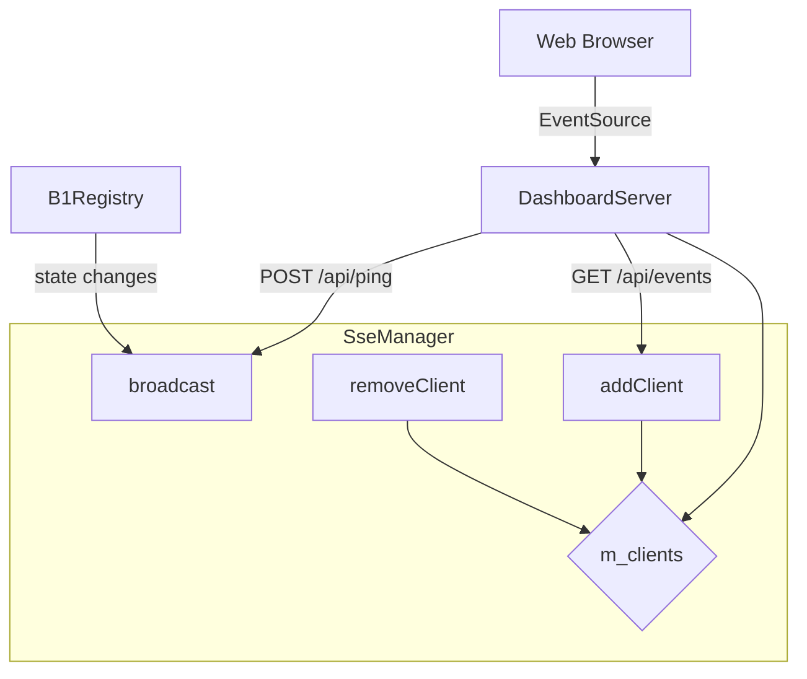
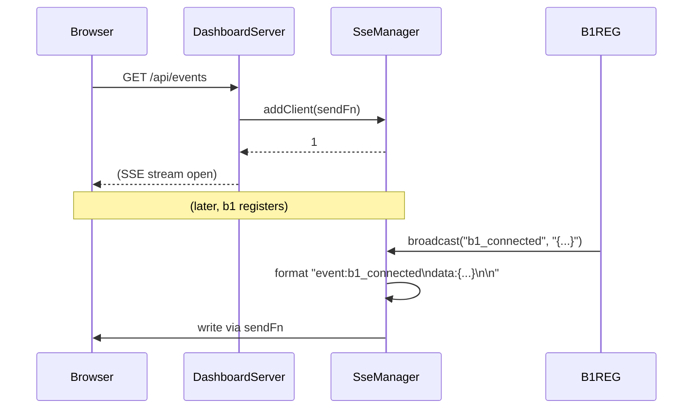

# SseManager Spec

## 1. Overview

Manages Server-Sent Events (SSE) client connections for the c2 dashboard. Clients register via `GET /api/events` and receive real-time push notifications of state changes (b1 connect/disconnect, agent updates, user prompts, pong responses).

**Dependencies:** None (type-erased `sendFn` callbacks provided by the HTTP route handler)

**Lifecycle:** Created at c2 startup. Clients come and go via HTTP connections; each client gets a unique `id`.

## 2. Component Specifications

```cpp
namespace a0::c2 {

class SseManager {
public:
    SseManager() = default;
    ~SseManager() = default;

    /// Register a new client. \p sendFn is called to write SSE data to the response.
    /// \returns Unique client id.
    int addClient(std::function<void(const std::string&)> sendFn);

    /// Remove a client (called from the uWS onAborted handler).
    void removeClient(int id);

    /// Broadcast an SSE event to all connected clients.
    /// Format: "event:<type>\ndata:<dataJson>\n\n"
    /// \returns Number of clients that received the event.
    int broadcast(const std::string& eventType, const std::string& dataJson);

    /// Broadcast with explicit SSE id field.
    int broadcast(const std::string& eventType, const std::string& dataJson, const std::string& id);

    size_t clientCount() const;

private:
    struct Client {
        int id;
        std::function<void(const std::string&)> send;
    };
    mutable std::mutex m_mutex;
    std::unordered_map<int, Client> m_clients;
    int m_nextId = 1;
};

} // namespace a0::c2
```

## 3. Architecture Diagram



## 4. Data Flow



## 5. Error Handling

| Condition | Behaviour |
|-----------|-----------|
| Client disconnect | `onAborted` calls `removeClient`; next write via dead sendFn is caught by try/catch |
| broadcast with 0 clients | Returns 0, no-op |
| Add/remove from multiple threads | Mutex-protected; safe |

## 6. Testing Requirements

| Method | Test | Expected |
|--------|------|----------|
| addClient + broadcast | 1 client | Client receives event via sendFn |
| removeClient | After add, before broadcast | Client does not receive |
| broadcast with 0 clients | No clients added | Returns 0 |
| addClient + broadcast with id | 1 client | Client receives "id: 1\nevent:...\ndata:...\n\n" |
| Concurrent add/remove | Multiple threads | No data races |
