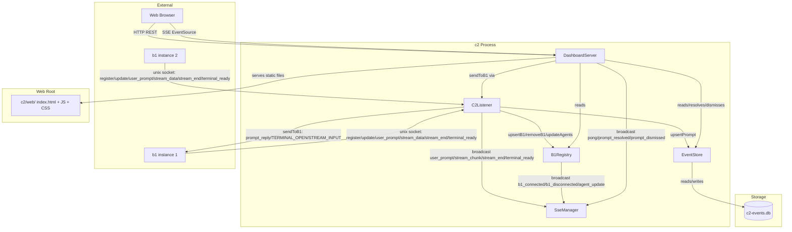
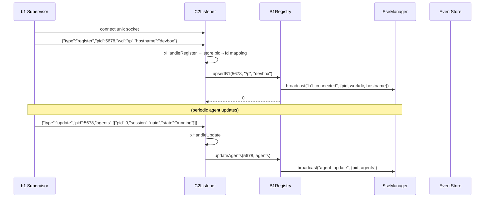
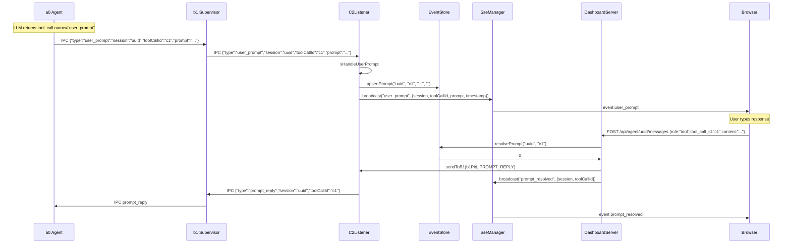
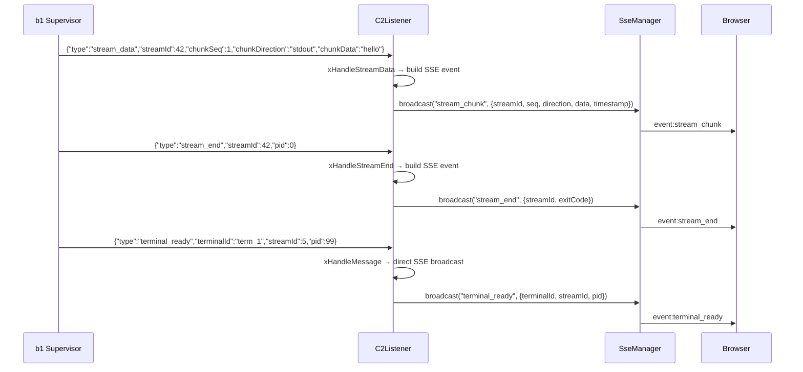
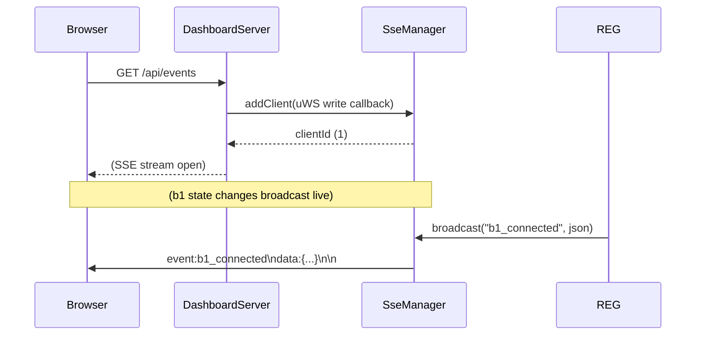
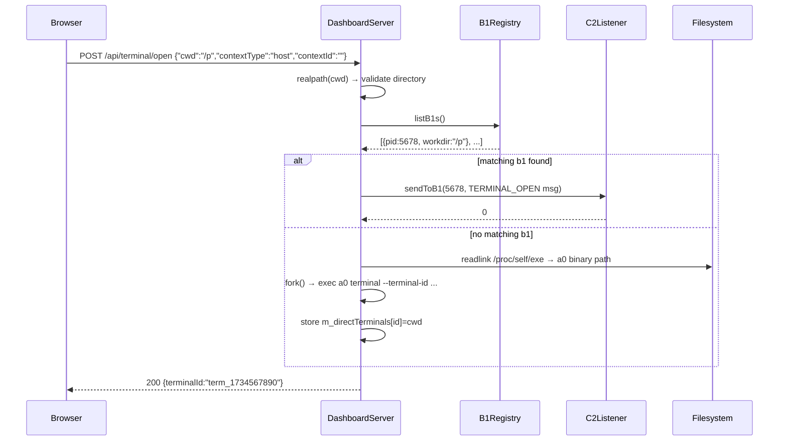

# Technical Specification: c2 Machine-Level Monitor Sub-Module

## §1. Overview

**Role:** c2 is a per-machine daemon that aggregates supervision data from all b1 instances on a single host. It receives b1 registrations, tracks a0 agent states, manages user-prompt events, and serves a web-based management dashboard over HTTP with real-time SSE push.

**Source files:** All in `src/c2/`:
- `c2_main.cpp` — CLI entry point, wiring, signal handling
- `c2_listener.h/.cpp` — Unix socket listener for b1 IPC messages
- `dashboard_server.h/.cpp` — uWebSockets HTTP server (REST + SSE + static files)
- `sse_manager.h/.cpp` — SSE client registry and broadcast
- `c2_event_store.h/.cpp` — SQLite-backed pending prompt storage
- `b1_registry.h/.cpp` — In-memory registry of b1 supervisors and agents

**Dependencies:** uWebSockets (HTTP server), SQLite3 (EventStore), `ipc_lib` (Unix socket + JSON-line protocol), nlohmann/json, POSIX (`poll`, `sigaction`, `fork`).

**Lifecycle:** Created at machine boot (auto-launched by first b1), runs until SIGINT/SIGTERM. Two threads: main thread blocks on `DashboardServer::run()` (uWS event loop), background thread runs `C2Listener::run()` (Unix socket poll loop).

---

## §2. Component Specifications

### 2.1 Core Data Structures

```cpp
struct AgentSummary {
    int pid = 0;
    std::string sessionUuid;
    std::string state;             // "running", "crashed", "stopped"
    int64_t connectedAt = 0;
    int64_t lastHeartbeat = 0;
};

struct B1Instance {
    int pid = 0;
    std::string workdir;
    std::string hostname;
    std::chrono::steady_clock::time_point connectedAt;
    std::chrono::steady_clock::time_point lastUpdate;
    std::vector<AgentSummary> agents;
};

struct PendingPrompt {
    std::string session;
    std::string toolCallId;
    std::string prompt;
    std::string context;
    int64_t createdAt = 0;
};
```

### 2.2 B1Registry

```cpp
namespace a0::c2 {

class SseManager;

class B1Registry {
public:
    B1Registry() = default;

    void setSseManager(SseManager* sse) { m_sse = sse; }

    int upsertB1(int pid, const std::string& workdir, const std::string& hostname);
    int removeB1(int pid);
    int updateAgents(int pid, const std::vector<AgentSummary>& agents);
    std::vector<B1Instance> listB1s() const;
    void getStats(int& totalB1s, int& totalAgents, int& crashedCount) const;
    int pruneStale(int maxAgeSeconds = 60);

private:
    mutable std::mutex m_mutex;
    std::unordered_map<int, B1Instance> m_b1s;
    SseManager* m_sse = nullptr;
};

} // namespace a0::c2
```

### 2.3 SseManager

```cpp
namespace a0::c2 {

class SseManager {
public:
    SseManager() = default;
    ~SseManager() = default;

    int addClient(std::function<void(const std::string&)> sendFn);
    void removeClient(int id);
    int broadcast(const std::string& eventType, const std::string& dataJson);
    int broadcast(const std::string& eventType, const std::string& dataJson, const std::string& id);
    size_t clientCount() const;

private:
    struct Client {
        int id;
        std::function<void(const std::string&)> send;
    };
    mutable std::mutex m_mutex;
    std::unordered_map<int, Client> m_clients;
    int m_nextId = 1;
};

} // namespace a0::c2
```

### 2.4 EventStore

```cpp
namespace a0::c2 {

class EventStore {
public:
    explicit EventStore(const std::string& dbPath);
    ~EventStore();

    int upsertPrompt(const std::string& session, const std::string& toolCallId,
                     const std::string& prompt, const std::string& context);
    std::vector<PendingPrompt> listPending() const;
    int resolvePrompt(const std::string& session, const std::string& toolCallId);
    int dismissPrompt(const std::string& session, const std::string& toolCallId);

private:
    class Impl;
    std::unique_ptr<Impl> m_impl;
};

} // namespace a0::c2
```

SQLite schema:

```sql
CREATE TABLE IF NOT EXISTS pending_prompts (
    session      TEXT PRIMARY KEY,
    tool_call_id TEXT NOT NULL,
    prompt       TEXT NOT NULL,
    context      TEXT DEFAULT '',
    created_at   INTEGER NOT NULL
);
```

### 2.5 C2Listener

```cpp
namespace a0::c2 {

class SseManager;
class EventStore;

class C2Listener {
public:
    C2Listener(const std::string& socketPath, B1Registry* registry,
               SseManager* sse, EventStore* events);
    ~C2Listener();

    int run();
    void shutdown();

    int sendToB1(int b1Pid, const ipc::Message& msg);

private:
    std::string m_socketPath;
    B1Registry* m_registry;
    SseManager* m_sse;
    EventStore* m_events;
    ipc::UnixSocket m_listenSocket;
    int m_listenFd = -1;
    bool m_running = false;
    std::unordered_map<int, ipc::BufferedSocket> m_peers;
    std::unordered_map<int, int> m_b1PidToFd;
    std::mutex m_b1Mutex;

    int xHandleMessage(const nlohmann::json& msg, int peerFd);
    int xHandleRegister(const nlohmann::json& msg, int peerFd);
    int xHandleUpdate(const nlohmann::json& msg);
    int xHandleUserPrompt(const nlohmann::json& msg);
    int xHandleStreamData(const nlohmann::json& msg);
    int xHandleStreamEnd(const nlohmann::json& msg);
    void xCleanupStaleSocket();
};

} // namespace a0::c2
```

### 2.6 DashboardServer

```cpp
namespace a0::c2 {

class B1Registry;
class SseManager;
class EventStore;
class C2Listener;

class DashboardServer {
public:
    DashboardServer(int port, B1Registry* registry, SseManager* sse,
                    EventStore* events, C2Listener* listener,
                    const std::string& webRoot,
                    const std::string& sslKey = "",
                    const std::string& sslCert = "");
    ~DashboardServer();

    int run();
    void shutdown();

private:
    int m_port;
    B1Registry* m_registry;
    SseManager* m_sse;
    EventStore* m_events;
    C2Listener* m_listener;
    std::string m_webRoot;
    std::string m_sslKey;
    std::string m_sslCert;
    bool m_running = false;
    bool m_shutdownRequested = false;
    struct us_listen_socket_t* m_listenToken = nullptr;

    std::unordered_map<std::string, std::string> m_directTerminals;

    template<typename App> void xSetupRoutes(App* app);
    std::string xBuildStatusJson();
    std::string xBuildStatsJson();
    std::string xBuildPendingJson();
    template<typename Res> void xServeStatic(Res* res, const std::string& urlPath);
    static std::string xMimeType(const std::string& path);
    static std::string xReadFile(const std::string& path);
};

} // namespace a0::c2
```

---

## §3. Architecture Diagram



---

## §4. Data Flow

### 4.1 b1 Registration and Periodic Update



### 4.2 User Prompt Lifecycle



### 4.3 Stream Data Relay



### 4.4 SSE Connection



### 4.5 Terminal Launch



---

## §5. Testing Requirements

### 5.1 B1Registry

| Method | Test Case | Input | Expected |
|--------|-----------|-------|----------|
| `upsertB1` | New instance | pid, wd, hostname | Instance added, SSE broadcast sent |
| `upsertB1` | Existing | Same pid | Instance updated, SSE sent |
| `removeB1` | Existing pid | pid | Instance removed, SSE sent |
| `removeB1` | Unknown pid | pid=999 | Returns -1 |
| `updateAgents` | Valid agents | pid, agent list | Agents replaced, SSE sent |
| `listB1s` | Two instances | — | Vector with 2 entries |
| `listB1s` | Empty | — | Empty vector |
| `getStats` | Mixed | 2 b1s, 1 crashed | `totalB1s=2, totalAgents=3, crashedCount=1` |
| `pruneStale` | Old instance | maxAge=0 | Stale removed, SSE sent |

### 5.2 SseManager

| Method | Test Case | Input | Expected |
|--------|-----------|-------|----------|
| `addClient` | New client | sendFn callback | Returns unique id > 0 |
| `removeClient` | Existing id | id | Client removed |
| `removeClient` | Unknown id | id=999 | No-op |
| `broadcast` | 1 client | eventType, dataJson | Client receives formatted SSE |
| `broadcast` | 0 clients | eventType, dataJson | Returns 0 |
| `broadcast` | With id field | eventType, dataJson, id | Client receives `id:...\nevent:...\ndata:...\n\n` |
| `clientCount` | 2 clients | — | Returns 2 |
| Concurrent add/remove | Multiple threads | — | No data races |

### 5.3 EventStore

| Method | Test Case | Input | Expected |
|--------|-----------|-------|----------|
| `upsertPrompt` | New prompt | session, toolCallId, prompt, context | Stored, listPending returns 1 |
| `upsertPrompt` | Duplicate session | Same session | Updated |
| `listPending` | One entry | — | Vector with 1 PendingPrompt |
| `listPending` | Empty store | — | Empty vector |
| `resolvePrompt` | Existing | session, toolCallId | Removed from pending |
| `dismissPrompt` | Existing | session, toolCallId | Removed from pending |

### 5.4 C2Listener

| Method | Test Case | Input | Expected |
|--------|-----------|-------|----------|
| `xHandleRegister` | Valid | `{"type":"register","pid":1,"wd":"/x","hostname":"h"}` | Calls upsertB1, stores pid→fd mapping |
| `xHandleRegister` | Missing pid | `{"type":"register"}` | Returns -1 |
| `xHandleUpdate` | Valid | `{"type":"update","pid":1,"agents":[...]}` | Calls updateAgents |
| `xHandleUserPrompt` | Valid | `{"session":"s","toolCallId":"c","prompt":"?"}` | Upserts EventStore, broadcasts SSE |
| `xHandleUserPrompt` | Missing fields | `{"type":"user_prompt"}` | Returns -1 |
| `xHandleStreamData` | Valid | `{"streamId":1,"chunkSeq":0,"chunkDirection":"stdout","chunkData":"o"}` | Broadcasts stream_chunk SSE |
| `xHandleStreamData` | m_sse null | — | Returns -1 |
| `xHandleStreamEnd` | Valid | `{"streamId":1,"pid":0}` | Broadcasts stream_end SSE |
| `xHandleStreamEnd` | m_sse null | — | Returns -1 |
| `sendToB1` | Known pid | pid, PROMPT_REPLY | Sends IPC message, returns >= 0 |
| `sendToB1` | Unknown pid | pid=999 | Returns -1 |
| `shutdown` | During poll | Call from other thread | run() returns 0 |

### 5.5 DashboardServer

| Method | Test Case | Input | Expected |
|--------|-----------|-------|----------|
| `xBuildStatusJson` | Two b1s | — | JSON array with 2 entries |
| `xBuildStatusJson` | Empty registry | — | `[]` |
| `xBuildStatsJson` | Mixed | 2 b1s, 1 crashed | `{"totalB1s":2,"totalAgents":3,"crashedCount":1}` |
| `xBuildPendingJson` | One pending | — | Array with 1 entry |
| `xBuildPendingJson` | No pending | — | `[]` |
| `xServeStatic` | Existing file | `/js/app.js` | 200, correct MIME type |
| `xServeStatic` | Missing file | `/nope` | 200, index.html served |
| `xServeStatic` | web_root missing | — | 404 "Not Found" |
| `xMimeType` | .js | — | `text/javascript` |
| `xMimeType` | .unknown | — | `application/octet-stream` |
| `xReadFile` | Existing | — | File contents string |
| `xReadFile` | Missing | — | Empty string |
| `run` | SSL enabled | sslKey + sslCert | Creates uWS::SSLApp |
| `run` | No SSL | — | Creates uWS::App |
| `shutdown` | Running | — | Socket closed, m_running=false |

---

## §6. (Skipped — no D3 animations)

---

## §7. CLI Entry Point

Wired in `src/c2/c2_main.cpp`:

```
c2 [--port <n>] [--socket <path>] [--web-root <path>] [--ssl-key <file> --ssl-cert <file>] [--log-file <path>]
```

| Flag | Default | Description |
|------|---------|-------------|
| `--port` | `8080` (or `A0_C2_PORT` env) | HTTP dashboard port |
| `--socket` | `$XDG_RUNTIME_DIR/a0-c2.sock` | Unix socket path for b1 IPC |
| `--web-root` | `<cwd>/.a0/git/opensassi/a0/c2/web` (or `C2_DEFAULT_WEB_ROOT` compile define) | Static file root |
| `--ssl-key` | — | TLS key file path |
| `--ssl-cert` | — | TLS cert file path |
| `--log-file` | — | Redirect stdout+stderr to file; child a0 processes derive own paths |
| `--help` | — | Print usage and exit 0 |

### Environment Variables

| Variable | Description |
|----------|-------------|
| `A0_C2_PORT` | Override HTTP port (same as `--port`) |
| `XDG_RUNTIME_DIR` | Base directory for default socket path |
| `C2_DEFAULT_WEB_ROOT` | Compile-time define to override default web root |

### Startup Sequence

1. Parse CLI flags, env vars (`A0_C2_PORT`, `XDG_RUNTIME_DIR`)
2. Compute `baseDir = XDG_RUNTIME_DIR ?? /tmp`
3. Determine `webRoot = C2_DEFAULT_WEB_ROOT ?? ${cwd}/.a0/git/opensassi/a0/c2/web`
4. Clean stale socket: `UnixSocket::unlinkPath(socketPath)`
5. Create `EventStore(socketPath + ".db")` — SQLite backing for pending prompts
6. Create `SseManager`
7. Create `B1Registry`, inject SSE: `registry.setSseManager(&sse)`
8. Write PID file at `baseDir/a0-c2.pid`
9. Redirect stdout+stderr to log file if `--log-file` specified (via `dup2`)
10. Create `C2Listener` and `DashboardServer` with all dependency pointers
11. Register signal handlers: `sigaction(SIGINT)` and `sigaction(SIGTERM)` → `handleSignal()`
12. Spawn listener thread: `std::thread([&listener] { listener.run(); })`
13. Block on main thread: `dashboard.run()` (uWS event loop)
14. On shutdown: `DashboardServer::shutdown()` → `C2Listener::shutdown()` → join thread → unlink socket → remove PID file → `_exit(0)`

### Signal Handler

```cpp
static void handleSignal(int) {
    if (g_dashboard) g_dashboard->shutdown();
    if (g_listener) g_listener->shutdown();
    if (g_socketPath) a0::ipc::UnixSocket::unlinkPath(*g_socketPath);
    if (g_pidPath) std::remove(g_pidPath->c_str());
    _exit(0);
}
```

### Compile-Time Override

```cpp
static std::string xGetWebRoot(const std::string& cwd) {
#ifdef C2_DEFAULT_WEB_ROOT
    return C2_DEFAULT_WEB_ROOT;
#else
    return cwd + "/.a0/git/opensassi/a0/c2/web";
#endif
}
```
