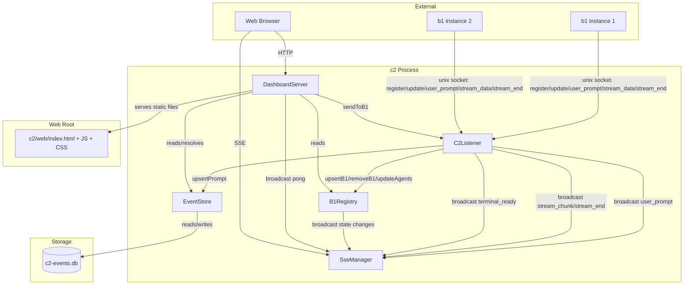
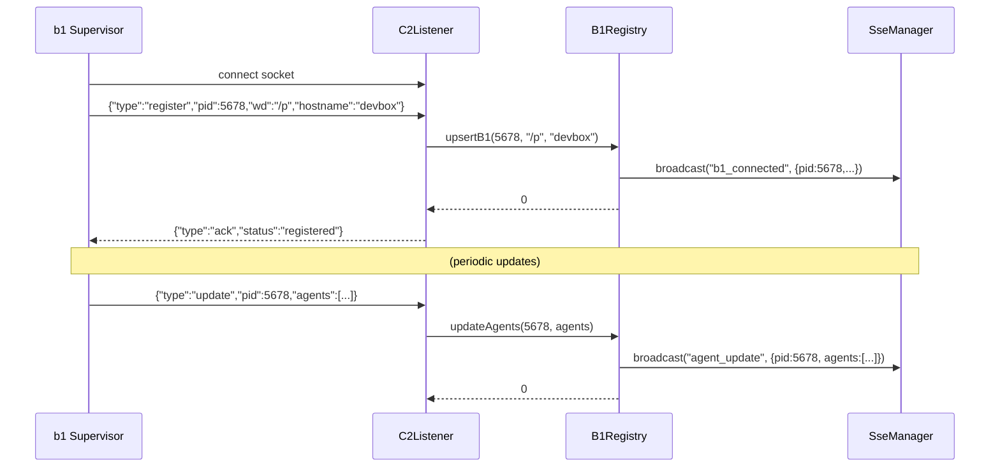
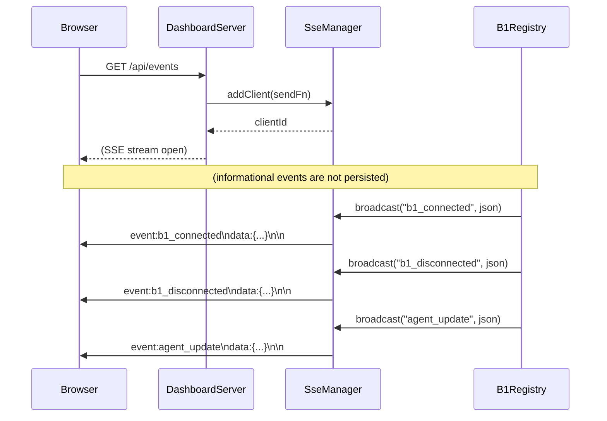
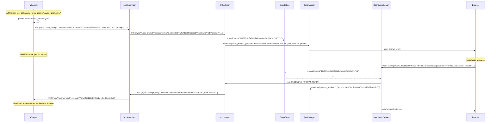
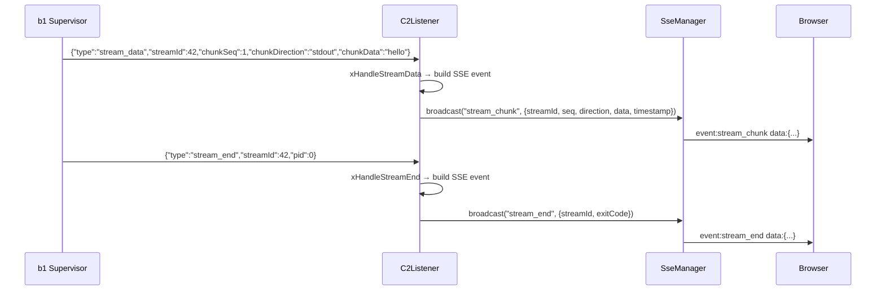
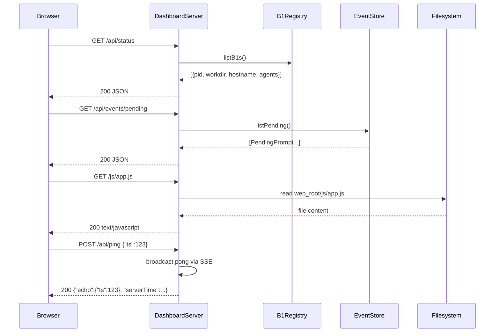

# Technical Specification: c2 Machine-Level Monitor Sub-Module

## For a0 Agent — Version 2.0

---

## 1. Overview

This document specifies a **c2 machine-level monitor sub-module** for the existing a0 C++17 agent ecosystem. The sub-module produces a standalone executable (`c2`) that aggregates supervision data from all b1 instances on a single machine and serves a web-based management UI.

**Purpose**: c2 is a per-machine daemon (one instance per host) that receives registrations from b1 supervisors, tracks their reported a0 agent states, manages user prompt events, and serves a WebComponents-based SPA dashboard over HTTP with real-time SSE push.

**Key behaviors**:

- **One instance per machine** — identified by a fixed Unix socket at `$XDG_RUNTIME_DIR/a0-c2.sock`
- **b1 auto-discovery** — when a b1 starts, it checks for c2 and starts one if missing, then registers
- **uWebSockets HTTP server** — serves REST API, static UI files, and SSE stream on localhost (configurable port, default 8080)
- **SSE push** — real-time events pushed to all connected browser clients: b1 connection/disconnection, agent state changes, user_prompt creation/resolution
- **User prompt management** — `user_prompt` tool call events (from a0→b1→c2) are stored in a SQLite-backed `EventStore` and served to the UI via SSE + REST
- **Multi-host support** — UI can connect to multiple c2 instances on different machines via configurable host list
- **Stateless between b1 registrations** — durable prompt state lives in SQLite; informational state refreshed from REST endpoints
- **`--port` CLI flag** — configurable HTTP port for the dashboard
- **`--web-root` CLI flag** — configurable path to static web UI files (default: `<cwd>/.a0/git/opensassi/a0/c2/web`)

---

## 2. Component Specifications (C++ Interfaces)

All new classes are defined in the `a0::c2` namespace, declared in `src/c2/`.

### 2.1 Core Data Structures

```cpp
#pragma once

#include <string>
#include <vector>
#include <chrono>
#include <cstdint>
#include <unordered_map>
#include "nlohmann/json.hpp"

namespace a0::c2 {

/// State of a supervised agent as reported by b1.
enum class AgentState {
    RUNNING,
    CRASHED,
    STOPPED
};

/// An a0 instance reported by a b1 supervisor.
struct AgentSummary {
    int pid = 0;
    std::string sessionUuid;
    std::string state;             // "running", "crashed", "stopped"
    int64_t connectedAt = 0;
    int64_t lastHeartbeat = 0;
};

/// A b1 supervisor instance registered with c2.
struct B1Instance {
    int pid = 0;
    std::string workdir;
    std::string hostname;
    std::chrono::steady_clock::time_point connectedAt;
    std::chrono::steady_clock::time_point lastUpdate;
    std::vector<AgentSummary> agents;
};

/// A pending user_prompt event awaiting UI response.
struct PendingPrompt {
    std::string session;
    std::string toolCallId;
    std::string prompt;
    std::string context;
    int64_t createdAt;
};

} // namespace a0::c2
```

### 2.2 B1Registry

```cpp
namespace a0::c2 {

class SseManager;

/// In-memory registry of all connected b1 supervisors and their a0 agents.
class B1Registry {
public:
    B1Registry();
    void setSseManager(SseManager* sse);

    int upsertB1(int pid, const std::string& workdir, const std::string& hostname);
    int removeB1(int pid);
    int updateAgents(int pid, const std::vector<AgentSummary>& agents);
    std::vector<B1Instance> listB1s() const;
    void getStats(int& totalB1s, int& totalAgents, int& crashedCount) const;
    int pruneStale(int maxAgeSeconds = 60);

private:
    mutable std::mutex m_mutex;
    std::unordered_map<int, B1Instance> m_b1s;
    SseManager* m_sse = nullptr;
};

} // namespace a0::c2
```

`B1Registry` is now observable: it accepts an optional `SseManager*`. On every state mutation (`upsertB1`, `removeB1`, `updateAgents`, `pruneStale`), the registry broadcasts the corresponding SSE event (`b1_connected`, `b1_disconnected`, `agent_update`) to all connected UI clients.

### 2.3 SseManager

```cpp
namespace a0::c2 {

/// Manages SSE client connections and broadcasts events.
class SseManager {
public:
    SseManager() = default;

    int addClient(std::function<void(const std::string&)> sendFn);
    void removeClient(int id);
    int broadcast(const std::string& eventType, const std::string& dataJson);
    int broadcast(const std::string& eventType, const std::string& dataJson, const std::string& id);
    size_t clientCount() const;

private:
    struct Client { int id; std::function<void(const std::string&)> send; };
    mutable std::mutex m_mutex;
    std::unordered_map<int, Client> m_clients;
    int m_nextId = 1;
};

} // namespace a0::c2
```

The `sendFn` callback is provided by the route handler and captures the uWS `HttpResponse*` to perform SSE writes. On `onAborted`, the client removes itself. Broadcast sends `event:<type>\ndata:<json>\n\n` to all active clients.

### 2.4 EventStore

```cpp
namespace a0::c2 {

/// SQLite-backed store for pending user_prompt events.
class EventStore {
public:
    explicit EventStore(const std::string& dbPath);
    ~EventStore();

    int upsertPrompt(const std::string& session, const std::string& toolCallId,
                     const std::string& prompt, const std::string& context);
    std::vector<PendingPrompt> listPending() const;
    int resolvePrompt(const std::string& session, const std::string& toolCallId);
    int dismissPrompt(const std::string& session, const std::string& toolCallId);

private:
    class Impl;
    std::unique_ptr<Impl> m_impl;
};

} // namespace a0::c2
```

A lightweight SQLite3 store with a single `pending_prompts` table. Prompts are created by `upsertPrompt` on incoming `user_prompt` IPC messages from b1, and removed by `resolvePrompt` (when the user sends a tool response via the UI) or `dismissPrompt` (user dismisses without answering).

Schema:

```sql
CREATE TABLE IF NOT EXISTS pending_prompts (
    session      TEXT PRIMARY KEY,
    tool_call_id TEXT NOT NULL,
    prompt       TEXT NOT NULL,
    context      TEXT DEFAULT '',
    created_at   INTEGER NOT NULL
);
```

### 2.5 C2Listener

```cpp
namespace a0::c2 {

class SseManager;
class EventStore;

/// Listens on the Unix domain socket for b1 registration/update/user_prompt messages.
class C2Listener {
public:
    C2Listener(const std::string& socketPath, B1Registry* registry,
               SseManager* sse, EventStore* events);
    ~C2Listener();

    int run();
    void shutdown();
    int sendToB1(int b1Pid, const ipc::Message& msg);

private:
    std::string m_socketPath;
    B1Registry* m_registry;
    SseManager* m_sse;
    EventStore* m_events;
    ipc::UnixSocket m_listenSocket;
    int m_listenFd = -1;
    bool m_running = false;
    std::vector<int> peerFds;
    std::unordered_map<int, int> m_b1PidToFd;
    std::mutex m_b1Mutex;

    int xHandleMessage(const nlohmann::json& msg, int peerFd);
    int xHandleRegister(const nlohmann::json& msg, int peerFd);
    int xHandleUpdate(const nlohmann::json& msg);
    int xHandleUserPrompt(const nlohmann::json& msg);
    int xHandleStreamData(const nlohmann::json& msg);
    int xHandleStreamEnd(const nlohmann::json& msg);
    void xCleanupStaleSocket();
};

} // namespace a0::c2
```

Extended from the original to:
- Track b1 PID → fd mapping for bidirectional communication
- Handle `user_prompt` IPC messages (store in EventStore + broadcast via SSE)
- Expose `sendToB1()` for the DashboardServer to send `prompt_reply` signals

### 2.6 DashboardServer

```cpp
namespace a0::c2 {

class B1Registry;
class SseManager;
class EventStore;
class C2Listener;

/// HTTP dashboard server with REST API, SSE, and static file serving.
class DashboardServer {
public:
    DashboardServer(int port, B1Registry* registry, SseManager* sse,
                    EventStore* events, C2Listener* listener,
                    const std::string& webRoot,
                    const std::string& sslKey = "",
                    const std::string& sslCert = "");
    ~DashboardServer();
    int run();
    void shutdown();

    // Route handlers (templated for SSL/non-SSL deduplication)
    template<typename App> void xSetupRoutes(App* app);
    template<typename Res> void xServeStatic(Res* res, const std::string& urlPath);

private:
    int m_port;
    B1Registry* m_registry;
    SseManager* m_sse;
    EventStore* m_events;
    C2Listener* m_listener;
    std::string m_webRoot;
    std::string m_sslKey;
    std::string m_sslCert;
    bool m_running;
};

} // namespace a0::c2
```

Replaces inline HTML with static file serving from `webRoot`. Uses a template-based `xSetupRoutes` to eliminate SSL/non-SSL route duplication.

**Route table:**

| Method | Path | Description |
|--------|------|-------------|
| GET | `/api/status` | All b1s + agents |
| GET | `/api/stats` | Aggregate counts |
| GET | `/api/events` | SSE stream |
| GET | `/api/events/pending` | Unresolved user prompts |
| GET | `/api/b1/:pid` | Single b1 details |
| GET | `/api/b1/:pid/agents` | Agents under b1 |
| GET | `/api/agent/:uuid` | Agent session info |
| POST | `/api/agent/:uuid/messages` | Append message + resolve prompt if tool role |
| DELETE | `/api/agent/:uuid/prompt/:toolCallId` | Dismiss prompt |
| POST | `/api/ping` | Triggers pong on SSE |
| POST | `/api/terminal/open` | Launch PTY terminal via b1 or direct a0 fork |
| GET | `/api/terminal/status/:terminalId` | Poll SQLite for stream readiness |
| POST | `/api/stream/:id/input` | Forward terminal stdin via b1 IPC |
| GET | `/api/stream/:id/chunks` | Stream output from SQLite ordered by seq |
| GET | `/api/session/:uuid/streams` | All streams for a session |
| GET | `/*` | Static files, SPA fallthrough |

---

## 3. System Architecture (C4 Diagram)



## 4. Data Flow Diagrams

### 4.1 b1 Registration and Periodic Update



### 4.2 SSE Event Flow



### 4.3 User Prompt Lifecycle



### 4.4 Stream Data Relay



### 4.5 Dashboard API (HTTP)



---

## 5. Configuration & CLI Extensions

### 5.1 c2 CLI

```
c2 [--port <n>] [--socket <path>] [--web-root <path>] [--ssl-key <file> --ssl-cert <file>] [--log-file <path>]

| Flag | Default | Description |
|------|---------|-------------|
| `--port` | `8080` | HTTP dashboard port |
| `--socket` | `$XDG_RUNTIME_DIR/a0-c2.sock` | Unix socket path for b1 registrations |
| `--web-root` | `<cwd>/.a0/git/opensassi/a0/c2/web` | Static file serving root |
| `--ssl-key` | — | TLS key file path |
| `--ssl-cert` | — | TLS cert file path |
| `--log-file` | — | Redirect stderr to file; forked a0 terminal derives own path |

### 5.2 Environment Variables

| Variable | Used by | Description |
|----------|---------|-------------|
| `A0_C2_PORT` | c2 | Override HTTP port |
| `A0_C2_SOCKET` | c2 | Override socket path |
| `XDG_RUNTIME_DIR` | c2 | Base for default socket path |

---

## 6. SSE Event Types

All SSE events use the `event:` field for discrimination and `data:` for JSON payload.

| Event | Persistent | Fields | Description |
|-------|------------|--------|-------------|
| `b1_connected` | No | pid, workdir, hostname, timestamp | New b1 registered |
| `b1_disconnected` | No | pid, workdir, hostname, timestamp, [reason] | b1 disconnected or pruned |
| `agent_update` | No | pid, agents[{pid, session, state}], timestamp | Agent list snapshot pushed |
| `user_prompt` | Yes (SQLite) | session, toolCallId, prompt, timestamp | Agent needs user input |
| `prompt_resolved` | No | session, toolCallId | User responded to prompt |
| `prompt_dismissed` | No | session, toolCallId | User dismissed prompt |
| `pong` | No | echo, serverTime | Response to client ping |
| `stream_chunk` | No | streamId, seq, direction, data, timestamp | Streaming tool output chunk |
| `stream_end` | No | streamId, exitCode | Streaming tool exited |
| `terminal_ready` | No | terminalId, streamId, pid | a0 terminal instance started |

Events that require user input (`user_prompt`) are persisted in SQLite until resolved or dismissed. Informational events are not stored — the UI refreshes base state from REST endpoints on reconnect.

---

## 7. Web UI Architecture

The web UI is a single-page application using native WebComponents (Custom Elements v1, no build step). All files are served from the `--web-root` directory.

### 7.1 File Layout

```
web_root/
├── index.html            # SPA shell
├── css/
│   └── main.css          # All styles (CSS variables for theming)
└── js/
    ├── app.js            # Bootstrap, router
    ├── store.js          # Reactive state + localStorage
    ├── sse.js            # EventSource management
    ├── api.js            # fetch() wrappers
    └── components/
        ├── app-shell.js
        ├── app-header.js
        ├── prompt-badge.js
        ├── dashboard-page.js
        ├── stats-cards.js
        ├── host-list.js
        ├── event-log.js
        ├── hosts-page.js
        ├── projects-page.js
        ├── agent-page.js
        ├── conversation-view.js
        ├── message-bubble.js
        ├── prompt-banner.js
        ├── settings-page.js
        └── sse-provider.js
```

### 7.2 Routing (Client-side History API)

| Route | Component | Description |
|-------|-----------|-------------|
| `/` | `dashboard-page` | Overview: stats, host list, event log, prompt banner |
| `/hosts` | `hosts-page` | Manage connected c2 instances |
| `/projects` | `projects-page` | All b1 instances + agent lists |
| `/agent/:uuid` | `agent-page` | LLM conversation viewer |
| `/settings` | `settings-page` | Display preferences |

### 7.3 Client-side Ping/Pong Keepalive

- Every 30s, the browser sends `POST /api/ping {"ts":<epoch>}`
- Server broadcasts a `pong` SSE event with the echo
- If no `pong` received within 35s, the browser closes the EventSource, refreshes base state from REST, and opens a new connection

### 7.4 Conversation Viewer

- Initial load: last 50 messages via `GET /api/agent/:uuid/messages?limit=50`
- Scroll-to-top: fetches 50 older messages
- Ring buffer: max 200 messages in memory, old messages pruned
- Collapse controls: system prompts, reasoning, and tool results collapsed by default (configurable in `/settings`)
- User_prompt banner appears at bottom when new prompt arrives, auto-focuses input

---

## 8. IPC Protocol Extensions

Two new message types are added to the IPC protocol for user prompt signalling:

```cpp
namespace MessageType {
    // ...existing types
    constexpr const char* USER_PROMPT  = "user_prompt";   // a0→b1→c2
    constexpr const char* PROMPT_REPLY = "prompt_reply";  // c2→b1→a0
}
```

The `Message` struct gains two fields:

```cpp
struct Message {
    // ...existing fields
    std::string toolCallId;
    std::string prompt;
};
```

**user_prompt** (a0→b1→c2):
```json
{"type":"user_prompt","session":"d4a7f2c1b3e809f7a2c4d6e8f0a1b3c5","toolCallId":"call_abc","prompt":"Enter file path:"}
```

**prompt_reply** (c2→b1→a0):
```json
{"type":"prompt_reply","session":"d4a7f2c1b3e809f7a2c4d6e8f0a1b3c5","toolCallId":"call_abc"}
```

The prompt_reply IPC is a lightweight signal — the actual response content is read by a0 from the persistence layer (SQLite).

---

## 9. b1 Supervisor Changes

The b1 `Supervisor` class is updated to:

1. **Track c2 messages in the poll loop**: `m_c2Fd` is added to the poll fd list so incoming messages from c2 (specifically `prompt_reply`) are received
2. **Forward `user_prompt` from a0 to c2**: New `xHandleUserPrompt` handler sends the message upstream
3. **Forward `prompt_reply` from c2 to a0**: New `xHandlePromptReply` handler looks up the agent fd by session UUID and forwards

The `AgentRecord` struct gains a `fd` field for easier fd-based lookups:

```cpp
struct AgentRecord {
    int pid = 0;
    int fd = -1;
    std::string sessionUuid;
    AgentState state;
    std::chrono::steady_clock::time_point connectedAt;
    std::chrono::steady_clock::time_point lastHeartbeat;
};
```

---

## 10. Testing Requirements

### 10.1 Unit Tests

| Class | Test Case | Verification |
|-------|-----------|-------------|
| `B1Registry` | upsertB1 new instance | Instance added, SSE broadcast sent |
| `B1Registry` | removeB1 existing | Instance removed, SSE broadcast sent |
| `B1Registry` | updateAgents | Agent list replaced, SSE broadcast sent |
| `B1Registry` | getStats with mixed states | Counts match |
| `SseManager` | addClient then broadcast | Client receives event |
| `SseManager` | removeClient | Client no longer receives |
| `SseManager` | broadcast with 0 clients | Returns 0, no crash |
| `EventStore` | upsertPrompt then listPending | Returns 1 prompt |
| `EventStore` | resolvePrompt | Prompt removed from list |
| `EventStore` | dismissPrompt | Prompt removed from list |
| `DashboardServer` | xBuildStatusJson | JSON array |
| `DashboardServer` | xBuildStatsJson | JSON with counts |
| `DashboardServer` | xBuildPendingJson | JSON array of pending prompts |
| `DashboardServer` | xMimeType .js | text/javascript |
| `C2Listener` | sendToB1 unknown pid | Returns -1 |
| `C2Listener` | xHandleUserPrompt | Stores in EventStore, broadcasts SSE |
| `C2Listener` | xHandleStreamData | Builds SSE event, broadcasts stream_chunk |
| `C2Listener` | xHandleStreamEnd | Builds SSE event, broadcasts stream_end |
| `C2Listener` | xHandleStreamData missing fields | Returns -1, no broadcast |

### 10.2 Integration Tests

| ID | Scenario | Steps | Expected |
|----|----------|-------|----------|
| INT‑C2‑01 | b1 registers with c2 | Start c2, then start b1 | c2 receives register, B1Registry has 1 entry, SSE broadcast |
| INT‑C2‑02 | b1 pushes update to c2 | b1 tracks an a0, sends update | c2 reflects agent, SSE broadcast |
| INT‑C2‑03 | Dashboard shows status | curl /api/status | JSON includes registered b1 data |
| INT‑C2‑04 | SSE event received | Connect to /api/events, register b1 | Client receives b1_connected event |
| INT‑C2‑05 | user_prompt lifecycle | b1 sends user_prompt IPC, UI responds via POST | Prompt stored, UI receives SSE, prompt resolved, b1 receives prompt_reply |
| INT‑C2‑06 | Static file serving | GET /js/app.js | 200 text/javascript |
| INT‑C2‑07 | SPA fallthrough | GET /nonexistent/path | 200 text/html (index.html) |
| INT‑C2‑08 | ping/pong | POST /api/ping {"ts":1} | SSE pong event received, response JSON matches |

---

## 11. Integration with Existing Main Specification

### 11.1 Dependencies

c2 depends on:
- **uWebSockets** — HTTP server (via FetchContent)
- **SQLite3** — EventStore for pending prompts
- **IPC library** (`ipc_lib`) — Unix socket + JSON-line protocol
- **nlohmann/json** — JSON (already a dependency of a0_lib)

### 11.2 Threading Model

c2 has two concurrent event sources:
- **Unix socket** (b1 registrations) — `C2Listener::run()` on a dedicated thread
- **HTTP server** (dashboard/API) — `DashboardServer::run()` on main thread

Both access `B1Registry` under a mutex (low contention). `SseManager` has its own mutex. `C2Listener::sendToB1` uses a separate `m_b1Mutex` for the PID→fd map.

### 11.3 c2_main Startup Sequence

1. Parse `--port`, `--socket`, `--web-root`, `--ssl-key`, `--ssl-cert` flags + env vars
2. Compute default `webRoot` from CWD: `<cwd>/.a0/git/opensassi/a0/c2/web`
3. Create `EventStore` (opens `<socketPath>.db` SQLite file)
4. Create `SseManager`
5. Write PID file at `baseDir/a0-c2.pid` (or clean stale PID from crash)
6. Create `B1Registry`, inject SseManager pointer
7. Create `C2Listener` (with registry, sse, eventStore)
8. Create `DashboardServer` (with all dependencies)
9. Register `sigaction` handlers for SIGINT/SIGTERM (no SA_RESTART)
10. Start listener thread, then block on `dashboard.run()`
11. On signal: `DashboardServer::shutdown()` closes listen socket via `us_listen_socket_close`, event loop exits → join listener → unlink socket + PID file → `return 0` (signal handler calls `_exit(0)` directly with cleanup)

---

## 12. Implementation Outline

### Phase 1: EventStore
- SQLite-backed pending_prompts table
- CRUD operations: upsertPrompt, listPending, resolvePrompt, dismissPrompt

### Phase 2: SseManager
- SSE client tracking (add/remove/broadcast)
- Type-erased send functions for uWS SSL/non-SSL compatibility

### Phase 3: B1Registry → SSE Bridge
- Inject SseManager pointer
- Emit broadcasts on all state mutations

### Phase 4: DashboardServer Rewrite
- Template-based route setup (eliminate SSL/non-SSL duplication)
- Static file serving from web_root
- SSE endpoint, new REST endpoints
- User prompt resolution + prompt_reply forwarding

### Phase 5: IPC Protocol Extensions
- Add USER_PROMPT and PROMPT_REPLY message types
- Add toolCallId and prompt fields to Message struct

### Phase 6: b1 Supervisor Extensions
- Track c2 fd in poll loop
- Forward user_prompt upstream, prompt_reply downstream

### Phase 7: Signal Handling + PID File
- Register `sigaction` with `sa_flags = 0` (no SA_RESTART) for SIGINT/SIGTERM
- Signal handler: `DashboardServer::shutdown()` (closes listen socket), `C2Listener::shutdown()`, unlink socket file, remove PID file, `_exit(0)`
- Write PID file on startup, remove on clean exit or in signal handler

### Phase 8: Web UI
- WebComponents SPA with 5 pages
- SSE connection, ping/pong keepalive
- Multi-host support via host list
- Conversation viewer with ring buffer and collapse controls

---

## 13. Web Dashboard Wireframe

```
┌──────────────────────────────────────────────┐
│  [a0 c2]  Dashboard  Hosts  Projects  ⚙  [!3] │
├──────────────────────────────────────────────┤
│  Stats: 2 b1 · 5 a0 · 1 crashed · 3 pending  │
├────────────────────┬─────────────────────────┤
│  Hosts              │ Event Log               │
│  ● localhost (2b)   │ [13:45] b1 connected /p1│
│  ● devbox (3b)      │ [13:46] a0 crashed pid5 │
│                     │ [13:47] user_prompt d4a7│
│                     │ ...                     │
├────────────────────┴─────────────────────────┤
│  Prompt: "What files to process?" [________] │
│  [Send] [Dismiss]                             │
└──────────────────────────────────────────────┘
```

---

## 14. Future Extensions

- **Historical data**: c2 queries the persistence layer for crash history, uptime trends
- **WebSocket support**: alternative transport to SSE for environments where EventSource is blocked
- **Alerting**: c2 detects patterns (e.g., 3 crashes in 5 minutes) and pushes notifications
- **Agent control**: dashboard buttons to restart or shutdown specific agents (via c2→b1→a0 socket relay)
- **TLS**: optional HTTPS for remote access
- **Metrics export**: Prometheus endpoint at `/metrics`
- **a0 user_prompt tool**: implement the `user_prompt` tool call in a0's SkillRunner/AgentCore (intercept → persist → IPC signal → poll for reply)
- **Multi-host aggregation**: global event timeline across all connected c2 instances
