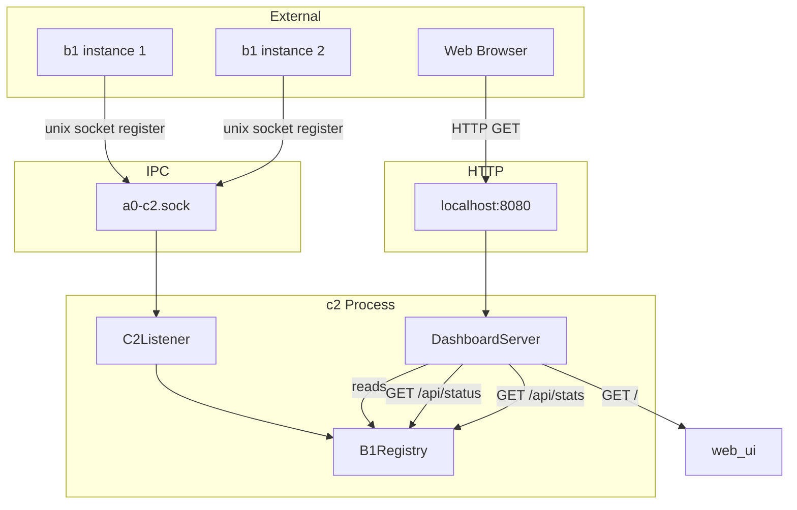
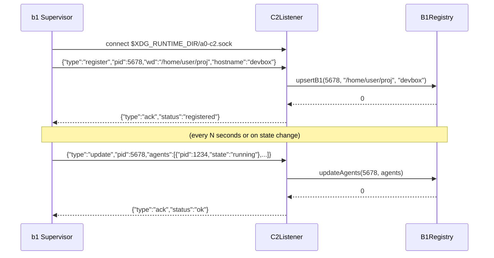
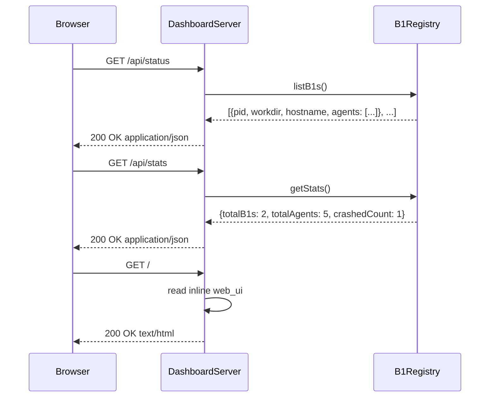
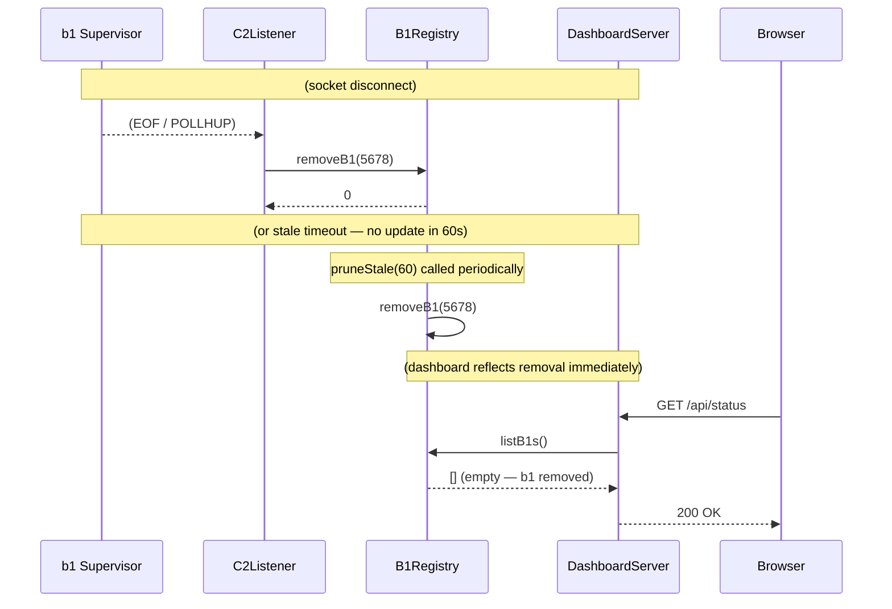

# Technical Specification: c2 Machine-Level Monitor Sub-Module

## For a0 Agent — Version 1.0

---

## 1. Overview

This document specifies a **c2 machine-level monitor sub-module** for the existing a0 C++17 agent ecosystem. The sub-module produces a standalone executable (`c2`) that aggregates supervision data from all b1 instances on a single machine.

**Purpose**: c2 is a per-machine daemon (one instance per host) that receives registrations from b1 supervisors, tracks their reported a0 agent states, and serves a web-based monitoring dashboard over HTTP. It is the system's observability hub.

**Key behaviors**:

- **One instance per machine** — identified by a fixed Unix socket at `$XDG_RUNTIME_DIR/a0-c2.sock`
- **b1 auto-discovery** — when a b1 starts, it checks for c2 and starts one if missing, then registers
- **cpp-httplib HTTP server** — serves a real-time dashboard on localhost (configurable port, default 8080)
- **Stateless between b1 registrations** — all durable state lives in the persistence layer (SQLite); c2 only maintains in-memory b1 agent snapshots
- **`--port` CLI flag** — configurable HTTP port for the dashboard

---

## 2. Component Specifications (C++ Interfaces)

All new classes are defined in the `a0::c2` namespace, declared in `src/c2/`.

### 2.1 Core Data Structures

```cpp
#pragma once

#include <string>
#include <vector>
#include <chrono>
#include <cstdint>
#include <unordered_map>
#include "nlohmann/json.hpp"

namespace a0::c2 {

/// State of a supervised agent as reported by b1.
enum class AgentState {
    RUNNING,
    CRASHED,
    STOPPED
};

/// An a0 instance reported by a b1 supervisor.
struct AgentSummary {
    int pid;
    std::string sessionUuid;
    std::string state;             // "running", "crashed", "stopped"
    int64_t connectedAt;           // epoch seconds
    int64_t lastHeartbeat;         // epoch seconds
};

/// A b1 supervisor instance registered with c2.
struct B1Instance {
    int pid;
    std::string workdir;
    std::string hostname;
    std::chrono::steady_clock::time_point connectedAt;
    std::chrono::steady_clock::time_point lastUpdate;
    std::vector<AgentSummary> agents;
};

/// Snapshot pushed from b1 to c2.
struct B1Snapshot {
    int pid;
    std::string workdir;
    std::vector<AgentSummary> agents;
    int64_t uptimeSeconds;
};

} // namespace a0::c2
```

### 2.2 B1Registry

```cpp
namespace a0::c2 {

/// In-memory registry of all connected b1 supervisors and their a0 agents.
/// All operations are O(1) or O(n) over the (small) number of b1 instances.
class B1Registry {
public:
    B1Registry();

    /// Register or update a b1 instance.
    /// \param pid        b1 process ID.
    /// \param workdir    b1's working directory.
    /// \param hostname   Machine hostname.
    /// \retval 0  Inserted or updated.
    int upsertB1(int pid, const std::string& workdir, const std::string& hostname);

    /// Remove a b1 instance (disconnected or timed out).
    /// \param pid  b1 process ID.
    /// \retval 0  Removed.
    /// \retval -1 Not found.
    int removeB1(int pid);

    /// Update the agent list for a b1 instance.
    /// \param pid    b1 process ID.
    /// \param agents New agent state vector.
    /// \retval 0  Updated.
    /// \retval -1 b1 not found.
    int updateAgents(int pid, const std::vector<AgentSummary>& agents);

    /// Get all registered b1 instances (for dashboard API).
    std::vector<B1Instance> listB1s() const;

    /// Get summary statistics.
    /// \param[out] totalB1s     Number of registered b1s.
    /// \param[out] totalAgents  Total a0 agents across all b1s.
    /// \param[out] crashedCount  Number of crashed agents.
    void getStats(int& totalB1s, int& totalAgents, int& crashedCount) const;

    /// Prune b1 instances that haven't sent an update in N seconds.
    /// \param maxAgeSeconds  Stale timeout.
    /// \returns Number of pruned instances.
    int pruneStale(int maxAgeSeconds = 60);

private:
    std::unordered_map<int, B1Instance> m_b1s;

    B1Registry(const B1Registry&) = delete;
    B1Registry& operator=(const B1Registry&) = delete;
};

} // namespace a0::c2
```

### 2.3 DashboardServer

```cpp
namespace a0::c2 {

/// HTTP dashboard server using cpp-httplib (httplib::Server).
/// Routes:
///   GET  /                → Serve static dashboard HTML
///   GET  /api/status      → JSON: all b1 instances + agent summaries
///   GET  /api/stats       → JSON: aggregate statistics
class DashboardServer {
public:
    /// \param port    HTTP listen port (default 8080).
    /// \param registry Shared b1 registry (non-owning pointer).
    DashboardServer(int port, B1Registry* registry);

    virtual ~DashboardServer();

    /// Start the HTTP server. Blocks until stopped.
    /// \retval 0  Server stopped normally.
    /// \retval -1  Failed to start.
    int run();

    /// Request graceful shutdown.
    void shutdown();

private:
    int m_port;
    B1Registry* m_registry;
    bool m_running;

    DashboardServer(const DashboardServer&) = delete;
    DashboardServer& operator=(const DashboardServer&) = delete;

    // Route handlers
    void xHandleStatus(struct uWS::HttpResponse<true>* res,
                       struct uWS::HttpRequest* req);
    void xHandleStats(struct uWS::HttpResponse<true>* res,
                      struct uWS::HttpRequest* req);
    void xHandleStatic(struct uWS::HttpResponse<true>* res,
                       struct uWS::HttpRequest* req);
};

} // namespace a0::c2
```

### 2.4 C2Listener

```cpp
namespace a0::c2 {

/// Listens on the Unix domain socket for b1 registration/update messages.
/// Runs alongside the HTTP server (separate thread or poll interleaving).
class C2Listener {
public:
    /// \param socketPath  Path for the Unix domain socket.
    /// \param registry    Shared b1 registry (non-owning pointer).
    C2Listener(const std::string& socketPath, B1Registry* registry);

    virtual ~C2Listener();

    /// Start listening. Blocks until shutdown.
    /// \retval 0  Normal shutdown.
    /// \retval -1 Initialization failure.
    int run();

    /// Request graceful shutdown.
    void shutdown();

private:
    std::string m_socketPath;
    B1Registry* m_registry;
    int m_listenFd;
    bool m_running;

    C2Listener(const C2Listener&) = delete;
    C2Listener& operator=(const C2Listener&) = delete;

    int xHandleMessage(const nlohmann::json& msg, int peerFd);
    int xHandleRegister(const nlohmann::json& msg);
    int xHandleUpdate(const nlohmann::json& msg);
    void xCleanupStaleSocket();
};

} // namespace a0::c2
```

---

## 3. System Architecture (C4 Diagram)



**Caption**: c2 runs one instance per machine. It listens on a Unix domain socket for b1 registrations and periodic updates, and serves an HTTP dashboard on localhost. `B1Registry` holds all in-memory state; no durable storage is needed in c2.

---

## 4. Data Flow Diagrams

### 4.1 b1 Registration and Periodic Update



### 4.2 Dashboard API Request



### 4.3 b1 Disconnect / Stale Detection



---

## 5. Configuration & CLI Extensions

### 5.1 c2 CLI

```
c2 [--port <n>] [--socket <path>]
```

| Flag | Default | Description |
|------|---------|-------------|
| `--port` | `8080` | HTTP dashboard port |
| `--socket` | `$XDG_RUNTIME_DIR/a0-c2.sock` | Unix socket path for b1 registrations |

### 5.2 Environment Variables

| Variable | Used by | Description |
|----------|---------|-------------|
| `A0_C2_PORT` | c2 | Override HTTP port |
| `A0_C2_SOCKET` | c2 | Override socket path |
| `XDG_RUNTIME_DIR` | c2 | Base for default socket path |

---

## 6. Testing Requirements

### 6.1 Unit Tests

| Class | Test Case | Verification |
|-------|-----------|-------------|
| `B1Registry` | upsertB1 new instance | Instance added, count = 1 |
| `B1Registry` | upsertB1 existing instance | Fields updated, count unchanged |
| `B1Registry` | removeB1 existing | Instance removed, count = 0 |
| `B1Registry` | removeB1 nonexistent | Returns -1 |
| `B1Registry` | updateAgents replaces old list | Agent list matches new vector |
| `B1Registry` | getStats with mixed states | Counts match: 2 b1s, 5 agents, 1 crashed |
| `B1Registry` | pruneStale removes expired | Instance lastUpdate > 60s ago → removed |
| `B1Registry` | pruneStale preserves recent | Instance lastUpdate < 60s → preserved |
| `C2Listener` | handleRegister JSON | Parses message, calls upsertB1, sends ack |
| `C2Listener` | handleUpdate JSON | Parses message, calls updateAgents, sends ack |
| `C2Listener` | malformed JSON | Returns error, no crash |
| `C2Listener` | unknown message type | Ignores, sends ack with error field |
| `DashboardServer` | GET /api/status returns JSON | 200, body parseable as JSON array |
| `DashboardServer` | GET /api/stats returns JSON | 200, body has totalB1s, totalAgents, crashedCount |
| `DashboardServer` | GET / returns HTML | 200, body contains "Dashboard" or similar |

### 6.2 Integration Tests

| ID | Scenario | Steps | Expected |
|----|----------|-------|----------|
| INT‑C2‑01 | b1 registers with c2 | Start c2, then start b1 | c2 receives register, B1Registry has 1 entry |
| INT‑C2‑02 | b1 pushes update to c2 | b1 tracks an a0, sends update | c2 reflects agent in B1Registry |
| INT‑C2‑03 | Dashboard shows status | curl http://localhost:8080/api/status | JSON includes registered b1 data |
| INT‑C2‑04 | b1 disconnect detected | Kill b1, wait for stale timeout | b1 removed from registry |
| INT‑C2‑05 | --port override | c2 --port 9090 → curl :9090/api/stats | Responds correctly |
| INT‑C2‑06 | Stale socket cleanup | Kill c2, start new c2 | Old socket removed, new one created |
| INT‑C2‑07 | Multiple b1 instances | Start 3 b1s in different dirs | All 3 registered, dashboard shows all |

### 6.3 Mocking

All socket tests use `socketpair()` or temporary socket files in `/tmp`. The HTTP server tests validate JSON builders without starting the server. `B1Registry` tests need no network or sockets at all.

---

## 7. Integration with Existing Main Specification

### 7.1 Dependencies

c2 depends on:
- **uWebSockets** — HTTP server (via FetchContent or system package)
- **IPC library** (`ipc_lib`) — Unix socket + JSON-line protocol from `src/ipc/`
- **nlohmann/json** — JSON (already a dependency of a0_lib)

### 7.2 Build System

`src/c2/CMakeLists.txt`:
```cmake
# cpp-httplib — header-only HTTP library
include(FetchContent)
FetchContent_Declare(
    cpp_httplib
    GIT_REPOSITORY https://github.com/yhirose/cpp-httplib.git
    GIT_TAG v0.18.0
)
FetchContent_MakeAvailable(cpp_httplib)

add_library(c2_lib STATIC
    b1_registry.cpp
    c2_listener.cpp
    dashboard_server.cpp
)
target_include_directories(c2_lib PUBLIC ${CMAKE_CURRENT_SOURCE_DIR} ${CMAKE_SOURCE_DIR}/src)
target_link_libraries(c2_lib PUBLIC ipc_lib nlohmann_json::nlohmann_json httplib::httplib)

add_executable(c2 c2_main.cpp)
target_link_libraries(c2 PRIVATE c2_lib)
install(TARGETS c2 RUNTIME DESTINATION bin)
```

### 7.3 c2_main Entry Point

1. Parse `--port` and `--socket` flags.
2. Cleanup stale socket file (unlink if exists).
3. Create `B1Registry` instance (shared between listener and dashboard).
4. Start `C2Listener` thread (or interleave poll with uWS async loop).
5. Start `DashboardServer` (uWS::App) on main thread.
6. Block until shutdown signal (SIGINT/SIGTERM).
7. On shutdown: unlink socket, exit 0.

### 7.4 Threading Model

c2 has two concurrent event sources:
- **Unix socket** (b1 registrations) — synchronous `poll()` loop
- **HTTP server** (dashboard) — cpp-httplib `svr.listen()` blocks

Uses a **dual-thread** design:
- Thread 1: `C2Listener::run()` — poll loop, one accept + recv per iteration
- Thread 2: `DashboardServer::run()` — `httplib::Server::listen()` blocks
- Both access `B1Registry` under a mutex (low contention — only periodic pushes)

The mutex on `B1Registry` is uncontended in practice (one update every few seconds per b1).

---

## 8. Implementation Outline

### Phase 1: B1Registry

- Implement in-memory registry with `upsertB1`, `removeB1`, `updateAgents`
- Implement `listB1s`, `getStats`, `pruneStale`
- Thread-safe with `std::shared_mutex` or `std::mutex`
- Unit tests (no dependencies beyond STL)

### Phase 2: C2Listener

- Implement Unix socket listen + poll loop
- Parse JSON-line messages, dispatch to registry
- Send JSON-line ack responses
- Implement stale socket cleanup on init
- Unit tests with socketpair

### Phase 3: DashboardServer

- Integrate cpp-httplib via FetchContent
- Implement `GET /api/status` — reads `B1Registry::listB1s()`, serializes to JSON
- Implement `GET /api/stats` — reads `B1Registry::getStats()`
- Implement `GET /` — serves inline HTML dashboard page
- Dashboard page is minimal: HTML table + JS `fetch()` polling `/api/status`
- JSON builder methods tested directly; server start tested in integration

### Phase 4: c2_main

- Parse CLI args
- Wire `B1Registry`, `C2Listener`, `DashboardServer`
- Implement threading (listener thread + HTTP main thread)
- Handle SIGINT/SIGTERM for graceful shutdown

### Phase 5: Testing

- Unit test suite for all classes
- Integration tests with mock b1 processes
- HTTP endpoint tests
- Stale socket cleanup test

---

## 9. Web Dashboard Wireframe

The dashboard is a single static HTML page served at `GET /`:

```
┌─────────────────────────────────────────────┐
│  a0 Agent Dashboard — devbox                │
├─────────────────────────────────────────────┤
│  Stats: 2 supervisors · 5 agents · 1 crashed│
├─────────────────────────────────────────────┤
│  Supervisor │ Workdir    │ Agents │ Status   │
│  ─────────────────────────────────────────   │
│  b1 (5678)  │ /home/u/p1 │ 3      │ OK       │
│  │  ├── a0 (1234)        running │          │
│  │  ├── a0 (1235)        running │          │
│  │  └── a0 (1236)        crashed │          │
│  ─────────────────────────────────────────   │
│  b1 (5690)  │ /home/u/p2 │ 2      │ OK       │
│  │  ├── a0 (1240)        running │          │
│  │  └── a0 (1241)        running │          │
└─────────────────────────────────────────────┘
```

The page fetches `/api/status` every 3 seconds via `setInterval` + `fetch()`. No build step — inline HTML/CSS/JS served as a C++ string constant in `web_ui.h`.

---

## 10. Future Extensions

- **Historical data**: c2 queries the persistence layer for crash history, uptime trends
- **WebSocket support**: real-time push of state changes to the dashboard
- **Alerting**: c2 detects patterns (e.g., 3 crashes in 5 minutes) and sends notifications
- **Agent control**: dashboard buttons to restart or shutdown specific agents (via c2→b1→a0 socket relay)
- **TLS**: optional HTTPS for remote access
- **Metrics export**: Prometheus endpoint at `/metrics`
