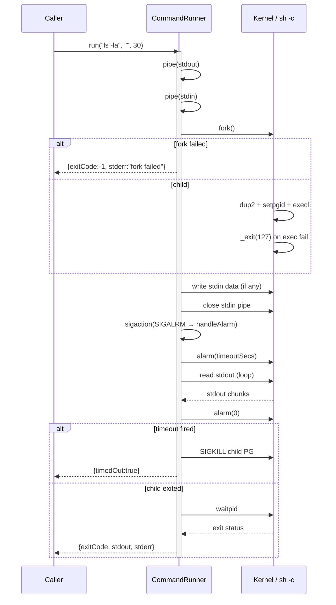

# CommandRunner Spec

## 1. Overview

Stateless utility class that wraps all subprocess creation in the a0 agent.
Every `fork()`, `exec()`, `pipe()`, `alarm()`, `waitpid()` call is isolated here.
No other class in the codebase manages processes directly.

**Dependencies:** POSIX (`fork`, `exec`, `pipe`, `dup2`, `waitpid`, `sigaction`, `alarm`, `kill`)

**Lifecycle:** Stateless — all methods static. No construction needed.

## 2. Component Specifications

```cpp
namespace a0 {

struct CommandResult {
    int exitCode;          // 0 = success, non-zero = command error
    std::string stdout;    // captured stdout
    std::string stderr;    // captured stderr
    bool timedOut;         // true if killed by timeout
};

class CommandRunner {
public:
    /// Run a single command synchronously.
    /// \param cmd         Shell command string (passed to sh -c)
    /// \param stdinData   Optional stdin payload
    /// \param timeoutSecs Max seconds before SIGKILL (0 = no timeout)
    /// \returns           Result with exit code, captured stdout/stderr
    static CommandResult run(const std::string& cmd,
                              const std::string& stdinData = "",
                              int timeoutSecs = 30);

    /// Run multiple commands in parallel.
    /// Forks N children, waits for all, collects results.
    /// \param cmds         Vector of command strings
    /// \param timeoutSecs  Per-command timeout
    /// \param maxParallel  Max concurrent children (0 = unlimited)
    static std::vector<CommandResult> runAll(
        const std::vector<std::string>& cmds,
        int timeoutSecs = 30,
        int maxParallel = 4);

    /// Single-quote shell escape.
    /// \param s  Raw string to escape
    /// \returns  Shell-safe single-quoted string
    static std::string shellEscape(const std::string& s);

private:
    static CommandResult xRunSingle(const std::string& cmd,
                                     const std::string& stdinData,
                                     int timeoutSecs);
};

} // namespace a0
```

## 3. Architecture Diagram

```mermaid
graph TB
    subgraph Callers
        SR[SubprocessToolRunner]
        DCW[DockerCLIWrapper]
        DTR[DockerToolRunnerImpl]
        VE[ValidationEngine]
    end

    subgraph CommandRunner
        R[run]
        RA[runAll]
        SE[shellEscape]
    end

    subgraph OS
        SH[/bin/sh -c]
        KERNEL[fork / exec / pipe]
    end

    SR --> R
    DCW --> R
    DTR --> R
    VC --> R
    R --> SH
    RA --> SH
    SH --> KERNEL
```

## 4. Data Flow



## 5. Error Handling

| Scenario | Behaviour |
|----------|-----------|
| `pipe()` failure | Returns `{exitCode:-1, stderr:"pipe failed"}` |
| `fork()` failure | Returns `{exitCode:-1, stderr:"fork failed"}` |
| `exec()` failure (command not found) | Child `_exit(127)`; parent sees exit code 127 |
| Timeout (30 s default) | `SIGKILL` sent to child process group; `timedOut=true` |
| `runAll` with empty cmds | Returns empty vector |
| Large stdout (>1 MB) | Read in loop until pipe closes (kernel-bounded) |
| Signal during read loop (EINTR) | Current impl does not retry on EINTR |

## 6. Edge Cases

| Case | Expected Result |
|------|----------------|
| Empty command string | Shell starts, runs nothing, returns 0 / empty output |
| Empty stdinData | No write to stdin pipe; stdin closed immediately |
| stdinData larger than pipe buffer | Written in loop (handles partial `write()` return) |
| timeoutSecs = 0 | No alarm set; command runs indefinitely |
| runAll with 0 maxParallel | Unlimited parallelism (all children forked at once) |
| Child killed by external signal | `exitCode` = negative signal number |
| Multi-line stdout | Captured as-is with embedded newlines |

## 7. Testing Requirements

| Method | Test Case | Input | Expected |
|--------|-----------|-------|----------|
| `run` | Simple echo | `"echo hello"` | exitCode=0, stdout="hello\n" |
| `run` | Non-zero exit | `"false"` | exitCode=1, stdout="" |
| `run` | With stdin | `"cat"`, stdin="test" | exitCode=0, stdout="test" |
| `run` | Timeout | `"sleep 60"`, timeout=1 | timedOut=true |
| `run` | Command not found | `"nonexistent_cmd_xyz"` | exitCode=127 |
| `run` | Empty cmd | `""` | exitCode=0 |
| `run` | Large stdout | Command producing 2 MB | stdout captured fully |
| `runAll` | Two commands | `["echo a", "echo b"]` | Two results, both exitCode=0 |
| `runAll` | Empty vector | `[]` | Empty result vector |
| `runAll` | Timeout in one | `["echo a", "sleep 60"]`, timeout=1 | First ok, second timedOut |
| `shellEscape` | No special chars | `"hello"` | `"'hello'"` |
| `shellEscape` | With single quote | `"it's"` | `"'it'\\''s'"` |
| `shellEscape` | Empty string | `""` | `"''"` |

## 8. Integration

All subprocess execution in the agent routes through CommandRunner:

- **SubprocessToolRunner** — delegates `run()` to `CommandRunner::run()`, retains only command-building logic (args mode, stdin mode)
- **DockerCLIWrapper** — delegates all `execInContainer`, `runDetached`, `pullImage`, `composeUp`/`Down` to `CommandRunner`
- **DockerToolRunnerImpl** — `execDockerRun` free function calls `CommandRunner::run()` instead of managing fork/pipe directly
- **ValidationEngine** — uses `CommandRunner::run()` for compatibility bridge execution and historical log replay
