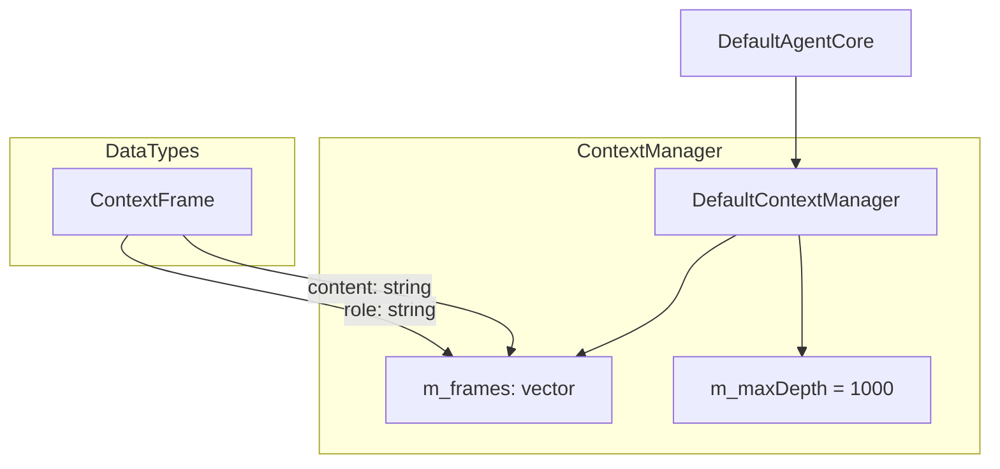
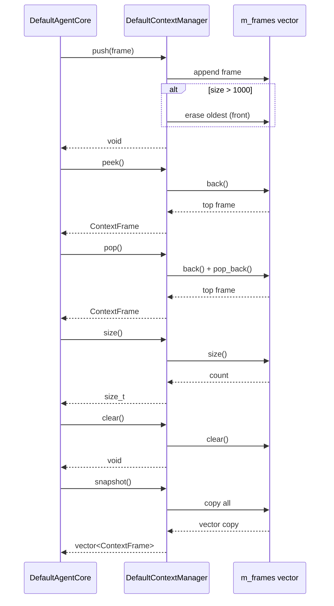

# DefaultContextManager Spec

## 1. Overview

DefaultContextManager implements ContextManager as a simple vector-based stack of ContextFrame objects. It supports push, pop, peek, size, clear, and snapshot operations. The maximum stack depth is 1000 frames; pushing beyond that silently drops the oldest frame. It is consumed by DefaultAgentCore during goal processing (user and assistant messages are pushed as frames).

## 2. Component Specifications

```cpp
class DefaultContextManager : public ContextManager {
public:
    /// \param frame  ContextFrame to append (becomes new top)
    /// Silently drops oldest frame if size > m_maxDepth (1000)
    void push(const ContextFrame& frame) override;

    /// \retval The topmost ContextFrame
    /// \throws std::out_of_range if stack is empty
    ContextFrame pop() override;

    /// \retval The topmost ContextFrame without removing it
    /// \throws std::out_of_range if stack is empty
    ContextFrame peek() const override;

    /// \retval Current number of frames in the stack
    size_t size() const override;

    /// Removes all frames from the stack
    void clear() override;

    /// \retval Copy of the entire frame vector (front = oldest)
    std::vector<ContextFrame> snapshot() const override;

private:
    std::vector<ContextFrame> m_frames;
    static constexpr size_t m_maxDepth = 1000;
};
```

## 3. Architecture Diagram



## 4. Data Flow



## 5. Error Handling

| Condition | Behaviour |
|-----------|-----------|
| `pop()` on empty stack | Throws `std::out_of_range("pop on empty context")` |
| `peek()` on empty stack | Throws `std::out_of_range("peek on empty context")` |

## 6. Edge Cases

| Case | Behaviour |
|------|-----------|
| After `clear()`, stack is empty | `size() == 0`, `pop()` / `peek()` throw |
| Push one frame after `clear()` | Stack has 1 element |
| Push 1001 frames sequentially | Oldest frame silently dropped; size stays at 1000 |
| `snapshot()` on empty stack | Returns empty vector |
| `snapshot()` on stack with N frames | Returns vector of length N with oldest at index 0 |
| `pop()` and then `peek()` on stack with 1 element | First call returns the element, second call throws (stack is empty) |

## 7. Testing Requirements

| Method | Test | Input | Expected |
|--------|------|-------|----------|
| `push` | Single frame | `{"user", "hello"}` | `size() == 1`, `peek().content == "hello"` |
| `push` | Exceeds max depth | 1001 pushes | `size() == 1000`, oldest frame dropped |
| `push` | After clear | Frame after `clear()` | `size() == 1` |
| `pop` | Non-empty stack | Stack with 3 frames | Returns the most recently pushed frame; `size() == 2` |
| `pop` | Empty stack | – | Throws `std::out_of_range` |
| `pop` | Single-element stack | Stack with 1 frame | Returns the frame; stack becomes empty |
| `peek` | Non-empty stack | Stack with frames | Returns top frame without removing; `size()` unchanged |
| `peek` | Empty stack | – | Throws `std::out_of_range` |
| `size` | Empty stack | – | Returns 0 |
| `size` | Stack with 5 frames | – | Returns 5 |
| `clear` | Non-empty stack | Stack with frames | `size() == 0`, `pop()` throws |
| `clear` | Already empty stack | – | No-op; `size() == 0` |
| `snapshot` | Empty stack | – | Returns empty vector |
| `snapshot` | Stack with 3 frames | – | Returns vector of length 3, oldest first |
| `snapshot` | Modification after snapshot | Push after snapshot | Original snapshot unaffected (copy semantics) |
